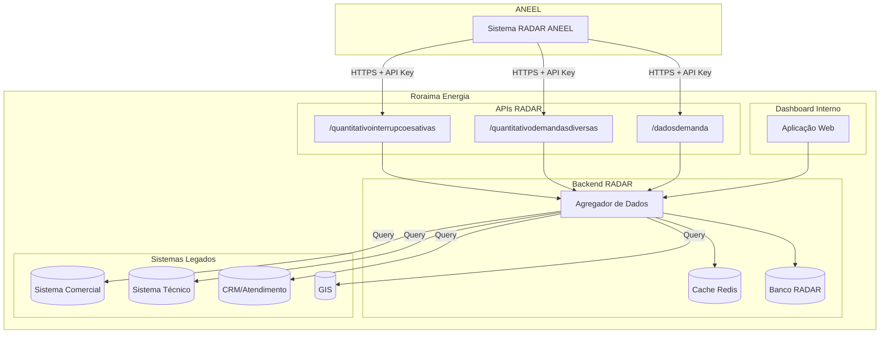

# Análise de Requisitos - Projeto RADAR Roraima Energia
## Sistema de Monitoramento de Interrupções e Demandas

**Versão:** 2.0
**Data:** 10/12/2025
**Empresa:** Roraima Energia S/A
**Baseado em:**
- Ofício Circular 14/2025-SMA/ANEEL e Especificação Técnica API V4
- **REN 1.137/2025** - Resiliência a Eventos Climáticos Severos (21/10/2025)

---

## 1. Sumário Executivo

### 1.1 Contexto do Projeto

O **Projeto RADAR** (Rede de Acompanhamento e Diagnóstico da Distribuição) é uma exigência da ANEEL para que todas as distribuidoras de energia elétrica do Brasil disponibilizem APIs REST para monitoramento de interrupções e demandas de consumidores.

A **Roraima Energia S/A** deve desenvolver e disponibilizar estas APIs conforme especificação técnica, permitindo que a ANEEL consulte dados em tempo real sobre:

1. **Interrupções de Fornecimento** - UCs sem energia (programadas e não programadas)
2. **Demandas Diversas** - Reclamações e solicitações de consumidores
3. **Dados de Demanda Individual** - Consulta por número de protocolo

Adicionalmente, este documento propõe o desenvolvimento de um **Dashboard interno** similar ao [PowerOutage.us](https://poweroutage.us/) para visualização e gestão interna dos dados pela própria Roraima Energia.

### 1.2 Objetivos do Projeto

| Objetivo | Descrição | Prioridade |
|----------|-----------|------------|
| **Conformidade ANEEL** | Desenvolver APIs REST conforme especificação técnica | Alta |
| **Dashboard Interno** | Visualização em tempo real para gestão operacional | Média |
| **Monitoramento** | Acompanhar status das interrupções e demandas | Média |
| **Relatórios** | Gerar relatórios gerenciais e regulatórios | Baixa |

### 1.3 Escopo

#### Dentro do Escopo
- Desenvolvimento das 3 APIs REST obrigatórias (Ofício Circular 14/2025)
- **Portal Público de Interrupções** (REN 1.137/2025 - Art. 106)
- Dashboard web interno para gestão operacional
- Mapa interativo do estado de Roraima (público e interno)
- Sistema de alertas (consumidores via SMS/WhatsApp)
- Comunicação automatizada com consumidores
- API para ANEEL extrair dados em tempo real
- Gestão do Plano de Contingência
- Integração com sistemas internos da Roraima Energia
- Documentação Swagger

#### Fora do Escopo
- Alterações estruturais nos sistemas legados de origem dos dados
- Aplicativo mobile nativo (apenas PWA)
- Sistema de Manejo Vegetal (projeto separado)

### 1.4 Stakeholders

| Stakeholder | Papel | Responsabilidade |
|-------------|-------|------------------|
| ANEEL | Órgão Regulador | Consumidor das APIs |
| Roraima Energia - TI | Equipe Interna | Desenvolvimento e manutenção |
| Roraima Energia - Operações | Usuário Interno | Uso do dashboard |
| Roraima Energia - Ouvidoria | Usuário Interno | Gestão de demandas |
| Roraima Energia - Diretoria | Sponsor | Aprovação e recursos |

---

## 2. Contexto da Roraima Energia

### 2.1 Informações da Distribuidora

| Item | Valor |
|------|-------|
| **Razão Social** | Roraima Energia S/A |
| **UF** | Roraima (RR) |
| **Região** | Norte |
| **Municípios Atendidos** | 15 |
| **Área de Concessão** | 224.300 km² |
| **Característica** | Conectada ao SIN (desde Setembro de 2025 via Linhão de Tucuruí) |

### 2.2 Municípios de Roraima

| Código IBGE | Município | Região |
|-------------|-----------|--------|
| 1400100 | Alto Alegre | Interior |
| 1400027 | Amajari | Interior |
| 1400050 | Boa Vista | Capital |
| 1400159 | Bonfim | Interior |
| 1400175 | Cantá | Interior |
| 1400209 | Caracaraí | Interior |
| 1400233 | Caroebe | Interior |
| 1400282 | Iracema | Interior |
| 1400308 | Mucajaí | Interior |
| 1400407 | Normandia | Interior |
| 1400456 | Pacaraima | Interior |
| 1400472 | Rorainópolis | Interior |
| 1400506 | São João da Baliza | Interior |
| 1400605 | São Luiz | Interior |
| 1400704 | Uiramutã | Interior |

### 2.3 Características Técnicas

- **Sistema Interligado**: Roraima está conectada ao SIN desde Setembro de 2025 através do Linhão de Tucuruí (LT 500 kV Manaus-Boa Vista)
- **Geração**: Energia proveniente do SIN + geração local complementar
- **Marco Histórico**: Último estado brasileiro a se conectar ao Sistema Interligado Nacional
- **Benefícios da Conexão**:
  - Maior confiabilidade no fornecimento
  - Redução de custos com geração térmica
  - Fim da dependência de importação da Venezuela
- **Desafios Operacionais**:
  - Grandes distâncias entre municípios
  - Baixa densidade populacional
  - Áreas indígenas
  - Condições climáticas (período de chuvas)
  - Extensão do Linhão (cerca de 720 km)

---

## 3. Análise Comparativa: PowerOutage.us

### 3.1 Funcionalidades do PowerOutage.us (Referência)

| Funcionalidade | PowerOutage.us | RADAR Roraima Energia |
|----------------|----------------|----------------------|
| **Cobertura** | EUA, Canadá, UK | Roraima (15 municípios) |
| **Atualização** | 10 minutos | 30 minutos (ANEEL) |
| **Hierarquia** | País > Estado > Condado > Cidade | Estado > Município > Conjunto Elétrico |
| **Mapa Interativo** | Heat map nacional | Heat map estadual |
| **API REST** | Comercial | Obrigatória (ANEEL) |
| **Histórico** | Desde 2016 | 36 meses |
| **Alertas** | Email/SMS | Dashboard + Email |
| **Demandas** | Não tem | Incluído (diferencial ANEEL) |

### 3.2 Funcionalidades Propostas para Dashboard Interno

Baseado no PowerOutage.us, adaptado para realidade da Roraima Energia:

1. **Mapa de Roraima**
   - Visualização por município
   - Visualização por conjunto elétrico
   - Heat map de severidade
   - Informações no hover/click

2. **Dashboard em Tempo Real**
   - Total de UCs sem energia
   - Interrupções programadas vs não programadas
   - Top municípios afetados
   - Evolução temporal (gráficos)

3. **Painel de Demandas**
   - Demandas em andamento
   - Registradas hoje
   - Por canal de atendimento
   - Por tipologia

4. **Alertas Internos**
   - Interrupção massiva (threshold configurável)
   - Falha na coleta de dados
   - SLA em risco

---

## 4. Requisitos das APIs (Especificação ANEEL)

### 4.1 Visão Geral das APIs

```
https://api.roraimaenergia.com.br/
├── /quantitativointerrupcoesativas    [GET] - Interrupções ativas
├── /quantitativodemandasdiversas      [GET] - Demandas agregadas
└── /dadosdemanda                      [GET] - Demanda por protocolo
```

### 4.2 API 1: Interrupções do Fornecimento

**Endpoint:** `GET /quantitativointerrupcoesativas`

#### 4.2.1 Especificação

| Item | Valor |
|------|-------|
| Método | GET |
| Rota | /quantitativointerrupcoesativas |
| Sensibilidade | Minúsculas |
| Autenticação | API Key (x-api-key) |
| Frequência ANEEL | A cada 30 minutos |
| Disponibilidade | 24/7 (todos os dias) |

#### 4.2.2 Parâmetro de Entrada (Opcional)

| Parâmetro | Tipo | Obrigatório | Descrição |
|-----------|------|-------------|-----------|
| dthRecuperacao | dd/mm/yyyy hh:mm | Não | Data/hora para recuperação retroativa |

#### 4.2.3 Estrutura de Resposta

```json
{
  "idcStatusRequisicao": 1,
  "emailIndisponibilidade": "ti.aneel@roraimaenergia.com.br",
  "mensagem": "",
  "interrupcaoFornecimento": [
    {
      "ideConjuntoUnidadeConsumidora": 1,
      "ideMunicipio": 1400050,
      "qtdUCsAtendidas": 85000,
      "qtdOcorrenciaProgramada": 150,
      "qtdOcorrenciaNaoProgramada": 45
    },
    {
      "ideConjuntoUnidadeConsumidora": 2,
      "ideMunicipio": 1400209,
      "qtdUCsAtendidas": 12000,
      "qtdOcorrenciaProgramada": 0,
      "qtdOcorrenciaNaoProgramada": 230
    }
  ]
}
```

#### 4.2.4 Campos da Resposta

| Campo | Tipo | Obrigatório | Descrição |
|-------|------|-------------|-----------|
| idcStatusRequisicao | int | Sim | 1=Sucesso, 2=Erro |
| emailIndisponibilidade | string(50) | Sim | Email para notificações da ANEEL |
| mensagem | string | Condicional | Obrigatório se erro |
| interrupcaoFornecimento | array | Sim | Lista de registros |

| Campo (array) | Tipo | Descrição |
|---------------|------|-----------|
| ideConjuntoUnidadeConsumidora | int | Código do conjunto elétrico |
| ideMunicipio | int | Código IBGE (7 dígitos) |
| qtdUCsAtendidas | int | Total de UCs no conjunto/município |
| qtdOcorrenciaProgramada | int | UCs com interrupção programada ativa |
| qtdOcorrenciaNaoProgramada | int | UCs com interrupção não programada ativa |

#### 4.2.5 Regras de Negócio

1. Retornar apenas interrupções **ativas** (não restabelecidas)
2. Agrupamento por **Município + Conjunto Elétrico**
3. Incluir UCs atendidas em caráter excepcional (art. 117 REN 1000/2021)
4. Manter dados dos **últimos 7 dias** para recuperação retroativa
5. Funcionalidade de recuperação ativa a partir de **01/04/2026**

### 4.3 API 2: Demandas Diversas

**Endpoint:** `GET /quantitativodemandasdiversas`

#### 4.3.1 Especificação

| Item | Valor |
|------|-------|
| Método | GET |
| Rota | /quantitativodemandasdiversas |
| Sensibilidade | Minúsculas |
| Autenticação | API Key (x-api-key) |
| Frequência ANEEL | A cada 30 minutos |
| Disponibilidade | Segunda a Sexta, 6h às 24h |

#### 4.3.2 Estrutura de Resposta

```json
{
  "idcStatusRequisicao": 1,
  "mensagem": "",
  "demandasDiversas": [
    {
      "idcNivelAtendimento": 1,
      "idcCanalAtendimento": 2,
      "idcTipologia": "10101",
      "qtdAndamentoNoMomento": 15,
      "qtdRegistradaNoDia": 28,
      "qtdImprocedenteNoDia": 3,
      "qtdProcedenteNoDia": 8,
      "qtdSemProcedenciaNoDia": 2
    }
  ]
}
```

#### 4.3.3 Canais de Atendimento

| ID | Canal |
|----|-------|
| 1 | Presencial |
| 2 | Telefônico |
| 3 | Agência Virtual |
| 4 | consumidor.gov |
| 5 | Aplicativo |
| 6 | E-mail |
| 7 | SMS |
| 8 | Redes Sociais |
| 9 | Outros |
| 10 | Chatbot |
| 11 | Chat Humano |
| 12 | WhatsApp |

#### 4.3.4 Níveis de Atendimento

| ID | Nível |
|----|-------|
| 1 | 1º Nível (CTA) |
| 2 | 2º Nível (Ouvidoria) |

### 4.4 API 3: Dados Detalhados de Demanda

**Endpoint:** `GET /dadosdemanda?numProtocolo={protocolo}`

#### 4.4.1 Especificação

| Item | Valor |
|------|-------|
| Método | GET |
| Rota | /dadosdemanda |
| Parâmetro | numProtocolo (query string) |
| Sensibilidade | Minúsculas |
| Autenticação | API Key (x-api-key) |
| Disponibilidade | Segunda a Sábado, 8h às 20h |

#### 4.4.2 Estrutura de Resposta

```json
{
  "idcStatusRequisicao": 1,
  "mensagem": "",
  "demanda": {
    "numProtocolo": "RR2024001234567890",
    "numUC": "123456789012345",
    "numCPFCNPJ": "12345678901",
    "nomeTitularUC": "João da Silva",
    "idcCanalAtendimento": 2,
    "idcTipologia": "10105",
    "idcStatus": 0,
    "idcProcedencia": 2,
    "dthAbertura": "10/12/2025 14:30",
    "dthEncerramento": null,
    "ideMunicipio": 1400050,
    "idcNivelTratamento": 0
  }
}
```

#### 4.4.3 Valores dos Campos

**idcStatus:**
| Valor | Descrição |
|-------|-----------|
| 0 | Em andamento |
| 1 | Encerrada |
| 2 | Outros |

**idcProcedencia:**
| Valor | Descrição |
|-------|-----------|
| 0 | Improcedente |
| 1 | Procedente |
| 2 | Em tratamento |
| 3 | Outros |

**idcNivelTratamento:**
| Valor | Descrição |
|-------|-----------|
| 0 | Primeiro nível (CTA) |
| 1 | Ouvidoria (segundo nível) |
| 2 | Outros |

---

## 5. Requisitos REN 1.137/2025 - Resiliência Climática

A **Resolução Normativa ANEEL nº 1.137/2025** (21/10/2025) estabelece disposições para aumento da resiliência do sistema de distribuição a eventos climáticos severos. Esta resolução adiciona requisitos **obrigatórios** que devem ser atendidos pelo sistema RADAR Roraima Energia.

### 5.1 Portal Público de Interrupções (Art. 106-107)

**OBRIGATÓRIO**: Disponibilizar em sítio eletrônico público, com atualização a cada 30 minutos:

#### 5.1.1 Mapa de Interrupções (Art. 106)

| Requisito | Descrição | Prazo |
|-----------|-----------|-------|
| Mapa por bairro | UCs afetadas discriminadas por bairro (mínimo) | 180 dias |
| Visualização interativa | Mapa com arruamento para identificar extensão/duração | Alternativa |
| Faixas de duração | Apresentar UCs por tempo: 1h, 3h, 6h, 12h, 24h, 48h+ | 180 dias |

#### 5.1.2 Informações de Ocorrências Abertas (Art. 107)

| Campo | Descrição | Atualização |
|-------|-----------|-------------|
| Número da ocorrência | Identificador único | 30 min |
| Município/bairro | Localização da ocorrência | 30 min |
| Data/hora início | Quando iniciou a interrupção | 30 min |
| Tipo | Programada ou Não programada | 30 min |
| Status | Em preparação / Em Deslocamento / Em Execução | 30 min |
| Qtd UCs interrompidas | Na ocorrência e total da área | 30 min |
| Duração (hh:mm) | Tempo decorrido da interrupção | 30 min |
| CHI | Consumidor Hora Interrompido (ocorrência e total) | 30 min |
| Qtd ocorrências | Por município e total | 30 min |
| Qtd equipes | Em atividade por município e total | 30 min |
| Estágio da operação | Conforme plano de contingência | 30 min |

### 5.2 Comunicação com Consumidores (Art. 105, 109-112)

#### 5.2.1 Comunicação Obrigatória de Interrupções

| Requisito | Prazo | Canal |
|-----------|-------|-------|
| Causa + área + previsão | 15 min após conhecer causa | SMS + WhatsApp |
| Comunicação inicial | Máximo 1h após reconhecer interrupção | SMS + WhatsApp |
| Atualizações | Sempre que houver mudança na previsão | Automático |

#### 5.2.2 Informações ao Consumidor (Art. 109)

| Informação | Descrição |
|------------|-----------|
| Motivo da Interrupção | Conforme ANEXO 8.C do Módulo 8 PRODIST |
| Área Afetada | Delimitação geográfica |
| UCs Impactadas | Número de unidades afetadas |
| Previsão de Restabelecimento | Estimativa de retorno |

#### 5.2.3 Canais Obrigatórios (Art. 110)

- **SMS** - Obrigatório
- **WhatsApp/Apps de mensagem** - Obrigatório
- **Website/App** - Complementar (recomendado)
- **Redes Sociais** - Complementar

> **Nota**: Consumidor pode solicitar suspensão do envio a qualquer tempo (Art. 111)

### 5.3 API para ANEEL (Art. 113)

**OBRIGATÓRIO**: Disponibilizar API permitindo que ANEEL extraia dados de interrupção diretamente da fonte.

| Requisito | Especificação |
|-----------|---------------|
| Tipo | API REST (ou outra solução segura) |
| Dados | Interrupções do fornecimento |
| Disponibilidade | Tempo real |
| Segurança | Conforme instruções técnicas ANEEL |
| Prazo | 60 dias após publicação das instruções |

### 5.4 Comunicação com Poder Público (Art. 113-120)

#### 5.4.1 Requisitos de Comunicação

| Requisito | Descrição |
|-----------|-----------|
| Notificação imediata | Após identificação de evento crítico |
| Canais oficiais | Previamente estabelecidos |
| Representantes | Até 2 por ente público (municipal, estadual, distrital) |
| Comunicação anual | Detalhando execução dos protocolos |

#### 5.4.2 Canais Exclusivos para Poder Público (Art. 371-A REN 1.000)

| Canal | Disponibilidade |
|-------|-----------------|
| Telefone emergência | 24/7 com atendimento humano |
| Atendimento presencial | Horário agendado |
| Chat com atendimento humano | Horário comercial |
| Videoconferência | Sob demanda |

### 5.5 Novo Indicador DISE (Art. 173, 180-A)

**DISE** = Duração da Interrupção Individual ocorrida em Situação de Emergência

#### 5.5.1 Limites do DISE

| Localização | Tensão | Limite DISE |
|-------------|--------|-------------|
| Área Urbana | > 2,3 kV e < 69 kV | **24 horas** |
| Área Não Urbana | > 2,3 kV e < 69 kV | **48 horas** |
| Área Urbana | ≤ 2,3 kV | **24 horas** |
| Área Não Urbana | ≤ 2,3 kV | **48 horas** |

#### 5.5.2 Compensação por Violação do DISE (Art. 225)

```
CompDISE = DISEv × (VRC / 730) × kei3

Onde:
- DISEv = Duração verificada em Situação de Emergência
- VRC = Valor monetário base (TUSD Fio B)
- kei3 = 14 (BT) ou 20 (MT)
```

### 5.6 Plano de Contingência (Art. 140-148)

O sistema RADAR deve apoiar a gestão do Plano de Contingência:

#### 5.6.1 Requisitos do Plano

| Requisito | Descrição |
|-----------|-----------|
| Níveis de contingência | Critérios objetivos |
| Planos de ação | Por nível de contingência |
| Cadeia de governança | Estratégico, tático, operacional |
| Simulações/Treinamentos | Periodicidade máxima de 1 ano |
| Revisão | Periodicidade máxima de 1 ano |
| Publicação | Website + postos de atendimento |

#### 5.6.2 Integração com RADAR

O sistema deve exibir:
- Nível de contingência atual
- Estágio da operação
- Recursos mobilizados
- Contatos dos responsáveis (interno)

### 5.7 Prazos de Implementação (Art. 13-18)

| Requisito | Prazo | Data Limite* |
|-----------|-------|--------------|
| Planos (manejo, comunicação, contingência) | 90 dias | ~28/01/2026 |
| Registro interações Poder Público | 180 dias | ~28/04/2026 |
| Comunicação ao consumidor (15min/1h) | 180 dias | ~28/04/2026 |
| Mapa de interrupções no site | 180 dias | ~28/04/2026 |
| Informações de ocorrências abertas | 180 dias | ~28/04/2026 |
| Indicador DISE | 180 dias | ~28/04/2026 |
| API para ANEEL | 60 dias após instruções | A definir |

*Considerando publicação em 30/10/2025

### 5.8 Penalidades (Art. 9 - REN 846/2019)

| Grupo | Infração |
|-------|----------|
| **Grupo III** | Deixar de prestar informações de interrupções aos consumidores |
| **Grupo IV** | Ausência/inadequação do Plano de Contingência |
| **Grupo IV** | Ausência/inadequação do Plano de Manejo Vegetal |
| **Grupo IV** | Comunicação ineficiente com Poder Público em emergência |
| **Grupo V** | Atuação inadequada no restabelecimento |

---

## 6. Requisitos Não-Funcionais

### 6.1 Segurança (Obrigatório ANEEL)

| Requisito | Especificação |
|-----------|---------------|
| Protocolo | HTTPS obrigatório |
| Autenticação | API Key no header (x-api-key) |
| IP Whitelist | 200.198.220.128/25 (ANEEL) |
| Conformidade | e-Ping, Guia de APIs gov.br |
| Erro não autorizado | HTTP 401 |

### 6.2 Performance

| Requisito | Meta |
|-----------|------|
| Tempo de resposta | < 5 segundos |
| Disponibilidade | 99% (APIs ANEEL) |
| Timeout | 30-45 segundos |

### 6.3 Formato de Dados

| Requisito | Especificação |
|-----------|---------------|
| Formato | JSON |
| Encoding | UTF-8 |
| Nomenclatura campos | camelCase |
| Nomenclatura rotas | minúsculas |
| Data/hora | dd/MM/yyyy HH:mm |

### 6.4 Monitoramento

| Requisito | Especificação |
|-----------|---------------|
| Swagger | Recomendado pela ANEEL |
| Logs | Todas as requisições |
| Alertas | Indisponibilidade automática |
| Health check | Endpoint /health |

---

## 7. Integrações com Sistemas Internos

### 7.1 Sistemas de Origem dos Dados

A Roraima Energia precisa integrar as APIs com seus sistemas internos para obter os dados em tempo real:

| Sistema | Dados | Integração |
|---------|-------|------------|
| **Sistema Comercial (Ajuri)** | Cadastro de UCs, titulares | Oracle DBLink |
| **Sistema Técnico (Inservice)** | Interrupções ativas | Oracle DBLink |
| **CRM/Atendimento** | Demandas e protocolos | Oracle DBLink |
| **GIS** | Conjuntos elétricos, municípios | Oracle DBLink |

**Nota:** O Inservice integra internamente com o SCADA (SAGE). O RADAR não integra diretamente com SCADA.

### 7.2 Diagrama de Integração



---

## 8. Cronograma Consolidado

### 8.1 Prazos ANEEL - Ofício Circular 14/2025

| Entrega | Prazo ANEEL | Status |
|---------|-------------|--------|
| 1ª API - Interrupções | Final de 2025 | **Em desenvolvimento** |
| 2ª API - Demanda específica | Final de Abril/2026 | Planejado |
| 3ª API - Demandas diversas | Final de Maio/2026 | Planejado |
| Funcionalidade de recuperação | 01/04/2026 | Planejado |

### 8.2 Prazos REN 1.137/2025 (Resiliência Climática)

| Requisito | Prazo | Data Limite |
|-----------|-------|-------------|
| Plano de Contingência publicado | 90 dias | 28/01/2026 |
| Plano de Comunicação publicado | 90 dias | 28/01/2026 |
| Plano de Manejo Vegetal publicado | 90 dias | 28/01/2026 |
| Comunicação ao consumidor (15min/1h) | 180 dias | 28/04/2026 |
| Mapa público de interrupções | 180 dias | 28/04/2026 |
| Informações ocorrências abertas | 180 dias | 28/04/2026 |
| Indicador DISE operacional | 180 dias | 28/04/2026 |
| API tempo real para ANEEL | 60 dias pós-instruções | A definir |

### 8.3 Marcos ANEEL

- **Final 2025**: Atualização visual do Painel de Interrupções (ANEEL)
- **Janeiro/2026**: Lançamento nacional RADAR (ANEEL)
- **28/01/2026**: Planos de Contingência/Comunicação publicados (REN 1.137)
- **28/04/2026**: Portal Público de Interrupções operacional (REN 1.137)

### 8.4 Cronograma Sugerido - Roraima Energia

| Fase | Atividades | Período |
|------|------------|---------|
| **Fase 1** | API Interrupções ANEEL + Integração sistemas | Dez/2025 |
| **Fase 2** | Planos (Contingência, Comunicação) publicados | Jan/2026 |
| **Fase 3** | Portal Público de Interrupções (REN 1.137) | Jan-Fev/2026 |
| **Fase 4** | Sistema de comunicação SMS/WhatsApp | Mar/2026 |
| **Fase 5** | API Demanda específica | Fev-Abr/2026 |
| **Fase 6** | API Demandas diversas + Dashboard completo | Abr-Mai/2026 |
| **Fase 7** | Indicador DISE + Relatórios | Mai-Jun/2026 |

---

## 9. Requisitos do Dashboard (Interno + Público)

### 9.1 Portal Público de Interrupções (REN 1.137/2025)

O portal público é **OBRIGATÓRIO** conforme Art. 106-107 da REN 1.137/2025.

#### 9.1.1 Funcionalidades Obrigatórias

| Funcionalidade | Requisito Legal | Atualização |
|----------------|-----------------|-------------|
| Mapa de interrupções por bairro | Art. 106 | 30 min |
| Total UCs afetadas por faixa de duração | Art. 106 | 30 min |
| Lista de ocorrências abertas | Art. 107 | 30 min |
| Status das ocorrências | Art. 107 | 30 min |
| CHI (Consumidor Hora Interrompido) | Art. 107 | 30 min |
| Quantidade de equipes em campo | Art. 107 | 30 min |
| Estágio do plano de contingência | Art. 107 | 30 min |

#### 9.1.2 Layout Sugerido (Estilo PowerOutage.us)

```
+--------------------------------------------------+
|  RORAIMA ENERGIA - INTERRUPÇÕES EM TEMPO REAL    |
+--------------------------------------------------+
|  [MAPA INTERATIVO DE RORAIMA]    |  KPIs:        |
|                                   |  - Total UCs  |
|  Cores por severidade            |  - <1h: XXX   |
|  Click no município              |  - <3h: XXX   |
|  para detalhes                   |  - <6h: XXX   |
|                                   |  - <12h: XX   |
|                                   |  - <24h: XX   |
|                                   |  - >48h: X    |
+--------------------------------------------------+
|  OCORRÊNCIAS ABERTAS (Lista com filtros)          |
|  Município | Bairro | Início | UCs | Status      |
+--------------------------------------------------+
|  INFORMAÇÕES DO PLANO DE CONTINGÊNCIA             |
|  Nível atual: NORMAL | Equipes: 45 | Total: 120  |
+--------------------------------------------------+
```

### 9.2 Dashboard Interno (Gestão Operacional)

#### 9.2.1 Mapa de Roraima

- Visualização dos 15 municípios
- Cores por severidade (% UCs afetadas)
- Click para detalhes do município
- Informações no hover

**Escala de cores:**
| Cor | Severidade |
|-----|------------|
| Verde | < 1% UCs afetadas |
| Amarelo | 1-5% UCs afetadas |
| Laranja | 5-10% UCs afetadas |
| Vermelho | > 10% UCs afetadas |

#### 9.2.2 Cards de KPIs

- Total de UCs sem energia
- Interrupções programadas
- Interrupções não programadas
- Demandas em andamento
- Demandas do dia

#### 9.2.3 Gráficos

- Evolução temporal (últimas 24h)
- Distribuição por município
- Demandas por canal
- Demandas por tipologia

#### 9.2.4 Tabelas

- Lista de interrupções por município
- Lista de demandas em andamento
- Histórico de coletas

### 9.3 Perfis de Usuário

| Perfil | Acesso |
|--------|--------|
| Administrador | Tudo |
| Operador | Dashboard, Interrupções |
| Atendimento | Dashboard, Demandas |
| Visualizador | Dashboard (somente leitura) |

---

## 10. Riscos e Mitigações

| Risco | Probabilidade | Impacto | Mitigação |
|-------|---------------|---------|-----------|
| Atraso no prazo ANEEL | Média | Alto | Priorizar API de interrupções |
| Integração com sistemas legados | Alta | Alto | Mapeamento antecipado dos dados |
| Indisponibilidade das APIs | Média | Alto | Monitoramento + alertas |
| Dados inconsistentes | Média | Médio | Validações + reconciliação |
| Falta de recursos de TI | Média | Alto | Planejamento antecipado |

---

## 11. Referências

1. Ofício Circular 14/2025-SMA/ANEEL
2. Descrição dos dados e detalhamento técnicos da API - V4 (23/10/2025)
3. Apresentação Técnica RADAR - 30/07/2025
4. **REN 1.137/2025** - Resiliência a Eventos Climáticos Severos (21/10/2025)
5. Resolução Homologatória nº 2.992/21
6. REN 1000/2021
7. REN 956/2021 - PRODIST
8. REN 846/2019 - Sanções e Penalidades
9. e-Ping - Padrões de Interoperabilidade de Governo Eletrônico
10. Guia de Requisitos Mínimos de Privacidade e Segurança para APIs
11. PowerOutage.us (referência de dashboard)

---

## 12. Glossário

| Termo | Definição |
|-------|-----------|
| UC | Unidade Consumidora |
| CTA | Central de Teleatendimento |
| IBGE | Instituto Brasileiro de Geografia e Estatística |
| API | Application Programming Interface |
| REST | Representational State Transfer |
| SLA | Service Level Agreement |
| RADAR | Rede de Acompanhamento e Diagnóstico da Distribuição |
| SIN | Sistema Interligado Nacional |
| SCADA | Supervisory Control and Data Acquisition |
| CHI | Consumidor Hora Interrompido |
| DISE | Duração da Interrupção em Situação de Emergência |
| DEC | Duração Equivalente de Interrupção por Unidade Consumidora |
| FEC | Frequência Equivalente de Interrupção por Unidade Consumidora |
| PRODIST | Procedimentos de Distribuição |
| REN | Resolução Normativa |

---

## 13. Aprovações

| Papel | Nome | Data | Assinatura |
|-------|------|------|------------|
| Gerente de TI | | | |
| Diretor Técnico | | | |
| Diretor Presidente | | | |

