# Documento de Design e Arquitetura
## Projeto RADAR Roraima Energia

**Versão:** 2.0
**Data:** 10/12/2025
**Empresa:** Roraima Energia S/A
**Status:** Draft
**Baseado em:**
- Ofício Circular 14/2025-SMA/ANEEL
- **REN 1.137/2025** - Resiliência a Eventos Climáticos Severos

---

## Índice

1. [Visão Geral](#1-visão-geral)
2. [Escopo e Objetivos](#2-escopo-e-objetivos)
3. [Arquitetura de Alto Nível](#3-arquitetura-de-alto-nível)
4. [Arquitetura das APIs ANEEL](#4-arquitetura-das-apis-aneel)
5. [Portal Público de Interrupções (REN 1.137)](#5-portal-público-de-interrupções-ren-1137)
6. [Sistema de Notificação ao Consumidor](#6-sistema-de-notificação-ao-consumidor)
7. [Módulo DISE - Indicador de Emergência](#7-módulo-dise---indicador-de-emergência)
8. [Arquitetura do Dashboard Interno](#8-arquitetura-do-dashboard-interno)
9. [Modelo de Dados](#9-modelo-de-dados)
10. [Integrações com Sistemas Legados](#10-integrações-com-sistemas-legados)
11. [Segurança](#11-segurança)
12. [Infraestrutura](#12-infraestrutura)
13. [Monitoramento](#13-monitoramento)
14. [Plano de Implantação](#14-plano-de-implantação)
15. [Estimativas](#15-estimativas)

---

## 1. Visão Geral

### 1.1 Propósito

Este documento descreve a arquitetura técnica do sistema RADAR da Roraima Energia, que contempla:

1. **APIs REST obrigatórias** para a ANEEL (Ofício Circular 14/2025)
2. **Portal Público de Interrupções** (REN 1.137/2025 - Art. 106-107)
3. **Sistema de Notificação ao Consumidor** via SMS/WhatsApp (REN 1.137/2025 - Art. 105)
4. **API para ANEEL** em tempo real (REN 1.137/2025 - Art. 113)
5. **Módulo DISE** - Indicador de Duração em Situação de Emergência
6. **Dashboard interno** para gestão operacional (similar ao PowerOutage.us)

### 1.2 Contexto

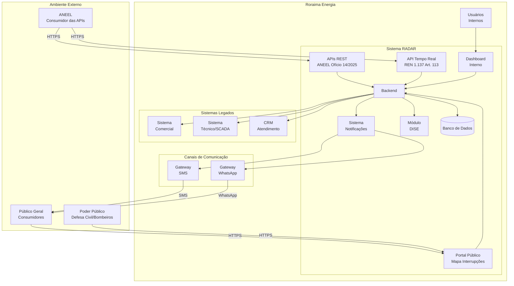

### 1.3 Princípios de Design

| Princípio | Descrição |
|-----------|-----------|
| **Conformidade** | APIs 100% aderentes às especificações ANEEL (Ofício 14/2025 e REN 1.137/2025) |
| **Transparência** | Portal público acessível 24/7 com informações em tempo real |
| **Comunicação Proativa** | Notificações automáticas dentro dos prazos regulatórios (15 min/1h) |
| **Simplicidade** | Arquitetura adequada ao porte da Roraima Energia |
| **Manutenibilidade** | Código limpo e documentado |
| **Resiliência** | Tolerância a falhas dos sistemas legados e alta disponibilidade |
| **Segurança** | Conformidade com padrões gov.br e LGPD |
| **Atualização Contínua** | Dados atualizados a cada 30 minutos (portal) conforme Art. 107 |

---

## 2. Escopo e Objetivos

### 2.1 Obrigações Ofício Circular 14/2025 (APIs RADAR)

A Roraima Energia **DEVE** entregar:

| Entrega | Prazo | Descrição |
|---------|-------|-----------|
| **API 1** | Dez/2025 | `/quantitativointerrupcoesativas` |
| **API 2** | Abr/2026 | `/dadosdemanda` |
| **API 3** | Mai/2026 | `/quantitativodemandasdiversas` |

**Requisitos obrigatórios:**
- [ ] API REST acessível via HTTPS
- [ ] Autenticação via API Key (x-api-key)
- [ ] Restrição de IP (200.198.220.128/25)
- [ ] Resposta em JSON com camelCase
- [ ] Rotas em minúsculas
- [ ] Disponibilidade conforme especificação
- [ ] Email de indisponibilidade
- [ ] Swagger (recomendado)

### 2.2 Obrigações REN 1.137/2025 (Resiliência Climática)

| Entrega | Prazo | Artigo | Descrição |
|---------|-------|--------|-----------|
| **Portal Público** | 180 dias | Art. 106-107 | Mapa de interrupções atualizado a cada 30 min |
| **Notificação SMS/WhatsApp** | 180 dias | Art. 105 | Comunicação em até 15 min (causa conhecida) / 1h (máx) |
| **API Tempo Real** | 60 dias após instruções | Art. 113 | API para ANEEL extrair dados em tempo real |
| **Indicador DISE** | 180 dias | Art. 173/180-A | Duração da Interrupção em Situação de Emergência |
| **Plano de Contingência** | 90 dias | Art. 140-148 | Gestão e documentação do plano |

**Requisitos do Portal Público (Art. 106-107):**
- [ ] Mapa georreferenciado de Roraima com interrupções
- [ ] Classificação por faixa de duração: <1h, 1-3h, 3-6h, 6-12h, 12-24h, 24-48h, >48h
- [ ] Quantidade de UCs afetadas por faixa
- [ ] Status de cada ocorrência: Em preparação / Deslocamento / Em execução
- [ ] Indicador CHI (Consumidor Hora Interrompido)
- [ ] Quantidade de equipes em campo
- [ ] Atualização a cada 30 minutos
- [ ] Acesso público sem autenticação

**Requisitos de Notificação (Art. 105, 109-112):**
- [ ] SMS + WhatsApp obrigatórios
- [ ] Prazo máximo 15 min quando causa conhecida
- [ ] Prazo máximo 1h quando causa desconhecida
- [ ] Conteúdo: previsão de restabelecimento, causa, área afetada
- [ ] Opt-out respeitando preferências do consumidor

### 2.3 Dashboard Interno (Complementar)

Funcionalidades do dashboard similar ao PowerOutage.us:

| Funcionalidade | Prioridade |
|----------------|------------|
| Mapa de Roraima com interrupções | Alta |
| KPIs em tempo real (DEC/FEC/DISE) | Alta |
| Painel de situação de emergência | Alta |
| Gráficos de evolução | Média |
| Painel de demandas | Média |
| Sistema de alertas | Média |
| Gestão de plano de contingência | Média |
| Relatórios | Baixa |

---

## 3. Arquitetura de Alto Nível

### 3.1 Diagrama de Arquitetura

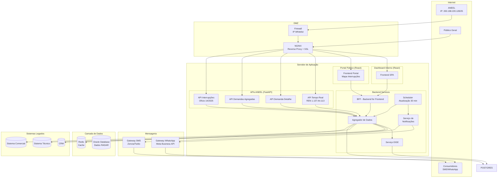

### 3.2 Stack Tecnológico

| Camada | Tecnologia | Justificativa |
|--------|------------|---------------|
| **Frontend** | React + TypeScript | Moderno, produtivo, boa comunidade |
| **Backend API** | Python + FastAPI | Framework moderno, async nativo, OpenAPI automático |
| **Banco de Dados** | Oracle Database 19c+ | Padrão corporativo Roraima Energia, integração nativa com sistemas legados |
| **ORM** | SQLAlchemy + oracledb | Driver oficial Oracle para Python, suporte async |
| **Cache** | Redis | Performance, TTL nativo, pub/sub para notificações |
| **Proxy** | NGINX | SSL, rate limiting, IP filtering |
| **Mapas** | Leaflet | Open source, leve |
| **Gráficos** | Recharts | React nativo, simples |
| **SMS Gateway** | Zenvia ou Twilio | Integração consolidada no Brasil |
| **WhatsApp** | Meta Business API | API oficial do WhatsApp Business |
| **Filas** | Celery + Redis | Processamento assíncrono de notificações |
| **Scheduler** | Celery Beat | Agendamento de tarefas (atualização 30 min) |

### 3.3 Arquitetura e Princípios de Design

**Decisão:** Arquitetura **Hexagonal (Ports and Adapters)** com princípios de **Clean Architecture** e **DDD**

**Princípios Adotados:**

| Princípio | Descrição |
|-----------|-----------|
| **Hexagonal Architecture** | Isolamento do domínio através de ports (interfaces) e adapters (implementações) |
| **Clean Architecture** | Camadas com dependências apontando para dentro (domain no centro) |
| **DDD** | Bounded Contexts, Aggregates, Value Objects, Domain Events |
| **SOLID** | Single Responsibility, Open/Closed, Liskov, Interface Segregation, Dependency Inversion |
| **Clean Code** | Código legível, nomes expressivos, funções pequenas, sem duplicação |
| **TDD** | Red-Green-Refactor, testes antes da implementação |

**Metodologia de Versionamento:**

| Prática | Descrição |
|---------|-----------|
| **Conventional Commits** | `feat:`, `fix:`, `docs:`, `refactor:`, `test:`, `chore:` |
| **GitHub Flow** | Branch `main` → `feature/*` → PR → Review → Merge |
| **Ambientes** | `staging` (homologação) e `production` (produção) |
| **CI/CD** | GitHub Actions com deploy automático |

**Diagrama da Arquitetura Hexagonal:**

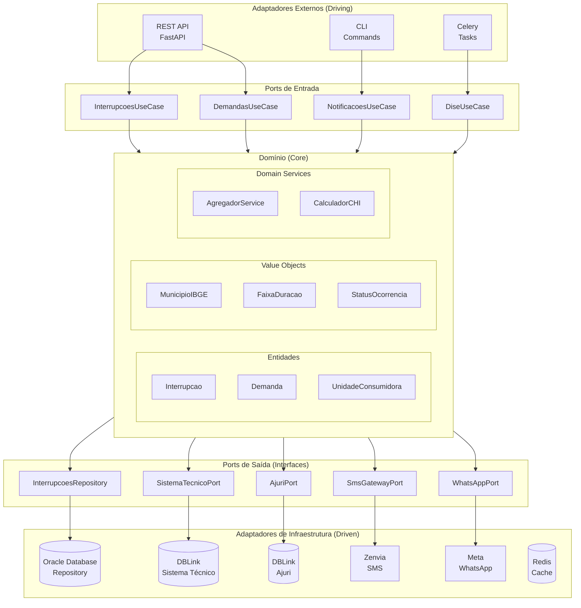

**Estrutura do Projeto (Clean Architecture + DDD):**
```
radar-api/
├── src/
│   ├── domain/                    # CAMADA DE DOMÍNIO (Core)
│   │   ├── __init__.py
│   │   ├── entities/              # Entidades do domínio
│   │   │   ├── __init__.py
│   │   │   ├── interrupcao.py
│   │   │   ├── demanda.py
│   │   │   ├── unidade_consumidora.py
│   │   │   └── situacao_emergencia.py
│   │   ├── value_objects/         # Value Objects
│   │   │   ├── __init__.py
│   │   │   ├── municipio_ibge.py
│   │   │   ├── faixa_duracao.py
│   │   │   ├── status_ocorrencia.py
│   │   │   └── coordenadas.py
│   │   ├── events/                # Domain Events
│   │   │   ├── __init__.py
│   │   │   ├── interrupcao_iniciada.py
│   │   │   └── interrupcao_encerrada.py
│   │   ├── services/              # Domain Services
│   │   │   ├── __init__.py
│   │   │   ├── agregador_interrupcoes.py
│   │   │   └── calculador_chi.py
│   │   └── exceptions.py          # Exceções do domínio
│   │
│   ├── application/               # CAMADA DE APLICAÇÃO (Use Cases)
│   │   ├── __init__.py
│   │   ├── ports/                 # Interfaces (Ports)
│   │   │   ├── __init__.py
│   │   │   ├── input/             # Ports de entrada (Driving)
│   │   │   │   ├── interrupcoes_use_case.py
│   │   │   │   ├── demandas_use_case.py
│   │   │   │   └── notificacoes_use_case.py
│   │   │   └── output/            # Ports de saída (Driven)
│   │   │       ├── interrupcoes_repository.py
│   │   │       ├── sistema_tecnico_port.py
│   │   │       ├── ajuri_port.py
│   │   │       ├── sms_gateway_port.py
│   │   │       └── whatsapp_port.py
│   │   ├── use_cases/             # Implementação dos Use Cases
│   │   │   ├── __init__.py
│   │   │   ├── get_interrupcoes_ativas.py
│   │   │   ├── get_demandas_agregadas.py
│   │   │   ├── enviar_notificacao.py
│   │   │   └── consultar_dise.py
│   │   └── dtos/                  # Data Transfer Objects
│   │       ├── __init__.py
│   │       ├── interrupcao_dto.py
│   │       └── demanda_dto.py
│   │
│   ├── infrastructure/            # CAMADA DE INFRAESTRUTURA (Adapters)
│   │   ├── __init__.py
│   │   ├── adapters/              # Implementações dos Ports
│   │   │   ├── __init__.py
│   │   │   ├── persistence/       # Adaptadores de persistência
│   │   │   │   ├── __init__.py
│   │   │   │   ├── oracle_interrupcoes_repository.py
│   │   │   │   ├── oracle_demandas_repository.py
│   │   │   │   └── redis_cache_adapter.py
│   │   │   ├── external/          # Adaptadores externos (DBLink)
│   │   │   │   ├── __init__.py
│   │   │   │   ├── sistema_tecnico_adapter.py
│   │   │   │   └── ajuri_adapter.py
│   │   │   └── messaging/         # Adaptadores de mensageria
│   │   │       ├── __init__.py
│   │   │       ├── zenvia_sms_adapter.py
│   │   │       └── meta_whatsapp_adapter.py
│   │   ├── database/
│   │   │   ├── __init__.py
│   │   │   ├── connection.py
│   │   │   ├── models/            # SQLAlchemy Models
│   │   │   │   ├── __init__.py
│   │   │   │   └── interrupcao_model.py
│   │   │   └── foreign_tables/    # Foreign Tables (DBLink)
│   │   │       ├── __init__.py
│   │   │       ├── sistema_tecnico.py
│   │   │       └── ajuri.py
│   │   └── config/
│   │       ├── __init__.py
│   │       └── settings.py        # Pydantic Settings
│   │
│   └── presentation/              # CAMADA DE APRESENTAÇÃO (API)
│       ├── __init__.py
│       ├── api/
│       │   ├── __init__.py
│       │   ├── main.py            # FastAPI app
│       │   ├── dependencies.py    # Dependency Injection
│       │   └── v1/
│       │       ├── __init__.py
│       │       ├── router.py
│       │       ├── interrupcoes.py
│       │       ├── demandas.py
│       │       └── portal_publico.py
│       ├── schemas/               # Pydantic Schemas (API)
│       │   ├── __init__.py
│       │   ├── interrupcao_schema.py
│       │   └── demanda_schema.py
│       └── cli/                   # CLI Commands
│           ├── __init__.py
│           └── commands.py
│
├── tests/                         # TESTES (TDD)
│   ├── __init__.py
│   ├── conftest.py               # Fixtures pytest
│   ├── unit/                     # Testes unitários
│   │   ├── domain/
│   │   │   ├── test_interrupcao.py
│   │   │   └── test_value_objects.py
│   │   └── application/
│   │       └── test_use_cases.py
│   ├── integration/              # Testes de integração
│   │   ├── test_repositories.py
│   │   └── test_adapters.py
│   └── e2e/                      # Testes end-to-end
│       └── test_api.py
│
├── portal-publico/               # Frontend React (Portal)
├── dashboard/                    # Frontend React (Dashboard)
│
├── .github/
│   └── workflows/
│       ├── ci.yml                # CI: lint, test, build
│       ├── cd-staging.yml        # Deploy para staging
│       └── cd-production.yml     # Deploy para produção
│
├── docker-compose.yml
├── docker-compose.staging.yml
├── docker-compose.prod.yml
├── Dockerfile
├── pyproject.toml               # Poetry / configurações
├── requirements.txt
├── .pre-commit-config.yaml      # Pre-commit hooks
├── .env.example
└── README.md
```

### 3.4 Fluxo de Desenvolvimento (GitHub Flow)

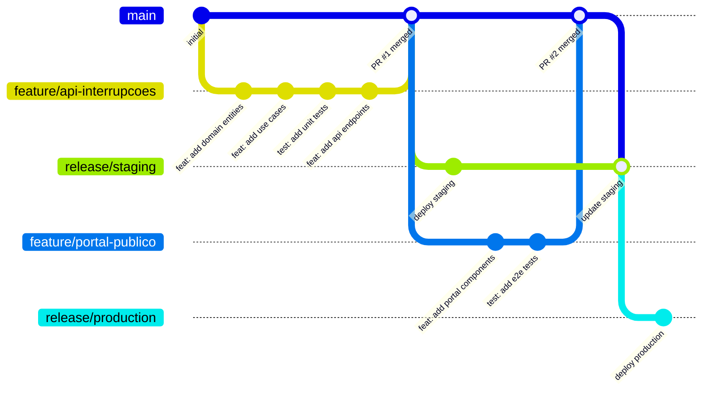

**Padrão de Commits (Conventional Commits):**

| Tipo | Descrição | Exemplo |
|------|-----------|---------|
| `feat:` | Nova funcionalidade | `feat: add endpoint GET /quantitativointerrupcoesativas` |
| `fix:` | Correção de bug | `fix: correct date parsing for dthRecuperacao` |
| `docs:` | Documentação | `docs: update API documentation` |
| `refactor:` | Refatoração | `refactor: extract domain service for aggregation` |
| `test:` | Testes | `test: add unit tests for InterrupcoesUseCase` |
| `chore:` | Tarefas | `chore: update dependencies` |
| `ci:` | CI/CD | `ci: add staging deployment workflow` |

**Ambientes:**

| Ambiente | Branch | URL | Propósito |
|----------|--------|-----|-----------|
| **Development** | `feature/*` | localhost:8000 | Desenvolvimento local |
| **Staging** | `main` | staging.radar.roraimaenergia.com.br | Homologação/QA |
| **Production** | `release/production` | radar.roraimaenergia.com.br | Produção |

---

## 4. Arquitetura das APIs ANEEL

### 4.1 Estrutura dos Endpoints

```mermaid
flowchart LR
    subgraph Request["Requisição ANEEL"]
        REQ[GET /quantitativointerrupcoesativas]
    end

    subgraph Middleware["Middlewares"]
        AUTH[Validar API Key]
        IP[Validar IP]
        LOG[Logar Requisição]
    end

    subgraph Controller["Controller"]
        CTRL[InterrupcoesController]
    end

    subgraph Service["Service"]
        SVC[InterrupcoesService]
    end

    subgraph Repository["Repository"]
        REPO[InterrupcoesRepository]
    end

    subgraph DataSources["Fontes de Dados"]
        CACHE[(Redis Cache)]
        DB[(PostgreSQL)]
        LEGACY[Sistema Técnico]
    end

    REQ --> AUTH --> IP --> LOG --> CTRL
    CTRL --> SVC
    SVC --> REPO
    REPO --> CACHE
    CACHE -->|cache miss| DB
    DB -->|dados desatualizados| LEGACY
```

### 4.2 Código da API de Interrupções

#### 4.2.1 Router (FastAPI)

```python
# app/api/v1/interrupcoes.py
from datetime import datetime
from typing import Optional
from fastapi import APIRouter, Depends, Query, HTTPException
from sqlalchemy.ext.asyncio import AsyncSession

from app.api.deps import get_db, verify_api_key, verify_ip_whitelist
from app.schemas.interrupcao import (
    InterrupcoesResponse,
    InterrupcaoFornecimento,
    RecuperacaoQuery
)
from app.services.interrupcoes import InterrupcoesService
from app.config import settings

router = APIRouter(
    prefix="",
    tags=["ANEEL - Interrupções"],
    dependencies=[Depends(verify_api_key), Depends(verify_ip_whitelist)]
)


@router.get(
    "/quantitativointerrupcoesativas",
    response_model=InterrupcoesResponse,
    summary="Quantitativo de interrupções ativas",
    description="Retorna o quantitativo de UCs com interrupção de fornecimento ativas"
)
async def get_interrupcoes_ativas(
    dthRecuperacao: Optional[str] = Query(
        None,
        description="Data/hora para recuperação (formato: dd/mm/yyyy hh:mm)",
        regex=r"^\d{2}/\d{2}/\d{4} \d{2}:\d{2}$"
    ),
    db: AsyncSession = Depends(get_db)
):
    """
    Endpoint obrigatório para ANEEL - Ofício Circular 14/2025.

    Parâmetros:
    - **dthRecuperacao**: Data/hora para recuperação de dados históricos (opcional)

    Retorna o quantitativo de UCs com interrupção ativa por município e conjunto elétrico.
    """
    try:
        data_hora = parse_data_hora(dthRecuperacao) if dthRecuperacao else datetime.now()

        service = InterrupcoesService(db)
        dados = await service.get_interrupcoes_ativas(data_hora)

        return InterrupcoesResponse(
            idcStatusRequisicao=1,
            emailIndisponibilidade=settings.EMAIL_INDISPONIBILIDADE,
            mensagem="",
            interrupcaoFornecimento=dados
        )
    except Exception as e:
        return InterrupcoesResponse(
            idcStatusRequisicao=2,
            emailIndisponibilidade=settings.EMAIL_INDISPONIBILIDADE,
            mensagem=f"Erro ao processar requisição: {str(e)}",
            interrupcaoFornecimento=[]
        )


def parse_data_hora(dth_recuperacao: str) -> datetime:
    """Converte string dd/mm/yyyy hh:mm para datetime."""
    return datetime.strptime(dth_recuperacao, "%d/%m/%Y %H:%M")
```

#### 4.2.2 Ports (Interfaces) - Clean Architecture

```python
# src/application/ports/output/interrupcoes_repository.py
from abc import ABC, abstractmethod
from datetime import datetime
from typing import List, Optional

from src.domain.entities.interrupcao import Interrupcao


class IInterrupcoesRepository(ABC):
    """Port de saída para persistência de interrupções."""

    @abstractmethod
    async def buscar_ativas(self) -> List[Interrupcao]:
        """Busca interrupções ativas."""
        pass

    @abstractmethod
    async def buscar_por_data(self, data_hora: datetime) -> List[Interrupcao]:
        """Busca interrupções em uma data específica."""
        pass

    @abstractmethod
    async def salvar_snapshot(self, interrupcoes: List[Interrupcao]) -> None:
        """Salva snapshot de interrupções."""
        pass


# src/application/ports/output/cache_port.py
class ICachePort(ABC):
    """Port de saída para cache."""

    @abstractmethod
    async def get(self, key: str) -> Optional[str]:
        pass

    @abstractmethod
    async def set(self, key: str, value: str, ttl_seconds: int) -> None:
        pass


# src/application/ports/output/sistema_tecnico_port.py
class ISistemaTecnicoPort(ABC):
    """Port de saída para integração com Sistema Técnico."""

    @abstractmethod
    async def get_interrupcoes_ativas(self) -> List[dict]:
        pass
```

#### 4.2.3 Use Case (Application Layer)

```python
# src/application/use_cases/get_interrupcoes_ativas.py
import logging
from datetime import datetime
from typing import List

from src.application.ports.output.interrupcoes_repository import IInterrupcoesRepository
from src.application.ports.output.cache_port import ICachePort
from src.application.ports.output.sistema_tecnico_port import ISistemaTecnicoPort
from src.presentation.schemas.interrupcao import InterrupcaoFornecimento

logger = logging.getLogger(__name__)


class GetInterrupcoesAtivasUseCase:
    """Use Case para obter interrupções ativas - Clean Architecture."""

    CACHE_KEY = "interrupcoes:ativas"
    CACHE_TTL = 25 * 60  # 25 minutos

    def __init__(
        self,
        repository: IInterrupcoesRepository,  # Interface, não implementação!
        cache: ICachePort,                     # Interface, não Redis direto!
        sistema_tecnico: ISistemaTecnicoPort   # Interface, não implementação!
    ):
        self._repository = repository
        self._cache = cache
        self._sistema_tecnico = sistema_tecnico

    async def execute(self, data_hora: datetime) -> List[InterrupcaoFornecimento]:
        """Executa o use case - busca interrupções ativas."""
        is_tempo_real = self._is_tempo_real(data_hora)

        if is_tempo_real:
            # Tenta buscar do cache via interface
            cached = await self._cache.get(self.CACHE_KEY)
            if cached:
                logger.debug("Retornando dados do cache")
                return [InterrupcaoFornecimento(**item) for item in json.loads(cached)]

        # Busca dados (tempo real ou histórico) via interfaces
        if is_tempo_real:
            dados_raw = await self._sistema_tecnico.get_interrupcoes_ativas()
            dados = self._agregar_dados(dados_raw)
            await self._repository.salvar_snapshot(dados)
        else:
            interrupcoes = await self._repository.buscar_por_data(data_hora)
            dados = [self._to_response(i) for i in interrupcoes]

        # Atualiza cache via interface
        if is_tempo_real and dados:
            await self._cache.set(
                self.CACHE_KEY,
                json.dumps([d.model_dump() for d in dados]),
                self.CACHE_TTL
            )

        return dados

    def _is_tempo_real(self, data_hora: datetime) -> bool:
        """Verifica se a consulta é em tempo real (menos de 5 min)."""
        diff = datetime.now() - data_hora
        return diff.total_seconds() < 300

    def _agregar_dados(self, interrupcoes: list) -> List[InterrupcaoFornecimento]:
        """Agrega interrupções por conjunto + município."""
        from collections import defaultdict
        mapa = defaultdict(lambda: {
            "qtdUCsAtendidas": 0,
            "qtdOcorrenciaProgramada": 0,
            "qtdOcorrenciaNaoProgramada": 0
        })

        for int_data in interrupcoes:
            chave = (int_data["conjunto_eletrico_id"], int_data["municipio_id"])
            if mapa[chave]["qtdUCsAtendidas"] == 0:
                mapa[chave]["qtdUCsAtendidas"] = int_data["qtd_ucs_total"]
            if int_data["programada"]:
                mapa[chave]["qtdOcorrenciaProgramada"] += int_data["qtd_ucs_afetadas"]
            else:
                mapa[chave]["qtdOcorrenciaNaoProgramada"] += int_data["qtd_ucs_afetadas"]

        return [
            InterrupcaoFornecimento(
                ideConjuntoUnidadeConsumidora=chave[0],
                ideMunicipio=chave[1],
                **valores
            )
            for chave, valores in mapa.items()
        ]

    def _to_response(self, interrupcao) -> InterrupcaoFornecimento:
        """Converte entidade para response."""
        return InterrupcaoFornecimento(
            ideConjuntoUnidadeConsumidora=interrupcao.conjunto_eletrico_id,
            ideMunicipio=interrupcao.municipio_id,
            qtdUCsAtendidas=interrupcao.qtd_ucs_atendidas,
            qtdOcorrenciaProgramada=interrupcao.qtd_programada,
            qtdOcorrenciaNaoProgramada=interrupcao.qtd_nao_programada
        )
```

#### 4.2.4 Schemas (Pydantic)

```python
# app/schemas/interrupcao.py
from typing import List, Optional
from pydantic import BaseModel, Field


class InterrupcaoFornecimento(BaseModel):
    """DTO para dados de interrupção por conjunto/município."""

    ideConjuntoUnidadeConsumidora: int = Field(
        ...,
        description="Código do conjunto elétrico",
        examples=[1]
    )
    ideMunicipio: int = Field(
        ...,
        description="Código IBGE do município",
        examples=[1400050]
    )
    qtdUCsAtendidas: int = Field(
        ...,
        description="Total de UCs atendidas",
        examples=[85000]
    )
    qtdOcorrenciaProgramada: int = Field(
        ...,
        description="UCs com interrupção programada",
        examples=[150]
    )
    qtdOcorrenciaNaoProgramada: int = Field(
        ...,
        description="UCs com interrupção não programada",
        examples=[45]
    )

    class Config:
        json_schema_extra = {
            "example": {
                "ideConjuntoUnidadeConsumidora": 1,
                "ideMunicipio": 1400100,
                "qtdUCsAtendidas": 85000,
                "qtdOcorrenciaProgramada": 150,
                "qtdOcorrenciaNaoProgramada": 45
            }
        }


class InterrupcoesResponse(BaseModel):
    """Resposta padrão da API de interrupções para ANEEL."""

    idcStatusRequisicao: int = Field(
        ...,
        description="1=Sucesso, 2=Erro",
        examples=[1]
    )
    emailIndisponibilidade: str = Field(
        ...,
        description="Email para notificações de indisponibilidade",
        examples=["ti.aneel@roraimaenergia.com.br"]
    )
    mensagem: str = Field(
        "",
        description="Mensagem de erro (se aplicável)",
        examples=[""]
    )
    interrupcaoFornecimento: List[InterrupcaoFornecimento] = Field(
        default_factory=list,
        description="Lista de interrupções por conjunto/município"
    )
```

### 4.3 Dependências de Segurança (FastAPI)

```python
# app/api/deps.py
from typing import Optional
from ipaddress import ip_address, ip_network

from fastapi import Request, HTTPException, Header, status
from fastapi.security import APIKeyHeader

from app.config import settings

# Security scheme para OpenAPI/Swagger
api_key_header = APIKeyHeader(name="x-api-key", auto_error=False)


async def verify_api_key(
    api_key: Optional[str] = Header(None, alias="x-api-key")
) -> str:
    """
    Valida a API Key enviada no header x-api-key.

    Raises:
        HTTPException 401: Se a API Key não for informada ou for inválida.
    """
    if not api_key:
        raise HTTPException(
            status_code=status.HTTP_401_UNAUTHORIZED,
            detail="API Key não informada"
        )

    if api_key != settings.ANEEL_API_KEY:
        raise HTTPException(
            status_code=status.HTTP_401_UNAUTHORIZED,
            detail="API Key inválida"
        )

    return api_key


async def verify_ip_whitelist(request: Request) -> str:
    """
    Valida se o IP de origem está na whitelist da ANEEL.

    IPs autorizados:
    - 200.198.220.128/25 (ANEEL)
    - 127.0.0.1 (localhost dev)
    - ::1 (localhost IPv6 dev)

    Raises:
        HTTPException 403: Se o IP não estiver autorizado.
    """
    # Ranges permitidos
    allowed_ranges = [
        "200.198.220.128/25",  # ANEEL
        "127.0.0.1/32",        # Localhost
        "::1/128",             # Localhost IPv6
    ]

    # Adiciona IPs extras do ambiente
    if settings.ALLOWED_IPS:
        allowed_ranges.extend(settings.ALLOWED_IPS.split(","))

    # Obtém IP do cliente
    client_ip = _get_client_ip(request)

    # Verifica se está em algum range permitido
    try:
        client_addr = ip_address(client_ip)
        is_allowed = any(
            client_addr in ip_network(range_str, strict=False)
            for range_str in allowed_ranges
        )
    except ValueError:
        is_allowed = False

    if not is_allowed:
        raise HTTPException(
            status_code=status.HTTP_403_FORBIDDEN,
            detail=f"IP não autorizado: {client_ip}"
        )

    return client_ip


def _get_client_ip(request: Request) -> str:
    """Extrai o IP real do cliente considerando proxies."""
    # X-Forwarded-For pode conter múltiplos IPs separados por vírgula
    forwarded_for = request.headers.get("x-forwarded-for")
    if forwarded_for:
        return forwarded_for.split(",")[0].strip()

    # X-Real-IP definido pelo NGINX
    real_ip = request.headers.get("x-real-ip")
    if real_ip:
        return real_ip.strip()

    # IP direto da conexão
    if request.client:
        return request.client.host

    return "0.0.0.0"
```

### 4.4 Configurações (Pydantic Settings)

```python
# app/config.py
from typing import Optional
from pydantic_settings import BaseSettings


class Settings(BaseSettings):
    """Configurações da aplicação via variáveis de ambiente."""

    # Aplicação
    APP_NAME: str = "RADAR - Roraima Energia"
    APP_VERSION: str = "1.0.0"
    DEBUG: bool = False

    # Banco de Dados Oracle
    ORACLE_USER: str = "radar"
    ORACLE_PASSWORD: str  # Obrigatório - sem default
    ORACLE_HOST: str = "localhost"
    ORACLE_PORT: int = 1521
    ORACLE_SERVICE: str = "ORCLPDB1"

    @property
    def DATABASE_URL(self) -> str:
        """Gera connection string Oracle para SQLAlchemy."""
        return (
            f"oracle+oracledb://{self.ORACLE_USER}:{self.ORACLE_PASSWORD}"
            f"@{self.ORACLE_HOST}:{self.ORACLE_PORT}/?service_name={self.ORACLE_SERVICE}"
        )

    # Redis
    REDIS_URL: str = "redis://localhost:6379/0"

    # Segurança ANEEL
    ANEEL_API_KEY: str
    ALLOWED_IPS: Optional[str] = None
    EMAIL_INDISPONIBILIDADE: str = "ti.aneel@roraimaenergia.com.br"

    # SMS Gateway (Zenvia/Twilio)
    SMS_GATEWAY_URL: Optional[str] = None
    SMS_GATEWAY_TOKEN: Optional[str] = None

    # WhatsApp Business API
    WHATSAPP_API_URL: Optional[str] = None
    WHATSAPP_TOKEN: Optional[str] = None

    # Celery
    CELERY_BROKER_URL: str = "redis://localhost:6379/1"
    CELERY_RESULT_BACKEND: str = "redis://localhost:6379/2"

    class Config:
        env_file = ".env"
        case_sensitive = True


settings = Settings()
```

### 4.5 API 2 - Dados de Demanda (`/dadosdemanda`)

**Prazo de entrega:** Abril/2026

**Descrição:** Retorna dados detalhados de uma demanda específica a partir do número do protocolo.

#### 4.5.1 Endpoint

```
GET /dadosdemanda?numProtocolo={numero}
```

**Headers obrigatórios:**
- `x-api-key`: Chave de autenticação

**Query Parameters:**
| Parâmetro | Tipo | Obrigatório | Descrição |
|-----------|------|-------------|-----------|
| numProtocolo | string | Sim | Número do protocolo da demanda |

#### 4.5.2 Response Schema

```python
# src/presentation/schemas/demanda_schema.py
from typing import Optional
from datetime import datetime
from pydantic import BaseModel, Field


class DadosDemandaResponse(BaseModel):
    """Resposta da API de dados de demanda para ANEEL."""

    idcStatusRequisicao: int = Field(..., description="1=Sucesso, 2=Erro")
    emailIndisponibilidade: str = Field(..., description="Email para notificações")
    mensagem: str = Field("", description="Mensagem de erro se aplicável")

    # Dados da demanda
    numProtocolo: Optional[str] = Field(None, description="Número do protocolo")
    numUC: Optional[str] = Field(None, description="Número da UC")
    numCpfCnpj: Optional[str] = Field(None, description="CPF/CNPJ do titular")
    nomTitular: Optional[str] = Field(None, description="Nome do titular")
    idcCanalAtendimento: Optional[int] = Field(None, description="Canal: 1=Presencial, 2=Telefone, 3=Internet, 4=App")
    idcTipologia: Optional[str] = Field(None, description="Código tipologia (7 dígitos)")
    idcStatus: Optional[int] = Field(None, description="0=Andamento, 1=Registrada, 2=Encerrada")
    idcProcedencia: Optional[int] = Field(None, description="0=Improcedente, 1=Procedente, 2=Sem procedência")
    dthAbertura: Optional[datetime] = Field(None, description="Data/hora abertura")
    dthEncerramento: Optional[datetime] = Field(None, description="Data/hora encerramento")
    ideMunicipio: Optional[int] = Field(None, description="Código IBGE do município")
    idcNivelTratamento: Optional[int] = Field(None, description="0=1º nível, 1=2º nível, 2=3º nível")


class DemandaNaoEncontradaResponse(BaseModel):
    """Resposta quando demanda não é encontrada."""
    idcStatusRequisicao: int = 1
    emailIndisponibilidade: str
    mensagem: str = "Protocolo não encontrado"
```

#### 4.5.3 Implementação do Endpoint

```python
# src/presentation/api/v1/demandas.py
from typing import Optional
from fastapi import APIRouter, Depends, Query, HTTPException

from src.application.ports.input.demandas_use_case import IDemandasUseCase
from src.presentation.schemas.demanda_schema import DadosDemandaResponse
from src.presentation.api.dependencies import get_demandas_use_case, verify_api_key, verify_ip_whitelist
from src.infrastructure.config.settings import settings

router = APIRouter(
    prefix="",
    tags=["ANEEL - Demandas"],
    dependencies=[Depends(verify_api_key), Depends(verify_ip_whitelist)]
)


@router.get(
    "/dadosdemanda",
    response_model=DadosDemandaResponse,
    summary="Dados de demanda por protocolo",
    description="Retorna dados detalhados de uma demanda específica"
)
async def get_dados_demanda(
    numProtocolo: str = Query(..., description="Número do protocolo"),
    use_case: IDemandasUseCase = Depends(get_demandas_use_case)
):
    """
    Endpoint obrigatório para ANEEL - Ofício Circular 14/2025.

    Retorna os dados de uma demanda a partir do número do protocolo.
    """
    try:
        demanda = await use_case.buscar_por_protocolo(numProtocolo)

        if not demanda:
            return DadosDemandaResponse(
                idcStatusRequisicao=1,
                emailIndisponibilidade=settings.EMAIL_INDISPONIBILIDADE,
                mensagem="Protocolo não encontrado"
            )

        return DadosDemandaResponse(
            idcStatusRequisicao=1,
            emailIndisponibilidade=settings.EMAIL_INDISPONIBILIDADE,
            mensagem="",
            **demanda.model_dump()
        )
    except Exception as e:
        return DadosDemandaResponse(
            idcStatusRequisicao=2,
            emailIndisponibilidade=settings.EMAIL_INDISPONIBILIDADE,
            mensagem=f"Erro ao processar requisição: {str(e)}"
        )
```

### 4.6 API 3 - Quantitativo de Demandas Diversas (`/quantitativodemandasdiversas`)

**Prazo de entrega:** Maio/2026

**Descrição:** Retorna o quantitativo agregado de demandas por canal de atendimento, tipologia e status.

#### 4.6.1 Endpoint

```
GET /quantitativodemandasdiversas?dthRecuperacao={data}
```

**Headers obrigatórios:**
- `x-api-key`: Chave de autenticação

**Query Parameters:**
| Parâmetro | Tipo | Obrigatório | Descrição |
|-----------|------|-------------|-----------|
| dthRecuperacao | string | Não | Data/hora recuperação (dd/mm/yyyy hh:mm) |

#### 4.6.2 Response Schema

```python
# src/presentation/schemas/demanda_agregada_schema.py
from typing import List
from pydantic import BaseModel, Field


class DemandaAgregada(BaseModel):
    """DTO para demandas agregadas por canal/tipologia."""

    idcNivelAtendimento: int = Field(..., description="0=1º nível, 1=2º nível, 2=3º nível")
    idcCanalAtendimento: int = Field(..., description="1=Presencial, 2=Telefone, 3=Internet, 4=App")
    idcTipologia: str = Field(..., description="Código tipologia (7 dígitos)")
    qtdAndamento: int = Field(..., description="Quantidade em andamento")
    qtdRegistrada: int = Field(..., description="Quantidade registrada")
    qtdImprocedente: int = Field(..., description="Quantidade improcedente")
    qtdProcedente: int = Field(..., description="Quantidade procedente")
    qtdSemProcedencia: int = Field(..., description="Quantidade sem procedência definida")


class DemandasDiversasResponse(BaseModel):
    """Resposta da API de demandas diversas para ANEEL."""

    idcStatusRequisicao: int = Field(..., description="1=Sucesso, 2=Erro")
    emailIndisponibilidade: str = Field(..., description="Email para notificações")
    mensagem: str = Field("", description="Mensagem de erro se aplicável")
    quantitativoDemandasDiversas: List[DemandaAgregada] = Field(
        default_factory=list,
        description="Lista de demandas agregadas"
    )
```

#### 4.6.3 Implementação do Endpoint

```python
# src/presentation/api/v1/demandas_diversas.py
from datetime import datetime
from typing import Optional
from fastapi import APIRouter, Depends, Query

from src.application.ports.input.demandas_use_case import IDemandasUseCase
from src.presentation.schemas.demanda_agregada_schema import DemandasDiversasResponse
from src.presentation.api.dependencies import get_demandas_use_case, verify_api_key, verify_ip_whitelist
from src.infrastructure.config.settings import settings

router = APIRouter(
    prefix="",
    tags=["ANEEL - Demandas"],
    dependencies=[Depends(verify_api_key), Depends(verify_ip_whitelist)]
)


@router.get(
    "/quantitativodemandasdiversas",
    response_model=DemandasDiversasResponse,
    summary="Quantitativo de demandas diversas",
    description="Retorna quantitativo agregado de demandas por canal, tipologia e status"
)
async def get_demandas_diversas(
    dthRecuperacao: Optional[str] = Query(
        None,
        description="Data/hora para recuperação (formato: dd/mm/yyyy hh:mm)",
        regex=r"^\d{2}/\d{2}/\d{4} \d{2}:\d{2}$"
    ),
    use_case: IDemandasUseCase = Depends(get_demandas_use_case)
):
    """
    Endpoint obrigatório para ANEEL - Ofício Circular 14/2025.

    Retorna o quantitativo de demandas agregadas por:
    - Nível de atendimento (1º, 2º, 3º nível)
    - Canal de atendimento (presencial, telefone, internet, app)
    - Tipologia
    - Status (andamento, registrada, improcedente, procedente, sem procedência)
    """
    try:
        data_hora = (
            datetime.strptime(dthRecuperacao, "%d/%m/%Y %H:%M")
            if dthRecuperacao
            else datetime.now()
        )

        dados = await use_case.get_demandas_agregadas(data_hora)

        return DemandasDiversasResponse(
            idcStatusRequisicao=1,
            emailIndisponibilidade=settings.EMAIL_INDISPONIBILIDADE,
            mensagem="",
            quantitativoDemandasDiversas=dados
        )
    except Exception as e:
        return DemandasDiversasResponse(
            idcStatusRequisicao=2,
            emailIndisponibilidade=settings.EMAIL_INDISPONIBILIDADE,
            mensagem=f"Erro ao processar requisição: {str(e)}",
            quantitativoDemandasDiversas=[]
        )
```

---

## 5. Portal Público de Interrupções (REN 1.137)

### 5.1 Visão Geral

O Portal Público de Interrupções é obrigatório conforme Art. 106-107 da REN 1.137/2025 e deve:
- Estar acessível ao público sem autenticação
- Exibir mapa georreferenciado de Roraima com interrupções
- Ser atualizado a cada 30 minutos
- Mostrar quantidade de UCs afetadas por faixa de duração
- Exibir status das ocorrências e equipes em campo

### 5.2 Arquitetura do Portal

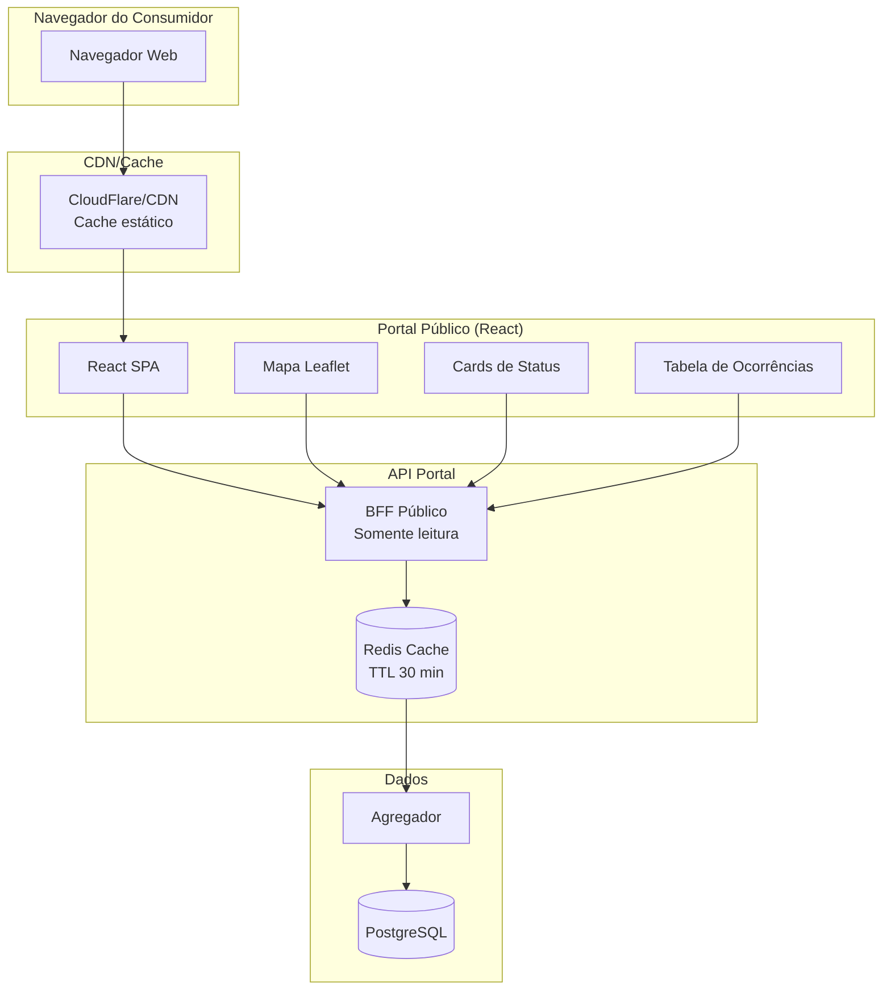

### 5.3 Estrutura do Frontend do Portal

```
portal-publico/
├── public/
│   ├── index.html
│   └── assets/
│       ├── roraima.geojson       # Limites dos municípios
│       └── logo-roraima.png
├── src/
│   ├── App.tsx
│   ├── pages/
│   │   └── PortalInterrupcoes/
│   │       ├── index.tsx
│   │       ├── components/
│   │       │   ├── MapaInterrupcoes.tsx
│   │       │   ├── ResumoGeral.tsx
│   │       │   ├── CardsFaixaDuracao.tsx
│   │       │   ├── TabelaOcorrencias.tsx
│   │       │   ├── StatusEquipes.tsx
│   │       │   └── UltimaAtualizacao.tsx
│   ├── components/
│   │   ├── Header/
│   │   └── Footer/
│   ├── hooks/
│   │   ├── useInterrupcoesPublicas.ts
│   │   └── useStatusGeral.ts
│   ├── services/
│   │   └── apiPublica.ts
│   └── types/
│       └── interrupcao.ts
├── package.json
└── vite.config.ts
```

### 5.4 Componentes Principais

#### 5.4.1 Cards por Faixa de Duração (Art. 107)

```typescript
// portal-publico/src/pages/PortalInterrupcoes/components/CardsFaixaDuracao.tsx
import React from 'react';
import { useInterrupcoesPublicas } from '../../../hooks/useInterrupcoesPublicas';

interface FaixaDuracao {
  faixa: string;
  label: string;
  qtdUCs: number;
  cor: string;
}

const FAIXAS: FaixaDuracao[] = [
  { faixa: 'ate1h', label: '< 1 hora', qtdUCs: 0, cor: '#4CAF50' },
  { faixa: '1a3h', label: '1 a 3 horas', qtdUCs: 0, cor: '#8BC34A' },
  { faixa: '3a6h', label: '3 a 6 horas', qtdUCs: 0, cor: '#FFEB3B' },
  { faixa: '6a12h', label: '6 a 12 horas', qtdUCs: 0, cor: '#FF9800' },
  { faixa: '12a24h', label: '12 a 24 horas', qtdUCs: 0, cor: '#FF5722' },
  { faixa: '24a48h', label: '24 a 48 horas', qtdUCs: 0, cor: '#F44336' },
  { faixa: 'mais48h', label: '> 48 horas', qtdUCs: 0, cor: '#B71C1C' },
];

export const CardsFaixaDuracao: React.FC = () => {
  const { data, isLoading } = useInterrupcoesPublicas();

  if (isLoading) return <div className="loading">Carregando...</div>;

  const faixasComDados = FAIXAS.map(f => ({
    ...f,
    qtdUCs: data?.faixas?.[f.faixa] || 0
  }));

  return (
    <div className="cards-faixa-duracao">
      <h2>Unidades Consumidoras por Tempo de Interrupção</h2>
      <div className="cards-container">
        {faixasComDados.map(faixa => (
          <div
            key={faixa.faixa}
            className="card-faixa"
            style={{ borderColor: faixa.cor }}
          >
            <div className="faixa-label">{faixa.label}</div>
            <div className="faixa-valor" style={{ color: faixa.cor }}>
              {faixa.qtdUCs.toLocaleString('pt-BR')}
            </div>
            <div className="faixa-unidade">UCs</div>
          </div>
        ))}
      </div>
    </div>
  );
};
```

#### 5.4.2 Tabela de Ocorrências com Status (Art. 107)

```typescript
// portal-publico/src/pages/PortalInterrupcoes/components/TabelaOcorrencias.tsx
import React from 'react';
import { useInterrupcoesPublicas } from '../../../hooks/useInterrupcoesPublicas';

interface Ocorrencia {
  id: string;
  municipio: string;
  bairro: string;
  status: 'preparacao' | 'deslocamento' | 'execucao';
  inicio: Date;
  previsao?: Date;
  qtdUCs: number;
  chi: number;       // Consumidor Hora Interrompido
  equipes: number;
  causa?: string;
}

const STATUS_LABELS = {
  preparacao: { label: 'Em preparação', cor: '#FF9800', icone: '🔧' },
  deslocamento: { label: 'Deslocamento', cor: '#2196F3', icone: '🚗' },
  execucao: { label: 'Em execução', cor: '#4CAF50', icone: '⚡' },
};

export const TabelaOcorrencias: React.FC = () => {
  const { data, isLoading } = useInterrupcoesPublicas();

  if (isLoading) return <div className="loading">Carregando...</div>;

  return (
    <div className="tabela-ocorrencias">
      <h2>Ocorrências em Andamento</h2>
      <table>
        <thead>
          <tr>
            <th>Município</th>
            <th>Bairro/Localidade</th>
            <th>Status</th>
            <th>Início</th>
            <th>Previsão</th>
            <th>UCs Afetadas</th>
            <th>CHI</th>
            <th>Equipes</th>
          </tr>
        </thead>
        <tbody>
          {data?.ocorrencias?.map((oc: Ocorrencia) => (
            <tr key={oc.id}>
              <td>{oc.municipio}</td>
              <td>{oc.bairro}</td>
              <td>
                <span
                  className="status-badge"
                  style={{ backgroundColor: STATUS_LABELS[oc.status].cor }}
                >
                  {STATUS_LABELS[oc.status].icone} {STATUS_LABELS[oc.status].label}
                </span>
              </td>
              <td>{new Date(oc.inicio).toLocaleTimeString('pt-BR')}</td>
              <td>
                {oc.previsao
                  ? new Date(oc.previsao).toLocaleTimeString('pt-BR')
                  : 'A definir'}
              </td>
              <td>{oc.qtdUCs.toLocaleString('pt-BR')}</td>
              <td>{oc.chi.toLocaleString('pt-BR')}</td>
              <td>{oc.equipes}</td>
            </tr>
          ))}
        </tbody>
      </table>
      <div className="legenda">
        <p><strong>CHI:</strong> Consumidor Hora Interrompido (quantidade de consumidores × horas de interrupção)</p>
      </div>
    </div>
  );
};
```

#### 5.4.3 Mapa do Portal Público

```typescript
// portal-publico/src/pages/PortalInterrupcoes/components/MapaInterrupcoes.tsx
import React, { useEffect, useRef } from 'react';
import L from 'leaflet';
import 'leaflet/dist/leaflet.css';
import { useInterrupcoesPublicas } from '../../../hooks/useInterrupcoesPublicas';

// Cores por faixa de duração (conforme Art. 107)
const CORES_DURACAO = {
  ate1h: '#4CAF50',
  '1a3h': '#8BC34A',
  '3a6h': '#FFEB3B',
  '6a12h': '#FF9800',
  '12a24h': '#FF5722',
  '24a48h': '#F44336',
  mais48h: '#B71C1C',
};

export const MapaInterrupcoes: React.FC = () => {
  const mapRef = useRef<L.Map | null>(null);
  const containerRef = useRef<HTMLDivElement>(null);
  const { data, isLoading } = useInterrupcoesPublicas();

  useEffect(() => {
    if (!containerRef.current || mapRef.current) return;

    // Inicializa mapa centrado em Roraima
    mapRef.current = L.map(containerRef.current, {
      center: [2.8235, -60.6758],
      zoom: 7,
      zoomControl: true,
    });

    // Camada base OpenStreetMap
    L.tileLayer('https://{s}.tile.openstreetmap.org/{z}/{x}/{y}.png', {
      attribution: '© OpenStreetMap | Roraima Energia',
    }).addTo(mapRef.current);

    // Carrega limites dos municípios
    fetch('/assets/roraima.geojson')
      .then(res => res.json())
      .then(geojson => {
        if (mapRef.current) {
          L.geoJSON(geojson, {
            style: {
              color: '#666',
              weight: 2,
              fillOpacity: 0.1
            }
          }).addTo(mapRef.current);
        }
      });

    return () => {
      mapRef.current?.remove();
      mapRef.current = null;
    };
  }, []);

  // Atualiza marcadores quando dados mudam
  useEffect(() => {
    if (!mapRef.current || !data?.ocorrencias) return;

    // Remove marcadores anteriores
    mapRef.current.eachLayer(layer => {
      if ((layer as any).isOcorrencia) {
        mapRef.current?.removeLayer(layer);
      }
    });

    // Adiciona novas ocorrências
    data.ocorrencias.forEach((oc: any) => {
      if (oc.latitude && oc.longitude) {
        const cor = CORES_DURACAO[oc.faixaDuracao] || '#999';

        const marker = L.circleMarker([oc.latitude, oc.longitude], {
          radius: Math.min(20, Math.max(8, oc.qtdUCs / 100)),
          fillColor: cor,
          color: '#333',
          weight: 2,
          fillOpacity: 0.8,
        });

        marker.bindPopup(`
          <strong>${oc.municipio}</strong><br/>
          <strong>Bairro:</strong> ${oc.bairro || 'N/A'}<br/>
          <strong>UCs afetadas:</strong> ${oc.qtdUCs.toLocaleString('pt-BR')}<br/>
          <strong>Duração:</strong> ${oc.duracao}<br/>
          <strong>Status:</strong> ${oc.status}<br/>
          <strong>Causa:</strong> ${oc.causa || 'Em investigação'}<br/>
          <strong>Previsão:</strong> ${oc.previsao || 'A definir'}
        `);

        (marker as any).isOcorrencia = true;
        marker.addTo(mapRef.current!);
      }
    });
  }, [data]);

  return (
    <div className="mapa-interrupcoes-container">
      <h2>Mapa de Interrupções em Roraima</h2>
      {isLoading && <div className="loading-overlay">Atualizando...</div>}
      <div ref={containerRef} className="mapa-interrupcoes" style={{ height: '500px' }} />
      <LegendaDuracao />
    </div>
  );
};

const LegendaDuracao: React.FC = () => (
  <div className="legenda-duracao">
    <h4>Tempo de Interrupção</h4>
    <div className="legenda-itens">
      {Object.entries(CORES_DURACAO).map(([faixa, cor]) => (
        <div key={faixa} className="legenda-item">
          <span className="cor-box" style={{ backgroundColor: cor }} />
          <span className="faixa-texto">{formatarFaixa(faixa)}</span>
        </div>
      ))}
    </div>
  </div>
);

function formatarFaixa(faixa: string): string {
  const labels: Record<string, string> = {
    ate1h: '< 1h',
    '1a3h': '1-3h',
    '3a6h': '3-6h',
    '6a12h': '6-12h',
    '12a24h': '12-24h',
    '24a48h': '24-48h',
    mais48h: '> 48h',
  };
  return labels[faixa] || faixa;
}
```

### 5.5 API do Portal Público (FastAPI + Clean Architecture)

```python
# src/presentation/api/v1/portal_publico.py
from datetime import datetime
from typing import List, Optional
from fastapi import APIRouter, Depends
from fastapi_cache.decorator import cache

from src.application.use_cases.get_dados_portal import GetDadosPortalUseCase
from src.presentation.schemas.portal_schema import (
    DadosPortalResponse,
    ResumoGeralResponse,
    StatusEquipesResponse
)
from src.presentation.api.dependencies import get_portal_use_case

router = APIRouter(
    prefix="/api/portal",
    tags=["Portal Público"]
)


@router.get(
    "/interrupcoes",
    response_model=DadosPortalResponse,
    summary="Dados para o portal público de interrupções",
    description="Dados atualizados a cada 30 minutos conforme Art. 107 REN 1.137"
)
@cache(expire=1800)  # Cache de 30 minutos conforme Art. 107
async def get_interrupcoes(
    use_case: GetDadosPortalUseCase = Depends(get_portal_use_case)
):
    """Retorna dados completos para o portal público."""
    return await use_case.execute()


@router.get(
    "/resumo",
    response_model=ResumoGeralResponse,
    summary="Resumo geral das interrupções"
)
@cache(expire=1800)
async def get_resumo(
    use_case: GetDadosPortalUseCase = Depends(get_portal_use_case)
):
    """Retorna resumo consolidado das interrupções."""
    return await use_case.get_resumo_geral()


@router.get(
    "/equipes",
    response_model=StatusEquipesResponse,
    summary="Status das equipes em campo"
)
@cache(expire=300)  # Atualiza a cada 5 minutos
async def get_equipes(
    use_case: GetDadosPortalUseCase = Depends(get_portal_use_case)
):
    """Retorna status das equipes de campo."""
    return await use_case.get_status_equipes()
```

```python
# src/application/use_cases/get_dados_portal.py
import logging
from datetime import datetime
from typing import List, Dict, Any

from src.application.ports.output.interrupcoes_repository import InterrupcoesRepository
from src.application.ports.output.sistema_tecnico_port import SistemaTecnicoPort
from src.domain.services.calculador_chi import CalculadorCHI
from src.domain.value_objects.faixa_duracao import FaixaDuracao

logger = logging.getLogger(__name__)


class GetDadosPortalUseCase:
    """Use Case para obter dados do portal público (REN 1.137 Art. 106-107)."""

    def __init__(
        self,
        interrupcoes_repository: InterrupcoesRepository,
        sistema_tecnico: SistemaTecnicoPort
    ):
        self._repository = interrupcoes_repository
        self._sistema_tecnico = sistema_tecnico
        self._calculador_chi = CalculadorCHI()

    async def execute(self) -> Dict[str, Any]:
        """Retorna dados completos para o portal público."""
        interrupcoes = await self._repository.buscar_interrupcoes_ativas()

        return {
            "ultimaAtualizacao": datetime.now(),
            "totalUCsAfetadas": sum(i.qtd_ucs for i in interrupcoes),
            "totalOcorrencias": len(interrupcoes),
            "faixas": self._calcular_faixas_duracao(interrupcoes),
            "ocorrencias": [
                {
                    "id": i.id,
                    "municipio": i.municipio.nome,
                    "bairro": i.bairro,
                    "latitude": i.coordenadas.latitude if i.coordenadas else None,
                    "longitude": i.coordenadas.longitude if i.coordenadas else None,
                    "status": i.status.value,
                    "inicio": i.data_inicio,
                    "previsao": i.previsao_restabelecimento,
                    "qtdUCs": i.qtd_ucs,
                    "chi": self._calculador_chi.calcular(i),
                    "duracao": self._formatar_duracao(i.data_inicio),
                    "faixaDuracao": FaixaDuracao.classificar(i.data_inicio).value,
                    "causa": i.causa,
                    "equipes": i.qtd_equipes,
                }
                for i in interrupcoes
            ],
        }

    def _calcular_faixas_duracao(self, interrupcoes: list) -> Dict[str, int]:
        """Calcula UCs por faixa de duração conforme Art. 107."""
        faixas = {faixa.value: 0 for faixa in FaixaDuracao}

        for interrupcao in interrupcoes:
            faixa = FaixaDuracao.classificar(interrupcao.data_inicio)
            faixas[faixa.value] += interrupcao.qtd_ucs

        return faixas

    def _formatar_duracao(self, data_inicio: datetime) -> str:
        """Formata duração em formato legível."""
        diff = datetime.now() - data_inicio
        horas = int(diff.total_seconds() // 3600)
        minutos = int((diff.total_seconds() % 3600) // 60)
        return f"{horas}h{minutos:02d}min"

    async def get_resumo_geral(self) -> Dict[str, Any]:
        """Retorna resumo consolidado."""
        interrupcoes = await self._repository.buscar_interrupcoes_ativas()
        return {
            "totalMunicipiosAfetados": len(set(i.municipio.codigo for i in interrupcoes)),
            "totalUCsAfetadas": sum(i.qtd_ucs for i in interrupcoes),
            "totalEquipesEmCampo": await self._sistema_tecnico.get_total_equipes_em_campo(),
            "chiTotal": sum(self._calculador_chi.calcular(i) for i in interrupcoes),
        }

    async def get_status_equipes(self) -> Dict[str, int]:
        """Retorna status das equipes de campo."""
        return await self._sistema_tecnico.get_status_equipes()
```

```python
# src/domain/value_objects/faixa_duracao.py
from enum import Enum
from datetime import datetime


class FaixaDuracao(Enum):
    """Value Object para faixas de duração conforme Art. 107 REN 1.137."""

    ATE_1H = "ate1h"
    DE_1_A_3H = "1a3h"
    DE_3_A_6H = "3a6h"
    DE_6_A_12H = "6a12h"
    DE_12_A_24H = "12a24h"
    DE_24_A_48H = "24a48h"
    MAIS_48H = "mais48h"

    @classmethod
    def classificar(cls, data_inicio: datetime) -> "FaixaDuracao":
        """Classifica uma interrupção na faixa de duração apropriada."""
        horas = (datetime.now() - data_inicio).total_seconds() / 3600

        if horas < 1:
            return cls.ATE_1H
        elif horas < 3:
            return cls.DE_1_A_3H
        elif horas < 6:
            return cls.DE_3_A_6H
        elif horas < 12:
            return cls.DE_6_A_12H
        elif horas < 24:
            return cls.DE_12_A_24H
        elif horas < 48:
            return cls.DE_24_A_48H
        else:
            return cls.MAIS_48H
```

---

## 6. Sistema de Notificação ao Consumidor

### 6.1 Visão Geral

Conforme Art. 105 da REN 1.137/2025, a distribuidora DEVE notificar os consumidores afetados:
- **Prazo máximo de 15 minutos** quando a causa da interrupção é conhecida
- **Prazo máximo de 1 hora** quando a causa é desconhecida
- **Canais obrigatórios:** SMS e WhatsApp
- **Conteúdo:** Causa, área afetada, previsão de restabelecimento

### 6.2 Arquitetura do Sistema de Notificações

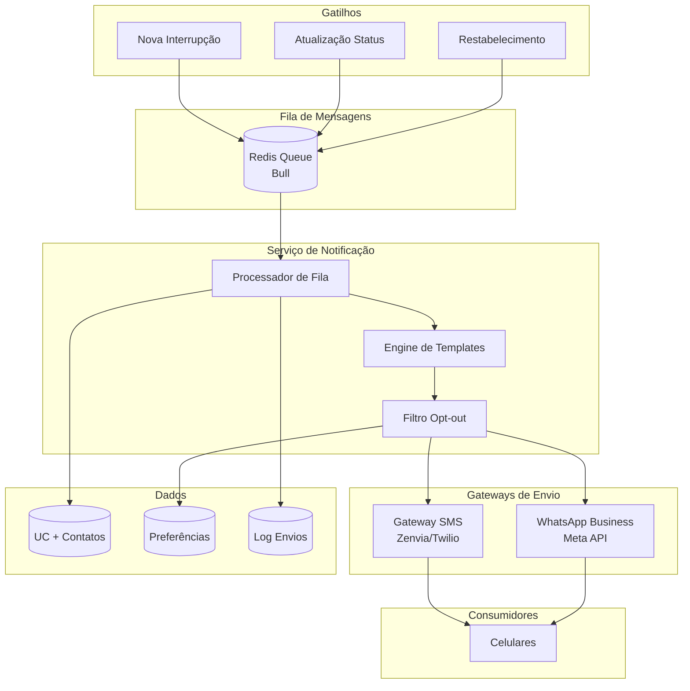

### 6.3 Implementação do Serviço de Notificações (Python + Celery)

```python
# src/application/use_cases/enviar_notificacao.py
import logging
from dataclasses import dataclass
from datetime import datetime
from typing import List, Optional

from src.application.ports.output.sms_gateway_port import SmsGatewayPort
from src.application.ports.output.whatsapp_port import WhatsAppPort
from src.application.ports.output.contatos_repository import ContatosRepository
from src.tasks.celery_app import celery_app

logger = logging.getLogger(__name__)


@dataclass
class NotificacaoPayload:
    """DTO para payload de notificação."""
    tipo: str  # 'nova_interrupcao' | 'atualizacao' | 'restabelecimento'
    interrupcao_id: str
    municipio: str
    bairro: Optional[str] = None
    causa: Optional[str] = None
    previsao_restabelecimento: Optional[datetime] = None
    ucs_afetadas: List[str] = None  # Lista de códigos de UC


class EnviarNotificacaoUseCase:
    """Use Case para envio de notificações (REN 1.137 Art. 105)."""

    # Prazos conforme Art. 105 REN 1.137/2025
    PRAZO_CAUSA_CONHECIDA_SEG = 15 * 60  # 15 minutos
    PRAZO_CAUSA_DESCONHECIDA_SEG = 60 * 60  # 1 hora

    def __init__(
        self,
        contatos_repository: ContatosRepository,
        sms_gateway: SmsGatewayPort,
        whatsapp_gateway: WhatsAppPort
    ):
        self._contatos = contatos_repository
        self._sms = sms_gateway
        self._whatsapp = whatsapp_gateway

    async def execute(self, payload: NotificacaoPayload) -> dict:
        """Enfileira notificação para processamento assíncrono."""
        prazo = (
            self.PRAZO_CAUSA_CONHECIDA_SEG
            if payload.causa
            else self.PRAZO_CAUSA_DESCONHECIDA_SEG
        )

        logger.info(
            f"Enfileirando notificação para {len(payload.ucs_afetadas)} UCs - "
            f"Prazo: {prazo // 60} minutos"
        )

        # Envia para fila Celery
        task = processar_notificacao.apply_async(
            kwargs=payload.__dict__,
            countdown=0,  # Envia imediatamente
            expires=prazo,  # Expira conforme prazo regulatório
            retry=True,
            retry_policy={
                'max_retries': 3,
                'interval_start': 5,
                'interval_step': 10,
                'interval_max': 60,
            }
        )

        return {"queued": True, "task_id": task.id, "ucs_count": len(payload.ucs_afetadas)}


@celery_app.task(bind=True, name='tasks.processar_notificacao')
def processar_notificacao(
    self,
    tipo: str,
    interrupcao_id: str,
    municipio: str,
    bairro: str = None,
    causa: str = None,
    previsao_restabelecimento: datetime = None,
    ucs_afetadas: List[str] = None
):
    """Task Celery para processar notificações."""
    from src.infrastructure.adapters.messaging.zenvia_sms_adapter import ZenviaSmsAdapter
    from src.infrastructure.adapters.messaging.meta_whatsapp_adapter import MetaWhatsAppAdapter
    from src.infrastructure.adapters.persistence.postgres_contatos_repository import PostgresContatosRepository

    logger.info(f"Processando notificação {tipo} para interrupção {interrupcao_id}")

    # Instancia adaptadores
    sms_gateway = ZenviaSmsAdapter()
    whatsapp_gateway = MetaWhatsAppAdapter()
    contatos_repo = PostgresContatosRepository()

    # Busca contatos ativos (respeitando opt-out)
    contatos = contatos_repo.buscar_contatos_ativos(ucs_afetadas)

    # Gera mensagem
    mensagem = _gerar_mensagem(tipo, municipio, bairro, causa, previsao_restabelecimento)

    enviados_sms = 0
    enviados_wa = 0
    falhas = 0

    for contato in contatos:
        try:
            if contato.telefone and contato.aceita_sms:
                sms_gateway.enviar(contato.telefone, mensagem)
                enviados_sms += 1

            if contato.whatsapp and contato.aceita_whatsapp:
                whatsapp_gateway.enviar(contato.whatsapp, mensagem)
                enviados_wa += 1

        except Exception as e:
            logger.error(f"Erro ao enviar para {contato.uc_id}: {e}")
            falhas += 1

    logger.info(
        f"Notificação {interrupcao_id} concluída: "
        f"SMS={enviados_sms}, WhatsApp={enviados_wa}, Falhas={falhas}"
    )

    return {"enviados_sms": enviados_sms, "enviados_wa": enviados_wa, "falhas": falhas}


def _gerar_mensagem(
    tipo: str,
    municipio: str,
    bairro: str = None,
    causa: str = None,
    previsao: datetime = None
) -> str:
    """Gera mensagem de notificação baseada no tipo."""
    local = f"{bairro}, {municipio}" if bairro else municipio
    previsao_str = previsao.strftime("%d/%m/%Y %H:%M") if previsao else "Em análise"

    templates = {
        "nova_interrupcao": (
            f"RORAIMA ENERGIA - Falta de energia\n\n"
            f"Local: {local}\n"
            f"Causa: {causa or 'Em investigação'}\n"
            f"Previsão: {previsao_str}\n\n"
            f"Equipes já estão trabalhando para restabelecer o fornecimento."
        ),
        "atualizacao": (
            f"RORAIMA ENERGIA - Atualização\n\n"
            f"Local: {local}\n"
            f"Nova previsão: {previsao_str}\n\n"
            f"Continuamos trabalhando para restabelecer o fornecimento."
        ),
        "restabelecimento": (
            f"RORAIMA ENERGIA - Energia Restabelecida\n\n"
            f"Local: {local}\n\n"
            f"O fornecimento de energia foi normalizado. "
            f"Agradecemos a compreensão."
        ),
    }

    return templates.get(tipo, f"RORAIMA ENERGIA - Informativo sobre {local}.")
```

```python
# src/tasks/celery_app.py
from celery import Celery
from celery.schedules import crontab

from src.infrastructure.config.settings import settings

celery_app = Celery(
    "radar_tasks",
    broker=settings.CELERY_BROKER_URL,
    backend=settings.CELERY_RESULT_BACKEND,
    include=["src.tasks.workers"]
)

celery_app.conf.update(
    task_serializer="json",
    accept_content=["json"],
    result_serializer="json",
    timezone="America/Manaus",
    enable_utc=True,
    task_track_started=True,
    task_time_limit=3600,  # 1 hora max
    worker_prefetch_multiplier=1,
)

# Celery Beat - Tarefas agendadas
celery_app.conf.beat_schedule = {
    # Atualização do portal público a cada 30 minutos (Art. 107)
    "refresh-portal-30min": {
        "task": "tasks.refresh_portal_publico",
        "schedule": crontab(minute="*/30"),
    },
    # Atualização da API ANEEL a cada 5 minutos
    "refresh-api-aneel-5min": {
        "task": "tasks.refresh_api_aneel",
        "schedule": crontab(minute="*/5"),
    },
    # Verificação de DISE a cada 15 minutos
    "check-dise-15min": {
        "task": "tasks.verificar_dise",
        "schedule": crontab(minute="*/15"),
    },
}
```

### 6.4 Gateways de Envio (Python)

```python
# src/infrastructure/adapters/messaging/zenvia_sms_adapter.py
import logging
import re
import httpx

from src.application.ports.output.sms_gateway_port import ISmsGatewayPort
from src.infrastructure.config.settings import settings

logger = logging.getLogger(__name__)


class ZenviaSmsAdapter(ISmsGatewayPort):
    """Adapter para envio de SMS via Zenvia."""

    def __init__(self):
        self.api_url = settings.SMS_API_URL or "https://api.zenvia.com/v2/channels/sms/messages"
        self.api_key = settings.SMS_API_KEY
        self.remetente = settings.SMS_REMETENTE or "RORAIMAENERGIA"

    async def enviar(self, telefone: str, mensagem: str) -> bool:
        """Envia SMS para o telefone especificado."""
        try:
            telefone_formatado = self._formatar_telefone(telefone)

            async with httpx.AsyncClient() as client:
                response = await client.post(
                    self.api_url,
                    json={
                        "from": self.remetente,
                        "to": telefone_formatado,
                        "contents": [{"type": "text", "text": mensagem}],
                    },
                    headers={
                        "X-API-TOKEN": self.api_key,
                        "Content-Type": "application/json",
                    },
                )

            logger.debug(f"SMS enviado para {telefone}: {response.status_code}")
            return response.status_code == 200

        except Exception as e:
            logger.error(f"Erro ao enviar SMS para {telefone}: {e}")
            raise

    def _formatar_telefone(self, telefone: str) -> str:
        """Formata telefone para padrão E.164."""
        numeros = re.sub(r"\D", "", telefone)
        if len(numeros) == 11:
            return f"55{numeros}"
        return numeros
```

```python
# src/infrastructure/adapters/messaging/meta_whatsapp_adapter.py
import logging
import re
import httpx

from src.application.ports.output.whatsapp_port import IWhatsAppPort
from src.infrastructure.config.settings import settings

logger = logging.getLogger(__name__)


class MetaWhatsAppAdapter(IWhatsAppPort):
    """Adapter para envio de WhatsApp via Meta Business API."""

    def __init__(self):
        self.api_url = "https://graph.facebook.com/v18.0"
        self.token = settings.WHATSAPP_TOKEN
        self.phone_number_id = settings.WHATSAPP_PHONE_NUMBER_ID

    async def enviar(self, telefone: str, mensagem: str) -> bool:
        """Envia mensagem WhatsApp para o telefone especificado."""
        try:
            telefone_formatado = self._formatar_telefone(telefone)

            async with httpx.AsyncClient() as client:
                response = await client.post(
                    f"{self.api_url}/{self.phone_number_id}/messages",
                    json={
                        "messaging_product": "whatsapp",
                        "recipient_type": "individual",
                        "to": telefone_formatado,
                        "type": "text",
                        "text": {"body": mensagem},
                    },
                    headers={
                        "Authorization": f"Bearer {self.token}",
                        "Content-Type": "application/json",
                    },
                )

            data = response.json()
            msg_id = data.get("messages", [{}])[0].get("id")
            logger.debug(f"WhatsApp enviado para {telefone}: {msg_id}")
            return response.status_code == 200

        except Exception as e:
            logger.error(f"Erro ao enviar WhatsApp para {telefone}: {e}")
            raise

    def _formatar_telefone(self, telefone: str) -> str:
        """Formata telefone para padrão E.164."""
        numeros = re.sub(r"\D", "", telefone)
        if len(numeros) == 11:
            return f"55{numeros}"
        return numeros
```

### 6.5 Gestão de Opt-out (Python)

```python
# src/infrastructure/adapters/persistence/oracle_contatos_repository.py
from typing import List
from sqlalchemy import select
from sqlalchemy.ext.asyncio import AsyncSession

from src.application.ports.output.contatos_repository import IContatosRepository
from src.infrastructure.database.models.contato_model import ContatoConsumidor


class OracleContatosRepository(IContatosRepository):
    """Adapter para persistência de contatos no Oracle."""

    def __init__(self, session: AsyncSession):
        self._session = session

    async def buscar_contatos_ativos(self, ucs: List[str]) -> List[ContatoConsumidor]:
        """Busca contatos que NÃO fizeram opt-out."""
        query = (
            select(ContatoConsumidor)
            .where(
                ContatoConsumidor.uc_codigo.in_(ucs),
                ContatoConsumidor.opt_out == False
            )
        )
        result = await self._session.execute(query)
        return result.scalars().all()

    async def registrar_opt_out(
        self, telefone: str, canal: str  # 'sms' | 'whatsapp' | 'todos'
    ) -> None:
        """Registra opt-out para um contato."""
        query = select(ContatoConsumidor).where(
            (ContatoConsumidor.telefone == telefone) |
            (ContatoConsumidor.whatsapp == telefone)
        )
        result = await self._session.execute(query)
        contato = result.scalar_one_or_none()

        if contato:
            if canal == "todos":
                contato.opt_out = True
            elif canal == "sms":
                contato.aceita_sms = False
            elif canal == "whatsapp":
                contato.aceita_whatsapp = False

            await self._session.commit()
```

---

## 7. Módulo DISE - Indicador de Emergência

### 7.1 Visão Geral

O **DISE** (Duração da Interrupção em Situação de Emergência) é um novo indicador definido pelos Art. 173 e 180-A da REN 1.137/2025:

- **Limite urbano:** 24 horas
- **Limite rural:** 48 horas
- **Cálculo:** Similar ao DIC, mas aplicado apenas durante situação de emergência declarada

### 7.2 Arquitetura do Módulo DISE

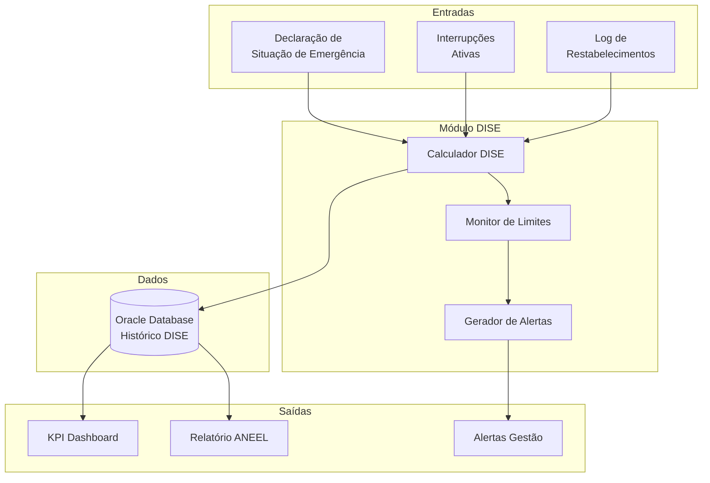

### 7.3 Implementação do Serviço DISE

```typescript
// src/modules/dise/dise.service.ts
import { Injectable, Logger } from '@nestjs/common';
import { InjectRepository } from '@nestjs/typeorm';
import { Repository } from 'typeorm';
import { Cron, CronExpression } from '@nestjs/schedule';
import { DiseRegistro } from './entities/dise-registro.entity';
import { SituacaoEmergencia } from './entities/situacao-emergencia.entity';

interface DiseCalculado {
  ucId: string;
  municipioId: number;
  tipoArea: 'urbano' | 'rural';
  duracaoHoras: number;
  limiteHoras: number;
  percentualLimite: number;
  emViolacao: boolean;
}

@Injectable()
export class DiseService {
  private readonly logger = new Logger(DiseService.name);

  // Limites conforme Art. 180-A REN 1.137/2025
  private readonly LIMITE_URBANO_HORAS = 24;
  private readonly LIMITE_RURAL_HORAS = 48;

  constructor(
    @InjectRepository(DiseRegistro)
    private readonly diseRepo: Repository<DiseRegistro>,
    @InjectRepository(SituacaoEmergencia)
    private readonly emergenciaRepo: Repository<SituacaoEmergencia>,
  ) {}

  /**
   * Calcula DISE para todas as UCs em situação de emergência ativa
   */
  @Cron(CronExpression.EVERY_30_MINUTES)
  async calcularDise() {
    const emergenciasAtivas = await this.getEmergenciasAtivas();

    if (emergenciasAtivas.length === 0) {
      this.logger.debug('Nenhuma situação de emergência ativa');
      return;
    }

    for (const emergencia of emergenciasAtivas) {
      await this.calcularDiseParaEmergencia(emergencia);
    }
  }

  async calcularDiseParaEmergencia(emergencia: SituacaoEmergencia) {
    this.logger.log(`Calculando DISE para emergência ${emergencia.id}`);

    // Busca todas as interrupções durante o período de emergência
    const interrupcoes = await this.buscarInterrupcoesDuranteEmergencia(emergencia);

    const resultados: DiseCalculado[] = [];

    for (const int of interrupcoes) {
      const duracaoHoras = this.calcularDuracaoHoras(int.dataInicio, int.dataFim);
      const limite = int.tipoArea === 'urbano' ? this.LIMITE_URBANO_HORAS : this.LIMITE_RURAL_HORAS;

      const dise: DiseCalculado = {
        ucId: int.ucId,
        municipioId: int.municipioId,
        tipoArea: int.tipoArea,
        duracaoHoras,
        limiteHoras: limite,
        percentualLimite: (duracaoHoras / limite) * 100,
        emViolacao: duracaoHoras > limite,
      };

      resultados.push(dise);

      // Registra no banco
      await this.diseRepo.save({
        emergenciaId: emergencia.id,
        ucId: int.ucId,
        municipioId: int.municipioId,
        tipoArea: int.tipoArea,
        duracaoMinutos: duracaoHoras * 60,
        limiteMinutos: limite * 60,
        emViolacao: dise.emViolacao,
        dataCalculo: new Date(),
      });
    }

    // Gera alertas para violações
    const violacoes = resultados.filter(r => r.emViolacao);
    if (violacoes.length > 0) {
      await this.gerarAlertasViolacao(emergencia, violacoes);
    }

    return resultados;
  }

  async getIndicadoresDise(emergenciaId?: string) {
    const query = this.diseRepo.createQueryBuilder('d');

    if (emergenciaId) {
      query.where('d.emergenciaId = :emergenciaId', { emergenciaId });
    }

    const registros = await query
      .select([
        'd.tipoArea as tipoArea',
        'AVG(d.duracaoMinutos) as duracaoMediaMinutos',
        'MAX(d.duracaoMinutos) as duracaoMaxMinutos',
        'COUNT(CASE WHEN d.emViolacao = true THEN 1 END) as qtdViolacoes',
        'COUNT(*) as totalUcs',
      ])
      .groupBy('d.tipoArea')
      .getRawMany();

    return {
      urbano: registros.find(r => r.tipoArea === 'urbano') || this.getIndicadorVazio('urbano'),
      rural: registros.find(r => r.tipoArea === 'rural') || this.getIndicadorVazio('rural'),
    };
  }

  async getRelatorioDise(dataInicio: Date, dataFim: Date) {
    // Gera relatório consolidado para período
    const registros = await this.diseRepo
      .createQueryBuilder('d')
      .leftJoin('d.emergencia', 'e')
      .where('d.dataCalculo BETWEEN :dataInicio AND :dataFim', { dataInicio, dataFim })
      .select([
        'e.id as emergenciaId',
        'e.descricao as emergenciaDescricao',
        'd.municipioId as municipioId',
        'd.tipoArea as tipoArea',
        'COUNT(DISTINCT d.ucId) as totalUcsAfetadas',
        'SUM(CASE WHEN d.emViolacao = true THEN 1 ELSE 0 END) as ucsEmViolacao',
        'AVG(d.duracaoMinutos) / 60 as duracaoMediaHoras',
        'MAX(d.duracaoMinutos) / 60 as duracaoMaxHoras',
      ])
      .groupBy('e.id, e.descricao, d.municipioId, d.tipoArea')
      .orderBy('e.id', 'DESC')
      .getRawMany();

    return registros;
  }

  private calcularDuracaoHoras(inicio: Date, fim?: Date): number {
    const dataFim = fim || new Date();
    const diffMs = dataFim.getTime() - new Date(inicio).getTime();
    return diffMs / (1000 * 60 * 60);
  }

  private async getEmergenciasAtivas(): Promise<SituacaoEmergencia[]> {
    return this.emergenciaRepo.find({
      where: { ativa: true },
    });
  }

  private async buscarInterrupcoesDuranteEmergencia(emergencia: SituacaoEmergencia) {
    // Implementar busca de interrupções
    return [];
  }

  private async gerarAlertasViolacao(emergencia: SituacaoEmergencia, violacoes: DiseCalculado[]) {
    this.logger.warn(
      `ALERTA DISE: ${violacoes.length} UCs em violação durante emergência ${emergencia.id}`
    );
    // Implementar envio de alertas
  }

  private getIndicadorVazio(tipo: string) {
    return {
      tipoArea: tipo,
      duracaoMediaMinutos: 0,
      duracaoMaxMinutos: 0,
      qtdViolacoes: 0,
      totalUcs: 0,
    };
  }
}
```

### 7.4 Controller da API DISE

```typescript
// src/modules/dise/dise.controller.ts
import { Controller, Get, Query, UseGuards } from '@nestjs/common';
import { ApiTags, ApiOperation, ApiSecurity } from '@nestjs/swagger';
import { ApiKeyGuard } from '../../common/guards/api-key.guard';
import { DiseService } from './dise.service';

@ApiTags('DISE')
@Controller('api/dise')
@UseGuards(ApiKeyGuard)
@ApiSecurity('api-key')
export class DiseController {
  constructor(private readonly diseService: DiseService) {}

  @Get('indicadores')
  @ApiOperation({ summary: 'Retorna indicadores DISE atuais' })
  async getIndicadores(@Query('emergenciaId') emergenciaId?: string) {
    return this.diseService.getIndicadoresDise(emergenciaId);
  }

  @Get('relatorio')
  @ApiOperation({ summary: 'Gera relatório DISE para período' })
  async getRelatorio(
    @Query('dataInicio') dataInicio: string,
    @Query('dataFim') dataFim: string,
  ) {
    return this.diseService.getRelatorioDise(
      new Date(dataInicio),
      new Date(dataFim),
    );
  }
}
```

### 7.5 Entidades do Módulo DISE

```typescript
// src/modules/dise/entities/situacao-emergencia.entity.ts
import { Entity, PrimaryGeneratedColumn, Column, CreateDateColumn } from 'typeorm';

@Entity('situacao_emergencia')
export class SituacaoEmergencia {
  @PrimaryGeneratedColumn('uuid')
  id: string;

  @Column({ type: 'varchar', length: 200 })
  descricao: string;

  @Column({ type: 'varchar', length: 50 })
  tipoEvento: string; // tempestade, enchente, incendio, etc.

  @Column({ type: 'timestamp' })
  dataInicio: Date;

  @Column({ type: 'timestamp', nullable: true })
  dataFim: Date;

  @Column({ type: 'boolean', default: true })
  ativa: boolean;

  @Column({ type: 'text', nullable: true })
  municipiosAfetados: string; // JSON array de códigos IBGE

  @Column({ type: 'varchar', nullable: true })
  decretoEstadual: string;

  @Column({ type: 'varchar', nullable: true })
  decretoMunicipal: string;

  @CreateDateColumn()
  createdAt: Date;
}
```

```typescript
// src/modules/dise/entities/dise-registro.entity.ts
import { Entity, PrimaryGeneratedColumn, Column, ManyToOne, CreateDateColumn, Index } from 'typeorm';
import { SituacaoEmergencia } from './situacao-emergencia.entity';

@Entity('dise_registro')
@Index(['emergenciaId', 'ucId'])
@Index(['dataCalculo'])
export class DiseRegistro {
  @PrimaryGeneratedColumn('bigint')
  id: number;

  @Column({ type: 'uuid' })
  emergenciaId: string;

  @ManyToOne(() => SituacaoEmergencia)
  emergencia: SituacaoEmergencia;

  @Column({ type: 'varchar', length: 20 })
  ucId: string;

  @Column({ type: 'int' })
  municipioId: number;

  @Column({ type: 'varchar', length: 10 })
  tipoArea: 'urbano' | 'rural';

  @Column({ type: 'int' })
  duracaoMinutos: number;

  @Column({ type: 'int' })
  limiteMinutos: number;

  @Column({ type: 'boolean' })
  emViolacao: boolean;

  @Column({ type: 'timestamp' })
  dataCalculo: Date;

  @CreateDateColumn()
  createdAt: Date;
}
```

---

## 8. Arquitetura do Dashboard Interno

### 8.1 Estrutura do Frontend

```
frontend/
├── public/
│   ├── index.html
│   └── assets/
│       └── roraima.geojson     # Mapa de Roraima
├── src/
│   ├── App.tsx
│   ├── pages/
│   │   ├── Dashboard/
│   │   │   ├── index.tsx
│   │   │   ├── components/
│   │   │   │   ├── MapaRoraima.tsx
│   │   │   │   ├── KPICards.tsx
│   │   │   │   ├── GraficoEvolucao.tsx
│   │   │   │   └── TabelaMunicipios.tsx
│   │   ├── Interrupcoes/
│   │   ├── Demandas/
│   │   └── Configuracoes/
│   ├── components/
│   │   ├── Layout/
│   │   ├── Map/
│   │   ├── Charts/
│   │   └── common/
│   ├── hooks/
│   │   ├── useInterrupcoes.ts
│   │   ├── useDemandas.ts
│   │   └── useKPIs.ts
│   ├── services/
│   │   └── api.ts
│   ├── types/
│   └── utils/
├── package.json
└── vite.config.ts
```

### 8.2 Componente do Mapa de Roraima

```typescript
// src/pages/Dashboard/components/MapaRoraima.tsx
import React, { useEffect, useRef } from 'react';
import L from 'leaflet';
import 'leaflet/dist/leaflet.css';
import { useInterrupcoes } from '../../../hooks/useInterrupcoes';

// Coordenadas centrais de Roraima
const CENTRO_RORAIMA: L.LatLngExpression = [2.8235, -60.6758];
const ZOOM_INICIAL = 6;

// Cores por severidade
const CORES_SEVERIDADE = {
  normal: '#4CAF50',      // Verde - < 1%
  atencao: '#FFEB3B',     // Amarelo - 1-5%
  alerta: '#FF9800',      // Laranja - 5-10%
  critico: '#F44336',     // Vermelho - > 10%
};

export const MapaRoraima: React.FC = () => {
  const mapRef = useRef<L.Map | null>(null);
  const containerRef = useRef<HTMLDivElement>(null);
  const { data: interrupcoes, isLoading } = useInterrupcoes();

  useEffect(() => {
    if (!containerRef.current || mapRef.current) return;

    // Inicializa o mapa
    mapRef.current = L.map(containerRef.current, {
      center: CENTRO_RORAIMA,
      zoom: ZOOM_INICIAL,
      zoomControl: true,
    });

    // Adiciona camada base
    L.tileLayer('https://{s}.tile.openstreetmap.org/{z}/{x}/{y}.png', {
      attribution: '© OpenStreetMap',
    }).addTo(mapRef.current);

    // Carrega GeoJSON de Roraima
    fetch('/assets/roraima.geojson')
      .then(res => res.json())
      .then(geojson => {
        if (mapRef.current) {
          L.geoJSON(geojson, {
            style: { color: '#666', weight: 1, fillOpacity: 0.1 }
          }).addTo(mapRef.current);
        }
      });

    return () => {
      mapRef.current?.remove();
      mapRef.current = null;
    };
  }, []);

  // Atualiza cores dos municípios quando dados mudam
  useEffect(() => {
    if (!mapRef.current || !interrupcoes) return;

    // Remove camadas anteriores de dados
    mapRef.current.eachLayer((layer) => {
      if ((layer as any).isDataLayer) {
        mapRef.current?.removeLayer(layer);
      }
    });

    // Adiciona novos dados
    interrupcoes.forEach(item => {
      const percentual = calcularPercentual(item);
      const cor = getCorSeveridade(percentual);

      // Adiciona círculo no centróide do município
      const coords = getCoordenadaMunicipio(item.ideMunicipio);
      if (coords) {
        const circle = L.circleMarker(coords, {
          radius: Math.max(8, Math.min(30, item.qtdOcorrenciaProgramada + item.qtdOcorrenciaNaoProgramada) / 10),
          fillColor: cor,
          color: '#333',
          weight: 1,
          fillOpacity: 0.8,
        });

        circle.bindTooltip(`
          <strong>${getNomeMunicipio(item.ideMunicipio)}</strong><br/>
          UCs Atendidas: ${item.qtdUCsAtendidas.toLocaleString()}<br/>
          Programadas: ${item.qtdOcorrenciaProgramada.toLocaleString()}<br/>
          Não Programadas: ${item.qtdOcorrenciaNaoProgramada.toLocaleString()}<br/>
          <strong>Afetado: ${percentual.toFixed(2)}%</strong>
        `);

        (circle as any).isDataLayer = true;
        circle.addTo(mapRef.current!);
      }
    });
  }, [interrupcoes]);

  return (
    <div className="mapa-container">
      {isLoading && <div className="mapa-loading">Carregando...</div>}
      <div ref={containerRef} className="mapa" style={{ height: '500px' }} />
      <LegendaMapa />
    </div>
  );
};

// Componente de legenda
const LegendaMapa: React.FC = () => (
  <div className="legenda-mapa">
    <h4>Severidade</h4>
    <div className="legenda-item">
      <span style={{ backgroundColor: CORES_SEVERIDADE.normal }} />
      <span>&lt; 1%</span>
    </div>
    <div className="legenda-item">
      <span style={{ backgroundColor: CORES_SEVERIDADE.atencao }} />
      <span>1-5%</span>
    </div>
    <div className="legenda-item">
      <span style={{ backgroundColor: CORES_SEVERIDADE.alerta }} />
      <span>5-10%</span>
    </div>
    <div className="legenda-item">
      <span style={{ backgroundColor: CORES_SEVERIDADE.critico }} />
      <span>&gt; 10%</span>
    </div>
  </div>
);

// Funções auxiliares
function calcularPercentual(item: any): number {
  const total = item.qtdOcorrenciaProgramada + item.qtdOcorrenciaNaoProgramada;
  return item.qtdUCsAtendidas > 0 ? (total / item.qtdUCsAtendidas) * 100 : 0;
}

function getCorSeveridade(percentual: number): string {
  if (percentual < 1) return CORES_SEVERIDADE.normal;
  if (percentual < 5) return CORES_SEVERIDADE.atencao;
  if (percentual < 10) return CORES_SEVERIDADE.alerta;
  return CORES_SEVERIDADE.critico;
}

// Coordenadas dos municípios de Roraima
const COORDENADAS_MUNICIPIOS: Record<number, [number, number]> = {
  1400050: [2.8235, -60.6758],   // Boa Vista
  1400100: [2.9889, -61.3114],   // Alto Alegre
  1400027: [3.6481, -61.3656],   // Amajari
  1400159: [3.3614, -59.8331],   // Bonfim
  1400175: [2.6097, -60.5986],   // Cantá
  1400209: [1.8267, -61.1278],   // Caracaraí
  1400233: [0.8842, -59.6958],   // Caroebe
  1400282: [2.1831, -61.0450],   // Iracema
  1400308: [2.4336, -60.9125],   // Mucajaí
  1400407: [3.8797, -59.6225],   // Normandia
  1400456: [4.4797, -61.1478],   // Pacaraima
  1400472: [0.9419, -60.4394],   // Rorainópolis
  1400506: [1.0256, -59.9089],   // São João da Baliza
  1400605: [1.0131, -60.0392],   // São Luiz
  1400704: [4.5972, -60.1844],   // Uiramutã
};

function getCoordenadaMunicipio(codigoIbge: number): [number, number] | null {
  return COORDENADAS_MUNICIPIOS[codigoIbge] || null;
}

const NOMES_MUNICIPIOS: Record<number, string> = {
  1400050: 'Boa Vista',
  1400100: 'Alto Alegre',
  1400027: 'Amajari',
  1400159: 'Bonfim',
  1400175: 'Cantá',
  1400209: 'Caracaraí',
  1400233: 'Caroebe',
  1400282: 'Iracema',
  1400308: 'Mucajaí',
  1400407: 'Normandia',
  1400456: 'Pacaraima',
  1400472: 'Rorainópolis',
  1400506: 'São João da Baliza',
  1400605: 'São Luiz',
  1400704: 'Uiramutã',
};

function getNomeMunicipio(codigoIbge: number): string {
  return NOMES_MUNICIPIOS[codigoIbge] || 'Desconhecido';
}
```

### 8.3 Hook de Dados

```typescript
// src/hooks/useInterrupcoes.ts
import { useQuery } from '@tanstack/react-query';
import { api } from '../services/api';

interface InterrupcaoFornecimento {
  ideConjuntoUnidadeConsumidora: number;
  ideMunicipio: number;
  qtdUCsAtendidas: number;
  qtdOcorrenciaProgramada: number;
  qtdOcorrenciaNaoProgramada: number;
}

interface InterrupcoesResponse {
  idcStatusRequisicao: number;
  emailIndisponibilidade: string;
  mensagem: string;
  interrupcaoFornecimento: InterrupcaoFornecimento[];
}

export function useInterrupcoes() {
  return useQuery<InterrupcaoFornecimento[]>({
    queryKey: ['interrupcoes'],
    queryFn: async () => {
      const response = await api.get<InterrupcoesResponse>('/api/dashboard/interrupcoes');

      if (response.data.idcStatusRequisicao !== 1) {
        throw new Error(response.data.mensagem);
      }

      return response.data.interrupcaoFornecimento;
    },
    refetchInterval: 5 * 60 * 1000, // Atualiza a cada 5 minutos
    staleTime: 2 * 60 * 1000,       // Considera stale após 2 minutos
  });
}

// src/hooks/useKPIs.ts
export function useKPIs() {
  return useQuery({
    queryKey: ['kpis'],
    queryFn: async () => {
      const response = await api.get('/api/dashboard/kpis');
      return response.data;
    },
    refetchInterval: 60 * 1000, // Atualiza a cada 1 minuto
  });
}
```

---

## 9. Modelo de Dados

### 9.1 Diagrama ER

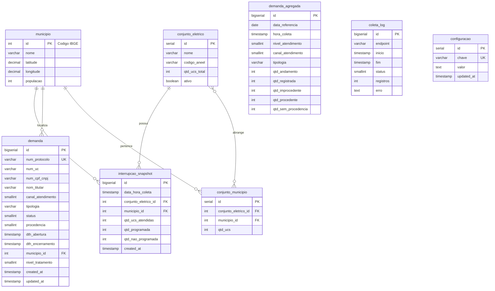

### 9.2 Scripts SQL (Oracle)

```sql
-- Criação das tabelas para Oracle Database

-- Sequências
CREATE SEQUENCE seq_conjunto_eletrico START WITH 1 INCREMENT BY 1;
CREATE SEQUENCE seq_conjunto_municipio START WITH 1 INCREMENT BY 1;
CREATE SEQUENCE seq_interrupcao_snapshot START WITH 1 INCREMENT BY 1;
CREATE SEQUENCE seq_demanda START WITH 1 INCREMENT BY 1;
CREATE SEQUENCE seq_demanda_agregada START WITH 1 INCREMENT BY 1;
CREATE SEQUENCE seq_coleta_log START WITH 1 INCREMENT BY 1;
CREATE SEQUENCE seq_configuracao START WITH 1 INCREMENT BY 1;

-- Municípios de Roraima
CREATE TABLE municipio (
    id NUMBER(10) PRIMARY KEY,  -- Código IBGE
    nome VARCHAR2(100) NOT NULL,
    latitude NUMBER(10, 7),
    longitude NUMBER(10, 7),
    populacao NUMBER(10)
);

-- Dados iniciais dos municípios
INSERT INTO municipio (id, nome, latitude, longitude) VALUES (1400050, 'Boa Vista', 2.8235, -60.6758);
INSERT INTO municipio (id, nome, latitude, longitude) VALUES (1400100, 'Alto Alegre', 2.9889, -61.3114);
INSERT INTO municipio (id, nome, latitude, longitude) VALUES (1400027, 'Amajari', 3.6481, -61.3656);
INSERT INTO municipio (id, nome, latitude, longitude) VALUES (1400159, 'Bonfim', 3.3614, -59.8331);
INSERT INTO municipio (id, nome, latitude, longitude) VALUES (1400175, 'Cantá', 2.6097, -60.5986);
INSERT INTO municipio (id, nome, latitude, longitude) VALUES (1400209, 'Caracaraí', 1.8267, -61.1278);
INSERT INTO municipio (id, nome, latitude, longitude) VALUES (1400233, 'Caroebe', 0.8842, -59.6958);
INSERT INTO municipio (id, nome, latitude, longitude) VALUES (1400282, 'Iracema', 2.1831, -61.0450);
INSERT INTO municipio (id, nome, latitude, longitude) VALUES (1400308, 'Mucajaí', 2.4336, -60.9125);
INSERT INTO municipio (id, nome, latitude, longitude) VALUES (1400407, 'Normandia', 3.8797, -59.6225);
INSERT INTO municipio (id, nome, latitude, longitude) VALUES (1400456, 'Pacaraima', 4.4797, -61.1478);
INSERT INTO municipio (id, nome, latitude, longitude) VALUES (1400472, 'Rorainópolis', 0.9419, -60.4394);
INSERT INTO municipio (id, nome, latitude, longitude) VALUES (1400506, 'São João da Baliza', 1.0256, -59.9089);
INSERT INTO municipio (id, nome, latitude, longitude) VALUES (1400605, 'São Luiz', 1.0131, -60.0392);
INSERT INTO municipio (id, nome, latitude, longitude) VALUES (1400704, 'Uiramutã', 4.5972, -60.1844);
COMMIT;

-- Conjuntos elétricos
CREATE TABLE conjunto_eletrico (
    id NUMBER(10) DEFAULT seq_conjunto_eletrico.NEXTVAL PRIMARY KEY,
    nome VARCHAR2(100) NOT NULL,
    codigo_aneel VARCHAR2(20),
    qtd_ucs_total NUMBER(10) DEFAULT 0,
    ativo NUMBER(1) DEFAULT 1
);

-- Relação conjunto x município
CREATE TABLE conjunto_municipio (
    id NUMBER(10) DEFAULT seq_conjunto_municipio.NEXTVAL PRIMARY KEY,
    conjunto_eletrico_id NUMBER(10) REFERENCES conjunto_eletrico(id),
    municipio_id NUMBER(10) REFERENCES municipio(id),
    qtd_ucs NUMBER(10) DEFAULT 0,
    CONSTRAINT uk_conjunto_mun UNIQUE (conjunto_eletrico_id, municipio_id)
);

-- Snapshots de interrupções (para histórico)
CREATE TABLE interrupcao_snapshot (
    id NUMBER(19) DEFAULT seq_interrupcao_snapshot.NEXTVAL PRIMARY KEY,
    data_hora_coleta TIMESTAMP NOT NULL,
    conjunto_eletrico_id NUMBER(10) REFERENCES conjunto_eletrico(id),
    municipio_id NUMBER(10) REFERENCES municipio(id),
    qtd_ucs_atendidas NUMBER(10) NOT NULL,
    qtd_programada NUMBER(10) DEFAULT 0 NOT NULL,
    qtd_nao_programada NUMBER(10) DEFAULT 0 NOT NULL,
    created_at TIMESTAMP DEFAULT SYSTIMESTAMP
);

-- Índices para consultas por data
CREATE INDEX idx_int_data ON interrupcao_snapshot(data_hora_coleta DESC);
CREATE INDEX idx_int_municipio ON interrupcao_snapshot(municipio_id, data_hora_coleta DESC);

-- Demandas
CREATE TABLE demanda (
    id NUMBER(19) DEFAULT seq_demanda.NEXTVAL PRIMARY KEY,
    num_protocolo VARCHAR2(30) NOT NULL UNIQUE,
    num_uc VARCHAR2(15),
    num_cpf_cnpj VARCHAR2(14),
    nom_titular VARCHAR2(100),
    canal_atendimento NUMBER(5) NOT NULL,
    tipologia VARCHAR2(7) NOT NULL,
    status NUMBER(5) DEFAULT 0 NOT NULL,
    procedencia NUMBER(5) DEFAULT 2 NOT NULL,
    dth_abertura TIMESTAMP NOT NULL,
    dth_encerramento TIMESTAMP,
    municipio_id NUMBER(10) REFERENCES municipio(id),
    nivel_tratamento NUMBER(5) DEFAULT 0 NOT NULL,
    created_at TIMESTAMP DEFAULT SYSTIMESTAMP,
    updated_at TIMESTAMP DEFAULT SYSTIMESTAMP
);

CREATE INDEX idx_demanda_proto ON demanda(num_protocolo);
CREATE INDEX idx_demanda_status ON demanda(status);

-- Demandas agregadas (cache diário)
CREATE TABLE demanda_agregada (
    id NUMBER(19) DEFAULT seq_demanda_agregada.NEXTVAL PRIMARY KEY,
    data_referencia DATE NOT NULL,
    hora_coleta TIMESTAMP NOT NULL,
    nivel_atendimento NUMBER(5) NOT NULL,
    canal_atendimento NUMBER(5) NOT NULL,
    tipologia VARCHAR2(7) NOT NULL,
    qtd_andamento NUMBER(10) DEFAULT 0,
    qtd_registrada NUMBER(10) DEFAULT 0,
    qtd_improcedente NUMBER(10) DEFAULT 0,
    qtd_procedente NUMBER(10) DEFAULT 0,
    qtd_sem_procedencia NUMBER(10) DEFAULT 0,
    CONSTRAINT uk_demanda_agg UNIQUE (data_referencia, hora_coleta, nivel_atendimento, canal_atendimento, tipologia)
);

-- Log de coletas (auditoria)
CREATE TABLE coleta_log (
    id NUMBER(19) DEFAULT seq_coleta_log.NEXTVAL PRIMARY KEY,
    endpoint VARCHAR2(50) NOT NULL,
    origem_ip VARCHAR2(45),
    inicio TIMESTAMP NOT NULL,
    fim TIMESTAMP,
    status NUMBER(5),
    registros NUMBER(10),
    erro CLOB,
    created_at TIMESTAMP DEFAULT SYSTIMESTAMP
);

-- Configurações do sistema
CREATE TABLE configuracao (
    id NUMBER(10) DEFAULT seq_configuracao.NEXTVAL PRIMARY KEY,
    chave VARCHAR2(100) NOT NULL UNIQUE,
    valor CLOB,
    updated_at TIMESTAMP DEFAULT SYSTIMESTAMP
);

-- Configurações iniciais
INSERT INTO configuracao (chave, valor) VALUES ('EMAIL_INDISPONIBILIDADE', 'ti.aneel@roraimaenergia.com.br');
INSERT INTO configuracao (chave, valor) VALUES ('API_KEY_ANEEL', 'chave-sera-definida');
INSERT INTO configuracao (chave, valor) VALUES ('CACHE_TTL_INTERRUPCOES', '1500');
INSERT INTO configuracao (chave, valor) VALUES ('ALERTA_THRESHOLD_UCS', '1000');
COMMIT;

-- Procedure para limpar dados antigos
CREATE OR REPLACE PROCEDURE limpar_dados_antigos AS
BEGIN
    -- Mantém 36 meses de histórico
    DELETE FROM interrupcao_snapshot
    WHERE data_hora_coleta < ADD_MONTHS(SYSDATE, -36);

    -- Mantém 36 meses de demandas agregadas
    DELETE FROM demanda_agregada
    WHERE data_referencia < ADD_MONTHS(SYSDATE, -36);

    -- Mantém 90 dias de logs
    DELETE FROM coleta_log
    WHERE created_at < SYSDATE - 90;

    COMMIT;
END;
/
```

---

## 10. Integrações com Sistemas Legados

### 10.1 Estratégia de Integração

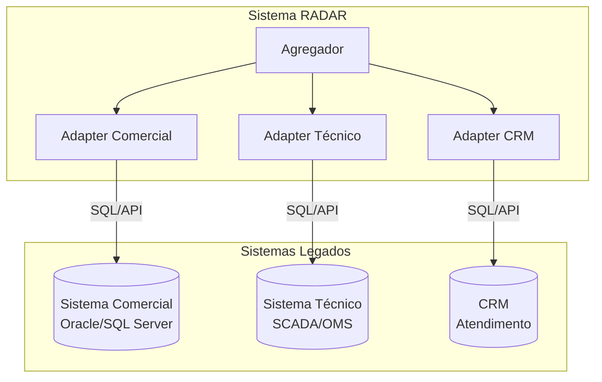

### 10.2 Interface de Integração

```typescript
// src/modules/integracao/interfaces/sistema-tecnico.interface.ts

export interface InterrupcaoAtiva {
  id: string;
  conjuntoEletricoId: number;
  municipioId: number;
  qtdUcsAfetadas: number;
  programada: boolean;
  dataInicio: Date;
  causa?: string;
}

export interface ISistemaTecnicoAdapter {
  /**
   * Retorna todas as interrupções ativas no momento
   */
  getInterrupcoesAtivas(): Promise<InterrupcaoAtiva[]>;

  /**
   * Retorna interrupções ativas em uma data/hora específica
   */
  getInterrupcoesHistoricas(dataHora: Date): Promise<InterrupcaoAtiva[]>;

  /**
   * Verifica disponibilidade do sistema
   */
  healthCheck(): Promise<boolean>;
}

// src/modules/integracao/adapters/sistema-tecnico-exemplo.adapter.ts
import { Injectable, Logger } from '@nestjs/common';
import { ISistemaTecnicoAdapter, InterrupcaoAtiva } from '../interfaces/sistema-tecnico.interface';

/**
 * Adapter de exemplo - SUBSTITUIR pela integração real
 *
 * Este adapter deve ser implementado de acordo com o sistema técnico
 * utilizado pela Roraima Energia (SCADA, OMS, etc.)
 */
@Injectable()
export class SistemaTecnicoAdapter implements ISistemaTecnicoAdapter {
  private readonly logger = new Logger(SistemaTecnicoAdapter.name);

  async getInterrupcoesAtivas(): Promise<InterrupcaoAtiva[]> {
    this.logger.debug('Consultando interrupções ativas no sistema técnico');

    // TODO: Implementar integração real
    // Opções:
    // 1. Query direta no banco do sistema técnico
    // 2. Chamada de API do sistema técnico
    // 3. Leitura de arquivo de exportação
    // 4. Web service SOAP/REST

    // Exemplo de query (pseudocódigo):
    /*
    const result = await this.dataSource.query(`
      SELECT
        i.id,
        i.conjunto_eletrico_id,
        i.municipio_id,
        COUNT(DISTINCT uc.id) as qtd_ucs_afetadas,
        i.tipo = 'PROGRAMADA' as programada,
        i.data_inicio
      FROM interrupcao i
      JOIN unidade_consumidora uc ON uc.alimentador_id = i.alimentador_id
      WHERE i.status = 'ATIVA'
        AND i.data_fim IS NULL
      GROUP BY i.id, i.conjunto_eletrico_id, i.municipio_id, i.tipo, i.data_inicio
    `);
    */

    // Retorno de exemplo para desenvolvimento
    return [
      {
        id: 'INT-001',
        conjuntoEletricoId: 1,
        municipioId: 1400050, // Boa Vista
        qtdUcsAfetadas: 150,
        programada: true,
        dataInicio: new Date(),
      },
      {
        id: 'INT-002',
        conjuntoEletricoId: 1,
        municipioId: 1400050, // Boa Vista
        qtdUcsAfetadas: 45,
        programada: false,
        dataInicio: new Date(),
      },
    ];
  }

  async getInterrupcoesHistoricas(dataHora: Date): Promise<InterrupcaoAtiva[]> {
    this.logger.debug(`Consultando interrupções em ${dataHora}`);

    // TODO: Implementar consulta histórica
    // Necessário manter histórico no sistema técnico ou usar snapshots do RADAR

    return [];
  }

  async healthCheck(): Promise<boolean> {
    try {
      // TODO: Implementar verificação de disponibilidade
      return true;
    } catch {
      return false;
    }
  }
}
```

### 10.3 Mapeamento de Dados

| Dado RADAR | Sistema de Origem | Tabela/Campo |
|------------|-------------------|--------------|
| ideConjuntoUnidadeConsumidora | Sistema Comercial | conjunto.codigo |
| ideMunicipio | Sistema Comercial | uc.municipio_ibge |
| qtdUCsAtendidas | Sistema Comercial | COUNT(uc.id) |
| qtdOcorrenciaProgramada | Sistema Técnico | interrupcao.tipo='P' |
| qtdOcorrenciaNaoProgramada | Sistema Técnico | interrupcao.tipo='NP' |
| numProtocolo | CRM | protocolo.numero |
| idcCanalAtendimento | CRM | protocolo.canal |
| idcTipologia | CRM | protocolo.tipologia |

---

## 11. Segurança

### 11.1 Requisitos de Segurança ANEEL

| Requisito | Implementação |
|-----------|---------------|
| HTTPS obrigatório | Certificado SSL válido no NGINX |
| API Key | Header x-api-key validado |
| IP Whitelist | ANEEL: 200.198.220.128/25 |
| Padrões gov.br | e-Ping + Guia de APIs |

### 11.2 Configuração NGINX

```nginx
# /etc/nginx/sites-available/radar-api

# Rate limiting
limit_req_zone $binary_remote_addr zone=api_limit:10m rate=10r/s;

# Upstream para a aplicação
upstream radar_backend {
    server 127.0.0.1:3000;
    keepalive 32;
}

server {
    listen 443 ssl http2;
    server_name api.roraimaenergia.com.br;

    # SSL
    ssl_certificate /etc/ssl/certs/roraimaenergia.crt;
    ssl_certificate_key /etc/ssl/private/roraimaenergia.key;
    ssl_protocols TLSv1.2 TLSv1.3;
    ssl_ciphers ECDHE-ECDSA-AES128-GCM-SHA256:ECDHE-RSA-AES128-GCM-SHA256;
    ssl_prefer_server_ciphers on;

    # Security headers
    add_header X-Frame-Options "SAMEORIGIN" always;
    add_header X-Content-Type-Options "nosniff" always;
    add_header X-XSS-Protection "1; mode=block" always;
    add_header Strict-Transport-Security "max-age=31536000; includeSubDomains" always;

    # Logs
    access_log /var/log/nginx/radar-api-access.log;
    error_log /var/log/nginx/radar-api-error.log;

    # APIs ANEEL - com restrição de IP
    location ~ ^/(quantitativointerrupcoesativas|quantitativodemandasdiversas|dadosdemanda) {
        # Whitelist ANEEL + localhost para testes
        allow 200.198.220.128/25;
        allow 127.0.0.1;
        deny all;

        # Rate limiting
        limit_req zone=api_limit burst=20 nodelay;

        # Proxy
        proxy_pass http://radar_backend;
        proxy_http_version 1.1;
        proxy_set_header Host $host;
        proxy_set_header X-Real-IP $remote_addr;
        proxy_set_header X-Forwarded-For $proxy_add_x_forwarded_for;
        proxy_set_header X-Forwarded-Proto $scheme;

        # Timeouts
        proxy_connect_timeout 30s;
        proxy_send_timeout 60s;
        proxy_read_timeout 60s;
    }

    # Dashboard interno - sem restrição de IP externo
    location / {
        # Autenticação básica ou integração com SSO
        # auth_basic "Acesso Restrito";
        # auth_basic_user_file /etc/nginx/.htpasswd;

        proxy_pass http://radar_backend;
        proxy_http_version 1.1;
        proxy_set_header Host $host;
        proxy_set_header X-Real-IP $remote_addr;
        proxy_set_header X-Forwarded-For $proxy_add_x_forwarded_for;
        proxy_set_header X-Forwarded-Proto $scheme;
        proxy_set_header Upgrade $http_upgrade;
        proxy_set_header Connection "upgrade";
    }

    # Swagger
    location /swagger {
        proxy_pass http://radar_backend/swagger;
        proxy_http_version 1.1;
        proxy_set_header Host $host;
    }

    # Health check
    location /health {
        proxy_pass http://radar_backend/health;
        access_log off;
    }
}

# Redirect HTTP -> HTTPS
server {
    listen 80;
    server_name api.roraimaenergia.com.br;
    return 301 https://$server_name$request_uri;
}
```

### 11.3 Variáveis de Ambiente

```bash
# .env.example

# Aplicação
APP_ENV=production
PORT=8000

# Banco de Dados Oracle
ORACLE_USER=radar
ORACLE_PASSWORD=sua-senha-segura
ORACLE_HOST=localhost
ORACLE_PORT=1521
ORACLE_SERVICE=ORCLPDB1

# Redis
REDIS_URL=redis://localhost:6379

# ANEEL
ANEEL_API_KEY=chave-fornecida-pela-distribuidora-para-aneel
EMAIL_INDISPONIBILIDADE=ti.aneel@roraimaenergia.com.br

# IPs permitidos (além do ANEEL)
ALLOWED_IPS=10.0.0.0/8

# Celery
CELERY_BROKER_URL=redis://localhost:6379/1
CELERY_RESULT_BACKEND=redis://localhost:6379/2

# JWT (para dashboard interno)
JWT_SECRET=sua-chave-secreta-muito-longa
JWT_EXPIRES_IN=8h

# Logs
LOG_LEVEL=info
```

---

## 12. Infraestrutura

### 12.1 Arquitetura de Infraestrutura (Simples)

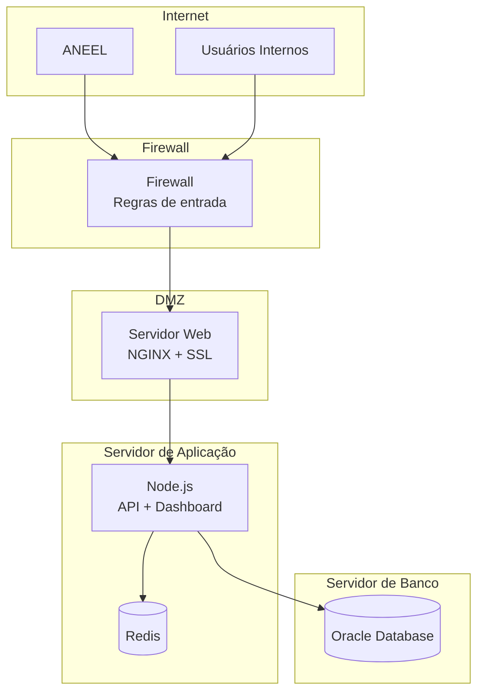

### 12.2 Especificação de Servidores (Mínimo)

| Servidor | CPU | RAM | Disco | SO |
|----------|-----|-----|-------|-----|
| **Web/App** | 4 vCPU | 8 GB | 100 GB SSD | Ubuntu 22.04 |
| **Banco** | 4 vCPU | 16 GB | 200 GB SSD | Ubuntu 22.04 |

**Observação:** Para ambiente de produção robusto, considerar:
- Separar servidor web (NGINX) do servidor de aplicação
- Redis em cluster ou sentinel
- Backup automatizado

### 12.3 Docker Compose (Desenvolvimento/Homologação)

```yaml
# docker-compose.yml
version: '3.8'

services:
  api:
    build:
      context: .
      dockerfile: Dockerfile
    ports:
      - "8000:8000"
    environment:
      - ORACLE_USER=radar
      - ORACLE_PASSWORD=radar123
      - ORACLE_HOST=oracle-db
      - ORACLE_PORT=1521
      - ORACLE_SERVICE=XEPDB1
      - REDIS_URL=redis://redis:6379
      - ANEEL_API_KEY=dev-api-key
      - EMAIL_INDISPONIBILIDADE=ti@roraimaenergia.com.br
    depends_on:
      - oracle-db
      - redis
    volumes:
      - ./src:/app/src

  celery-worker:
    build:
      context: .
      dockerfile: Dockerfile
    command: celery -A src.tasks.celery_app worker --loglevel=info
    environment:
      - ORACLE_USER=radar
      - ORACLE_PASSWORD=radar123
      - ORACLE_HOST=oracle-db
      - ORACLE_PORT=1521
      - ORACLE_SERVICE=XEPDB1
      - REDIS_URL=redis://redis:6379
      - CELERY_BROKER_URL=redis://redis:6379/1
    depends_on:
      - oracle-db
      - redis

  celery-beat:
    build:
      context: .
      dockerfile: Dockerfile
    command: celery -A src.tasks.celery_app beat --loglevel=info
    environment:
      - CELERY_BROKER_URL=redis://redis:6379/1
    depends_on:
      - redis

  oracle-db:
    image: gvenzl/oracle-xe:21-slim
    environment:
      ORACLE_PASSWORD: radar123
      APP_USER: radar
      APP_USER_PASSWORD: radar123
    ports:
      - "1521:1521"
    volumes:
      - oracle_data:/opt/oracle/oradata
      - ./scripts/init.sql:/container-entrypoint-initdb.d/init.sql

  redis:
    image: redis:7-alpine
    ports:
      - "6379:6379"
    volumes:
      - redis_data:/data

  nginx:
    image: nginx:alpine
    ports:
      - "80:80"
      - "443:443"
    volumes:
      - ./nginx/nginx.conf:/etc/nginx/nginx.conf
      - ./nginx/ssl:/etc/nginx/ssl
    depends_on:
      - api

volumes:
  oracle_data:
  redis_data:
```

---

## 13. Monitoramento

### 13.1 Health Checks

```typescript
// src/common/health/health.controller.ts
import { Controller, Get } from '@nestjs/common';
import { HealthCheck, HealthCheckService, TypeOrmHealthIndicator } from '@nestjs/terminus';
import { RedisHealthIndicator } from './redis.health';
import { SistemaTecnicoHealthIndicator } from './sistema-tecnico.health';

@Controller('health')
export class HealthController {
  constructor(
    private health: HealthCheckService,
    private db: TypeOrmHealthIndicator,
    private redis: RedisHealthIndicator,
    private sistemaTecnico: SistemaTecnicoHealthIndicator,
  ) {}

  @Get()
  @HealthCheck()
  check() {
    return this.health.check([
      () => this.db.pingCheck('database'),
      () => this.redis.isHealthy('redis'),
      () => this.sistemaTecnico.isHealthy('sistema-tecnico'),
    ]);
  }

  @Get('live')
  liveness() {
    return { status: 'ok', timestamp: new Date().toISOString() };
  }

  @Get('ready')
  @HealthCheck()
  readiness() {
    return this.health.check([
      () => this.db.pingCheck('database'),
    ]);
  }
}
```

### 13.2 Logging

```typescript
// src/common/interceptors/logging.interceptor.ts
import {
  Injectable,
  NestInterceptor,
  ExecutionContext,
  CallHandler,
  Logger,
} from '@nestjs/common';
import { Observable } from 'rxjs';
import { tap } from 'rxjs/operators';

@Injectable()
export class LoggingInterceptor implements NestInterceptor {
  private readonly logger = new Logger('HTTP');

  intercept(context: ExecutionContext, next: CallHandler): Observable<any> {
    const request = context.switchToHttp().getRequest();
    const { method, url, ip } = request;
    const userAgent = request.get('user-agent') || '';
    const startTime = Date.now();

    return next.handle().pipe(
      tap({
        next: () => {
          const response = context.switchToHttp().getResponse();
          const { statusCode } = response;
          const duration = Date.now() - startTime;

          this.logger.log(
            `${method} ${url} ${statusCode} ${duration}ms - ${ip} - ${userAgent}`
          );

          // Log específico para APIs ANEEL
          if (url.includes('quantitativo') || url.includes('dadosdemanda')) {
            this.logger.log(`[ANEEL] ${method} ${url} - IP: ${ip} - ${duration}ms`);
          }
        },
        error: (error) => {
          const duration = Date.now() - startTime;
          this.logger.error(
            `${method} ${url} ${error.status || 500} ${duration}ms - ${ip} - ${error.message}`
          );
        },
      }),
    );
  }
}
```

### 13.3 Alertas

```typescript
// src/common/services/alertas.service.ts
import { Injectable, Logger } from '@nestjs/common';
import { ConfigService } from '@nestjs/config';
import * as nodemailer from 'nodemailer';

@Injectable()
export class AlertasService {
  private readonly logger = new Logger(AlertasService.name);
  private transporter: nodemailer.Transporter;

  constructor(private configService: ConfigService) {
    this.transporter = nodemailer.createTransport({
      host: this.configService.get('SMTP_HOST'),
      port: this.configService.get('SMTP_PORT'),
      auth: {
        user: this.configService.get('SMTP_USER'),
        pass: this.configService.get('SMTP_PASS'),
      },
    });
  }

  async enviarAlertaIndisponibilidade(sistema: string, erro: string) {
    const destinatarios = [
      this.configService.get('EMAIL_INDISPONIBILIDADE'),
      this.configService.get('EMAIL_TI_INTERNO'),
    ].filter(Boolean);

    try {
      await this.transporter.sendMail({
        from: 'radar@roraimaenergia.com.br',
        to: destinatarios.join(','),
        subject: `[RADAR] Alerta: ${sistema} indisponível`,
        html: `
          <h2>Alerta de Indisponibilidade</h2>
          <p><strong>Sistema:</strong> ${sistema}</p>
          <p><strong>Data/Hora:</strong> ${new Date().toLocaleString('pt-BR')}</p>
          <p><strong>Erro:</strong> ${erro}</p>
          <hr>
          <p>Este é um alerta automático do Sistema RADAR.</p>
        `,
      });

      this.logger.log(`Alerta enviado para: ${destinatarios.join(', ')}`);
    } catch (error) {
      this.logger.error(`Falha ao enviar alerta: ${error.message}`);
    }
  }

  async enviarAlertaInterrupcaoMassiva(dados: {
    municipio: string;
    qtdUcsAfetadas: number;
    percentual: number;
  }) {
    // Threshold configurável
    const threshold = this.configService.get<number>('ALERTA_THRESHOLD_UCS') || 1000;

    if (dados.qtdUcsAfetadas < threshold) {
      return;
    }

    this.logger.warn(`Interrupção massiva detectada: ${dados.municipio} - ${dados.qtdUcsAfetadas} UCs`);

    // Enviar email, SMS, etc.
  }
}
```

---

## 14. Plano de Implantação

### 14.1 Fases de Implantação

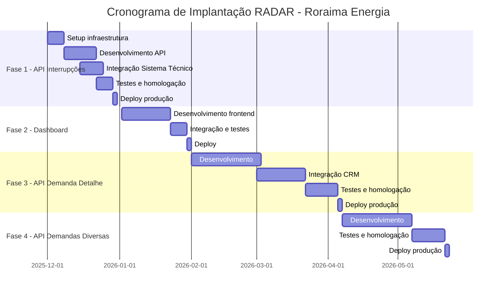

### 14.2 Checklist de Entrega - API Interrupções

- [ ] **Infraestrutura**
  - [ ] Servidor provisionado
  - [ ] Oracle Database configurado (schema RADAR)
  - [ ] Redis instalado
  - [ ] NGINX com SSL configurado
  - [ ] Firewall configurado (IP ANEEL)

- [ ] **Desenvolvimento**
  - [ ] Endpoint /quantitativointerrupcoesativas
  - [ ] Autenticação API Key
  - [ ] Validação de IP
  - [ ] Resposta JSON conforme especificação
  - [ ] Tratamento de erros

- [ ] **Integração**
  - [ ] Conexão com sistema técnico
  - [ ] Query de interrupções ativas
  - [ ] Agregação por município/conjunto

- [ ] **Testes**
  - [ ] Testes unitários
  - [ ] Testes de integração
  - [ ] Teste de carga
  - [ ] Teste com IP da ANEEL

- [ ] **Documentação**
  - [ ] Swagger atualizado
  - [ ] Runbook operacional
  - [ ] Procedimento de rollback

- [ ] **Go-Live**
  - [ ] API Key gerada e enviada para ANEEL
  - [ ] Email de indisponibilidade configurado
  - [ ] Monitoramento ativo
  - [ ] Equipe de plantão definida

---

## 15. Estimativas

### 15.1 Volume de Dados

| Métrica | Valor Estimado |
|---------|----------------|
| Municípios | 15 |
| Conjuntos elétricos | ~20-30 |
| UCs totais Roraima | ~150.000 |
| Coletas/dia (ANEEL) | 48 (interrupções) |
| Registros/coleta | ~30-50 |
| Registros/mês | ~45.000 |
| Storage/mês | ~10 MB |
| Storage/36 meses | ~360 MB |

### 15.2 Requisições Esperadas

| Origem | Frequência | Requests/dia |
|--------|------------|--------------|
| ANEEL - Interrupções | 30 min | 48 |
| ANEEL - Demandas diversas | 30 min (6h-24h) | 36 |
| ANEEL - Demanda detalhe | Sob demanda | ~10-50 |
| Dashboard interno | Contínuo | ~500-1000 |

### 15.3 Esforço de Desenvolvimento

| Componente | Esforço (pessoa-dias) |
|------------|----------------------|
| API Interrupções | 15-20 |
| API Demandas Diversas | 10-15 |
| API Demanda Detalhe | 10-15 |
| Dashboard básico | 20-30 |
| Integrações sistemas | 15-25 |
| Infraestrutura | 5-10 |
| Testes | 10-15 |
| **Total** | **85-130 pessoa-dias** |

---

## Anexos

### A. Contatos

| Função | Contato |
|--------|---------|
| Coordenador ANEEL | danielribeiro@aneel.gov.br |
| TI Roraima Energia | ti@roraimaenergia.com.br |

### B. Links Úteis

- Portal ANEEL RADAR: https://portalrelatorios.aneel.gov.br/hubDistribuicao
- Especificação API V4: Anexo ao Ofício Circular 14/2025
- e-Ping: https://www.gov.br/governodigital/pt-br/governanca-de-dados/eping
- Guia APIs gov.br: https://www.gov.br/governodigital/pt-br/governanca-de-dados

---

**Histórico de Revisões**

| Versão | Data | Autor | Alterações |
|--------|------|-------|------------|
| 1.0 | 10/12/2025 | TI | Versão inicial |
| 2.0 | 10/12/2025 | TI | Incorporação dos requisitos da REN 1.137/2025: Portal Público de Interrupções (Art. 106-107), Sistema de Notificação SMS/WhatsApp (Art. 105), Módulo DISE (Art. 173/180-A), API Tempo Real para ANEEL (Art. 113) |
| 3.0 | 10/12/2025 | TI | **Mudança de Stack Backend**: NestJS → Python + FastAPI. Adoção de Arquitetura Hexagonal (Ports & Adapters), Clean Architecture, DDD, SOLID, TDD. Implementação de Conventional Commits, GitHub Flow com ambientes staging/production. Integração via DBLink (Sistema Técnico + Ajuri). DISE consumido do Sistema Técnico. Celery + Redis para filas e agendamento. |
| 3.1 | 10/12/2025 | TI | **Banco de Dados**: PostgreSQL → Oracle Database. Scripts SQL adaptados para Oracle. APIs 2 e 3 especificadas. Correção de violações Clean Architecture (Use Cases com interfaces). Conversão de código backend NestJS para Python/FastAPI. |

