# Diagramas do Projeto RADAR - Roraima Energia
## Sistema de Monitoramento de Interrupções e Demandas

**Distribuidora:** Roraima Energia S/A
**Data:** 10/12/2025
**Versão:** 2.0
**Baseado em:**
- Ofício Circular 14/2025-SMA/ANEEL
- **REN 1.137/2025** - Resiliência a Eventos Climáticos Severos

---

## Índice

1. [Arquitetura Geral do Sistema](#1-arquitetura-geral-do-sistema)
2. [Fluxo de Dados - APIs ANEEL](#2-fluxo-de-dados---apis-aneel)
3. [Fluxo de Recuperação de Dados](#3-fluxo-de-recuperação-de-dados)
4. [Modelo de Dados (ERD)](#4-modelo-de-dados-erd)
5. [Estados de Demanda](#5-estados-de-demanda)
6. [Componentes do Dashboard](#6-componentes-do-dashboard)
7. [APIs - Endpoints ANEEL](#7-apis---endpoints-aneel)
8. [Casos de Uso](#8-casos-de-uso)
9. [Cronograma de Implementação](#9-cronograma-de-implementação)
10. [Modelos de Resposta API](#10-modelos-de-resposta-api)
11. [Fluxo de Autenticação](#11-fluxo-de-autenticação)
12. [Estrutura Geográfica de Roraima](#12-estrutura-geográfica-de-roraima)
13. [Níveis de Severidade - Heat Map](#13-níveis-de-severidade---heat-map)
14. [Canais de Atendimento](#14-canais-de-atendimento)
15. [Infraestrutura de Deploy](#15-infraestrutura-de-deploy)
16. [Sistema de Alertas](#16-sistema-de-alertas)
17. [Dashboard PowerOutage Style](#17-dashboard-poweroutage-style)
18. [Integração Sistemas Internos](#18-integração-sistemas-internos)
19. [Portal Público de Interrupções (REN 1.137)](#19-portal-público-de-interrupções-ren-1137)
20. [Sistema de Notificação SMS/WhatsApp](#20-sistema-de-notificação-smswhatsapp)
21. [Módulo DISE - Indicador de Emergência](#21-módulo-dise---indicador-de-emergência)
22. [Fluxo de Situação de Emergência](#22-fluxo-de-situação-de-emergência)

---

## 1. Arquitetura Geral do Sistema

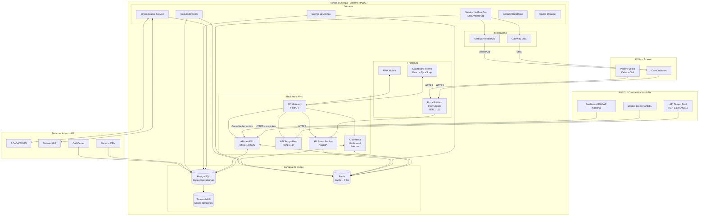
```mermaid
flowchart TB
    subgraph ANEEL["ANEEL - Consumidor das APIs"]
        ANEEL_WK[Worker Coletor ANEEL]
        ANEEL_DASH[Dashboard RADAR Nacional]
        ANEEL_REN[API Tempo Real<br/>REN 1.137 Art.113]
    end

    subgraph PublicoExterno["Público Externo"]
        CONSUMIDOR[Consumidores]
        PODER_PUB[Poder Público<br/>Defesa Civil]
    end

    subgraph RR["Roraima Energia - Sistema RADAR"]
        subgraph Frontend["Frontends"]
            WEB[Dashboard Interno<br/>React + TypeScript]
            MOBILE[PWA Mobile]
            PORTAL[Portal Público<br/>Interrupções<br/>REN 1.137]
        end

        subgraph Backend["Backend / APIs"]
            API[API Gateway<br/>FastAPI]
            API_ANEEL[APIs ANEEL<br/>Ofício 14/2025]
            API_REN[API Tempo Real<br/>REN 1.137]
            API_INT[API Interna<br/>/dashboard<br/>/alertas]
            API_PUB[API Portal Público<br/>/portal/*]
        end

        subgraph Services["Serviços"]
            SYNC[Sincronizador SCADA]
            ALERT[Serviço de Alertas]
            NOTIF[Serviço Notificações<br/>SMS/WhatsApp]
            DISE[Calculador DISE]
            REPORT[Gerador Relatórios]
            CACHE_SVC[Cache Manager]
        end

        subgraph Messaging["Mensageria"]
            SMS_GW[Gateway SMS]
            WA_GW[Gateway WhatsApp]
        end

        subgraph Data["Camada de Dados"]
            DB[(PostgreSQL<br/>Dados Operacionais)]
            CACHE[(Redis<br/>Cache + Filas)]
            TS[(TimescaleDB<br/>Séries Temporais)]
        end
    end

    subgraph Internos["Sistemas Internos RR"]
        SCADA[SCADA/ADMS]
        GIS[Sistema GIS]
        CRM[Sistema CRM]
        CALL[Call Center]
    end

    ANEEL_WK -->|HTTPS + x-api-key| API_ANEEL
    ANEEL_DASH -->|Consulta demandas| API_ANEEL
    ANEEL_REN -->|HTTPS| API_REN

    CONSUMIDOR -->|HTTPS| PORTAL
    PODER_PUB -->|HTTPS| PORTAL
    PORTAL --> API_PUB

    WEB <--> API
    MOBILE <--> API
    API --> API_INT
    API --> API_ANEEL
    API --> API_REN
    API --> API_PUB

    API_INT <--> DB
    API_INT <--> CACHE
    API_ANEEL <--> DB
    API_ANEEL <--> CACHE
    API_PUB <--> CACHE

    SYNC --> DB
    SYNC <--> SCADA
    SYNC <--> GIS

    ALERT --> CACHE
    ALERT --> DB

    NOTIF --> CACHE
    NOTIF --> SMS_GW
    NOTIF --> WA_GW
    SMS_GW -->|SMS| CONSUMIDOR
    WA_GW -->|WhatsApp| CONSUMIDOR

    DISE --> DB
    DISE --> CACHE

    CRM --> DB
    CALL --> DB

    DB --> TS
```

---

## 2. Fluxo de Dados - APIs ANEEL

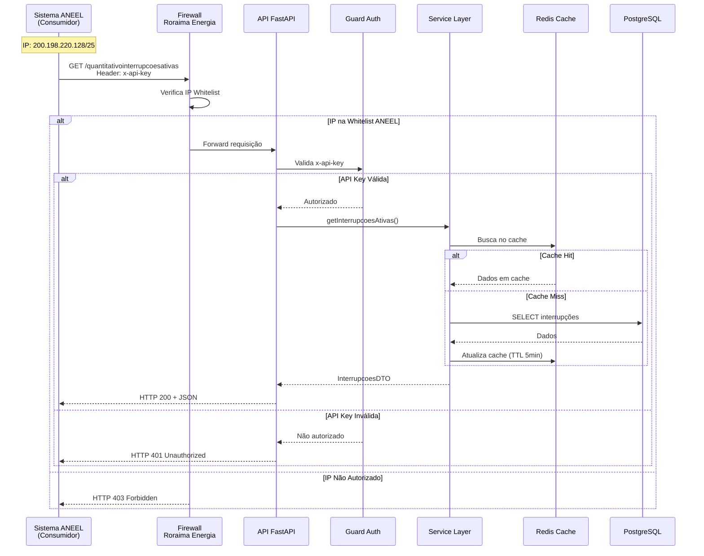
```mermaid
sequenceDiagram
    participant ANEEL as Sistema ANEEL<br/>(Consumidor)
    participant FW as Firewall<br/>Roraima Energia
    participant API as API FastAPI
    participant AUTH as Guard Auth
    participant SVC as Service Layer
    participant CACHE as Redis Cache
    participant DB as PostgreSQL

    Note over ANEEL: IP: 200.198.220.128/25

    ANEEL->>FW: GET /quantitativointerrupcoesativas<br/>Header: x-api-key
    FW->>FW: Verifica IP Whitelist

    alt IP na Whitelist ANEEL
        FW->>API: Forward requisição
        API->>AUTH: Valida x-api-key

        alt API Key Válida
            AUTH-->>API: Autorizado
            API->>SVC: getInterrupcoesAtivas()
            SVC->>CACHE: Busca no cache

            alt Cache Hit
                CACHE-->>SVC: Dados em cache
            else Cache Miss
                SVC->>DB: SELECT interrupções
                DB-->>SVC: Dados
                SVC->>CACHE: Atualiza cache (TTL 5min)
            end

            SVC-->>API: InterrupcoesDTO
            API-->>ANEEL: HTTP 200 + JSON
        else API Key Inválida
            AUTH-->>API: Não autorizado
            API-->>ANEEL: HTTP 401 Unauthorized
        end
    else IP Não Autorizado
        FW-->>ANEEL: HTTP 403 Forbidden
    end
```

---

## 3. Fluxo de Recuperação de Dados

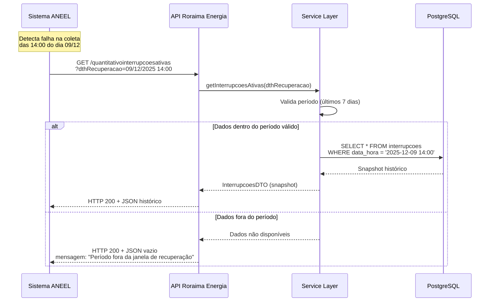
```mermaid
sequenceDiagram
    participant ANEEL as Sistema ANEEL
    participant API as API Roraima Energia
    participant SVC as Service Layer
    participant DB as PostgreSQL

    Note over ANEEL: Detecta falha na coleta<br/>das 14:00 do dia 09/12

    ANEEL->>API: GET /quantitativointerrupcoesativas<br/>?dthRecuperacao=09/12/2025 14:00

    API->>SVC: getInterrupcoesAtivas(dthRecuperacao)
    SVC->>SVC: Valida período (últimos 7 dias)

    alt Dados dentro do período válido
        SVC->>DB: SELECT * FROM interrupcoes<br/>WHERE data_hora = '2025-12-09 14:00'
        DB-->>SVC: Snapshot histórico
        SVC-->>API: InterrupcoesDTO (snapshot)
        API-->>ANEEL: HTTP 200 + JSON histórico
    else Dados fora do período
        SVC-->>API: Dados não disponíveis
        API-->>ANEEL: HTTP 200 + JSON vazio<br/>mensagem: "Período fora da janela de recuperação"
    end
```

---

## 4. Modelo de Dados (ERD)

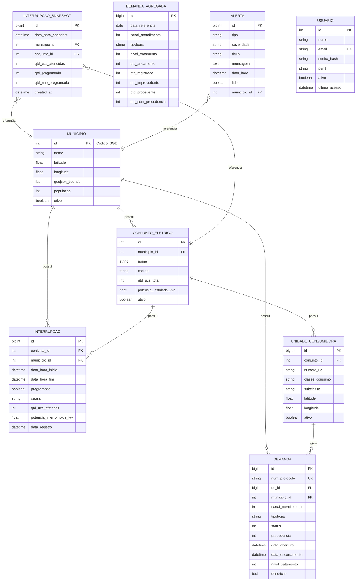
```mermaid
erDiagram
    MUNICIPIO ||--o{ CONJUNTO_ELETRICO : possui
    MUNICIPIO ||--o{ INTERRUPCAO : possui
    MUNICIPIO ||--o{ DEMANDA : possui

    CONJUNTO_ELETRICO ||--o{ INTERRUPCAO : possui
    CONJUNTO_ELETRICO ||--o{ UNIDADE_CONSUMIDORA : possui

    UNIDADE_CONSUMIDORA ||--o{ DEMANDA : gera

    MUNICIPIO {
        int id PK "Código IBGE"
        string nome
        float latitude
        float longitude
        json geojson_bounds
        int populacao
        boolean ativo
    }

    CONJUNTO_ELETRICO {
        int id PK
        int municipio_id FK
        string nome
        string codigo
        int qtd_ucs_total
        float potencia_instalada_kva
        boolean ativo
    }

    UNIDADE_CONSUMIDORA {
        bigint id PK
        int conjunto_id FK
        string numero_uc
        string classe_consumo
        string subclasse
        float latitude
        float longitude
        boolean ativo
    }

    INTERRUPCAO {
        bigint id PK
        int conjunto_id FK
        int municipio_id FK
        datetime data_hora_inicio
        datetime data_hora_fim
        boolean programada
        string causa
        int qtd_ucs_afetadas
        float potencia_interrompida_kw
        datetime data_registro
    }

    INTERRUPCAO_SNAPSHOT {
        bigint id PK
        datetime data_hora_snapshot
        int municipio_id FK
        int conjunto_id FK
        int qtd_ucs_atendidas
        int qtd_programada
        int qtd_nao_programada
        datetime created_at
    }

    DEMANDA {
        bigint id PK
        string num_protocolo UK
        bigint uc_id FK
        int municipio_id FK
        int canal_atendimento
        string tipologia
        int status
        int procedencia
        datetime data_abertura
        datetime data_encerramento
        int nivel_tratamento
        text descricao
    }

    DEMANDA_AGREGADA {
        bigint id PK
        date data_referencia
        int canal_atendimento
        string tipologia
        int nivel_tratamento
        int qtd_andamento
        int qtd_registrada
        int qtd_improcedente
        int qtd_procedente
        int qtd_sem_procedencia
    }

    ALERTA {
        bigint id PK
        string tipo
        string severidade
        string titulo
        text mensagem
        datetime data_hora
        boolean lido
        int municipio_id FK
    }

    USUARIO {
        int id PK
        string nome
        string email UK
        string senha_hash
        string perfil
        boolean ativo
        datetime ultimo_acesso
    }

    INTERRUPCAO_SNAPSHOT }o--|| MUNICIPIO : referencia
    INTERRUPCAO_SNAPSHOT }o--|| CONJUNTO_ELETRICO : referencia
    ALERTA }o--|| MUNICIPIO : referencia
```

---

## 5. Estados de Demanda

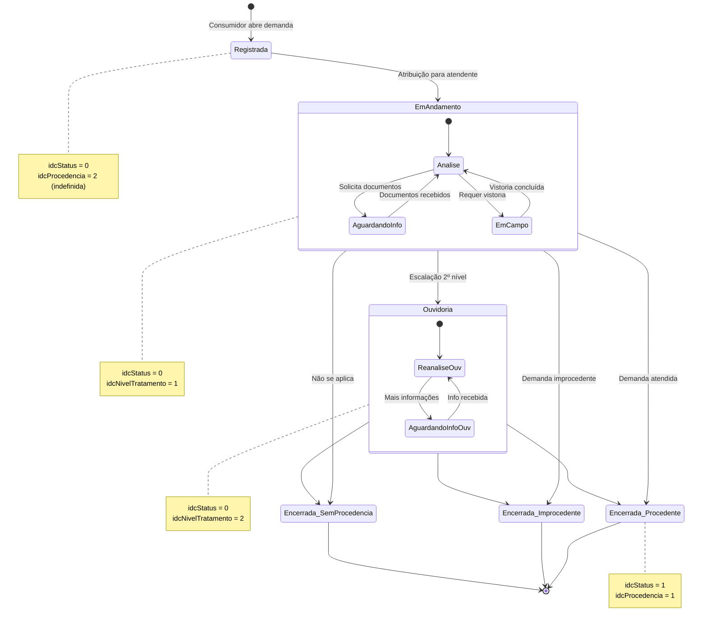
```mermaid
stateDiagram-v2
    [*] --> Registrada: Consumidor abre demanda

    Registrada --> EmAndamento: Atribuição para atendente

    state EmAndamento {
        [*] --> Analise
        Analise --> AguardandoInfo: Solicita documentos
        AguardandoInfo --> Analise: Documentos recebidos
        Analise --> EmCampo: Requer vistoria
        EmCampo --> Analise: Vistoria concluída
    }

    EmAndamento --> Encerrada_Procedente: Demanda atendida
    EmAndamento --> Encerrada_Improcedente: Demanda improcedente
    EmAndamento --> Encerrada_SemProcedencia: Não se aplica

    EmAndamento --> Ouvidoria: Escalação 2º nível

    state Ouvidoria {
        [*] --> ReanaliseOuv
        ReanaliseOuv --> AguardandoInfoOuv: Mais informações
        AguardandoInfoOuv --> ReanaliseOuv: Info recebida
    }

    Ouvidoria --> Encerrada_Procedente
    Ouvidoria --> Encerrada_Improcedente
    Ouvidoria --> Encerrada_SemProcedencia

    Encerrada_Procedente --> [*]
    Encerrada_Improcedente --> [*]
    Encerrada_SemProcedencia --> [*]

    note right of Registrada
        idcStatus = 0
        idcProcedencia = 2 (indefinida)
    end note

    note right of EmAndamento
        idcStatus = 0
        idcNivelTratamento = 1
    end note

    note right of Ouvidoria
        idcStatus = 0
        idcNivelTratamento = 2
    end note

    note right of Encerrada_Procedente
        idcStatus = 1
        idcProcedencia = 1
    end note
```

---

## 6. Componentes do Dashboard

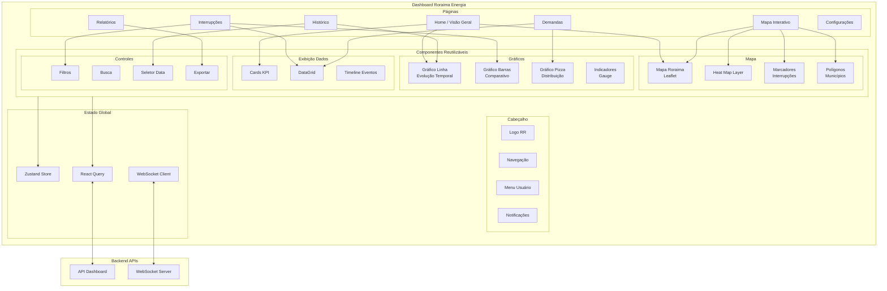
```mermaid
flowchart TB
    subgraph Dashboard["Dashboard Roraima Energia"]
        subgraph Header["Cabeçalho"]
            LOGO[Logo RR]
            NAV[Navegação]
            USER[Menu Usuário]
            NOTIF[Notificações]
        end

        subgraph Pages["Páginas"]
            HOME[Home / Visão Geral]
            MAP_PAGE[Mapa Interativo]
            INT_PAGE[Interrupções]
            DEM_PAGE[Demandas]
            HIST[Histórico]
            REL[Relatórios]
            CONFIG[Configurações]
        end

        subgraph Components["Componentes Reutilizáveis"]
            subgraph MapComponents["Mapa"]
                MAP[Mapa Roraima<br/>Leaflet]
                HEAT[Heat Map Layer]
                MARKERS[Marcadores<br/>Interrupções]
                POLYGON[Polígonos<br/>Municípios]
            end

            subgraph Charts["Gráficos"]
                LINE[Gráfico Linha<br/>Evolução Temporal]
                BAR[Gráfico Barras<br/>Comparativo]
                PIE[Gráfico Pizza<br/>Distribuição]
                GAUGE[Indicadores<br/>Gauge]
            end

            subgraph DataDisplay["Exibição Dados"]
                KPI[Cards KPI]
                TABLE[DataGrid]
                TIMELINE[Timeline Eventos]
            end

            subgraph Controls["Controles"]
                FILTER[Filtros]
                SEARCH[Busca]
                DATE[Seletor Data]
                EXPORT[Exportar]
            end
        end

        subgraph State["Estado Global"]
            STORE[Zustand Store]
            QUERY[React Query]
            WS[WebSocket Client]
        end
    end

    subgraph Backend["Backend APIs"]
        API_DASH[API Dashboard]
        API_WS[WebSocket Server]
    end

    HOME --> KPI
    HOME --> MAP
    HOME --> LINE

    MAP_PAGE --> MAP
    MAP_PAGE --> HEAT
    MAP_PAGE --> MARKERS
    MAP_PAGE --> POLYGON

    INT_PAGE --> TABLE
    INT_PAGE --> FILTER
    INT_PAGE --> BAR

    DEM_PAGE --> TABLE
    DEM_PAGE --> PIE

    HIST --> LINE
    HIST --> DATE

    REL --> EXPORT

    Components --> STORE
    Components --> QUERY
    WS <--> API_WS
    QUERY <--> API_DASH
```

---

## 7. APIs - Endpoints ANEEL

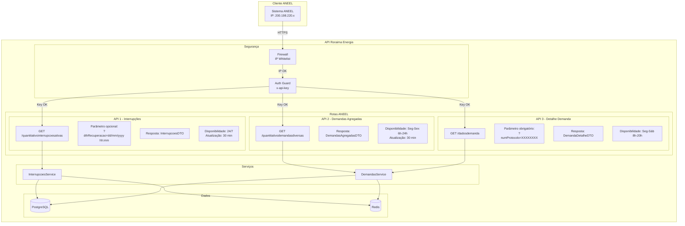
```mermaid
flowchart TB
    subgraph Cliente["Cliente ANEEL"]
        ANEEL_SYS[Sistema ANEEL<br/>IP: 200.198.220.x]
    end

    subgraph API_RR["API Roraima Energia"]
        subgraph Security["Segurança"]
            FW[Firewall<br/>IP Whitelist]
            AUTH[Auth Guard<br/>x-api-key]
        end

        subgraph Routes["Rotas ANEEL"]
            subgraph API1["API 1 - Interrupções"]
                R1[GET /quantitativointerrupcoesativas]
                R1_PARAM["Parâmetro opcional:<br/>?dthRecuperacao=dd/mm/yyyy hh:mm"]
                R1_RESP["Resposta: InterrupcoesDTO"]
                R1_AVAIL["Disponibilidade: 24/7<br/>Atualização: 30 min"]
            end

            subgraph API2["API 2 - Demandas Agregadas"]
                R2[GET /quantitativodemandasdiversas]
                R2_RESP["Resposta: DemandasAgregadasDTO"]
                R2_AVAIL["Disponibilidade: Seg-Sex 6h-24h<br/>Atualização: 30 min"]
            end

            subgraph API3["API 3 - Detalhe Demanda"]
                R3[GET /dadosdemanda]
                R3_PARAM["Parâmetro obrigatório:<br/>?numProtocolo=XXXXXXXX"]
                R3_RESP["Resposta: DemandaDetalheDTO"]
                R3_AVAIL["Disponibilidade: Seg-Sáb 8h-20h"]
            end
        end

        subgraph Services["Serviços"]
            SVC_INT[InterrupcoesService]
            SVC_DEM[DemandasService]
        end

        subgraph Data["Dados"]
            DB[(PostgreSQL)]
            CACHE[(Redis)]
        end
    end

    ANEEL_SYS -->|HTTPS| FW
    FW -->|IP OK| AUTH
    AUTH -->|Key OK| R1
    AUTH -->|Key OK| R2
    AUTH -->|Key OK| R3

    R1 --> SVC_INT
    R2 --> SVC_DEM
    R3 --> SVC_DEM

    SVC_INT --> CACHE
    SVC_INT --> DB
    SVC_DEM --> CACHE
    SVC_DEM --> DB
```

---

## 8. Casos de Uso

```mermaid
flowchart TB
    subgraph Atores["Atores"]
        ANEEL[Sistema ANEEL]
        OP[Operador COD<br/>Roraima Energia]
        GES[Gestor<br/>Roraima Energia]
        TEC[Técnico Campo]
        CONS[Consumidor]
        SYS[Sistema Automático]
    end

    subgraph UseCases["Casos de Uso"]
        subgraph ANEEL_UC["APIs ANEEL"]
            UC_API1[Consultar Interrupções<br/>Ativas]
            UC_API2[Consultar Demandas<br/>Agregadas]
            UC_API3[Consultar Detalhe<br/>Demanda]
            UC_REC[Recuperar Dados<br/>Históricos]
        end

        subgraph Dashboard_UC["Dashboard Interno"]
            UC_MAPA[Visualizar Mapa<br/>de Roraima]
            UC_HEAT[Ver Heat Map<br/>de Interrupções]
            UC_KPI[Monitorar KPIs<br/>em Tempo Real]
            UC_HIST[Analisar Histórico]
            UC_REL[Gerar Relatórios]
            UC_ALERT[Receber Alertas]
        end

        subgraph Operacional["Operacional"]
            UC_REG_INT[Registrar Interrupção]
            UC_ATU_INT[Atualizar Status<br/>Interrupção]
            UC_DESP[Despachar Equipe]
        end

        subgraph Atendimento["Atendimento"]
            UC_ABRIR[Abrir Demanda]
            UC_TRATAR[Tratar Demanda]
            UC_ESCALAR[Escalar para<br/>Ouvidoria]
        end

        subgraph Sistema["Sistema"]
            UC_SYNC[Sincronizar com<br/>SCADA]
            UC_CACHE[Atualizar Cache]
            UC_NOTIF[Enviar Notificações]
            UC_SNAP[Gerar Snapshots<br/>30 min]
        end
    end

    ANEEL --> UC_API1
    ANEEL --> UC_API2
    ANEEL --> UC_API3
    ANEEL --> UC_REC

    OP --> UC_MAPA
    OP --> UC_HEAT
    OP --> UC_KPI
    OP --> UC_REG_INT
    OP --> UC_ATU_INT
    OP --> UC_DESP
    OP --> UC_ALERT

    GES --> UC_HIST
    GES --> UC_REL
    GES --> UC_ALERT

    TEC --> UC_ATU_INT

    CONS --> UC_ABRIR

    OP --> UC_TRATAR
    OP --> UC_ESCALAR

    SYS --> UC_SYNC
    SYS --> UC_CACHE
    SYS --> UC_NOTIF
    SYS --> UC_SNAP
```

---

## 9. Cronograma de Implementação

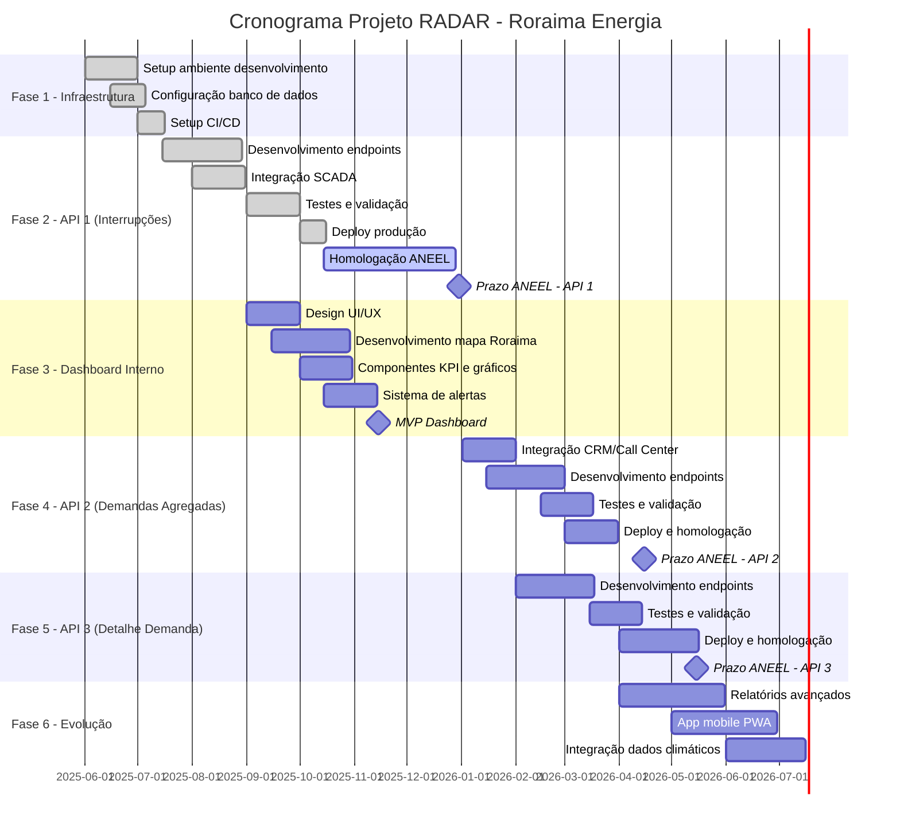
```mermaid
gantt
    title Cronograma Projeto RADAR - Roraima Energia
    dateFormat YYYY-MM-DD

    section Fase 1 - Infraestrutura
    Setup ambiente desenvolvimento     :done, inf1, 2025-06-01, 30d
    Configuração banco de dados        :done, inf2, 2025-06-15, 20d
    Setup CI/CD                        :done, inf3, 2025-07-01, 15d

    section Fase 2 - API 1 (Interrupções)
    Desenvolvimento endpoints          :done, api1_dev, 2025-07-15, 45d
    Integração SCADA                   :done, api1_scada, 2025-08-01, 30d
    Testes e validação                 :done, api1_test, 2025-09-01, 30d
    Deploy produção                    :done, api1_prod, 2025-10-01, 15d
    Homologação ANEEL                  :active, api1_hom, 2025-10-15, 75d
    Prazo ANEEL - API 1                :milestone, m1, 2025-12-31, 0d

    section Fase 3 - Dashboard Interno
    Design UI/UX                       :dash_ui, 2025-09-01, 30d
    Desenvolvimento mapa Roraima       :dash_map, 2025-09-15, 45d
    Componentes KPI e gráficos         :dash_kpi, 2025-10-01, 30d
    Sistema de alertas                 :dash_alert, 2025-10-15, 30d
    MVP Dashboard                      :milestone, m_dash, 2025-11-15, 0d

    section Fase 4 - API 2 (Demandas Agregadas)
    Integração CRM/Call Center         :api2_int, 2026-01-02, 30d
    Desenvolvimento endpoints          :api2_dev, 2026-01-15, 45d
    Testes e validação                 :api2_test, 2026-02-15, 30d
    Deploy e homologação               :api2_hom, 2026-03-01, 30d
    Prazo ANEEL - API 2                :milestone, m2, 2026-04-15, 0d

    section Fase 5 - API 3 (Detalhe Demanda)
    Desenvolvimento endpoints          :api3_dev, 2026-02-01, 45d
    Testes e validação                 :api3_test, 2026-03-15, 30d
    Deploy e homologação               :api3_hom, 2026-04-01, 45d
    Prazo ANEEL - API 3                :milestone, m3, 2026-05-15, 0d

    section Fase 6 - Evolução
    Relatórios avançados               :evol1, 2026-04-01, 60d
    App mobile PWA                     :evol2, 2026-05-01, 60d
    Integração dados climáticos        :evol3, 2026-06-01, 45d
```

---

## 10. Modelos de Resposta API

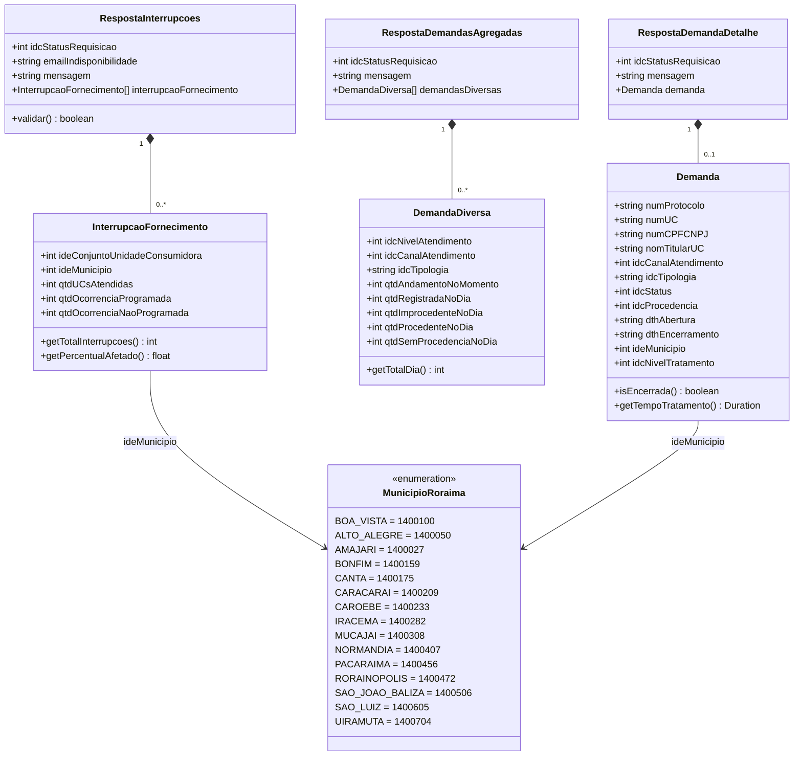
```mermaid
classDiagram
    class RespostaInterrupcoes {
        +int idcStatusRequisicao
        +string emailIndisponibilidade
        +string mensagem
        +InterrupcaoFornecimento[] interrupcaoFornecimento
        +validar() boolean
    }

    class InterrupcaoFornecimento {
        +int ideConjuntoUnidadeConsumidora
        +int ideMunicipio
        +int qtdUCsAtendidas
        +int qtdOcorrenciaProgramada
        +int qtdOcorrenciaNaoProgramada
        +getTotalInterrupcoes() int
        +getPercentualAfetado() float
    }

    class RespostaDemandasAgregadas {
        +int idcStatusRequisicao
        +string mensagem
        +DemandaDiversa[] demandasDiversas
    }

    class DemandaDiversa {
        +int idcNivelAtendimento
        +int idcCanalAtendimento
        +string idcTipologia
        +int qtdAndamentoNoMomento
        +int qtdRegistradaNoDia
        +int qtdImprocedenteNoDia
        +int qtdProcedenteNoDia
        +int qtdSemProcedenciaNoDia
        +getTotalDia() int
    }

    class RespostaDemandaDetalhe {
        +int idcStatusRequisicao
        +string mensagem
        +Demanda demanda
    }

    class Demanda {
        +string numProtocolo
        +string numUC
        +string numCPFCNPJ
        +string nomTitularUC
        +int idcCanalAtendimento
        +string idcTipologia
        +int idcStatus
        +int idcProcedencia
        +string dthAbertura
        +string dthEncerramento
        +int ideMunicipio
        +int idcNivelTratamento
        +isEncerrada() boolean
        +getTempoTratamento() Duration
    }

    class MunicipioRoraima {
        <<enumeration>>
        BOA_VISTA = 1400100
        ALTO_ALEGRE = 1400050
        AMAJARI = 1400027
        BONFIM = 1400159
        CANTA = 1400175
        CARACARAI = 1400209
        CAROEBE = 1400233
        IRACEMA = 1400282
        MUCAJAI = 1400308
        NORMANDIA = 1400407
        PACARAIMA = 1400456
        RORAINOPOLIS = 1400472
        SAO_JOAO_BALIZA = 1400506
        SAO_LUIZ = 1400605
        UIRAMUTA = 1400704
    }

    RespostaInterrupcoes "1" *-- "0..*" InterrupcaoFornecimento
    RespostaDemandasAgregadas "1" *-- "0..*" DemandaDiversa
    RespostaDemandaDetalhe "1" *-- "0..1" Demanda
    InterrupcaoFornecimento --> MunicipioRoraima : ideMunicipio
    Demanda --> MunicipioRoraima : ideMunicipio
```

---

## 11. Fluxo de Autenticação

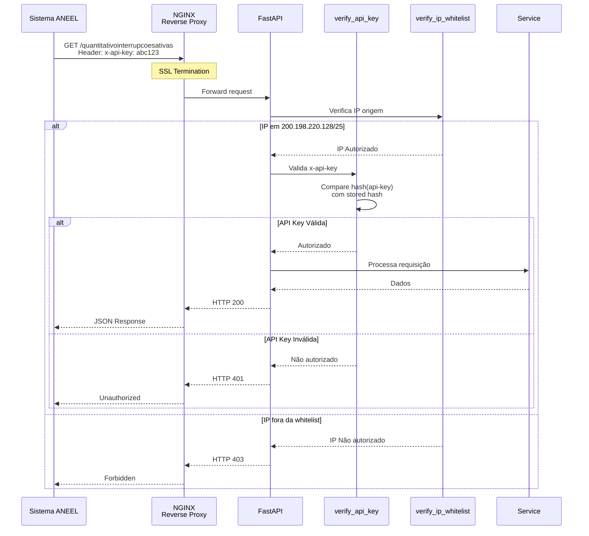
```mermaid
sequenceDiagram
    participant ANEEL as Sistema ANEEL
    participant NGINX as NGINX<br/>Reverse Proxy
    participant FAST as FastAPI
    participant GUARD as verify_api_key
    participant IP_GUARD as verify_ip_whitelist
    participant SVC as Service

    ANEEL->>NGINX: GET /quantitativointerrupcoesativas<br/>Header: x-api-key: abc123

    Note over NGINX: SSL Termination

    NGINX->>FAST: Forward request

    FAST->>IP_GUARD: Verifica IP origem

    alt IP em 200.198.220.128/25
        IP_GUARD-->>FAST: IP Autorizado
        FAST->>GUARD: Valida x-api-key

        GUARD->>GUARD: Compare hash(api-key)<br/>com stored hash

        alt API Key Válida
            GUARD-->>FAST: Autorizado
            FAST->>SVC: Processa requisição
            SVC-->>FAST: Dados
            FAST-->>NGINX: HTTP 200
            NGINX-->>ANEEL: JSON Response
        else API Key Inválida
            GUARD-->>FAST: Não autorizado
            FAST-->>NGINX: HTTP 401
            NGINX-->>ANEEL: Unauthorized
        end
    else IP fora da whitelist
        IP_GUARD-->>FAST: IP Não autorizado
        FAST-->>NGINX: HTTP 403
        NGINX-->>ANEEL: Forbidden
    end
```

### Autenticação Dashboard Interno

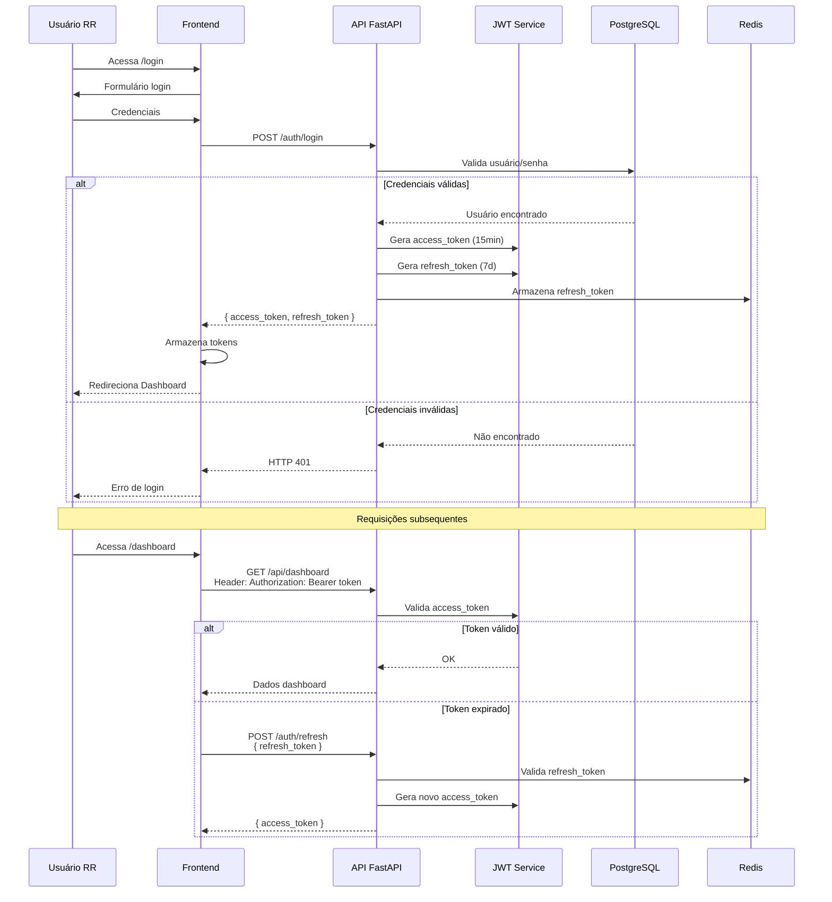
```mermaid
sequenceDiagram
    participant USER as Usuário RR
    participant WEB as Frontend
    participant API as API FastAPI
    participant JWT as JWT Service
    participant DB as PostgreSQL
    participant REDIS as Redis

    USER->>WEB: Acessa /login
    WEB->>USER: Formulário login
    USER->>WEB: Credenciais
    WEB->>API: POST /auth/login

    API->>DB: Valida usuário/senha

    alt Credenciais válidas
        DB-->>API: Usuário encontrado
        API->>JWT: Gera access_token (15min)
        API->>JWT: Gera refresh_token (7d)
        API->>REDIS: Armazena refresh_token
        API-->>WEB: { access_token, refresh_token }
        WEB->>WEB: Armazena tokens
        WEB-->>USER: Redireciona Dashboard
    else Credenciais inválidas
        DB-->>API: Não encontrado
        API-->>WEB: HTTP 401
        WEB-->>USER: Erro de login
    end

    Note over USER,REDIS: Requisições subsequentes

    USER->>WEB: Acessa /dashboard
    WEB->>API: GET /api/dashboard<br/>Header: Authorization: Bearer token
    API->>JWT: Valida access_token

    alt Token válido
        JWT-->>API: OK
        API-->>WEB: Dados dashboard
    else Token expirado
        WEB->>API: POST /auth/refresh<br/>{ refresh_token }
        API->>REDIS: Valida refresh_token
        API->>JWT: Gera novo access_token
        API-->>WEB: { access_token }
    end
```

---

## 12. Estrutura Geográfica de Roraima

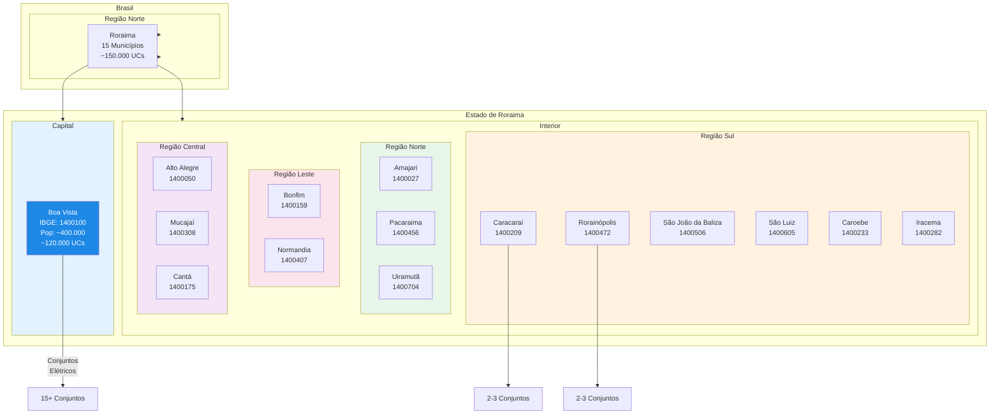
```mermaid
flowchart TB
    subgraph Brasil["Brasil"]
        subgraph Norte["Região Norte"]
            RR[Roraima<br/>15 Municípios<br/>~150.000 UCs]
        end
    end

    subgraph Roraima["Estado de Roraima"]
        subgraph Capital["Capital"]
            BV[Boa Vista<br/>IBGE: 1400100<br/>Pop: ~400.000<br/>~120.000 UCs]
        end

        subgraph Interior["Interior"]
            subgraph Sul["Região Sul"]
                CAR[Caracaraí<br/>1400209]
                ROQ[Rorainópolis<br/>1400472]
                SJB[São João da Baliza<br/>1400506]
                SL[São Luiz<br/>1400605]
                CRB[Caroebe<br/>1400233]
                IRC[Iracema<br/>1400282]
            end

            subgraph Norte_RR["Região Norte"]
                AM[Amajari<br/>1400027]
                PAC[Pacaraima<br/>1400456]
                UIR[Uiramutã<br/>1400704]
            end

            subgraph Leste["Região Leste"]
                BON[Bonfim<br/>1400159]
                NOR[Normandia<br/>1400407]
            end

            subgraph Central["Região Central"]
                AA[Alto Alegre<br/>1400050]
                MUC[Mucajaí<br/>1400308]
                CAN[Cantá<br/>1400175]
            end
        end
    end

    Brasil --> Norte
    Norte --> RR
    RR --> Capital
    RR --> Interior

    BV --> |"Conjuntos<br/>Elétricos"| CE_BV[15+ Conjuntos]
    CAR --> CE_CAR[2-3 Conjuntos]
    ROQ --> CE_ROQ[2-3 Conjuntos]

    style BV fill:#1e88e5,color:#fff
    style Capital fill:#e3f2fd
    style Sul fill:#fff3e0
    style Norte_RR fill:#e8f5e9
    style Leste fill:#fce4ec
    style Central fill:#f3e5f5
```

### Mapa Esquemático Roraima

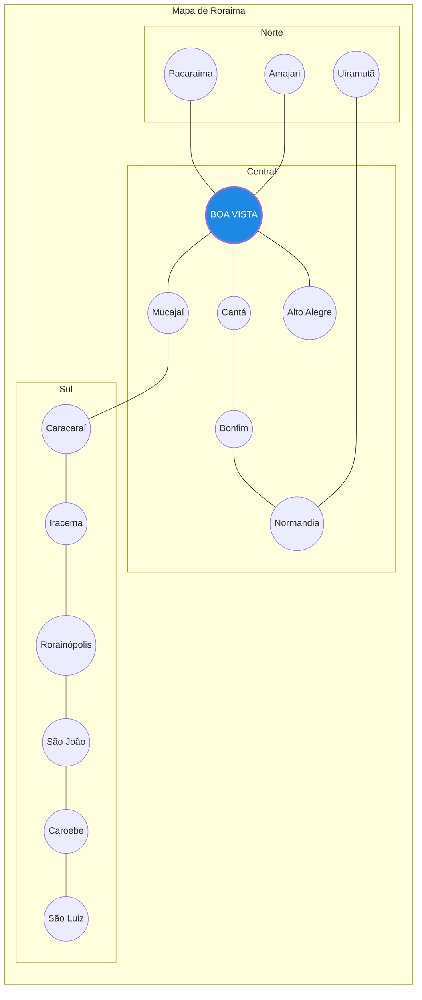
```mermaid
graph TB
    subgraph MapaRoraima["Mapa de Roraima"]
        direction TB

        subgraph NorteMap["Norte"]
            UIR_M((Uiramutã))
            PAC_M((Pacaraima))
            AM_M((Amajari))
        end

        subgraph CentralMap["Central"]
            AA_M((Alto Alegre))
            BV_M((BOA VISTA))
            CAN_M((Cantá))
            MUC_M((Mucajaí))
            NOR_M((Normandia))
            BON_M((Bonfim))
        end

        subgraph SulMap["Sul"]
            CAR_M((Caracaraí))
            IRC_M((Iracema))
            ROQ_M((Rorainópolis))
            SJB_M((São João))
            CRB_M((Caroebe))
            SL_M((São Luiz))
        end
    end

    AM_M --- BV_M
    PAC_M --- BV_M
    UIR_M --- NOR_M
    BV_M --- CAN_M
    BV_M --- MUC_M
    BV_M --- AA_M
    CAN_M --- BON_M
    BON_M --- NOR_M
    MUC_M --- CAR_M
    CAR_M --- IRC_M
    IRC_M --- ROQ_M
    ROQ_M --- SJB_M
    SJB_M --- CRB_M
    CRB_M --- SL_M

    style BV_M fill:#1e88e5,color:#fff,stroke-width:3px
```

---

## 13. Níveis de Severidade - Heat Map

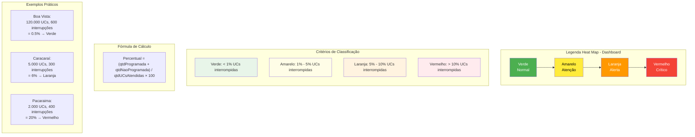
```mermaid
flowchart TB
    subgraph Legenda["Legenda Heat Map - Dashboard"]
        direction LR

        G[Verde<br/>Normal]
        Y[Amarelo<br/>Atenção]
        O[Laranja<br/>Alerta]
        R[Vermelho<br/>Crítico]

        G --> Y --> O --> R
    end

    subgraph Criterios["Critérios de Classificação"]
        direction TB

        C1["Verde: < 1% UCs interrompidas"]
        C2["Amarelo: 1% - 5% UCs interrompidas"]
        C3["Laranja: 5% - 10% UCs interrompidas"]
        C4["Vermelho: > 10% UCs interrompidas"]
    end

    subgraph Formula["Fórmula de Cálculo"]
        CALC["Percentual = (qtdProgramada + qtdNaoProgramada) / qtdUCsAtendidas × 100"]
    end

    subgraph Exemplos["Exemplos Práticos"]
        EX1["Boa Vista:<br/>120.000 UCs, 600 interrupções<br/>= 0.5% → Verde"]
        EX2["Caracaraí:<br/>5.000 UCs, 300 interrupções<br/>= 6% → Laranja"]
        EX3["Pacaraima:<br/>2.000 UCs, 400 interrupções<br/>= 20% → Vermelho"]
    end

    style G fill:#4caf50,color:#fff
    style Y fill:#ffeb3b,color:#000
    style O fill:#ff9800,color:#fff
    style R fill:#f44336,color:#fff
    style C1 fill:#e8f5e9
    style C2 fill:#fffde7
    style C3 fill:#fff3e0
    style C4 fill:#ffebee
```

---

## 14. Canais de Atendimento

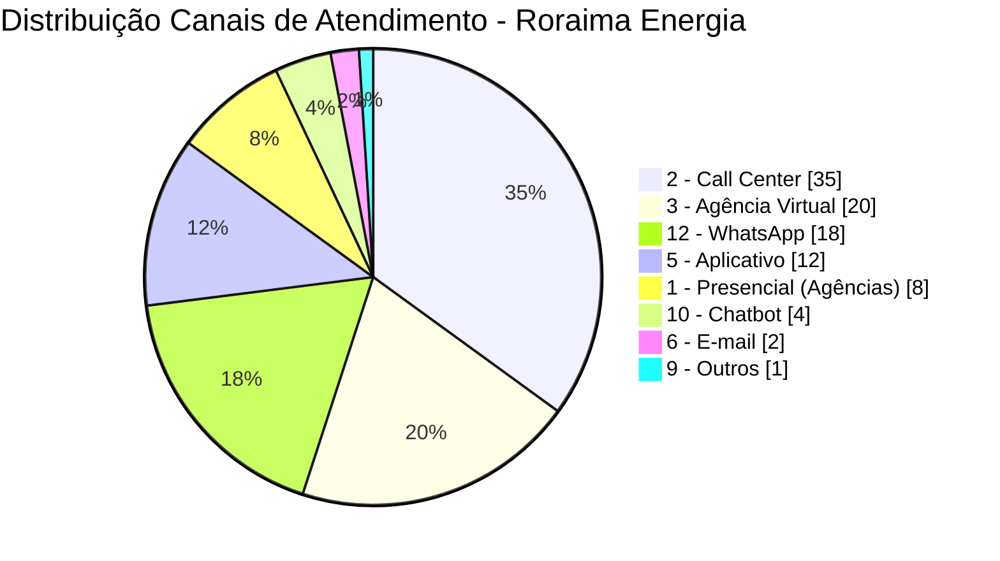
```mermaid
pie showData
    title Distribuição Canais de Atendimento - Roraima Energia
    "2 - Call Center" : 35
    "3 - Agência Virtual" : 20
    "12 - WhatsApp" : 18
    "5 - Aplicativo" : 12
    "1 - Presencial (Agências)" : 8
    "10 - Chatbot" : 4
    "6 - E-mail" : 2
    "9 - Outros" : 1
```

### Mapeamento de Canais

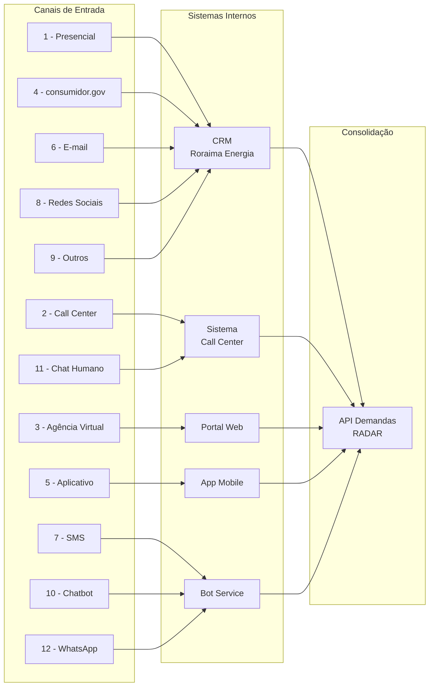
```mermaid
flowchart LR
    subgraph Canais["Canais de Entrada"]
        C1[1 - Presencial]
        C2[2 - Call Center]
        C3[3 - Agência Virtual]
        C4[4 - consumidor.gov]
        C5[5 - Aplicativo]
        C6[6 - E-mail]
        C7[7 - SMS]
        C8[8 - Redes Sociais]
        C9[9 - Outros]
        C10[10 - Chatbot]
        C11[11 - Chat Humano]
        C12[12 - WhatsApp]
    end

    subgraph Sistemas["Sistemas Internos"]
        CRM[CRM<br/>Roraima Energia]
        CALL[Sistema<br/>Call Center]
        WEB[Portal Web]
        APP[App Mobile]
        BOT[Bot Service]
    end

    subgraph Consolidacao["Consolidação"]
        API_DEM[API Demandas<br/>RADAR]
    end

    C1 --> CRM
    C2 --> CALL
    C3 --> WEB
    C4 --> CRM
    C5 --> APP
    C6 --> CRM
    C7 --> BOT
    C8 --> CRM
    C9 --> CRM
    C10 --> BOT
    C11 --> CALL
    C12 --> BOT

    CRM --> API_DEM
    CALL --> API_DEM
    WEB --> API_DEM
    APP --> API_DEM
    BOT --> API_DEM
```

---

## 15. Infraestrutura de Deploy

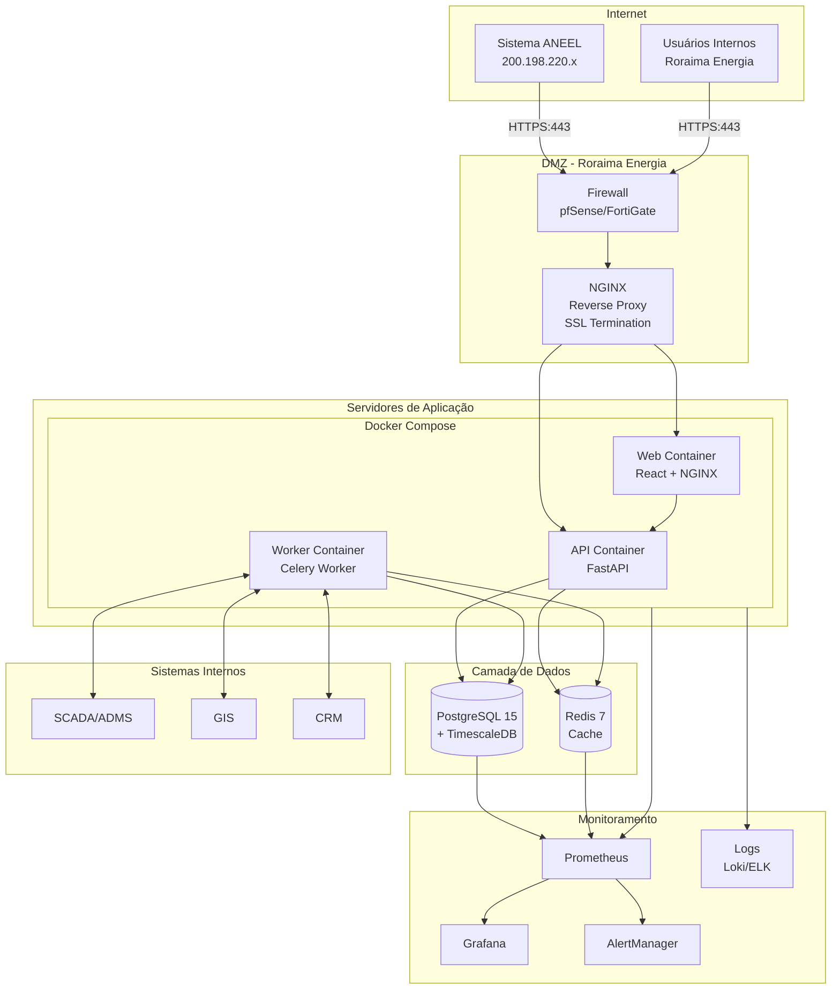
```mermaid
flowchart TB
    subgraph Internet
        ANEEL_NET[Sistema ANEEL<br/>200.198.220.x]
        USERS[Usuários Internos<br/>Roraima Energia]
    end

    subgraph DMZ["DMZ - Roraima Energia"]
        FW[Firewall<br/>pfSense/FortiGate]
        NGINX[NGINX<br/>Reverse Proxy<br/>SSL Termination]
    end

    subgraph AppServers["Servidores de Aplicação"]
        subgraph Docker["Docker Compose"]
            API_CONT[API Container<br/>FastAPI]
            WEB_CONT[Web Container<br/>React + NGINX]
            WORKER[Worker Container<br/>Celery Worker]
        end
    end

    subgraph DataLayer["Camada de Dados"]
        PG[(PostgreSQL 15<br/>+ TimescaleDB)]
        REDIS[(Redis 7<br/>Cache)]
    end

    subgraph InternalSystems["Sistemas Internos"]
        SCADA[SCADA/ADMS]
        GIS[GIS]
        CRM[CRM]
    end

    subgraph Monitoring["Monitoramento"]
        PROM[Prometheus]
        GRAF[Grafana]
        ALERT_MGR[AlertManager]
        LOGS[Logs<br/>Loki/ELK]
    end

    ANEEL_NET -->|HTTPS:443| FW
    USERS -->|HTTPS:443| FW

    FW --> NGINX
    NGINX --> API_CONT
    NGINX --> WEB_CONT

    API_CONT --> PG
    API_CONT --> REDIS
    WEB_CONT --> API_CONT
    WORKER --> PG
    WORKER --> REDIS
    WORKER <--> SCADA
    WORKER <--> GIS
    WORKER <--> CRM

    Docker --> PROM
    PG --> PROM
    REDIS --> PROM
    PROM --> GRAF
    PROM --> ALERT_MGR
    Docker --> LOGS
```

### Diagrama de Containers

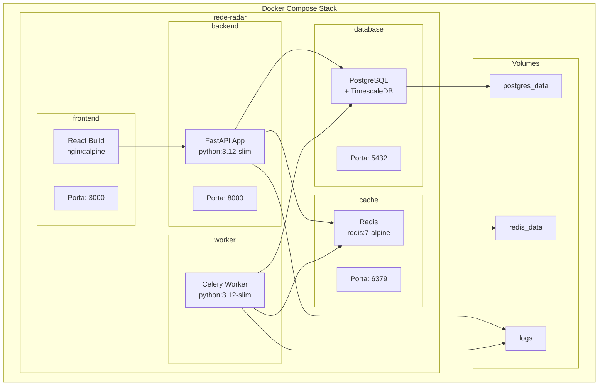
```mermaid
flowchart TB
    subgraph DockerCompose["Docker Compose Stack"]
        subgraph Network["rede-radar"]
            direction TB

            subgraph Frontend["frontend"]
                REACT[React Build<br/>nginx:alpine]
                REACT_PORT["Porta: 3000"]
            end

            subgraph Backend["backend"]
                FAST[FastAPI App<br/>python:3.12-slim]
                FAST_PORT["Porta: 8000"]
            end

            subgraph Worker["worker"]
                WK[Celery Worker<br/>python:3.12-slim]
            end

            subgraph Cache["cache"]
                RD[Redis<br/>redis:7-alpine]
                RD_PORT["Porta: 6379"]
            end

            subgraph Database["database"]
                PG[PostgreSQL<br/>+ TimescaleDB]
                PG_PORT["Porta: 5432"]
            end
        end

        subgraph Volumes["Volumes"]
            VOL_PG[postgres_data]
            VOL_REDIS[redis_data]
            VOL_LOGS[logs]
        end
    end

    REACT --> FAST
    FAST --> RD
    FAST --> PG
    WK --> RD
    WK --> PG

    PG --> VOL_PG
    RD --> VOL_REDIS
    FAST --> VOL_LOGS
    WK --> VOL_LOGS
```

---

## 16. Sistema de Alertas

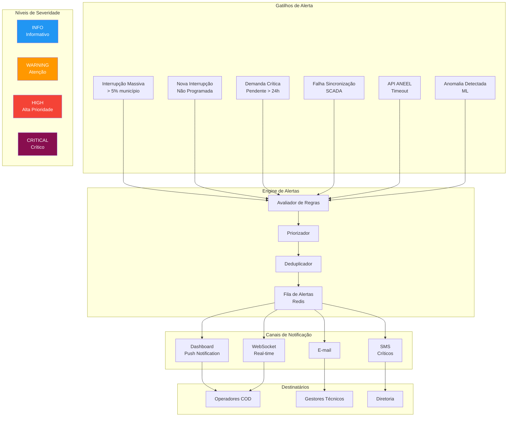
```mermaid
flowchart TB
    subgraph Triggers["Gatilhos de Alerta"]
        T1[Interrupção Massiva<br/>> 5% município]
        T2[Nova Interrupção<br/>Não Programada]
        T3[Demanda Crítica<br/>Pendente > 24h]
        T4[Falha Sincronização<br/>SCADA]
        T5[API ANEEL<br/>Timeout]
        T6[Anomalia Detectada<br/>ML]
    end

    subgraph Engine["Engine de Alertas"]
        EVAL[Avaliador de Regras]
        PRIO[Priorizador]
        DEDUP[Deduplicador]
        QUEUE[Fila de Alertas<br/>Redis]
    end

    subgraph Severidade["Níveis de Severidade"]
        SEV_INFO[INFO<br/>Informativo]
        SEV_WARN[WARNING<br/>Atenção]
        SEV_HIGH[HIGH<br/>Alta Prioridade]
        SEV_CRIT[CRITICAL<br/>Crítico]
    end

    subgraph Notificacao["Canais de Notificação"]
        DASH_NOT[Dashboard<br/>Push Notification]
        EMAIL_NOT[E-mail]
        SMS_NOT[SMS<br/>Críticos]
        WS_NOT[WebSocket<br/>Real-time]
    end

    subgraph Destinatarios["Destinatários"]
        OP_COD[Operadores COD]
        GES_TEC[Gestores Técnicos]
        DIR[Diretoria]
    end

    T1 --> EVAL
    T2 --> EVAL
    T3 --> EVAL
    T4 --> EVAL
    T5 --> EVAL
    T6 --> EVAL

    EVAL --> PRIO
    PRIO --> DEDUP
    DEDUP --> QUEUE

    QUEUE --> DASH_NOT
    QUEUE --> EMAIL_NOT
    QUEUE --> SMS_NOT
    QUEUE --> WS_NOT

    DASH_NOT --> OP_COD
    WS_NOT --> OP_COD
    EMAIL_NOT --> GES_TEC
    SMS_NOT --> DIR

    style SEV_INFO fill:#2196f3,color:#fff
    style SEV_WARN fill:#ff9800,color:#fff
    style SEV_HIGH fill:#f44336,color:#fff
    style SEV_CRIT fill:#880e4f,color:#fff
```

---

## 17. Dashboard PowerOutage Style

```mermaid
flowchart TB
    subgraph DashboardLayout["Layout Dashboard - Estilo PowerOutage.us"]
        subgraph Header["Cabeçalho"]
            LOGO[Logo Roraima Energia]
            TITLE["RADAR - Monitor de Interrupções"]
            CLOCK[Relógio Tempo Real]
            LAST_UPDATE[Última Atualização]
        end

        subgraph MainArea["Área Principal"]
            subgraph LeftPanel["Painel Esquerdo - 30%"]
                KPI_TOTAL["Total UCs Afetadas<br/>▲ 1.234"]
                KPI_PROG["Programadas<br/>234"]
                KPI_NPROG["Não Programadas<br/>1.000"]
                KPI_PERCENT["% Estado<br/>0.82%"]

                COUNTY_LIST["Lista Municípios<br/>Ordenada por Impacto"]
            end

            subgraph CenterPanel["Painel Central - 70%"]
                MAP_RR["Mapa Interativo<br/>Roraima<br/>(Leaflet + GeoJSON)"]

                MAP_LEGEND["Legenda<br/>🟢 Normal | 🟡 Atenção | 🟠 Alerta | 🔴 Crítico"]
            end
        end

        subgraph BottomArea["Área Inferior"]
            subgraph Charts["Gráficos"]
                CHART_HIST["Histórico 24h<br/>Linha Temporal"]
                CHART_COMP["Comparativo<br/>Municípios"]
            end

            subgraph QuickStats["Estatísticas Rápidas"]
                STAT_TODAY["Hoje: 15 eventos"]
                STAT_WEEK["Semana: 87 eventos"]
                STAT_AVG["Média: 2h12m"]
            end
        end
    end

    Header --> MainArea
    MainArea --> BottomArea

    style KPI_TOTAL fill:#f44336,color:#fff
    style KPI_PROG fill:#ff9800,color:#fff
    style KPI_NPROG fill:#d32f2f,color:#fff
    style KPI_PERCENT fill:#1976d2,color:#fff
```

### Wireframe Mapa

```mermaid
graph TB
    subgraph MapView["Visualização do Mapa"]
        subgraph MapControls["Controles"]
            ZOOM[Zoom +/-]
            LAYERS[Camadas]
            FULLSCREEN[Tela Cheia]
        end

        subgraph MapContent["Conteúdo do Mapa"]
            GEO_RR[GeoJSON Roraima]

            subgraph Markers["Marcadores"]
                M_INT[Interrupções Ativas]
                M_EQUIP[Equipes em Campo]
                M_SUB[Subestações]
            end

            subgraph Overlays["Overlays"]
                HEAT_LAYER[Heat Map Layer]
                CLUSTER[Cluster de Eventos]
            end
        end

        subgraph Popup["Popup ao Clicar"]
            POP_INFO["Município: Boa Vista<br/>UCs Afetadas: 523<br/>Programadas: 100<br/>Não Prog: 423<br/>Início: 14:30"]
        end
    end

    MapControls --> MapContent
    M_INT --> POP_INFO
```

---

## 18. Integração Sistemas Internos

```mermaid
flowchart TB
    subgraph RADAR["Sistema RADAR - Roraima Energia"]
        API[API FastAPI]
        DB[(PostgreSQL)]
        SYNC[Sync Service]
    end

    subgraph Sistemas["Sistemas Legados"]
        subgraph SCADA_SYS["SCADA/ADMS"]
            SCADA_DB[(DB SCADA)]
            SCADA_API[API SCADA]
        end

        subgraph GIS_SYS["Sistema GIS"]
            GIS_DB[(DB GIS)]
            GIS_SVC[Serviço GIS]
        end

        subgraph CRM_SYS["CRM/Atendimento"]
            CRM_DB[(DB CRM)]
            CRM_API[API CRM]
        end

        subgraph FATURA["Sistema Faturamento"]
            FAT_DB[(DB Faturamento)]
        end
    end

    subgraph Integracao["Métodos de Integração"]
        ETL[ETL Batch<br/>Noturno]
        RT[Real-time<br/>API/WebSocket]
        DB_LINK[Database Link<br/>Views]
    end

    SYNC --> RT --> SCADA_API
    SYNC --> RT --> CRM_API
    SYNC --> DB_LINK --> GIS_DB
    SYNC --> ETL --> FAT_DB

    SCADA_API --> SCADA_DB
    CRM_API --> CRM_DB
    GIS_SVC --> GIS_DB

    SYNC --> DB
    API --> DB
```

### Fluxo de Sincronização SCADA

```mermaid
sequenceDiagram
    participant CRON as Scheduler<br/>(30 min)
    participant SYNC as Sync Service
    participant SCADA as SCADA API
    participant TRANS as Transformer
    participant DB as PostgreSQL
    participant CACHE as Redis
    participant WS as WebSocket

    CRON->>SYNC: Trigger sync

    SYNC->>SCADA: GET /api/outages/active
    SCADA-->>SYNC: Interrupções ativas

    SYNC->>SCADA: GET /api/equipment/status
    SCADA-->>SYNC: Status equipamentos

    SYNC->>TRANS: Transforma dados
    Note over TRANS: Mapeia códigos internos<br/>para códigos IBGE
    TRANS-->>SYNC: Dados normalizados

    SYNC->>DB: BEGIN TRANSACTION
    SYNC->>DB: INSERT interrupcoes_snapshot
    SYNC->>DB: UPDATE interrupcoes_ativas
    SYNC->>DB: COMMIT

    SYNC->>CACHE: SET interrupcoes:ativas
    SYNC->>CACHE: SET snapshot:latest

    SYNC->>WS: EMIT 'interrupcoes:updated'
    Note over WS: Notifica todos os<br/>clientes conectados

    WS-->>SYNC: ACK
    SYNC-->>CRON: Sync complete
```

---

## 19. Portal Público de Interrupções (REN 1.137)

### Arquitetura do Portal Público

```mermaid
flowchart TB
    subgraph Usuarios["Usuários Externos"]
        CONSUMIDOR[Consumidores]
        IMPRENSA[Imprensa]
        DEF_CIVIL[Defesa Civil]
    end

    subgraph CDN["CDN / Edge"]
        CF[CloudFlare<br/>Cache + DDoS]
    end

    subgraph Portal["Portal Público (React)"]
        MAPA[Mapa Interrupções<br/>Leaflet]
        CARDS[Cards por Faixa<br/>de Duração]
        TABELA[Tabela<br/>Ocorrências]
        STATUS[Status<br/>Equipes]
    end

    subgraph API["API Portal Público"]
        BFF[BFF Público<br/>Somente Leitura]
        CACHE[(Redis Cache<br/>TTL 30 min)]
    end

    subgraph Backend["Backend RADAR"]
        AGG[Agregador Dados]
        SCHEDULER[Scheduler<br/>30 min]
        DB[(PostgreSQL)]
    end

    CONSUMIDOR --> CF
    IMPRENSA --> CF
    DEF_CIVIL --> CF

    CF --> MAPA
    CF --> CARDS
    CF --> TABELA
    CF --> STATUS

    MAPA --> BFF
    CARDS --> BFF
    TABELA --> BFF
    STATUS --> BFF

    BFF --> CACHE
    CACHE -->|cache miss| AGG
    SCHEDULER --> AGG
    AGG --> DB
```

### Faixas de Duração (Art. 107)

```mermaid
flowchart LR
    subgraph Faixas["Classificação por Tempo de Interrupção"]
        F1["< 1 hora<br/>🟢 Verde"]
        F2["1-3 horas<br/>🟡 Amarelo Claro"]
        F3["3-6 horas<br/>🟡 Amarelo"]
        F4["6-12 horas<br/>🟠 Laranja"]
        F5["12-24 horas<br/>🔴 Vermelho Claro"]
        F6["24-48 horas<br/>🔴 Vermelho"]
        F7["> 48 horas<br/>🟤 Crítico"]
    end

    F1 --> F2 --> F3 --> F4 --> F5 --> F6 --> F7
```

### Estados de Ocorrência (Art. 107)

```mermaid
stateDiagram-v2
    [*] --> EmPreparacao: Nova Interrupção

    EmPreparacao: Em Preparação
    EmPreparacao: 🔧 Análise e mobilização

    Deslocamento: Deslocamento
    Deslocamento: 🚗 Equipe em trânsito

    EmExecucao: Em Execução
    EmExecucao: ⚡ Trabalho em campo

    Restabelecido: Restabelecido
    Restabelecido: ✅ Energia normalizada

    EmPreparacao --> Deslocamento: Equipe designada
    Deslocamento --> EmExecucao: Chegou ao local
    EmExecucao --> Restabelecido: Energia restaurada
    EmExecucao --> Deslocamento: Necessário reforço
    Restabelecido --> [*]
```

---

## 20. Sistema de Notificação SMS/WhatsApp

### Arquitetura de Notificações (Art. 105)

```mermaid
flowchart TB
    subgraph Triggers["Gatilhos de Notificação"]
        NOVA_INT[Nova Interrupção]
        ATU_STATUS[Atualização Status]
        RESTAB[Restabelecimento]
    end

    subgraph Prazos["Prazos REN 1.137"]
        P1[Causa Conhecida<br/>⏱️ 15 minutos]
        P2[Causa Desconhecida<br/>⏱️ 1 hora]
    end

    subgraph Queue["Fila de Processamento"]
        BULL[(Redis Queue<br/>Bull)]
        PROC[Processador<br/>Async]
    end

    subgraph Templates["Templates de Mensagem"]
        TPL_NEW[Template Nova<br/>Interrupção]
        TPL_UPD[Template<br/>Atualização]
        TPL_REST[Template<br/>Restabelecimento]
    end

    subgraph Filtros["Filtros"]
        OPT_OUT[Verifica Opt-out]
        CONTATO[Busca Contatos<br/>UC → Telefone]
    end

    subgraph Gateways["Gateways de Envio"]
        SMS[Zenvia/Twilio<br/>SMS Gateway]
        WA[Meta Business<br/>WhatsApp API]
    end

    subgraph Consumidor["Consumidores"]
        TELEFONE[📱 Celular]
    end

    subgraph Log["Auditoria"]
        LOG_DB[(Log Envios<br/>PostgreSQL)]
    end

    NOVA_INT --> P1 & P2
    ATU_STATUS --> P1
    RESTAB --> P1

    P1 & P2 --> BULL
    BULL --> PROC

    PROC --> TPL_NEW & TPL_UPD & TPL_REST
    PROC --> CONTATO
    CONTATO --> OPT_OUT

    OPT_OUT -->|SMS permitido| SMS
    OPT_OUT -->|WhatsApp permitido| WA

    SMS --> TELEFONE
    WA --> TELEFONE

    PROC --> LOG_DB
```

### Fluxo de Notificação

```mermaid
sequenceDiagram
    participant SCADA as Sistema SCADA
    participant INT as Serviço Interrupções
    participant NOTIF as Serviço Notificações
    participant QUEUE as Redis Queue
    participant PROC as Processador
    participant CONTATO as Serviço Contatos
    participant SMS as Gateway SMS
    participant WA as Gateway WhatsApp
    participant CONSUMIDOR as Consumidor

    SCADA->>INT: Nova interrupção detectada

    INT->>INT: Identifica UCs afetadas
    INT->>NOTIF: Solicita notificação

    Note over NOTIF: Verifica prazo:<br/>15min (causa conhecida)<br/>1h (causa desconhecida)

    NOTIF->>QUEUE: Enfileira notificação

    QUEUE->>PROC: Processa job

    PROC->>CONTATO: Busca contatos das UCs
    CONTATO-->>PROC: Lista de telefones<br/>(respeitando opt-out)

    par Envio SMS
        PROC->>SMS: Envia mensagem
        SMS-->>CONSUMIDOR: 📩 SMS recebido
    and Envio WhatsApp
        PROC->>WA: Envia mensagem
        WA-->>CONSUMIDOR: 💬 WhatsApp recebido
    end

    PROC->>PROC: Registra log de envio

    Note over CONSUMIDOR: "RORAIMA ENERGIA<br/>Falta de energia em...<br/>Previsão: 14:30"
```

### Conteúdo da Mensagem

```mermaid
flowchart TB
    subgraph Mensagem["Estrutura da Mensagem"]
        HEADER["RORAIMA ENERGIA<br/>━━━━━━━━━━━"]
        TIPO["Tipo: Falta de Energia / Atualização / Restabelecido"]
        LOCAL["Local: Bairro, Município"]
        CAUSA["Causa: Árvore na rede / Em investigação"]
        PREVISAO["Previsão: DD/MM HH:MM"]
        FOOTER["Equipes trabalhando para restabelecer"]
    end

    HEADER --> TIPO --> LOCAL --> CAUSA --> PREVISAO --> FOOTER
```

---

## 21. Módulo DISE - Indicador de Emergência

### Arquitetura DISE (Art. 173 / 180-A)

```mermaid
flowchart TB
    subgraph Entradas["Entradas"]
        EMERG[Declaração de<br/>Situação de Emergência]
        INT_ATIVAS[Interrupções<br/>Durante Emergência]
        REST_LOG[Log de<br/>Restabelecimentos]
    end

    subgraph Processamento["Processamento DISE"]
        CALC[Calculador DISE]
        CLASS[Classificador<br/>Urbano/Rural]
        MONITOR[Monitor de<br/>Limites]
    end

    subgraph Limites["Limites REN 1.137"]
        LIM_URB["Urbano<br/>⏱️ 24 horas"]
        LIM_RUR["Rural<br/>⏱️ 48 horas"]
    end

    subgraph Alertas["Sistema de Alertas"]
        CHECK[Verificação<br/>Violação]
        ALERTA[Gerador de<br/>Alertas]
    end

    subgraph Saidas["Saídas"]
        KPI[KPI Dashboard]
        REPORT[Relatório ANEEL]
        EMAIL[Email Gestão]
    end

    subgraph Storage["Armazenamento"]
        DB[(PostgreSQL<br/>dise_registro)]
    end

    EMERG --> CALC
    INT_ATIVAS --> CALC
    REST_LOG --> CALC

    CALC --> CLASS
    CLASS --> LIM_URB & LIM_RUR

    LIM_URB & LIM_RUR --> MONITOR
    MONITOR --> CHECK
    CHECK -->|Violação| ALERTA

    CALC --> DB
    DB --> KPI
    DB --> REPORT
    ALERTA --> EMAIL
```

### Cálculo do Indicador DISE

```mermaid
flowchart LR
    subgraph Formula["Fórmula DISE"]
        UC[UC Afetada]
        INICIO[Data/Hora Início<br/>Interrupção]
        FIM[Data/Hora Fim<br/>ou Agora]
        DURACAO["Duração (horas)<br/>= Fim - Início"]
        LIMITE[Limite por Tipo<br/>24h ou 48h]
        DISE["DISE<br/>= Duração"]
        VIOLACAO{Duração > Limite?}
    end

    UC --> INICIO
    UC --> FIM
    INICIO --> DURACAO
    FIM --> DURACAO
    DURACAO --> DISE
    DISE --> VIOLACAO
    VIOLACAO -->|Sim| ALERTA_V[⚠️ Violação]
    VIOLACAO -->|Não| OK[✅ OK]
```

### Estados de Situação de Emergência

```mermaid
stateDiagram-v2
    [*] --> Normal: Operação Normal

    Normal: Operação Normal
    Normal: Indicadores DEC/FEC

    Declarada: Emergência Declarada
    Declarada: Decreto estadual/municipal
    Declarada: Indicador DISE ativado

    Ativa: Emergência Ativa
    Ativa: Monitoramento contínuo
    Ativa: Limites 24h/48h

    Encerrada: Emergência Encerrada
    Encerrada: Cálculo final DISE
    Encerrada: Relatório ANEEL

    Normal --> Declarada: Evento climático severo
    Declarada --> Ativa: Interrupções iniciadas
    Ativa --> Ativa: Novas interrupções
    Ativa --> Encerrada: Última UC restabelecida
    Encerrada --> Normal: Período encerrado
```

---

## 22. Fluxo de Situação de Emergência

### Processo Completo de Emergência

```mermaid
flowchart TB
    subgraph Evento["Evento Climático"]
        TEMPEST[🌪️ Tempestade]
        ENCHENTE[🌊 Enchente]
        INCENDIO[🔥 Incêndio]
    end

    subgraph Declaracao["Declaração de Emergência"]
        DECRETO[Decreto Municipal<br/>ou Estadual]
        REG_EMERG[Registro no<br/>Sistema RADAR]
        ATIVA_DISE[Ativa Indicador<br/>DISE]
    end

    subgraph Monitoramento["Monitoramento Ativo"]
        PORTAL_PUB[Portal Público<br/>Atualizado 30 min]
        NOTIF_CONS[Notificações<br/>SMS/WhatsApp]
        DASH_INT[Dashboard<br/>Interno]
        KPI_DISE[KPIs DISE<br/>Tempo Real]
    end

    subgraph Comunicacao["Comunicação"]
        CONSUMIDORES[Consumidores]
        PODER_PUB[Poder Público]
        IMPRENSA[Imprensa]
        ANEEL_API[API ANEEL<br/>Tempo Real]
    end

    subgraph Encerramento["Encerramento"]
        RESTAB_TOTAL[100% UCs<br/>Restabelecidas]
        RELATORIO[Relatório<br/>Final DISE]
        ENVIO_ANEEL[Envio para<br/>ANEEL]
    end

    TEMPEST & ENCHENTE & INCENDIO --> DECRETO
    DECRETO --> REG_EMERG
    REG_EMERG --> ATIVA_DISE

    ATIVA_DISE --> PORTAL_PUB
    ATIVA_DISE --> NOTIF_CONS
    ATIVA_DISE --> DASH_INT
    ATIVA_DISE --> KPI_DISE

    PORTAL_PUB --> CONSUMIDORES & PODER_PUB & IMPRENSA
    NOTIF_CONS --> CONSUMIDORES
    DASH_INT --> ANEEL_API

    KPI_DISE --> RESTAB_TOTAL
    RESTAB_TOTAL --> RELATORIO
    RELATORIO --> ENVIO_ANEEL
```

### Timeline de Comunicação

```mermaid
gantt
    title Timeline de Comunicação em Situação de Emergência
    dateFormat HH:mm
    axisFormat %H:%M

    section Evento
    Início da Emergência      :milestone, m1, 08:00, 0m

    section Consumidores
    SMS/WhatsApp (15 min)     :active, 08:00, 15m
    Atualização (30 min)      :08:15, 30m
    Atualização (30 min)      :08:45, 30m
    Restabelecimento          :09:15, 15m

    section Portal Público
    Primeira Atualização      :08:00, 30m
    Atualização Automática    :08:30, 30m
    Atualização Automática    :09:00, 30m

    section ANEEL
    API Tempo Real            :08:00, 90m

    section Poder Público
    Notificação Defesa Civil  :08:00, 15m
    Status via Portal         :08:15, 75m
```

### Indicadores em Tempo Real

```mermaid
flowchart LR
    subgraph Dashboard["Dashboard de Emergência"]
        subgraph KPIs["KPIs Principais"]
            K1["📊 Total UCs<br/>Afetadas"]
            K2["⏱️ Tempo Médio<br/>Interrupção"]
            K3["🏠 % Urbano<br/>Afetado"]
            K4["🌾 % Rural<br/>Afetado"]
        end

        subgraph DISE_KPIs["Indicadores DISE"]
            D1["⚠️ UCs > 24h<br/>(Urbano)"]
            D2["⚠️ UCs > 48h<br/>(Rural)"]
            D3["📈 CHI Total<br/>Consumidor.Hora"]
        end

        subgraph Equipes["Status Equipes"]
            E1["👷 Em Campo"]
            E2["🚗 Deslocamento"]
            E3["✅ Disponíveis"]
        end
    end

    K1 --> D1
    K1 --> D2
    K2 --> D3
```

---

## Notas de Implementação

### Ferramentas para Visualização dos Diagramas

1. **Mermaid Live Editor**: https://mermaid.live/
2. **VS Code Extensions**:
   - Markdown Preview Mermaid Support
   - Mermaid Editor
3. **GitHub/GitLab**: Renderização nativa em arquivos .md
4. **Confluence**: Plugin Mermaid
5. **Notion**: Blocos de código Mermaid

### Paleta de Cores Sugerida (Roraima Energia)

```mermaid
%%{init: {'theme': 'base', 'themeVariables': {
    'primaryColor': '#1565c0',
    'primaryTextColor': '#ffffff',
    'primaryBorderColor': '#0d47a1',
    'lineColor': '#424242',
    'secondaryColor': '#ff6f00',
    'tertiaryColor': '#2e7d32',
    'background': '#fafafa'
}}}%%
flowchart LR
    A[Primária<br/>#1565c0] --> B[Secundária<br/>#ff6f00]
    B --> C[Terciária<br/>#2e7d32]
    C --> D[Alerta<br/>#d32f2f]
```

### Responsabilidades por Diagrama

| # | Diagrama | Responsável | Fase | Regulamentação |
|---|----------|-------------|------|----------------|
| 1 | Arquitetura Geral | Arquiteto | Fase 1 | Ofício 14/2025 + REN 1.137 |
| 2 | Fluxo APIs ANEEL | Backend | Fase 2 | Ofício 14/2025 |
| 3 | Recuperação Dados | Backend | Fase 2 | Ofício 14/2025 |
| 4 | Modelo de Dados | DBA | Fase 1 | Ofício 14/2025 + REN 1.137 |
| 5 | Estados Demanda | Analista | Fase 4 | Ofício 14/2025 |
| 6 | Componentes Dashboard | Frontend | Fase 3 | - |
| 7 | Endpoints ANEEL | Backend | Fase 2-5 | Ofício 14/2025 |
| 8 | Casos de Uso | Analista | Fase 1 | Ofício 14/2025 + REN 1.137 |
| 9 | Cronograma | PM | Todas | - |
| 10 | Modelos Resposta | Backend | Fase 2-5 | Ofício 14/2025 |
| 11 | Autenticação | Segurança | Fase 2 | Ofício 14/2025 |
| 12 | Estrutura Geográfica | GIS | Fase 1 | - |
| 13 | Heat Map | Frontend | Fase 3 | - |
| 14 | Canais Atendimento | Analista | Fase 4 | REN 1.137 Art. 105 |
| 15 | Infraestrutura | DevOps | Fase 1 | - |
| 16 | Sistema Alertas | Backend | Fase 3 | - |
| 17 | Dashboard PowerOutage | Frontend | Fase 3 | - |
| 18 | Integração Sistemas | Backend | Fase 2-4 | - |
| 19 | Portal Público | Frontend | REN 1.137 | REN 1.137 Art. 106-107 |
| 20 | Notificação SMS/WhatsApp | Backend | REN 1.137 | REN 1.137 Art. 105 |
| 21 | Módulo DISE | Backend | REN 1.137 | REN 1.137 Art. 173/180-A |
| 22 | Fluxo Emergência | Analista | REN 1.137 | REN 1.137 Art. 140-148 |

---

## Referências

- **ANEEL**: Ofício Circular nº 14/2025-SMA/ANEEL
- **ANEEL**: REN 1.137/2025 - Resiliência a Eventos Climáticos Severos
- **PowerOutage.us**: Referência visual e funcional
- **Códigos IBGE**: https://www.ibge.gov.br/explica/codigos-dos-municipios.php
- **Roraima Energia**: Documentação técnica interna

---

**Histórico de Revisões**

| Versão | Data | Autor | Alterações |
|--------|------|-------|------------|
| 1.0 | 10/12/2025 | TI | Versão inicial com 18 diagramas |
| 2.0 | 10/12/2025 | TI | Adicionados 4 diagramas REN 1.137/2025: Portal Público, Notificações SMS/WhatsApp, Módulo DISE, Fluxo de Emergência |
| 3.0 | 10/12/2025 | TI | **Atualização Stack Backend**: NestJS → Python + FastAPI. Atualização de diagramas de arquitetura, containers Docker (FastAPI + Celery Worker), fluxos de autenticação. |

---

*Documento gerado em 10/12/2025 para o Projeto RADAR - Roraima Energia S/A*
