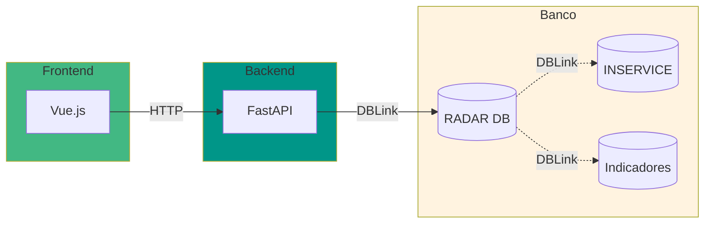
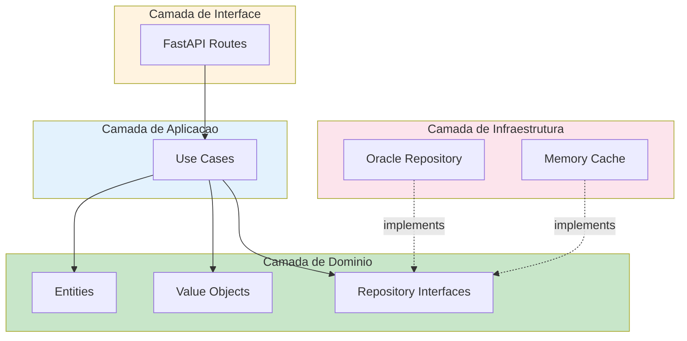

# Projeto RADAR

Monorepo contendo Backend (Python/FastAPI) e Frontend (Vue.js) para integracao com ANEEL da distribuidora de energia eletrica de Roraima.

## Visao Geral



O **RADAR** (Resposta Automatizada de Dados para ANEEL Regulacao) e um sistema que:

- Fornece APIs para **ANEEL** consultar dados de interrupcoes e demandas
- Possui **Dashboard Vue.js** para monitoramento interno
- Atende aos requisitos do **Oficio Circular 14/2025-SFE/ANEEL**
- Integra dados via **DBLinks** com sistemas INSERVICE e Indicadores

## Etapas do Projeto

| Etapa | API | Endpoint | Status | Prazo |
|-------|-----|----------|--------|-------|
| 1 | Interrupcoes Ativas | `/quantitativointerrupcoesativas` | Em desenvolvimento | Prioritario |
| 2 | Dados Demanda | `/dadosdemanda` | Placeholder | Abril/2026 |
| 3 | Demandas Diversas | `/quantitativodemandasdiversas` | Placeholder | Maio/2026 |
| 4 | Tempo Real | A definir | Aguardando ANEEL | 60 dias |

## Tecnologias

### Backend
- **Linguagem**: Python 3.11+
- **Framework**: FastAPI
- **Banco de Dados**: Oracle 19c (via DBLinks)
- **Testes**: Pytest
- **Logging**: Structlog

### Frontend
- **Framework**: Vue.js 3
- **Build**: Vite
- **State**: Pinia
- **Router**: Vue Router

## Estrutura do Monorepo

```
radar/
├── backend/                      # Backend Python/FastAPI
│   ├── shared/                   # Codigo compartilhado
│   │   ├── domain/               # Entidades, Value Objects
│   │   └── infrastructure/       # Database, Cache, Logger
│   ├── apps/                     # Aplicacoes (APIs)
│   │   ├── api_interrupcoes/     # Etapa 1 - Interrupcoes
│   │   ├── api_demanda/          # Etapa 2 - Dados Demanda
│   │   ├── api_demandas_diversas/# Etapa 3 - Demandas Diversas
│   │   └── api_tempo_real/       # Etapa 4 - Tempo Real
│   └── tests/                    # Testes backend
│       ├── unit/
│       ├── integration/
│       └── e2e/
│
├── frontend/                     # Frontend Vue.js
│   ├── src/
│   │   ├── views/
│   │   ├── router/
│   │   └── stores/
│   └── public/
│
├── docs/                         # Documentacao
│   ├── adr/                      # Architecture Decision Records
│   ├── architecture/             # Diagramas
│   └── development/              # Guias de desenvolvimento
│
├── pyproject.toml                # Configuracao Python
└── .env.example                  # Exemplo de variaveis de ambiente
```

## Instalacao

### Backend

```bash
# Criar ambiente virtual
python -m venv .venv
source .venv/bin/activate  # Linux/Mac
# ou
.venv\Scripts\activate     # Windows

# Instalar dependencias
pip install -e ".[dev]"

# Configurar ambiente
cp .env.example .env
# Edite .env com suas configuracoes

# Executar API de Interrupcoes (Etapa 1)
python -m backend.apps.api_interrupcoes.main

# Ou usar o comando
radar-api1
```

### Frontend

```bash
cd frontend

# Instalar dependencias
npm install

# Executar em desenvolvimento
npm run dev

# Build para producao
npm run build
```

## Configuracao

Copie `.env.example` para `.env` e configure:

```env
# Ambiente
ENVIRONMENT=development

# Servidor
HOST=0.0.0.0
PORT=8000

# Banco de Dados Oracle
DB_USER=radar_api
DB_PASSWORD=sua_senha
DB_CONNECTION_STRING=localhost:1521/RADARDB

# Autenticacao
API_KEY=sua_chave_api

# Cache
CACHE_TTL_SECONDS=300

# CORS (Frontend)
CORS_ORIGINS=http://localhost:5173
```

## Comandos

### Backend

```bash
# Desenvolvimento
radar-api1                    # Inicia API de Interrupcoes
radar-api2                    # Inicia API de Demanda
radar-api3                    # Inicia API de Demandas Diversas
radar-api4                    # Inicia API Tempo Real

# Testes
pytest                        # Todos os testes
pytest -m unit                # Apenas unitarios
pytest -m integration         # Apenas integracao
pytest --cov                  # Com cobertura

# Qualidade
ruff check backend/           # Linting
ruff format backend/          # Formatacao
mypy backend/                 # Type checking
```

### Frontend

```bash
cd frontend

npm run dev                   # Desenvolvimento
npm run build                 # Build producao
npm run lint                  # Linting
npm run format                # Formatacao
```

## Exemplo de Resposta API

```json
{
  "idcStatusRequisicao": 1,
  "desStatusRequisicao": "Sucesso",
  "emailIndisponibilidade": "radar@roraimaenergia.com.br",
  "mensagem": "",
  "listaInterrupcoes": [
    {
      "ideConjuntoUnidadeConsumidora": 1,
      "ideMunicipio": 1400100,
      "qtdUCsAtendidas": 125000,
      "qtdOcorrenciaProgramada": 150,
      "qtdOcorrenciaNaoProgramada": 45
    }
  ]
}
```

## Documentacao

| Documento | Descricao |
|-----------|-----------|
| [docs/api/](docs/api/) | Especificacao das APIs |
| [docs/adr/](docs/adr/) | Decisoes de arquitetura |
| [docs/architecture/](docs/architecture/) | Diagramas de arquitetura |
| [docs/development/](docs/development/) | Guias de desenvolvimento |

## Arquitetura

O backend segue **Arquitetura Hexagonal** (Ports and Adapters):



## Seguranca

- Autenticacao via header `x-api-key`
- HTTPS obrigatorio em producao
- Whitelist de IPs (ANEEL)
- CORS configuravel
- Sanitizacao de queries

## Contribuicao

1. Crie uma branch: `git checkout -b feature/nova-funcionalidade`
2. Siga o guia de [desenvolvimento](docs/development/00-index.md)
3. Escreva testes primeiro (TDD)
4. Garanta cobertura >= 80%
5. Crie um Pull Request

## Licenca

Propriedade da Eletrororaima - Uso interno.

## Contato

- **Equipe**: TI - Desenvolvimento
- **Email**: ti.desenvolvimento@eletrororaima.com
