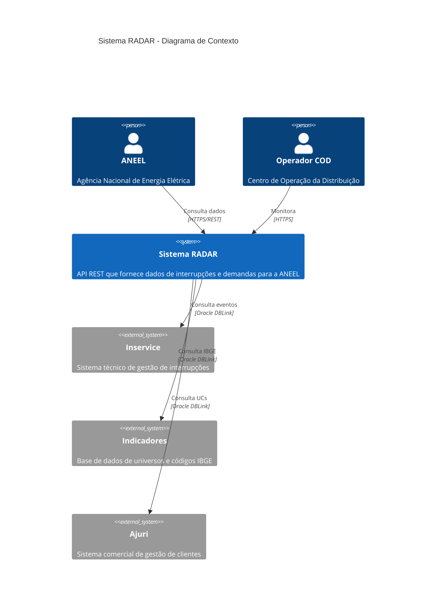
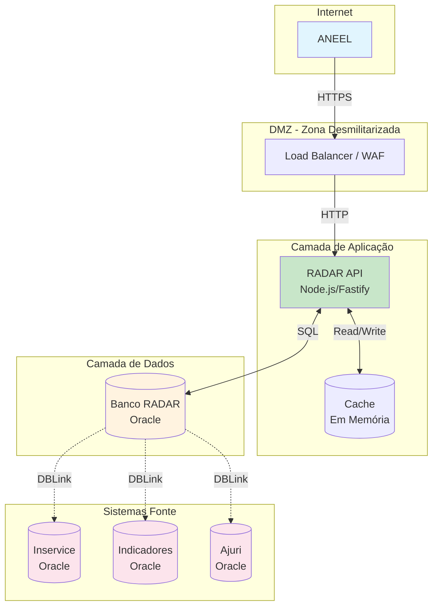
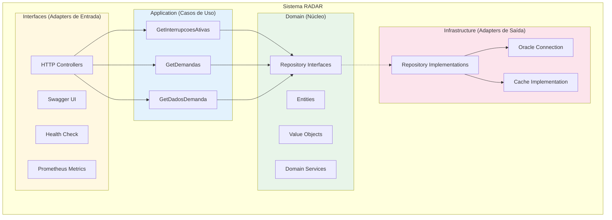
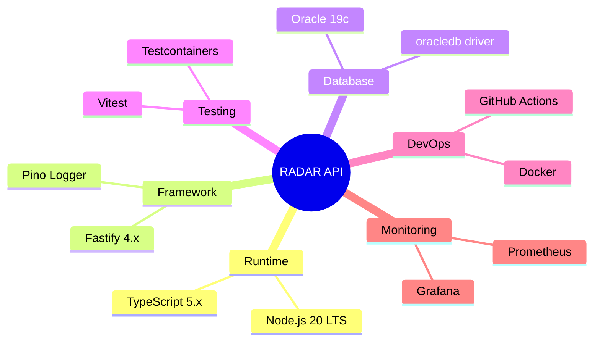
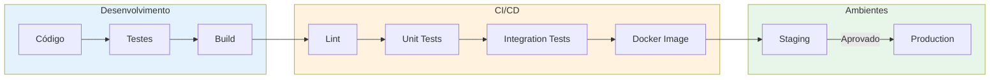

# Visão Geral do Sistema - Projeto RADAR

## Contexto do Sistema (C4 - Nível 1)

## Arquitetura de Alto Nível

## Componentes do Sistema (C4 - Nível 2)

## Stack Tecnológica

## Fluxo de Deploy

## Requisitos Não-Funcionais

| Requisito | Especificação | Justificativa |
|-----------|---------------|---------------|
| **Disponibilidade** | 99.5% (24x7) | Exigência ANEEL |
| **Tempo de Resposta** | < 5 segundos | Exigência ANEEL |
| **Frequência de Consulta** | A cada 30 minutos | Padrão ANEEL |
| **Retenção de Dados** | 36 meses | Exigência ANEEL |
| **Histórico** | 7 dias para recuperação | A partir de Abril/2026 |
