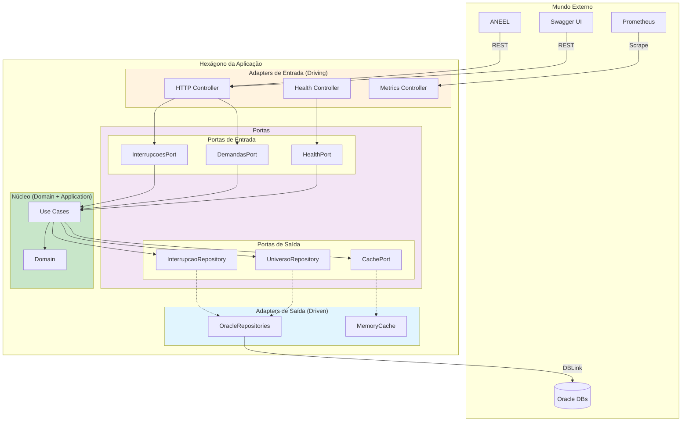
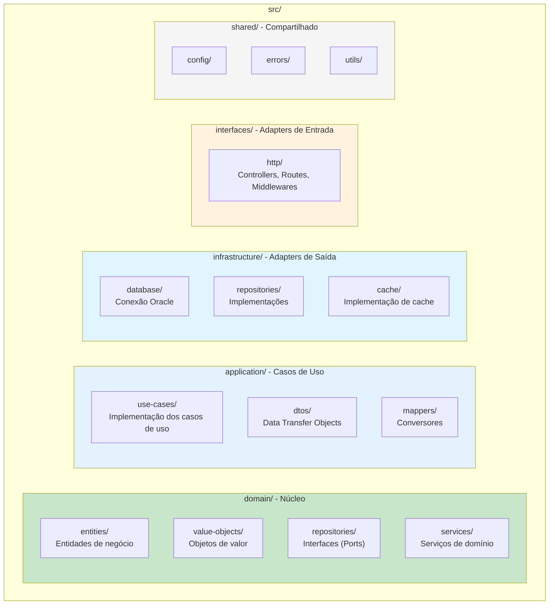
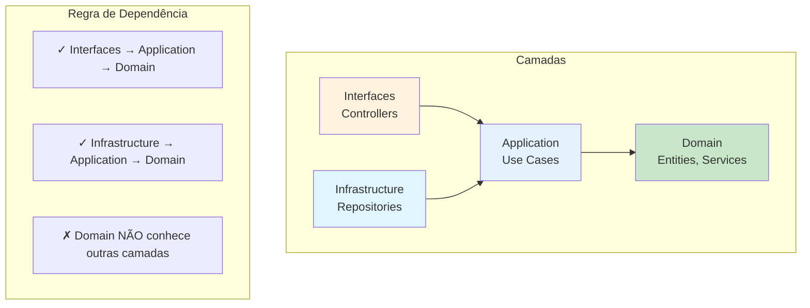
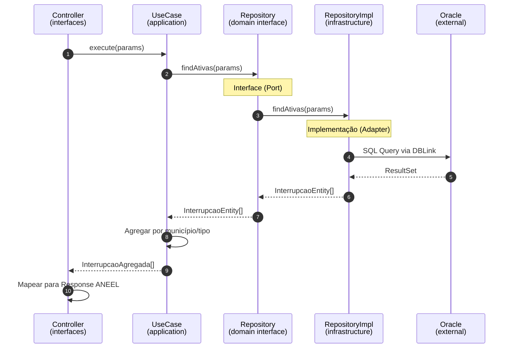
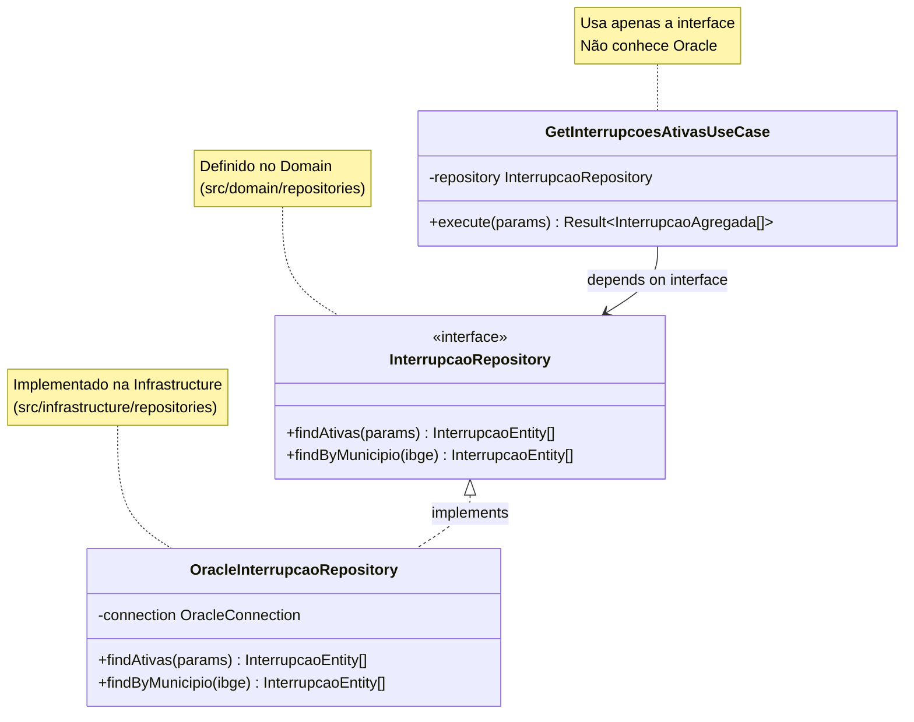

# Arquitetura Hexagonal - Projeto RADAR

## Visão Geral

A arquitetura hexagonal (Ports and Adapters) isola o domínio de negócio das tecnologias externas.

## Estrutura de Diretórios

## Regra de Dependência

## Exemplo: Fluxo GetInterrupcoesAtivas

## Inversão de Dependência

## Benefícios da Arquitetura

| Benefício | Descrição |
|-----------|-----------|
| **Testabilidade** | Domínio testável sem banco de dados |
| **Flexibilidade** | Trocar Oracle por outro DB sem afetar domínio |
| **Manutenibilidade** | Regras de negócio centralizadas |
| **Independência** | Framework HTTP pode ser trocado |
| **Clareza** | Responsabilidades bem definidas |
