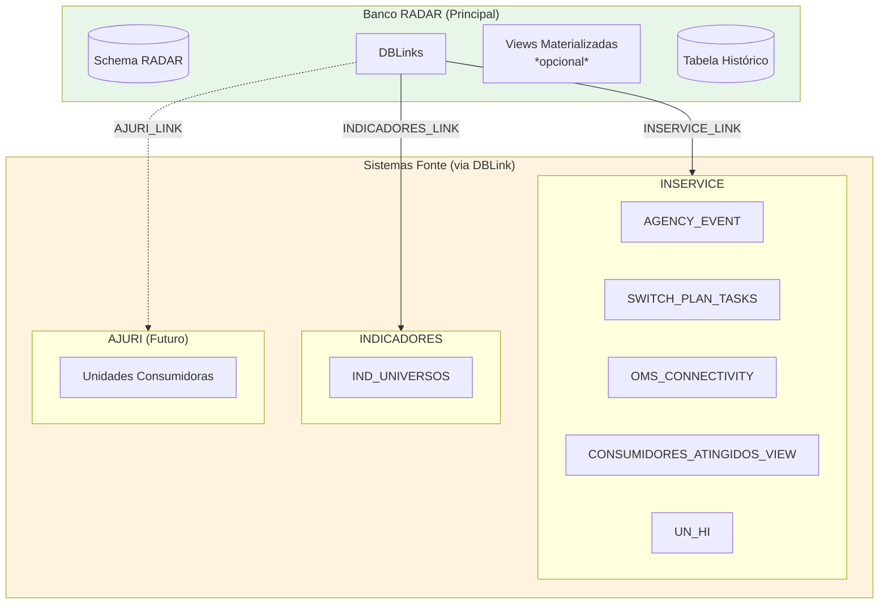
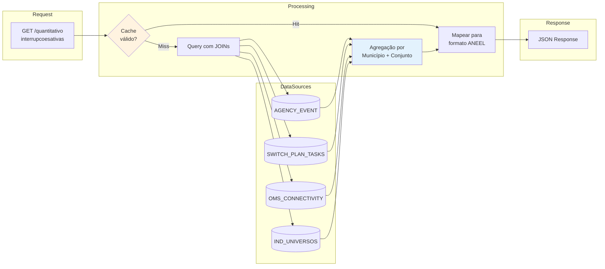
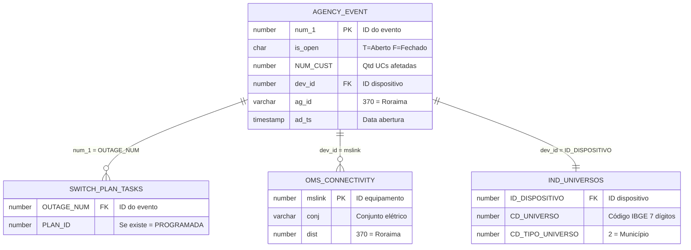
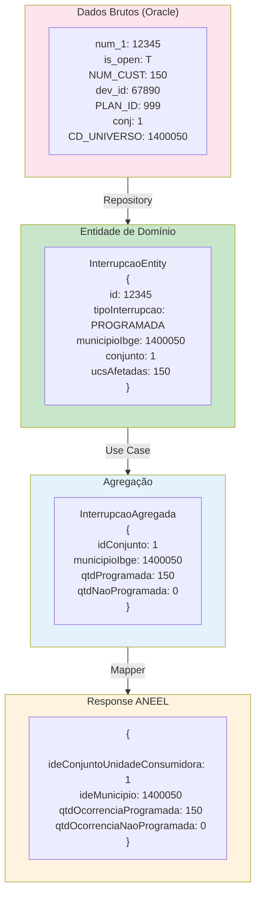
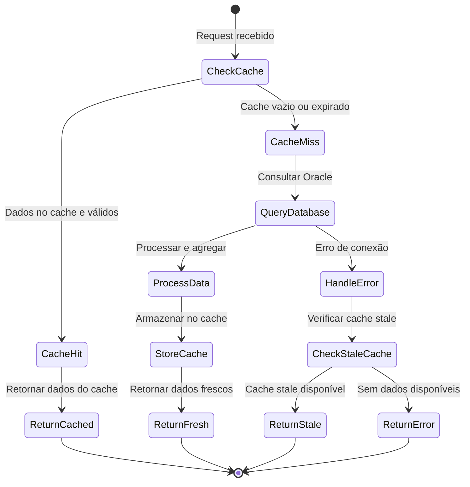

# Fluxo de Dados - Projeto RADAR

## Arquitetura de Dados

## Fluxo da API 1 - Interrupções Ativas

## Query Principal - Interrupções Ativas

## Transformação de Dados

## Cache Flow

## Mapeamento de Campos

| Campo ANEEL | Origem | Tabela | Transformação |
|-------------|--------|--------|---------------|
| `ideConjuntoUnidadeConsumidora` | `conj` | OMS_CONNECTIVITY | Direto |
| `ideMunicipio` | `CD_UNIVERSO` | IND_UNIVERSOS | Direto (7 dígitos) |
| `qtdUCsAtendidas` | - | View futura | Total UCs no conjunto |
| `qtdOcorrenciaProgramada` | `NUM_CUST` onde `PLAN_ID IS NOT NULL` | AGENCY_EVENT + SWITCH_PLAN_TASKS | SUM agrupado |
| `qtdOcorrenciaNaoProgramada` | `NUM_CUST` onde `PLAN_ID IS NULL` | AGENCY_EVENT | SUM agrupado |
