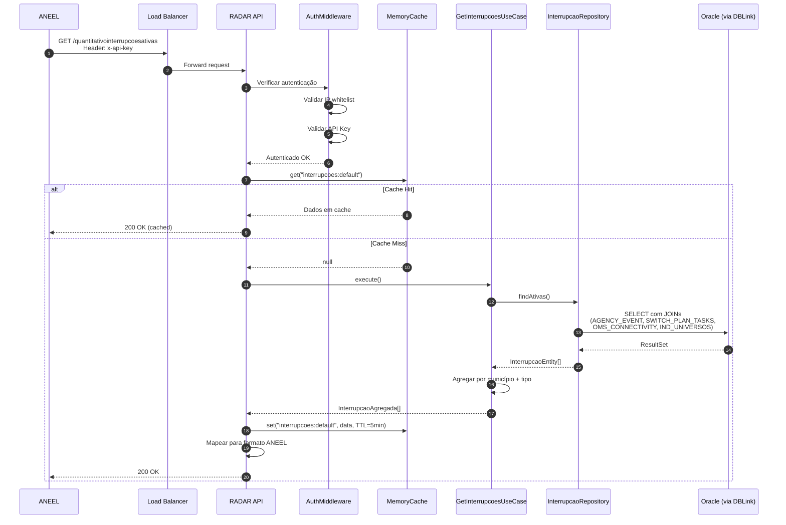
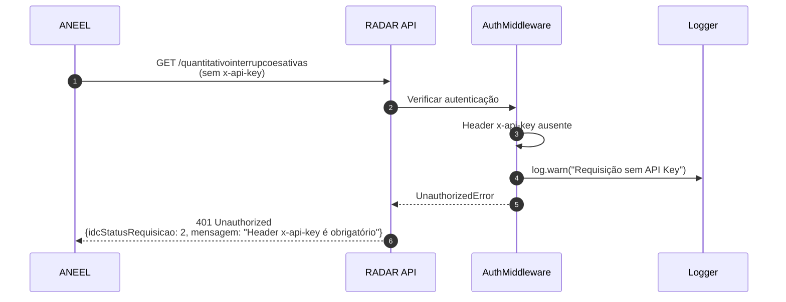
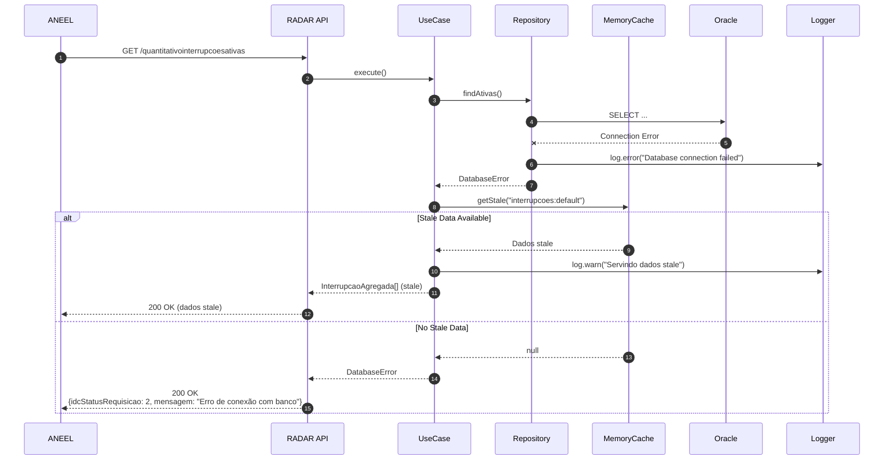
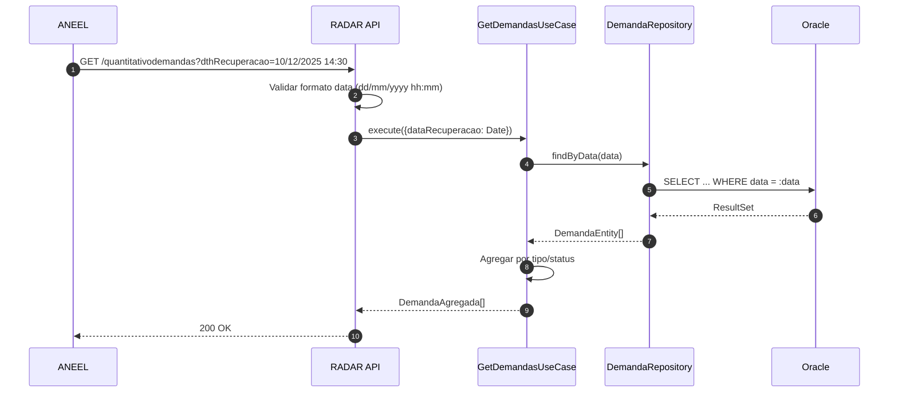
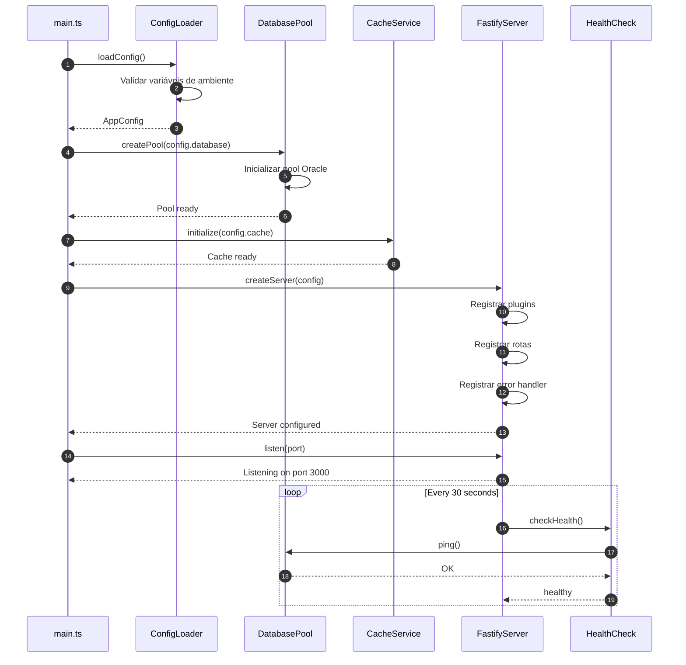
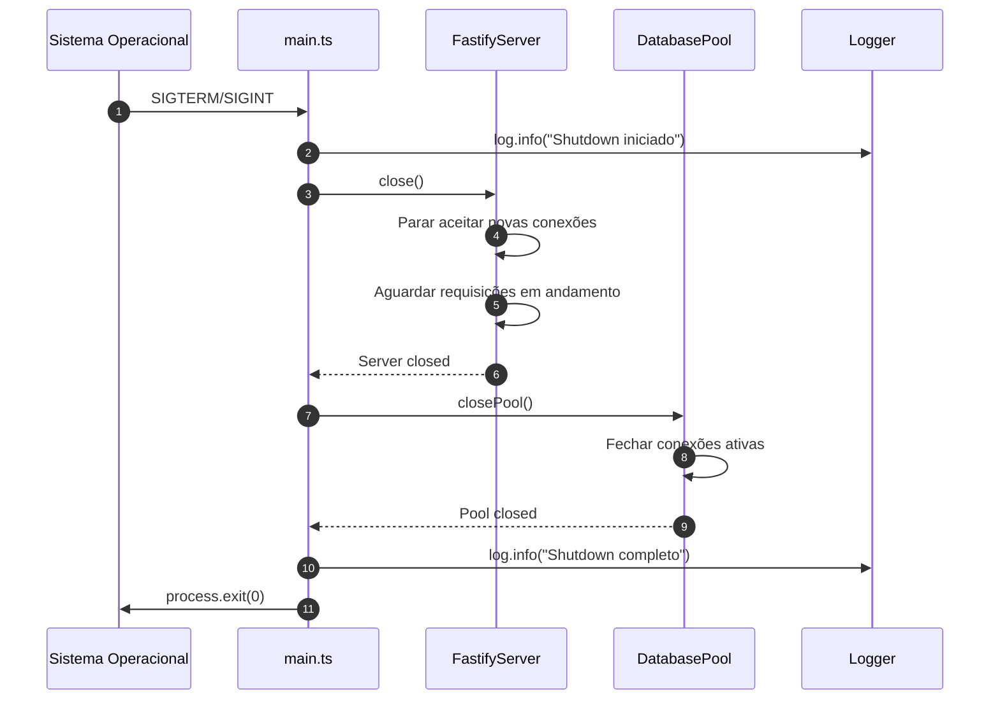
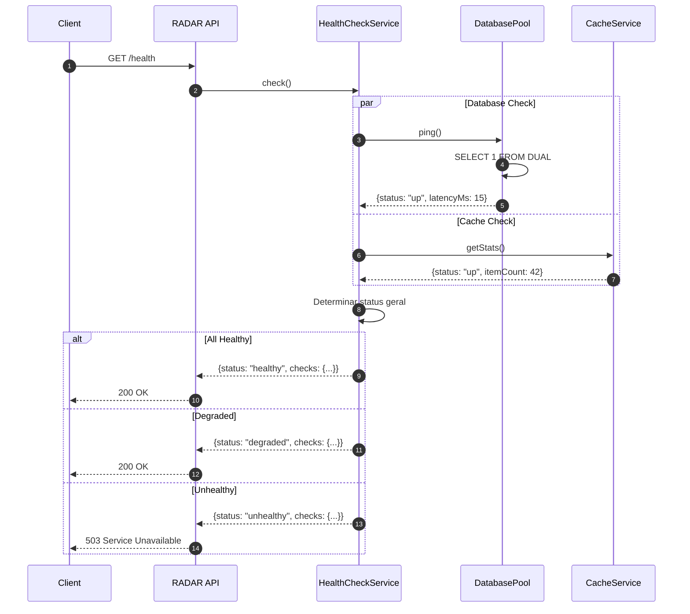

# Diagramas de Sequência - Projeto RADAR

## API 1: GET /quantitativointerrupcoesativas

### Fluxo Principal (Sucesso)

### Fluxo com Erro de Autenticação

### Fluxo com Erro de Banco de Dados

## API 2: GET /quantitativodemandas

## Fluxo de Startup da Aplicação

## Fluxo de Shutdown Graceful

## Health Check Detalhado

