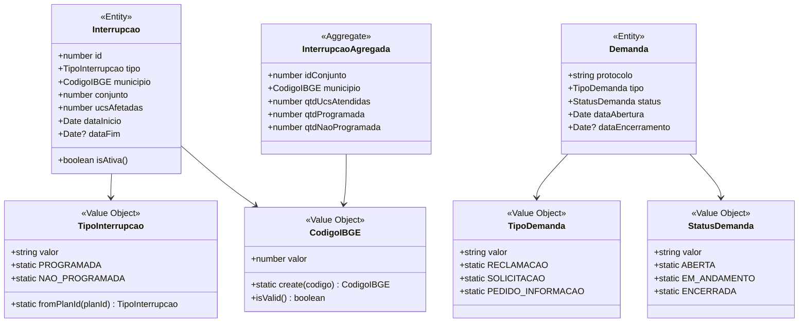
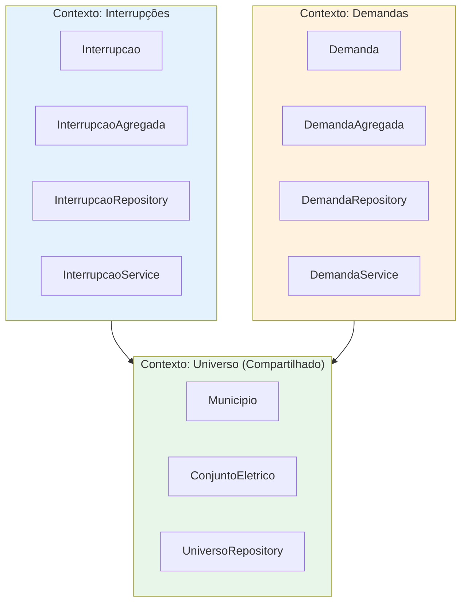
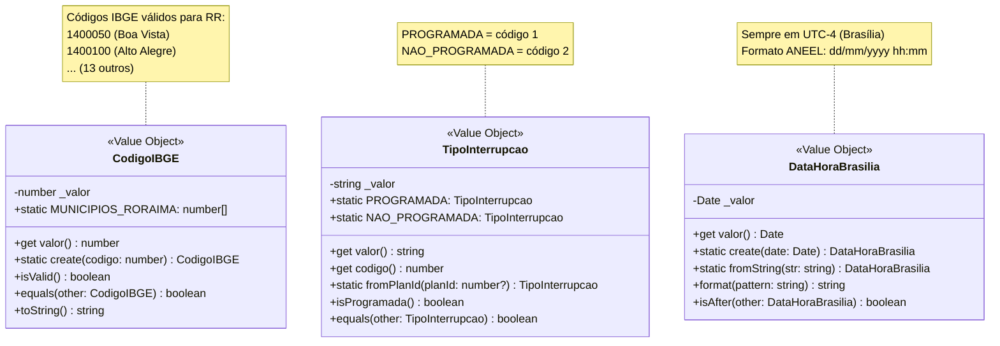
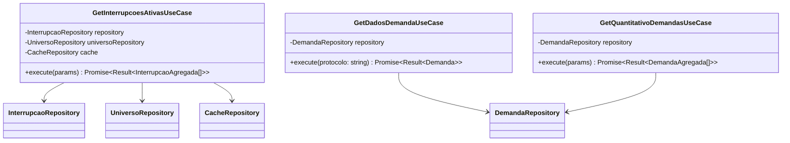
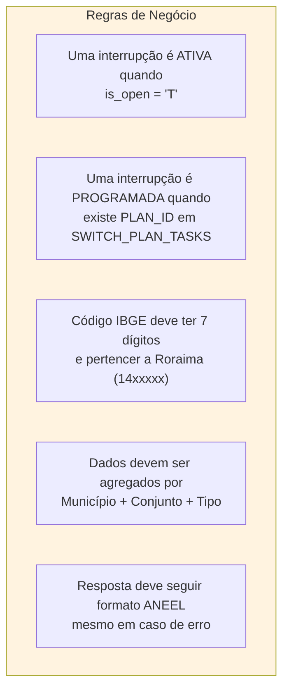

# Modelo de Domínio - Projeto RADAR

## Entidades e Agregados

## Bounded Contexts

## Value Objects Detalhados

## Repository Interfaces (Ports)

```mermaid
classDiagram
    class InterrupcaoRepository {
        <<interface>>
        +findAtivas(params: FindAtivasParams) Promise~Interrupcao[]~
        +findByMunicipio(ibge: CodigoIBGE) Promise~Interrupcao[]~
        +findHistorico(params: HistoricoParams) Promise~Interrupcao[]~
    }

    class UniversoRepository {
        <<interface>>
        +findMunicipioByDispositivo(devId: number) Promise~CodigoIBGE~
        +findConjuntoByDispositivo(devId: number) Promise~number~
        +findAllMunicipios() Promise~Municipio[]~
    }

    class DemandaRepository {
        <<interface>>
        +findByProtocolo(protocolo: string) Promise~Demanda~
        +findAbertas() Promise~Demanda[]~
        +findByPeriodo(inicio: Date, fim: Date) Promise~Demanda[]~
    }

    class CacheRepository {
        <<interface>>
        +get~T~(key: string) Promise~T?~
        +set~T~(key: string, value: T, ttl: number) Promise~void~
        +invalidate(key: string) Promise~void~
        +invalidateAll() Promise~void~
    }
```

## Use Cases

## Regras de Negócio

## Invariantes de Domínio

| Entidade | Invariante | Validação |
|----------|------------|-----------|
| `CodigoIBGE` | Deve ter 7 dígitos | `valor >= 1000000 && valor <= 9999999` |
| `CodigoIBGE` | Deve ser de Roraima | `valor >= 1400000 && valor <= 1499999` |
| `TipoInterrupcao` | Apenas PROGRAMADA ou NAO_PROGRAMADA | Enum restrito |
| `Interrupcao` | Se ativa, dataFim deve ser null | `isAtiva() => dataFim === null` |
| `Interrupcao` | ucsAfetadas >= 0 | `ucsAfetadas >= 0` |
