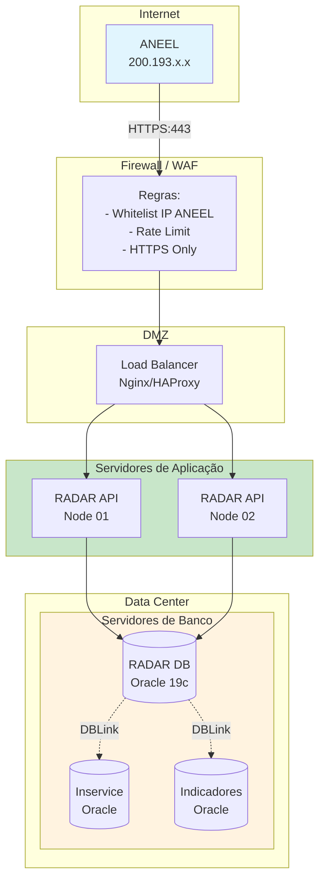
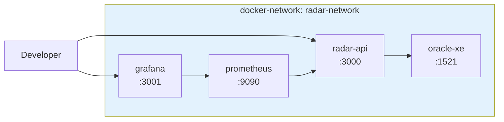
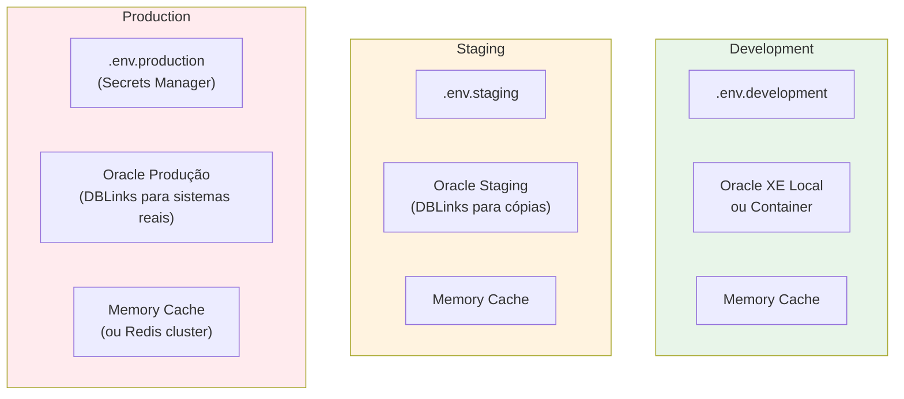
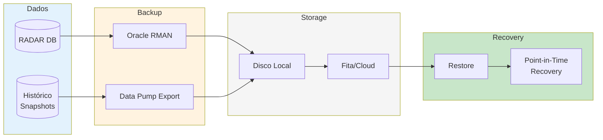

# Infraestrutura - Projeto RADAR

## Topologia de Rede



## Docker Compose (Desenvolvimento)



## CI/CD Pipeline

```mermaid
flowchart LR
    subgraph Trigger
        PUSH[Push to main]
        PR[Pull Request]
    end

    subgraph Build["Build Stage"]
        CHECKOUT[Checkout]
        INSTALL[npm install]
        LINT[ESLint + Prettier]
        BUILD[tsc build]
    end

    subgraph Test["Test Stage"]
        UNIT[Unit Tests]
        INTEG[Integration Tests]
        COV[Coverage Report]
    end

    subgraph Security["Security Stage"]
        AUDIT[npm audit]
        SNYK[Snyk scan]
    end

    subgraph Deploy["Deploy Stage"]
        DOCKER[Build Docker Image]
        PUSH_REG[Push to Registry]
        DEPLOY_STG[Deploy Staging]
        DEPLOY_PROD[Deploy Production]
    end

    PUSH --> CHECKOUT
    PR --> CHECKOUT
    CHECKOUT --> INSTALL
    INSTALL --> LINT
    LINT --> BUILD
    BUILD --> UNIT
    UNIT --> INTEG
    INTEG --> COV
    COV --> AUDIT
    AUDIT --> SNYK
    SNYK --> DOCKER
    DOCKER --> PUSH_REG
    PUSH_REG --> DEPLOY_STG
    DEPLOY_STG -->|Manual Approval| DEPLOY_PROD

    style Build fill:#e3f2fd
    style Test fill:#c8e6c9
    style Security fill:#fff3e0
    style Deploy fill:#fce4ec
```



## Monitoramento

```mermaid
flowchart TB
    subgraph Application
        API[RADAR API]
        METRICS[/metrics]
        HEALTH[/health]
        LOGS[Logs stdout]
    end

    subgraph Collection
        PROM[Prometheus]
        LOKI[Loki]
    end

    subgraph Visualization
        GRAFANA[Grafana]
    end

    subgraph Alerting
        ALERTMANAGER[AlertManager]
        EMAIL[Email]
        SLACK[Slack]
    end

    API --> METRICS
    API --> HEALTH
    API --> LOGS

    PROM -->|Scrape| METRICS
    PROM -->|Scrape| HEALTH
    LOKI -->|Collect| LOGS

    GRAFANA --> PROM
    GRAFANA --> LOKI

    PROM --> ALERTMANAGER
    ALERTMANAGER --> EMAIL
    ALERTMANAGER --> SLACK

    style Application fill:#c8e6c9
    style Collection fill:#e3f2fd
    style Visualization fill:#fff3e0
    style Alerting fill:#fce4ec
```

## Configuração de Ambiente



## Backup e Recuperação



## Requisitos de Infraestrutura

| Componente | Desenvolvimento | Staging | Produção |
|------------|-----------------|---------|----------|
| **CPU** | 2 cores | 4 cores | 8 cores |
| **RAM** | 4 GB | 8 GB | 16 GB |
| **Disco** | 50 GB | 100 GB | 500 GB |
| **Node.js** | 20 LTS | 20 LTS | 20 LTS |
| **Oracle** | XE 21c | 19c | 19c Enterprise |
| **Instâncias** | 1 | 1 | 2+ (HA) |

## SLA e Disponibilidade

| Métrica | Meta | Medição |
|---------|------|---------|
| **Disponibilidade** | 99.5% | Uptime mensal |
| **Tempo de Resposta (p95)** | < 5s | Prometheus histogram |
| **Taxa de Erro** | < 0.1% | Contador de erros / total |
| **MTTR** | < 1 hora | Tempo para restaurar serviço |
| **RPO** | 30 minutos | Snapshots de histórico |
| **RTO** | 4 horas | Tempo para recuperação total |
