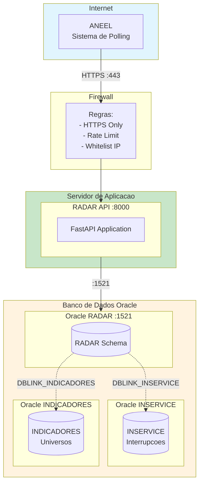
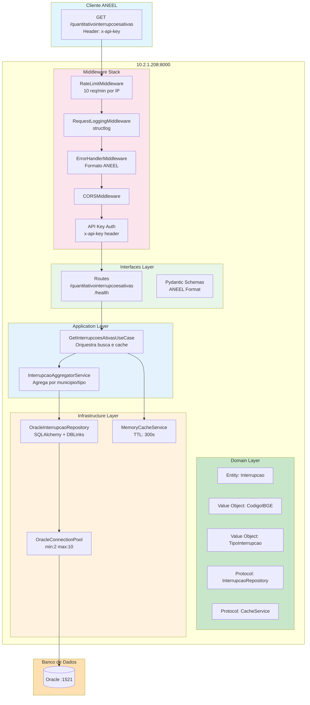
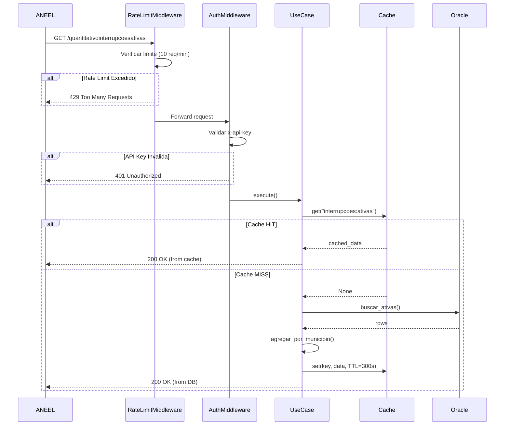
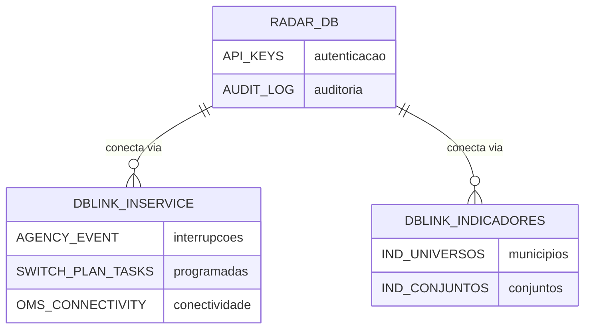
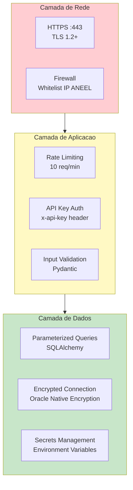

# Diagrama de Componentes - API 1 (Quantitativo de Interrupcoes Ativas)

## Visao Geral da Arquitetura

Este documento descreve a arquitetura de componentes da API 1 do Projeto RADAR, responsavel pelo fornecimento de dados quantitativos de interrupcoes ativas no sistema eletrico de Roraima.

## Diagrama de Infraestrutura



## Mapa de Portas e Conexoes

| Servico | Host | Porta | Protocolo | Descricao |
|---------|------|-------|-----------|-----------|
| **RADAR API** | 10.2.1.208 | 8000 | HTTP/HTTPS | FastAPI Application |
| **Oracle RADAR** | 10.2.1.208 | 1521 | Oracle Net | Banco principal |
| **DBLINK_INSERVICE** | - | 1521 | Oracle Net | Link para sistema OMS |
| **DBLINK_INDICADORES** | - | 1521 | Oracle Net | Link para universos |
| **Memory Cache** | localhost | - | In-Memory | Cache de 5 minutos |

## Diagrama de Componentes da Aplicacao



## Fluxo de Requisicao



## Estrutura de Diretorios

```
backend/
├── apps/
│   └── api_interrupcoes/           # API 1
│       ├── main.py                 # FastAPI app factory
│       ├── routes.py               # Endpoints HTTP
│       ├── schemas.py              # Pydantic models (ANEEL)
│       ├── dependencies.py         # Dependency Injection
│       ├── middleware.py           # Rate Limit, Logging, Error
│       ├── use_cases/
│       │   └── get_interrupcoes_ativas.py
│       └── repositories/
│           └── interrupcao_repository.py
│
├── shared/
│   ├── domain/
│   │   ├── entities/
│   │   │   └── interrupcao.py      # Entity Interrupcao
│   │   ├── value_objects/
│   │   │   ├── codigo_ibge.py      # VO CodigoIBGE (15 municipios RR)
│   │   │   └── tipo_interrupcao.py # Enum PROGRAMADA/NAO_PROGRAMADA
│   │   ├── repositories/
│   │   │   └── interrupcao_repository.py  # Protocol
│   │   ├── cache/
│   │   │   └── cache_service.py    # Protocol
│   │   ├── services/
│   │   │   └── interrupcao_aggregator.py  # Domain Service
│   │   └── result.py               # Result Pattern
│   │
│   └── infrastructure/
│       ├── database/
│       │   ├── oracle_pool.py      # Connection Pool
│       │   └── oracle_connection.py
│       ├── cache/
│       │   └── memory_cache.py     # MemoryCacheService
│       ├── http/
│       │   └── aneel_response.py   # Response Builder
│       ├── config.py               # Pydantic Settings
│       └── logger.py               # structlog
│
└── tests/
    ├── unit/
    ├── integration/
    └── e2e/
        └── api/
            ├── test_interrupcoes.py
            └── test_rate_limiting.py
```

## Configuracao do Servidor (10.2.1.208)

### Variaveis de Ambiente

```bash
# Servidor
RADAR_HOST=0.0.0.0
RADAR_PORT=8000
RADAR_WORKERS=4
RADAR_ENVIRONMENT=production

# Banco de Dados Oracle
RADAR_DB_USER=radar_app
RADAR_DB_PASSWORD=***
RADAR_DB_CONNECTION_STRING=10.2.1.208:1521/RADAR
RADAR_DB_POOL_MIN=2
RADAR_DB_POOL_MAX=10

# Autenticacao
RADAR_API_KEY=***
RADAR_ALLOWED_IPS=*

# Cache
RADAR_CACHE_TTL_SECONDS=300
RADAR_CACHE_STALE_TTL_SECONDS=3600

# Logging
RADAR_LOG_LEVEL=INFO
RADAR_LOG_FORMAT=json

# Email
RADAR_EMAIL_INDISPONIBILIDADE=radar@roraimaenergia.com.br
```

### Endpoints Disponiveis

| Metodo | Endpoint | Porta | Descricao |
|--------|----------|-------|-----------|
| GET | `/` | 8000 | Root info |
| GET | `/health` | 8000 | Health check |
| GET | `/quantitativointerrupcoesativas` | 8000 | API principal ANEEL |
| GET | `/docs` | 8000 | Swagger UI (dev only) |
| GET | `/openapi.json` | 8000 | OpenAPI spec |

## Middleware Stack (ordem de execucao)

```
Request
    │
    ▼
┌────────────────────────────────────────────────────────────┐
│  1. RateLimitMiddleware                                     │
│     - Limite: 10 requisicoes/minuto por IP                 │
│     - Headers: X-RateLimit-Limit, X-RateLimit-Remaining    │
│     - Resposta 429: formato ANEEL                          │
│     - Excluidos: /, /health, /docs, /openapi.json          │
└────────────────────────────────────────────────────────────┘
    │
    ▼
┌────────────────────────────────────────────────────────────┐
│  2. RequestLoggingMiddleware                                │
│     - Log estruturado (structlog)                          │
│     - Request ID, duration, status_code                    │
└────────────────────────────────────────────────────────────┘
    │
    ▼
┌────────────────────────────────────────────────────────────┐
│  3. ErrorHandlerMiddleware                                  │
│     - Captura excecoes nao tratadas                        │
│     - Retorna 500 em formato ANEEL                         │
└────────────────────────────────────────────────────────────┘
    │
    ▼
┌────────────────────────────────────────────────────────────┐
│  4. CORSMiddleware                                          │
│     - Origins: configuravel via RADAR_CORS_ORIGINS         │
│     - Methods: GET, OPTIONS                                │
└────────────────────────────────────────────────────────────┘
    │
    ▼
┌────────────────────────────────────────────────────────────┐
│  5. API Key Authentication (Dependency)                     │
│     - Header: x-api-key                                    │
│     - Validacao contra RADAR_API_KEY                       │
│     - Resposta 401: formato ANEEL                          │
└────────────────────────────────────────────────────────────┘
    │
    ▼
  Route Handler
```

## Diagrama de Banco de Dados



### Query Principal (via DBLinks)

```sql
SELECT
    ae.num_1 AS id_interrupcao,
    ae.NUM_CUST AS ucs_afetadas,
    spt.PLAN_ID AS tipo_programada,
    iu.CD_UNIVERSO AS codigo_ibge,
    ic.ID_CONJUNTO AS id_conjunto
FROM INSERVICE.AGENCY_EVENT@DBLINK_INSERVICE ae
LEFT JOIN INSERVICE.SWITCH_PLAN_TASKS@DBLINK_INSERVICE spt
    ON spt.OUTAGE_NUM = ae.num_1
INNER JOIN INSERVICE.OMS_CONNECTIVITY@DBLINK_INSERVICE oc
    ON oc.mslink = ae.dev_id
INNER JOIN INDICADORES.IND_UNIVERSOS@DBLINK_INDICADORES iu
    ON iu.ID_DISPOSITIVO = ae.dev_id
    AND iu.CD_TIPO_UNIVERSO = 2  -- Municipio
INNER JOIN INDICADORES.IND_CONJUNTOS@DBLINK_INDICADORES ic
    ON ic.ID_DISPOSITIVO = ae.dev_id
WHERE ae.is_open = 'T'
  AND ae.ag_id = 370  -- Roraima Energia
```

## Seguranca



## Metricas e Monitoramento

| Metrica | Tipo | Descricao |
|---------|------|-----------|
| `request_count` | Counter | Total de requisicoes |
| `request_latency` | Histogram | Latencia das requisicoes |
| `cache_hits` | Counter | Hits no cache |
| `cache_misses` | Counter | Misses no cache |
| `db_query_duration` | Histogram | Tempo de queries Oracle |
| `rate_limit_exceeded` | Counter | Requisicoes bloqueadas |
| `active_interrupcoes` | Gauge | Interrupcoes ativas |

## SLA e Performance

| Metrica | Meta | Atual |
|---------|------|-------|
| Disponibilidade | 99.5% | - |
| Latencia P95 | < 2s | - |
| Taxa de Erro | < 0.1% | - |
| Cache Hit Ratio | > 80% | - |
| Rate Limit | 10 req/min | Implementado |

## Comandos de Operacao

```bash
# Iniciar servidor (producao)
cd /app/radar
source venv/bin/activate
uvicorn backend.apps.api_interrupcoes.main:app --host 0.0.0.0 --port 8000 --workers 4

# Health check
curl http://10.2.1.208:8000/health

# Testar endpoint principal
curl -H "x-api-key: $API_KEY" http://10.2.1.208:8000/quantitativointerrupcoesativas

# Ver logs
journalctl -u radar-api -f

# Verificar conexao Oracle
python -c "from backend.shared.infrastructure.database.oracle_pool import oracle_pool; import asyncio; asyncio.run(oracle_pool.health_check())"
```

## Referencias

- [Especificacao API 1 - ANEEL](../api-aneel/API_01_QUANTITATIVO_INTERRUPCOES_ATIVAS.md)
- [Clean Architecture](../development/01-clean-architecture.md)
- [TDD](../development/04-tdd-test-driven-development.md)
- [Infraestrutura](./06-infraestrutura.md)
