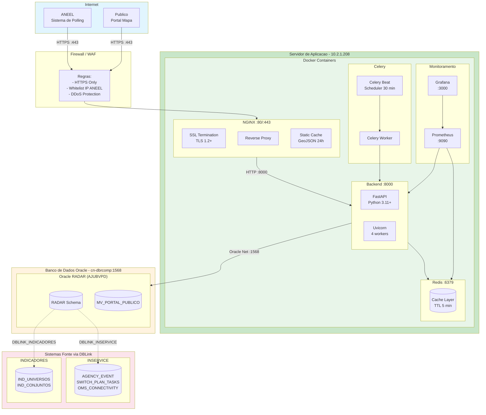
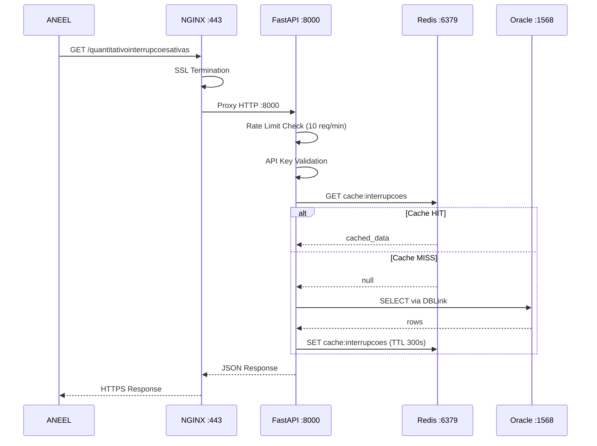

# Diagrama de Componentes - API 1 (Quantitativo de Interrupcoes Ativas)

## Visao Geral da Arquitetura

Este documento descreve a arquitetura de componentes da API 1 do Projeto RADAR, responsavel pelo fornecimento de dados quantitativos de interrupcoes ativas no sistema eletrico de Roraima.

---

## Diagrama de Infraestrutura Completa



---

## Mapa de Portas e Conexoes

### Servidor de Aplicacao (10.2.1.208)

| Container | Porta Interna | Porta Externa | Protocolo | Descricao |
|-----------|---------------|---------------|-----------|-----------|
| **NGINX** | 80 | 80 | HTTP | Redirect para HTTPS |
| **NGINX** | 443 | 443 | HTTPS | SSL Termination |
| **FastAPI** | 8000 | - | HTTP | API Backend (interno) |
| **Redis** | 6379 | - | Redis | Cache (interno) |
| **Prometheus** | 9090 | 9090 | HTTP | Metricas |
| **Grafana** | 3000 | 3000 | HTTP | Dashboards |

### Banco de Dados Oracle

| Servico | Host | Porta | Service Name | Descricao |
|---------|------|-------|--------------|-----------|
| **Oracle RADAR** | cn-dbrcomp | 1568 | AJUBVPD | Banco principal |
| **DBLINK_INSERVICE** | (interno) | 1521 | - | Sistema OMS |
| **DBLINK_INDICADORES** | (interno) | 1521 | - | Universos IBGE |

---

## Diagrama de Rede

```
                                    INTERNET
                                        │
                                        │ HTTPS :443
                                        ▼
┌───────────────────────────────────────────────────────────────────────────┐
│                              FIREWALL / WAF                                │
│                     (Whitelist IP ANEEL, DDoS Protection)                 │
└───────────────────────────────────────────────────────────────────────────┘
                                        │
                                        │
                                        ▼
┌───────────────────────────────────────────────────────────────────────────┐
│                     SERVIDOR 10.2.1.208 (Docker Host)                      │
│  ┌─────────────────────────────────────────────────────────────────────┐  │
│  │                         docker-network: radar                        │  │
│  │                                                                      │  │
│  │   ┌─────────────┐    ┌─────────────┐    ┌─────────────────────┐    │  │
│  │   │   NGINX     │    │   FastAPI   │    │       Redis         │    │  │
│  │   │  :80/:443   │───►│    :8000    │───►│       :6379         │    │  │
│  │   │             │    │             │    │                     │    │  │
│  │   │ - SSL       │    │ - Uvicorn   │    │ - Cache 5min        │    │  │
│  │   │ - Proxy     │    │ - 4 workers │    │ - Stale 1h          │    │  │
│  │   │ - Cache     │    │ - Async     │    │                     │    │  │
│  │   └─────────────┘    └──────┬──────┘    └─────────────────────┘    │  │
│  │                             │                                       │  │
│  │   ┌─────────────┐    ┌──────┴──────┐    ┌─────────────────────┐    │  │
│  │   │ Celery Beat │    │   Celery    │    │    Prometheus       │    │  │
│  │   │ (scheduler) │───►│   Worker    │    │      :9090          │    │  │
│  │   │  30 min     │    │             │    └──────────┬──────────┘    │  │
│  │   └─────────────┘    └─────────────┘               │               │  │
│  │                                          ┌─────────▼─────────┐     │  │
│  │                                          │     Grafana       │     │  │
│  │                                          │      :3000        │     │  │
│  │                                          └───────────────────┘     │  │
│  └──────────────────────────────────────────────────────────────────────┘  │
└───────────────────────────────────────────────────────────────────────────┘
                                        │
                                        │ Oracle Net :1568
                                        ▼
┌───────────────────────────────────────────────────────────────────────────┐
│                     ORACLE DATABASE - cn-dbrcomp:1568                      │
│                            Service: AJUBVPD                                │
│  ┌─────────────────────────────────────────────────────────────────────┐  │
│  │                         RADAR Schema                                 │  │
│  │   - API_KEYS                                                        │  │
│  │   - AUDIT_LOG                                                       │  │
│  │   - MV_PORTAL_PUBLICO (Materialized View)                          │  │
│  └─────────────────────────────────────────────────────────────────────┘  │
│                    │                              │                        │
│         DBLINK_INSERVICE                DBLINK_INDICADORES                │
│                    │                              │                        │
│                    ▼                              ▼                        │
│  ┌──────────────────────────┐    ┌──────────────────────────────────┐    │
│  │       INSERVICE          │    │          INDICADORES              │    │
│  │  - AGENCY_EVENT          │    │  - IND_UNIVERSOS                  │    │
│  │  - SWITCH_PLAN_TASKS     │    │  - IND_CONJUNTOS                  │    │
│  │  - OMS_CONNECTIVITY      │    │  - IND_MUNICIPIOS                 │    │
│  └──────────────────────────┘    └──────────────────────────────────────┘    │
└───────────────────────────────────────────────────────────────────────────┘
```

---

## Docker Compose (Producao)

```yaml
# docker-compose.yml
version: "3.8"

services:
  nginx:
    image: nginx:1.25-alpine
    container_name: radar-nginx
    ports:
      - "80:80"
      - "443:443"
    volumes:
      - ./nginx/nginx.conf:/etc/nginx/conf.d/default.conf:ro
      - ./nginx/ssl:/etc/nginx/ssl:ro
      - ./frontend/dist:/var/www/mapa/dist:ro
      - ./geojson:/var/www/mapa/geojson:ro
      - nginx_cache:/var/cache/nginx
    depends_on:
      - backend
    networks:
      - radar
    restart: unless-stopped

  backend:
    build: ./backend
    container_name: radar-api
    expose:
      - "8000"
    environment:
      - RADAR_HOST=0.0.0.0
      - RADAR_PORT=8000
      - RADAR_WORKERS=4
      - RADAR_DB_CONNECTION_STRING=${ORACLE_DSN}
      - RADAR_CACHE_URL=redis://redis:6379/0
    depends_on:
      - redis
    networks:
      - radar
    restart: unless-stopped

  redis:
    image: redis:7-alpine
    container_name: radar-redis
    expose:
      - "6379"
    volumes:
      - redis_data:/data
    networks:
      - radar
    restart: unless-stopped

  celery-worker:
    build: ./backend
    container_name: radar-celery-worker
    command: celery -A backend.shared.infrastructure.celery worker -l info
    environment:
      - RADAR_DB_CONNECTION_STRING=${ORACLE_DSN}
      - RADAR_CACHE_URL=redis://redis:6379/0
    depends_on:
      - redis
      - backend
    networks:
      - radar
    restart: unless-stopped

  celery-beat:
    build: ./backend
    container_name: radar-celery-beat
    command: celery -A backend.shared.infrastructure.celery beat -l info
    environment:
      - RADAR_CACHE_URL=redis://redis:6379/0
    depends_on:
      - redis
      - celery-worker
    networks:
      - radar
    restart: unless-stopped

  prometheus:
    image: prom/prometheus:v2.45.0
    container_name: radar-prometheus
    ports:
      - "9090:9090"
    volumes:
      - ./monitoring/prometheus.yml:/etc/prometheus/prometheus.yml:ro
      - prometheus_data:/prometheus
    networks:
      - radar
    restart: unless-stopped

  grafana:
    image: grafana/grafana:10.0.0
    container_name: radar-grafana
    ports:
      - "3000:3000"
    volumes:
      - grafana_data:/var/lib/grafana
      - ./monitoring/grafana/dashboards:/etc/grafana/provisioning/dashboards:ro
    networks:
      - radar
    restart: unless-stopped

networks:
  radar:
    driver: bridge

volumes:
  nginx_cache:
  redis_data:
  prometheus_data:
  grafana_data:
```

---

## Configuracao NGINX

```nginx
# /etc/nginx/conf.d/default.conf

upstream api_backend {
    server backend:8000;
    keepalive 32;
}

# Cache config
proxy_cache_path /var/cache/nginx/mapa levels=1:2
    keys_zone=mapa_cache:10m max_size=1g inactive=30m use_temp_path=off;

# HTTP -> HTTPS redirect
server {
    listen 80;
    server_name portal.roraimaenergia.com.br;
    return 301 https://$server_name$request_uri;
}

# HTTPS server
server {
    listen 443 ssl http2;
    server_name portal.roraimaenergia.com.br;

    # SSL
    ssl_certificate /etc/nginx/ssl/portal.crt;
    ssl_certificate_key /etc/nginx/ssl/portal.key;
    ssl_protocols TLSv1.2 TLSv1.3;

    # Security headers
    add_header Strict-Transport-Security "max-age=31536000" always;
    add_header X-Frame-Options "SAMEORIGIN" always;
    add_header X-Content-Type-Options "nosniff" always;

    # Gzip
    gzip on;
    gzip_types text/plain application/json application/javascript text/css;

    # Frontend (Portal Mapa)
    root /var/www/mapa/dist;

    location / {
        try_files $uri $uri/ /index.html;
    }

    # API Backend
    location /api/ {
        proxy_pass http://api_backend;
        proxy_http_version 1.1;
        proxy_set_header Host $host;
        proxy_set_header X-Real-IP $remote_addr;
        proxy_set_header X-Forwarded-For $proxy_add_x_forwarded_for;
        proxy_set_header X-Forwarded-Proto $scheme;

        # Cache para API mapa (30 min)
        location ~ ^/api/mapa/ {
            proxy_pass http://api_backend;
            proxy_cache mapa_cache;
            proxy_cache_valid 200 30m;
            add_header X-Cache-Status $upstream_cache_status;
        }
    }

    # GeoJSON (cache longo)
    location /geojson/ {
        alias /var/www/mapa/geojson/;
        expires 24h;
        add_header Cache-Control "public";
    }

    # Health check
    location /health {
        proxy_pass http://api_backend;
        access_log off;
    }

    # Metrics (interno)
    location /metrics {
        proxy_pass http://api_backend;
        allow 10.0.0.0/8;
        deny all;
    }
}
```

---

## Variaveis de Ambiente (Producao)

```bash
# .env.production

# ========================================
# SERVIDOR - 10.2.1.208
# ========================================
RADAR_HOST=0.0.0.0
RADAR_PORT=8000
RADAR_WORKERS=4
RADAR_ENVIRONMENT=production
RADAR_DEBUG=false

# ========================================
# BANCO DE DADOS ORACLE
# ========================================
RADAR_DB_USER=radar_app
RADAR_DB_PASSWORD=<senha_segura>
RADAR_DB_CONNECTION_STRING=(DESCRIPTION=(ADDRESS=(PROTOCOL=TCP)(HOST=cn-dbrcomp)(PORT=1568))(CONNECT_DATA=(SERVER=DEDICATED)(SERVICE_NAME=AJUBVPD)))
RADAR_DB_POOL_MIN=2
RADAR_DB_POOL_MAX=10
RADAR_DB_POOL_TIMEOUT=60

# ========================================
# CACHE REDIS
# ========================================
RADAR_CACHE_URL=redis://redis:6379/0
RADAR_CACHE_TTL_SECONDS=300
RADAR_CACHE_STALE_TTL_SECONDS=3600

# ========================================
# AUTENTICACAO
# ========================================
RADAR_API_KEY=<api_key_aneel>
RADAR_ALLOWED_IPS=200.193.0.0/16

# ========================================
# CELERY (SCHEDULER)
# ========================================
CELERY_BROKER_URL=redis://redis:6379/1
CELERY_RESULT_BACKEND=redis://redis:6379/2
CELERY_SCHEDULE_INTERVAL=1800  # 30 minutos

# ========================================
# LOGGING
# ========================================
RADAR_LOG_LEVEL=INFO
RADAR_LOG_FORMAT=json

# ========================================
# CORS
# ========================================
RADAR_CORS_ORIGINS=https://portal.roraimaenergia.com.br

# ========================================
# EMAIL
# ========================================
RADAR_EMAIL_INDISPONIBILIDADE=radar@roraimaenergia.com.br
```

---

## Endpoints por Porta

### Porta 443 (HTTPS - Publico)

| Metodo | Endpoint | Autenticacao | Descricao |
|--------|----------|--------------|-----------|
| GET | `/` | Nao | Portal Mapa (Frontend) |
| GET | `/health` | Nao | Health check |
| GET | `/quantitativointerrupcoesativas` | x-api-key | API ANEEL |
| GET | `/api/mapa/interrupcoes` | Nao | Interrupcoes para mapa |
| GET | `/api/mapa/estatisticas` | Nao | Estatisticas |
| GET | `/api/mapa/municipios` | Nao | Lista municipios |
| GET | `/geojson/roraima.json` | Nao | GeoJSON municipios |

### Porta 9090 (Prometheus - Interno)

| Metodo | Endpoint | Descricao |
|--------|----------|-----------|
| GET | `/metrics` | Metricas da aplicacao |
| GET | `/targets` | Status dos targets |

### Porta 3000 (Grafana - Interno)

| Metodo | Endpoint | Descricao |
|--------|----------|-----------|
| GET | `/` | Dashboard principal |
| GET | `/d/radar-api` | Dashboard API |
| GET | `/d/radar-cache` | Dashboard Cache |

---

## Fluxo de Comunicacao



---

## Monitoramento e Alertas

### Prometheus - prometheus.yml

```yaml
global:
  scrape_interval: 15s
  evaluation_interval: 15s

alerting:
  alertmanagers:
    - static_configs:
        - targets: ['alertmanager:9093']

rule_files:
  - '/etc/prometheus/alerts/*.yml'

scrape_configs:
  - job_name: 'radar-api'
    static_configs:
      - targets: ['backend:8000']
    metrics_path: '/metrics'

  - job_name: 'redis'
    static_configs:
      - targets: ['redis:6379']

  - job_name: 'nginx'
    static_configs:
      - targets: ['nginx:80']
```

### Alertas Criticos

| Alerta | Condicao | Severidade |
|--------|----------|------------|
| APIDown | up{job="radar-api"} == 0 por 5min | critical |
| HighLatency | p95 > 5s por 10min | warning |
| CacheDown | redis_up == 0 | critical |
| HighErrorRate | error_rate > 1% por 5min | warning |
| DataStale | last_update > 35min | warning |

---

## Comandos de Operacao

```bash
# Subir ambiente
cd /app/radar
docker-compose up -d

# Ver logs
docker-compose logs -f backend

# Health check
curl https://portal.roraimaenergia.com.br/health

# Testar API ANEEL
curl -H "x-api-key: $API_KEY" \
  https://portal.roraimaenergia.com.br/quantitativointerrupcoesativas

# Verificar cache Redis
docker exec -it radar-redis redis-cli KEYS "*"

# Restart backend
docker-compose restart backend

# Ver metricas
curl http://10.2.1.208:9090/metrics
```

---

## Referencias

- [REN 1.137/2025 - Art. 106-107](https://www.aneel.gov.br)
- [Clean Architecture](../development/01-clean-architecture.md)
- [TDD](../development/04-tdd-test-driven-development.md)
- [Infraestrutura](./06-infraestrutura.md)
- [RAD-228 - Configuracao NGINX](../tasks/mapa-interrupcoes/RAD-228.md)
- [RAD-229 - Monitoramento](../tasks/mapa-interrupcoes/RAD-229.md)
