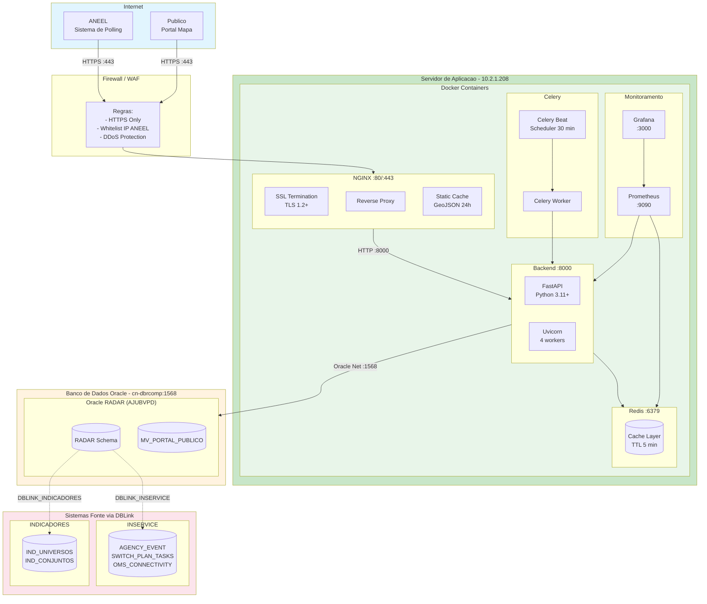
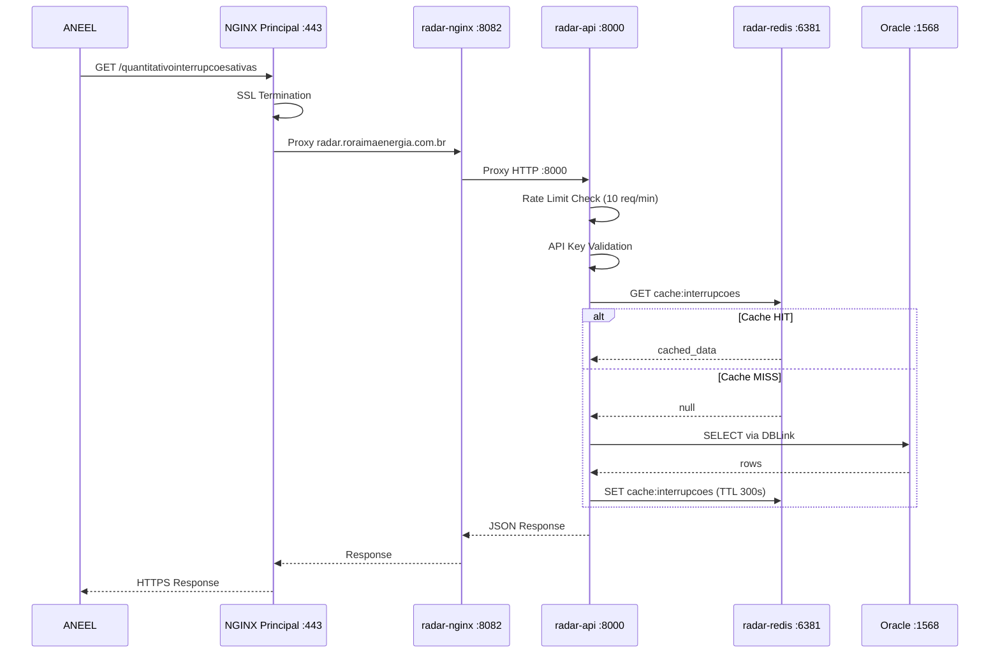

# Diagrama de Componentes - API 1 (Quantitativo de Interrupcoes Ativas)

## Visao Geral da Arquitetura

Este documento descreve a arquitetura de componentes da API 1 do Projeto RADAR, responsavel pelo fornecimento de dados quantitativos de interrupcoes ativas no sistema eletrico de Roraima.

---

## Diagrama de Infraestrutura Completa



---

## Mapa de Portas e Conexoes

### Servidor de Aplicacao (srv-maps-docker / 10.2.1.208)

> **IMPORTANTE**: Este servidor ja hospeda o projeto mjqee-gfuz (PRD/HM).
> As portas abaixo foram escolhidas para evitar conflitos.

#### Ambiente de PRODUCAO (PRD)

| Container | Porta Interna | Porta Externa | Protocolo | Descricao |
|-----------|---------------|---------------|-----------|-----------|
| **radar-nginx-prd** | 80 | 8082 | HTTP | Proxy reverso |
| **radar-api-prd** | 8000 | 8000 | HTTP | FastAPI Backend |
| **radar-redis-prd** | 6379 | 6381 | Redis | Cache |
| **radar-prometheus-prd** | 9090 | 9090 | HTTP | Metricas |
| **radar-grafana-prd** | 3000 | 3000 | HTTP | Dashboards |

#### Ambiente de HOMOLOGACAO (HM)

| Container | Porta Interna | Porta Externa | Protocolo | Descricao |
|-----------|---------------|---------------|-----------|-----------|
| **radar-nginx-hm** | 80 | 8083 | HTTP | Proxy reverso |
| **radar-api-hm** | 8000 | 8001 | HTTP | FastAPI Backend |
| **radar-redis-hm** | 6379 | 6382 | Redis | Cache |
| **radar-prometheus-hm** | 9090 | 9092 | HTTP | Metricas |
| **radar-grafana-hm** | 3000 | 3002 | HTTP | Dashboards |

#### NGINX Principal (80/443) - Virtual Host

O NGINX principal nas portas 80/443 deve rotear para o RADAR:
- `radar.roraimaenergia.com.br` → `localhost:8082` (PRD)
- `radar-hm.roraimaenergia.com.br` → `localhost:8083` (HM)

### Portas em Uso por Outros Projetos (NAO USAR)

| Porta | Projeto | Servico |
|-------|---------|---------|
| 3001 | mjqee-gfuz-hm | Grafana |
| 3034 | mjqee-gfuz-hm | Frontend |
| 6379 | mjqee-gfuz-prd | Redis |
| 6380 | mjqee-gfuz-hm | Redis |
| 8033 | mjqee-gfuz-prd | Backend |
| 8034 | mjqee-gfuz-hm | Backend |
| 8080 | mjqee-gfuz-prd | NGINX |
| 8081 | mjqee-gfuz-hm | NGINX |
| 9091 | mjqee-gfuz-hm | Prometheus |
| 9121 | mjqee-gfuz-hm | Redis Exporter |

### Banco de Dados Oracle

| Servico | Host | Porta | Service Name | Descricao |
|---------|------|-------|--------------|-----------|
| **Oracle RADAR** | cn-dbrcomp | 1568 | AJUBVPD | Banco principal |
| **DBLINK_INSERVICE** | (interno) | 1521 | - | Sistema OMS |
| **DBLINK_INDICADORES** | (interno) | 1521 | - | Universos IBGE |

---

## Diagrama de Rede

```
                                    INTERNET
                                        │
                                        │ HTTPS :443
                                        ▼
┌───────────────────────────────────────────────────────────────────────────┐
│                              FIREWALL / WAF                                │
│                     (Whitelist IP ANEEL, DDoS Protection)                 │
└───────────────────────────────────────────────────────────────────────────┘
                                        │
                                        ▼
┌───────────────────────────────────────────────────────────────────────────┐
│            NGINX PRINCIPAL :80/:443 (Virtual Hosts)                        │
│  radar.roraimaenergia.com.br → :8082   radar-hm.* → :8083                 │
└───────────────────────────────────────────────────────────────────────────┘
                                        │
                                        ▼
┌───────────────────────────────────────────────────────────────────────────┐
│              SERVIDOR srv-maps-docker / 10.2.1.208 (Docker Host)           │
│                                                                            │
│  ┌──────────────────────────────┐  ┌──────────────────────────────┐       │
│  │   RADAR PRD (docker-network) │  │   RADAR HM (docker-network)  │       │
│  │                              │  │                              │       │
│  │  ┌────────────────────────┐  │  │  ┌────────────────────────┐  │       │
│  │  │ radar-nginx-prd :8082  │  │  │  │ radar-nginx-hm  :8083  │  │       │
│  │  └───────────┬────────────┘  │  │  └───────────┬────────────┘  │       │
│  │              │               │  │              │               │       │
│  │  ┌───────────▼────────────┐  │  │  ┌───────────▼────────────┐  │       │
│  │  │ radar-api-prd   :8000  │  │  │  │ radar-api-hm    :8001  │  │       │
│  │  └───────────┬────────────┘  │  │  └───────────┬────────────┘  │       │
│  │              │               │  │              │               │       │
│  │  ┌───────────▼────────────┐  │  │  ┌───────────▼────────────┐  │       │
│  │  │ radar-redis-prd :6381  │  │  │  │ radar-redis-hm  :6382  │  │       │
│  │  └────────────────────────┘  │  │  └────────────────────────┘  │       │
│  │                              │  │                              │       │
│  │  ┌────────────────────────┐  │  │  ┌────────────────────────┐  │       │
│  │  │ radar-prometheus :9090 │  │  │  │ radar-prometheus :9092 │  │       │
│  │  └───────────┬────────────┘  │  │  └───────────┬────────────┘  │       │
│  │  ┌───────────▼────────────┐  │  │  ┌───────────▼────────────┐  │       │
│  │  │ radar-grafana   :3000  │  │  │  │ radar-grafana   :3002  │  │       │
│  │  └────────────────────────┘  │  │  └────────────────────────┘  │       │
│  └──────────────────────────────┘  └──────────────────────────────┘       │
│                                                                            │
│  ┌──────────────────────────────────────────────────────────────────────┐ │
│  │  OUTROS PROJETOS (NAO MODIFICAR)                                      │ │
│  │  mjqee-gfuz-prd: 8080, 8033, 6379                                    │ │
│  │  mjqee-gfuz-hm:  8081, 8034, 6380, 3001, 3034, 9091, 9121           │ │
│  └──────────────────────────────────────────────────────────────────────┘ │
└───────────────────────────────────────────────────────────────────────────┘
                                        │
                                        │ Oracle Net :1568
                                        ▼
┌───────────────────────────────────────────────────────────────────────────┐
│                     ORACLE DATABASE - cn-dbrcomp:1568                      │
│                            Service: AJUBVPD                                │
│  ┌─────────────────────────────────────────────────────────────────────┐  │
│  │                         RADAR Schema                                 │  │
│  │   - API_KEYS                                                        │  │
│  │   - AUDIT_LOG                                                       │  │
│  │   - MV_PORTAL_PUBLICO (Materialized View)                          │  │
│  └─────────────────────────────────────────────────────────────────────┘  │
│                    │                              │                        │
│         DBLINK_INSERVICE                DBLINK_INDICADORES                │
│                    │                              │                        │
│                    ▼                              ▼                        │
│  ┌──────────────────────────┐    ┌──────────────────────────────────┐    │
│  │       INSERVICE          │    │          INDICADORES              │    │
│  │  - AGENCY_EVENT          │    │  - IND_UNIVERSOS                  │    │
│  │  - SWITCH_PLAN_TASKS     │    │  - IND_CONJUNTOS                  │    │
│  │  - OMS_CONNECTIVITY      │    │  - IND_MUNICIPIOS                 │    │
│  └──────────────────────────┘    └──────────────────────────────────────┘    │
└───────────────────────────────────────────────────────────────────────────┘
```

---

## Docker Compose (Producao - PRD)

```yaml
# docker-compose.prd.yml
# Servidor: srv-maps-docker / 10.2.1.208
# IMPORTANTE: Portas escolhidas para evitar conflito com mjqee-gfuz
version: "3.8"

services:
  nginx:
    image: nginx:1.25-alpine
    container_name: radar-nginx-prd
    ports:
      - "8082:80"    # Evita conflito com mjqee (8080, 8081)
    volumes:
      - ./nginx/nginx.conf:/etc/nginx/conf.d/default.conf:ro
      - ./frontend/dist:/var/www/mapa/dist:ro
      - ./geojson:/var/www/mapa/geojson:ro
      - nginx_cache:/var/cache/nginx
    depends_on:
      - backend
    networks:
      - radar-prd
    restart: unless-stopped
    healthcheck:
      test: ["CMD", "curl", "-f", "http://localhost/health"]
      interval: 30s
      timeout: 10s
      retries: 3

  backend:
    build: ./backend
    container_name: radar-api-prd
    ports:
      - "8000:8000"  # LIVRE - FastAPI
    environment:
      - RADAR_HOST=0.0.0.0
      - RADAR_PORT=8000
      - RADAR_WORKERS=4
      - RADAR_ENVIRONMENT=production
      - RADAR_DB_CONNECTION_STRING=${ORACLE_DSN}
      - RADAR_CACHE_URL=redis://redis:6379/0
    depends_on:
      - redis
    networks:
      - radar-prd
    restart: unless-stopped
    healthcheck:
      test: ["CMD", "curl", "-f", "http://localhost:8000/health"]
      interval: 30s
      timeout: 10s
      retries: 3

  redis:
    image: redis:7-alpine
    container_name: radar-redis-prd
    ports:
      - "6381:6379"  # Evita conflito com mjqee (6379, 6380)
    volumes:
      - redis_data:/data
    networks:
      - radar-prd
    restart: unless-stopped
    healthcheck:
      test: ["CMD", "redis-cli", "ping"]
      interval: 30s
      timeout: 10s
      retries: 3

  celery-worker:
    build: ./backend
    container_name: radar-celery-worker-prd
    command: celery -A backend.shared.infrastructure.celery worker -l info
    environment:
      - RADAR_DB_CONNECTION_STRING=${ORACLE_DSN}
      - RADAR_CACHE_URL=redis://redis:6379/0
    depends_on:
      - redis
      - backend
    networks:
      - radar-prd
    restart: unless-stopped

  celery-beat:
    build: ./backend
    container_name: radar-celery-beat-prd
    command: celery -A backend.shared.infrastructure.celery beat -l info
    environment:
      - RADAR_CACHE_URL=redis://redis:6379/0
    depends_on:
      - redis
      - celery-worker
    networks:
      - radar-prd
    restart: unless-stopped

  prometheus:
    image: prom/prometheus:v2.45.0
    container_name: radar-prometheus-prd
    ports:
      - "9090:9090"  # LIVRE
    volumes:
      - ./monitoring/prometheus.yml:/etc/prometheus/prometheus.yml:ro
      - prometheus_data:/prometheus
    networks:
      - radar-prd
    restart: unless-stopped

  grafana:
    image: grafana/grafana:10.0.0
    container_name: radar-grafana-prd
    ports:
      - "3000:3000"  # LIVRE
    volumes:
      - grafana_data:/var/lib/grafana
      - ./monitoring/grafana/dashboards:/etc/grafana/provisioning/dashboards:ro
    networks:
      - radar-prd
    restart: unless-stopped

networks:
  radar-prd:
    driver: bridge
    name: radar-prd

volumes:
  nginx_cache:
  redis_data:
  prometheus_data:
  grafana_data:
```

---

## Docker Compose (Homologacao - HM)

```yaml
# docker-compose.hm.yml
# Servidor: srv-maps-docker / 10.2.1.208
# Ambiente de homologacao com portas alternativas
version: "3.8"

services:
  nginx:
    image: nginx:1.25-alpine
    container_name: radar-nginx-hm
    ports:
      - "8083:80"
    volumes:
      - ./nginx/nginx.conf:/etc/nginx/conf.d/default.conf:ro
      - ./frontend/dist:/var/www/mapa/dist:ro
      - ./geojson:/var/www/mapa/geojson:ro
    depends_on:
      - backend
    networks:
      - radar-hm
    restart: unless-stopped

  backend:
    build: ./backend
    container_name: radar-api-hm
    ports:
      - "8001:8000"
    environment:
      - RADAR_HOST=0.0.0.0
      - RADAR_PORT=8000
      - RADAR_WORKERS=2
      - RADAR_ENVIRONMENT=homologation
      - RADAR_DB_CONNECTION_STRING=${ORACLE_DSN}
      - RADAR_CACHE_URL=redis://redis:6379/0
    depends_on:
      - redis
    networks:
      - radar-hm
    restart: unless-stopped

  redis:
    image: redis:7-alpine
    container_name: radar-redis-hm
    ports:
      - "6382:6379"
    volumes:
      - redis_data_hm:/data
    networks:
      - radar-hm
    restart: unless-stopped

  celery-worker:
    build: ./backend
    container_name: radar-celery-worker-hm
    command: celery -A backend.shared.infrastructure.celery worker -l info
    environment:
      - RADAR_DB_CONNECTION_STRING=${ORACLE_DSN}
      - RADAR_CACHE_URL=redis://redis:6379/0
    depends_on:
      - redis
      - backend
    networks:
      - radar-hm
    restart: unless-stopped

  celery-beat:
    build: ./backend
    container_name: radar-celery-beat-hm
    command: celery -A backend.shared.infrastructure.celery beat -l info
    environment:
      - RADAR_CACHE_URL=redis://redis:6379/0
    depends_on:
      - redis
      - celery-worker
    networks:
      - radar-hm
    restart: unless-stopped

  prometheus:
    image: prom/prometheus:v2.45.0
    container_name: radar-prometheus-hm
    ports:
      - "9092:9090"
    volumes:
      - ./monitoring/prometheus.yml:/etc/prometheus/prometheus.yml:ro
      - prometheus_data_hm:/prometheus
    networks:
      - radar-hm
    restart: unless-stopped

  grafana:
    image: grafana/grafana:10.0.0
    container_name: radar-grafana-hm
    ports:
      - "3002:3000"
    volumes:
      - grafana_data_hm:/var/lib/grafana
      - ./monitoring/grafana/dashboards:/etc/grafana/provisioning/dashboards:ro
    networks:
      - radar-hm
    restart: unless-stopped

networks:
  radar-hm:
    driver: bridge
    name: radar-hm

volumes:
  redis_data_hm:
  prometheus_data_hm:
  grafana_data_hm:
```

---

## Configuracao NGINX

```nginx
# /etc/nginx/conf.d/default.conf

upstream api_backend {
    server backend:8000;
    keepalive 32;
}

# Cache config
proxy_cache_path /var/cache/nginx/mapa levels=1:2
    keys_zone=mapa_cache:10m max_size=1g inactive=30m use_temp_path=off;

# HTTP -> HTTPS redirect
server {
    listen 80;
    server_name portal.roraimaenergia.com.br;
    return 301 https://$server_name$request_uri;
}

# HTTPS server
server {
    listen 443 ssl http2;
    server_name portal.roraimaenergia.com.br;

    # SSL
    ssl_certificate /etc/nginx/ssl/portal.crt;
    ssl_certificate_key /etc/nginx/ssl/portal.key;
    ssl_protocols TLSv1.2 TLSv1.3;

    # Security headers
    add_header Strict-Transport-Security "max-age=31536000" always;
    add_header X-Frame-Options "SAMEORIGIN" always;
    add_header X-Content-Type-Options "nosniff" always;

    # Gzip
    gzip on;
    gzip_types text/plain application/json application/javascript text/css;

    # Frontend (Portal Mapa)
    root /var/www/mapa/dist;

    location / {
        try_files $uri $uri/ /index.html;
    }

    # API Backend
    location /api/ {
        proxy_pass http://api_backend;
        proxy_http_version 1.1;
        proxy_set_header Host $host;
        proxy_set_header X-Real-IP $remote_addr;
        proxy_set_header X-Forwarded-For $proxy_add_x_forwarded_for;
        proxy_set_header X-Forwarded-Proto $scheme;

        # Cache para API mapa (30 min)
        location ~ ^/api/mapa/ {
            proxy_pass http://api_backend;
            proxy_cache mapa_cache;
            proxy_cache_valid 200 30m;
            add_header X-Cache-Status $upstream_cache_status;
        }
    }

    # GeoJSON (cache longo)
    location /geojson/ {
        alias /var/www/mapa/geojson/;
        expires 24h;
        add_header Cache-Control "public";
    }

    # Health check
    location /health {
        proxy_pass http://api_backend;
        access_log off;
    }

    # Metrics (interno)
    location /metrics {
        proxy_pass http://api_backend;
        allow 10.0.0.0/8;
        deny all;
    }
}
```

---

## Variaveis de Ambiente

### Producao (.env.prd)

```bash
# .env.prd
# Servidor: srv-maps-docker / 10.2.1.208

# ========================================
# SERVIDOR
# ========================================
RADAR_HOST=0.0.0.0
RADAR_PORT=8000
RADAR_WORKERS=4
RADAR_ENVIRONMENT=production
RADAR_DEBUG=false

# ========================================
# BANCO DE DADOS ORACLE
# ========================================
RADAR_DB_USER=radar_app
RADAR_DB_PASSWORD=<senha_segura>
RADAR_DB_CONNECTION_STRING=(DESCRIPTION=(ADDRESS=(PROTOCOL=TCP)(HOST=cn-dbrcomp)(PORT=1568))(CONNECT_DATA=(SERVER=DEDICATED)(SERVICE_NAME=AJUBVPD)))
RADAR_DB_POOL_MIN=2
RADAR_DB_POOL_MAX=10
RADAR_DB_POOL_TIMEOUT=60

# ========================================
# CACHE REDIS (porta 6381 - PRD)
# ========================================
RADAR_CACHE_URL=redis://radar-redis-prd:6379/0
RADAR_CACHE_TTL_SECONDS=300
RADAR_CACHE_STALE_TTL_SECONDS=3600

# ========================================
# AUTENTICACAO
# ========================================
RADAR_API_KEY=<api_key_aneel>
RADAR_ALLOWED_IPS=200.193.0.0/16

# ========================================
# CELERY (SCHEDULER)
# ========================================
CELERY_BROKER_URL=redis://radar-redis-prd:6379/1
CELERY_RESULT_BACKEND=redis://radar-redis-prd:6379/2
CELERY_SCHEDULE_INTERVAL=1800

# ========================================
# LOGGING
# ========================================
RADAR_LOG_LEVEL=INFO
RADAR_LOG_FORMAT=json

# ========================================
# CORS
# ========================================
RADAR_CORS_ORIGINS=https://radar.roraimaenergia.com.br

# ========================================
# EMAIL
# ========================================
RADAR_EMAIL_INDISPONIBILIDADE=radar@roraimaenergia.com.br
```

### Homologacao (.env.hm)

```bash
# .env.hm
# Servidor: srv-maps-docker / 10.2.1.208

# ========================================
# SERVIDOR
# ========================================
RADAR_HOST=0.0.0.0
RADAR_PORT=8000
RADAR_WORKERS=2
RADAR_ENVIRONMENT=homologation
RADAR_DEBUG=true

# ========================================
# BANCO DE DADOS ORACLE
# ========================================
RADAR_DB_USER=radar_app
RADAR_DB_PASSWORD=<senha_segura>
RADAR_DB_CONNECTION_STRING=(DESCRIPTION=(ADDRESS=(PROTOCOL=TCP)(HOST=cn-dbrcomp)(PORT=1568))(CONNECT_DATA=(SERVER=DEDICATED)(SERVICE_NAME=AJUBVPD)))
RADAR_DB_POOL_MIN=1
RADAR_DB_POOL_MAX=5
RADAR_DB_POOL_TIMEOUT=60

# ========================================
# CACHE REDIS (porta 6382 - HM)
# ========================================
RADAR_CACHE_URL=redis://radar-redis-hm:6379/0
RADAR_CACHE_TTL_SECONDS=60
RADAR_CACHE_STALE_TTL_SECONDS=300

# ========================================
# AUTENTICACAO
# ========================================
RADAR_API_KEY=<api_key_hm>
RADAR_ALLOWED_IPS=10.0.0.0/8

# ========================================
# CELERY (SCHEDULER)
# ========================================
CELERY_BROKER_URL=redis://radar-redis-hm:6379/1
CELERY_RESULT_BACKEND=redis://radar-redis-hm:6379/2
CELERY_SCHEDULE_INTERVAL=300

# ========================================
# LOGGING
# ========================================
RADAR_LOG_LEVEL=DEBUG
RADAR_LOG_FORMAT=text

# ========================================
# CORS
# ========================================
RADAR_CORS_ORIGINS=https://radar-hm.roraimaenergia.com.br,http://localhost:3000

# ========================================
# EMAIL
# ========================================
RADAR_EMAIL_INDISPONIBILIDADE=radar@roraimaenergia.com.br
```

---

## Endpoints por Porta

### PRODUCAO (PRD)

#### Porta 8082 (NGINX PRD) / 8000 (API direta)

| Metodo | Endpoint | Autenticacao | Descricao |
|--------|----------|--------------|-----------|
| GET | `/` | Nao | Portal Mapa (Frontend) |
| GET | `/health` | Nao | Health check |
| GET | `/quantitativointerrupcoesativas` | x-api-key | API ANEEL |
| GET | `/api/mapa/interrupcoes` | Nao | Interrupcoes para mapa |
| GET | `/api/mapa/estatisticas` | Nao | Estatisticas |
| GET | `/api/mapa/municipios` | Nao | Lista municipios |
| GET | `/geojson/roraima.json` | Nao | GeoJSON municipios |

#### Porta 9090 (Prometheus PRD)

| Metodo | Endpoint | Descricao |
|--------|----------|-----------|
| GET | `/metrics` | Metricas da aplicacao |
| GET | `/targets` | Status dos targets |

#### Porta 3000 (Grafana PRD)

| Metodo | Endpoint | Descricao |
|--------|----------|-----------|
| GET | `/` | Dashboard principal |
| GET | `/d/radar-api` | Dashboard API |
| GET | `/d/radar-cache` | Dashboard Cache |

### HOMOLOGACAO (HM)

#### Porta 8083 (NGINX HM) / 8001 (API direta)

| Metodo | Endpoint | Autenticacao | Descricao |
|--------|----------|--------------|-----------|
| GET | `/` | Nao | Portal Mapa (Frontend) |
| GET | `/health` | Nao | Health check |
| GET | `/docs` | Nao | Swagger UI (apenas HM) |
| GET | `/quantitativointerrupcoesativas` | x-api-key | API ANEEL |
| GET | `/api/mapa/interrupcoes` | Nao | Interrupcoes para mapa |

#### Porta 9092 (Prometheus HM) / 3002 (Grafana HM)

Mesmos endpoints do PRD.

---

## Fluxo de Comunicacao



---

## Monitoramento e Alertas

### Prometheus - prometheus.yml

```yaml
global:
  scrape_interval: 15s
  evaluation_interval: 15s

alerting:
  alertmanagers:
    - static_configs:
        - targets: ['alertmanager:9093']

rule_files:
  - '/etc/prometheus/alerts/*.yml'

scrape_configs:
  - job_name: 'radar-api'
    static_configs:
      - targets: ['backend:8000']
    metrics_path: '/metrics'

  - job_name: 'redis'
    static_configs:
      - targets: ['redis:6379']

  - job_name: 'nginx'
    static_configs:
      - targets: ['nginx:80']
```

### Alertas Criticos

| Alerta | Condicao | Severidade |
|--------|----------|------------|
| APIDown | up{job="radar-api"} == 0 por 5min | critical |
| HighLatency | p95 > 5s por 10min | warning |
| CacheDown | redis_up == 0 | critical |
| HighErrorRate | error_rate > 1% por 5min | warning |
| DataStale | last_update > 35min | warning |

---

## Comandos de Operacao

### PRODUCAO (PRD)

```bash
# Subir ambiente PRD
cd /app/radar
docker-compose -f docker-compose.prd.yml --env-file .env.prd up -d

# Ver logs
docker-compose -f docker-compose.prd.yml logs -f radar-api-prd

# Health check (via NGINX)
curl http://10.2.1.208:8082/health

# Health check (direto na API)
curl http://10.2.1.208:8000/health

# Testar API ANEEL
curl -H "x-api-key: $API_KEY" \
  http://10.2.1.208:8000/quantitativointerrupcoesativas

# Verificar cache Redis (porta 6381)
docker exec -it radar-redis-prd redis-cli KEYS "*"

# Restart backend
docker-compose -f docker-compose.prd.yml restart radar-api-prd

# Ver metricas
curl http://10.2.1.208:9090/metrics

# Listar todos containers RADAR
docker ps --filter "name=radar" --format "table {{.Names}}\t{{.Ports}}\t{{.Status}}"
```

### HOMOLOGACAO (HM)

```bash
# Subir ambiente HM
cd /app/radar
docker-compose -f docker-compose.hm.yml --env-file .env.hm up -d

# Health check
curl http://10.2.1.208:8083/health
curl http://10.2.1.208:8001/health

# Swagger UI (apenas HM)
# Acessar: http://10.2.1.208:8001/docs

# Verificar cache Redis (porta 6382)
docker exec -it radar-redis-hm redis-cli KEYS "*"

# Ver metricas
curl http://10.2.1.208:9092/metrics

# Grafana HM
# Acessar: http://10.2.1.208:3002
```

### Verificar Conflitos de Porta

```bash
# Ver todas as portas em uso
ss -tlnp | grep LISTEN | sort -t: -k2 -n

# Verificar portas do RADAR
for p in 8000 8001 8082 8083 6381 6382 9090 9092 3000 3002; do
  echo -n "Porta $p: "
  ss -tlnp | grep ":$p " && echo "EM USO" || echo "LIVRE"
done
```

---

## Referencias

- [REN 1.137/2025 - Art. 106-107](https://www.aneel.gov.br)
- [Clean Architecture](../development/01-clean-architecture.md)
- [TDD](../development/04-tdd-test-driven-development.md)
- [Infraestrutura](./06-infraestrutura.md)
- [RAD-228 - Configuracao NGINX](../tasks/mapa-interrupcoes/RAD-228.md)
- [RAD-229 - Monitoramento](../tasks/mapa-interrupcoes/RAD-229.md)
