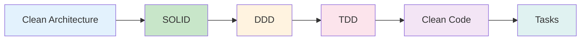

# Guia de Desenvolvimento - Projeto RADAR

Este diretorio contem a documentacao de boas praticas e padroes de desenvolvimento para o Projeto RADAR.

## Indice

| Documento | Descricao |
|-----------|-----------|
| [01-clean-architecture.md](./01-clean-architecture.md) | Arquitetura Limpa - camadas e dependencias |
| [02-solid-principles.md](./02-solid-principles.md) | Principios SOLID com exemplos praticos |
| [03-domain-driven-design.md](./03-domain-driven-design.md) | DDD - Entidades, Value Objects, Aggregates |
| [04-tdd-test-driven-development.md](./04-tdd-test-driven-development.md) | TDD - Red-Green-Refactor e exemplos de testes |
| [05-clean-code.md](./05-clean-code.md) | Clean Code - boas praticas de codigo |
| [tasks.json](./tasks.json) | Tarefas de desenvolvimento com checklists |

## Fluxo de Leitura Recomendado



## Quick Start

### 1. Entenda a Arquitetura

Leia [01-clean-architecture.md](./01-clean-architecture.md) para entender como o codigo esta organizado em camadas:

```
src/
├── domain/        # Regras de negocio (mais estavel)
├── application/   # Casos de uso
├── infrastructure/ # Implementacoes concretas
└── interfaces/    # Adaptadores HTTP
```

### 2. Aplique os Principios

Consulte [02-solid-principles.md](./02-solid-principles.md) ao escrever novas classes:

- **S**ingle Responsibility - Uma classe, uma responsabilidade
- **O**pen/Closed - Aberto para extensao, fechado para modificacao
- **L**iskov Substitution - Subtipos substituiveis
- **I**nterface Segregation - Interfaces pequenas e focadas
- **D**ependency Inversion - Dependa de abstracoes

### 3. Modele o Dominio

Use [03-domain-driven-design.md](./03-domain-driven-design.md) para modelar entidades:

- **Entities**: Objetos com identidade (Interrupcao, Demanda)
- **Value Objects**: Objetos imutaveis por valor (CodigoIBGE, TipoInterrupcao)
- **Aggregates**: Grupos de entidades (InterrupcaoAgregada)

### 4. Desenvolva com TDD

Siga [04-tdd-test-driven-development.md](./04-tdd-test-driven-development.md):

1. **RED** - Escreva um teste que falha
2. **GREEN** - Implemente o minimo para passar
3. **REFACTOR** - Melhore mantendo testes verdes

### 5. Mantenha o Codigo Limpo

Consulte [05-clean-code.md](./05-clean-code.md) durante code reviews:

- Nomes significativos
- Funcoes pequenas
- Comentarios minimos
- Formatacao consistente

### 6. Execute as Tarefas

Abra [tasks.json](./tasks.json) para ver o backlog completo com checklists TDD.

## Comandos Uteis

```bash
# Ambiente Virtual
python -m venv .venv
source .venv/bin/activate  # Linux/Mac
.venv\Scripts\activate     # Windows

# Instalacao
pip install -e ".[dev]"

# Desenvolvimento
radar-api1           # Inicia API de Interrupcoes
radar-api2           # Inicia API de Demanda
radar-api3           # Inicia API de Demandas Diversas
radar-api4           # Inicia API Tempo Real

# Testes
pytest               # Executa todos os testes
pytest -m unit       # Apenas testes unitarios
pytest -m integration # Apenas testes de integracao
pytest --cov         # Com relatorio de cobertura

# Qualidade
ruff check backend/  # Verifica codigo
ruff format backend/ # Formata codigo
mypy backend/        # Verificacao de tipos
```

## Padroes de Commit

```
tipo(escopo): descricao curta

Tipos:
- feat: Nova funcionalidade
- fix: Correcao de bug
- docs: Documentacao
- style: Formatacao
- refactor: Refatoracao
- test: Testes
- chore: Manutencao

Exemplos:
feat(api): adicionar endpoint de interrupcoes ativas
fix(cache): corrigir TTL do cache de interrupcoes
test(domain): adicionar testes para CodigoIBGE
```

## Estrutura de Branch

```
main           # Producao
├── develop    # Integracao
│   ├── feature/api1-interrupcoes
│   ├── feature/api2-demandas
│   └── fix/cache-timeout
```

## Checklist de Code Review

- [ ] Codigo segue Clean Architecture
- [ ] Principios SOLID aplicados
- [ ] Entidades e Value Objects corretos
- [ ] Testes escritos primeiro (TDD)
- [ ] Cobertura >= 80%
- [ ] Codigo limpo e legivel
- [ ] Sem warnings de lint
- [ ] Documentacao atualizada
