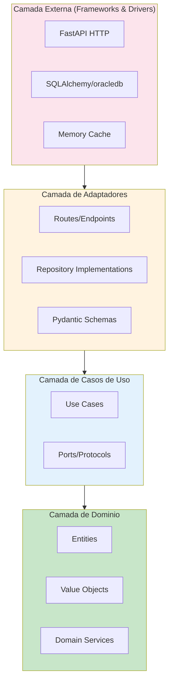
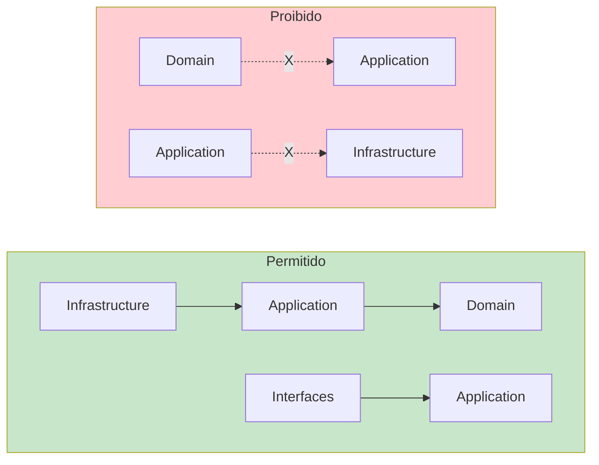
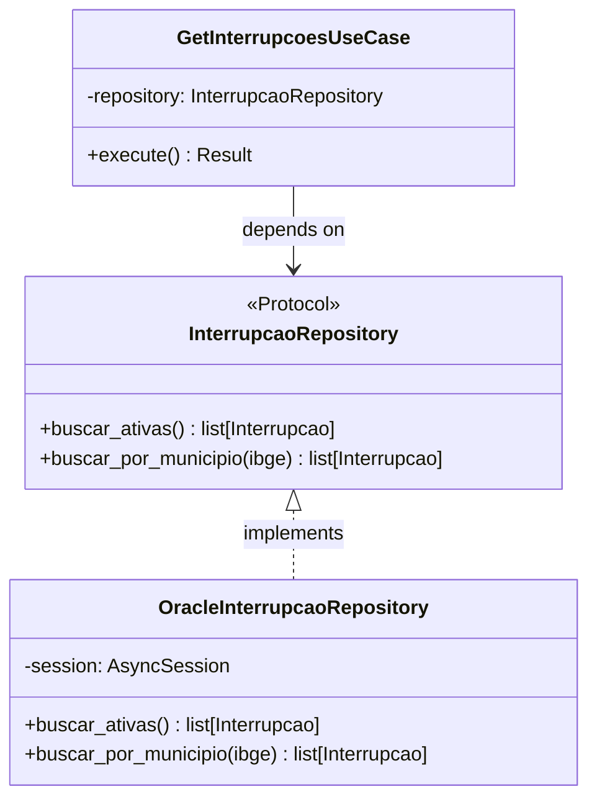

# Clean Architecture - Projeto RADAR

## Visao Geral

A Clean Architecture (Arquitetura Limpa) organiza o codigo em camadas concentricas, onde as dependencias apontam sempre para dentro - do mais externo (frameworks, drivers) para o mais interno (regras de negocio).



## Estrutura do Projeto RADAR

```
backend/
├── shared/                        # Codigo compartilhado
│   ├── domain/                    # Camada de Dominio (mais interna)
│   │   ├── entities/
│   │   │   └── interrupcao.py     # Entidade Interrupcao
│   │   ├── value_objects/
│   │   │   ├── codigo_ibge.py     # VO CodigoIBGE
│   │   │   └── tipo_interrupcao.py # Enum TipoInterrupcao
│   │   ├── errors.py              # Erros de dominio
│   │   └── result.py              # Padrao Result[T, E]
│   │
│   └── infrastructure/            # Camada de Infraestrutura
│       ├── database/
│       │   └── oracle_connection.py
│       ├── cache/
│       │   └── memory_cache.py
│       ├── http/
│       │   └── aneel_response.py
│       ├── config.py              # Settings com Pydantic
│       └── logger.py              # Structlog
│
└── apps/                          # APIs (Interfaces)
    └── api_interrupcoes/
        ├── main.py                # FastAPI app factory
        ├── routes.py              # Endpoints HTTP
        ├── schemas.py             # Pydantic models
        ├── dependencies.py        # Injecao de dependencias
        ├── middleware.py          # Error handler, logging
        ├── use_cases/
        │   └── get_interrupcoes_ativas.py
        └── repositories/
            └── interrupcao_repository.py
```

## Regra de Dependencia

A regra fundamental da Clean Architecture e que **dependencias so podem apontar para dentro**:



### Exemplo Pratico no RADAR

```python
# shared/domain/entities/interrupcao.py
# A entidade esta no dominio - nao conhece Oracle ou FastAPI
from dataclasses import dataclass
from datetime import datetime
from ..value_objects.codigo_ibge import CodigoIBGE
from ..value_objects.tipo_interrupcao import TipoInterrupcao


@dataclass(frozen=True)
class Interrupcao:
    """Entidade que representa uma interrupcao de fornecimento."""

    id: int
    codigo_ibge: CodigoIBGE
    tipo: TipoInterrupcao
    data_inicio: datetime
    consumidores_afetados: int

    def is_programada(self) -> bool:
        return self.tipo == TipoInterrupcao.PROGRAMADA
```

```python
# shared/domain/repositories/interrupcao_repository.py
# A interface (Protocol) esta no dominio - nao conhece Oracle
from typing import Protocol
from ..entities.interrupcao import Interrupcao
from ..value_objects.codigo_ibge import CodigoIBGE


class InterrupcaoRepository(Protocol):
    """Port para repositorio de interrupcoes."""

    async def buscar_ativas(self) -> list[Interrupcao]:
        """Busca todas as interrupcoes ativas."""
        ...

    async def buscar_por_municipio(self, ibge: CodigoIBGE) -> list[Interrupcao]:
        """Busca interrupcoes por codigo IBGE do municipio."""
        ...
```

```python
# apps/api_interrupcoes/repositories/oracle_interrupcao_repository.py
# A implementacao conhece Oracle, mas implementa o Protocol do dominio
from sqlalchemy.ext.asyncio import AsyncSession
from shared.domain.entities.interrupcao import Interrupcao
from shared.domain.value_objects.codigo_ibge import CodigoIBGE


class OracleInterrupcaoRepository:
    """Adapter que implementa InterrupcaoRepository usando Oracle."""

    def __init__(self, session: AsyncSession) -> None:
        self._session = session

    async def buscar_ativas(self) -> list[Interrupcao]:
        query = """
            SELECT ae.event_id, ae.city_ibge_code, ae.event_type,
                   ae.start_time, ae.affected_customers
            FROM INSERVICE.AGENCY_EVENT@DBLINK_INSERVICE ae
            WHERE ae.is_open = 'T'
        """
        result = await self._session.execute(text(query))
        return [self._to_entity(row) for row in result.fetchall()]

    def _to_entity(self, row) -> Interrupcao:
        return Interrupcao(
            id=row.event_id,
            codigo_ibge=CodigoIBGE(row.city_ibge_code),
            tipo=TipoInterrupcao(row.event_type),
            data_inicio=row.start_time,
            consumidores_afetados=row.affected_customers,
        )
```

## Inversao de Dependencia (DIP)

O dominio define interfaces (Protocols), e a infraestrutura as implementa (Adapters):



## Injecao de Dependencia com FastAPI

```python
# apps/api_interrupcoes/dependencies.py
from functools import lru_cache
from fastapi import Depends
from sqlalchemy.ext.asyncio import AsyncSession

from shared.infrastructure.config import Settings
from shared.infrastructure.database.oracle_connection import get_session
from .repositories.oracle_interrupcao_repository import OracleInterrupcaoRepository
from .use_cases.get_interrupcoes_ativas import GetInterrupcoesAtivasUseCase


@lru_cache
def get_settings() -> Settings:
    """Singleton das configuracoes."""
    return Settings()


async def get_repository(
    session: AsyncSession = Depends(get_session),
) -> OracleInterrupcaoRepository:
    """Factory do repositorio."""
    return OracleInterrupcaoRepository(session)


async def get_use_case(
    repository: OracleInterrupcaoRepository = Depends(get_repository),
) -> GetInterrupcoesAtivasUseCase:
    """Factory do caso de uso."""
    return GetInterrupcoesAtivasUseCase(repository)
```

```python
# apps/api_interrupcoes/routes.py
from fastapi import APIRouter, Depends, Header
from .dependencies import get_use_case
from .schemas import InterrupcaoResponse
from .use_cases.get_interrupcoes_ativas import GetInterrupcoesAtivasUseCase

router = APIRouter()


@router.get(
    "/quantitativointerrupcoesativas",
    response_model=InterrupcaoResponse,
    summary="Consulta interrupcoes ativas",
)
async def get_interrupcoes(
    dthRecuperacao: str,
    x_api_key: str = Header(..., alias="x-api-key"),
    use_case: GetInterrupcoesAtivasUseCase = Depends(get_use_case),
) -> InterrupcaoResponse:
    """Retorna o quantitativo de interrupcoes ativas."""
    result = await use_case.execute(dthRecuperacao)
    return result.to_response()
```

## Beneficios para o RADAR

1. **Testabilidade**: Podemos testar casos de uso com repositorios mock
2. **Flexibilidade**: Trocar Oracle por outro banco sem afetar dominio
3. **Manutencao**: Regras de negocio isoladas e faceis de encontrar
4. **Evolucao**: Adicionar novas APIs sem afetar codigo existente

## Checklist de Implementacao

- [ ] Entidades nao importam nada de infraestrutura
- [ ] Casos de uso dependem apenas de Protocols (interfaces)
- [ ] Repositorios implementam Protocols definidos no dominio
- [ ] Routes sao finas - apenas delegam para casos de uso
- [ ] Schemas Pydantic fazem a conversao entre camadas
- [ ] Erros de dominio sao diferentes de erros HTTP
