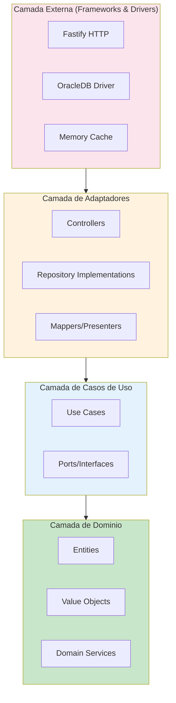
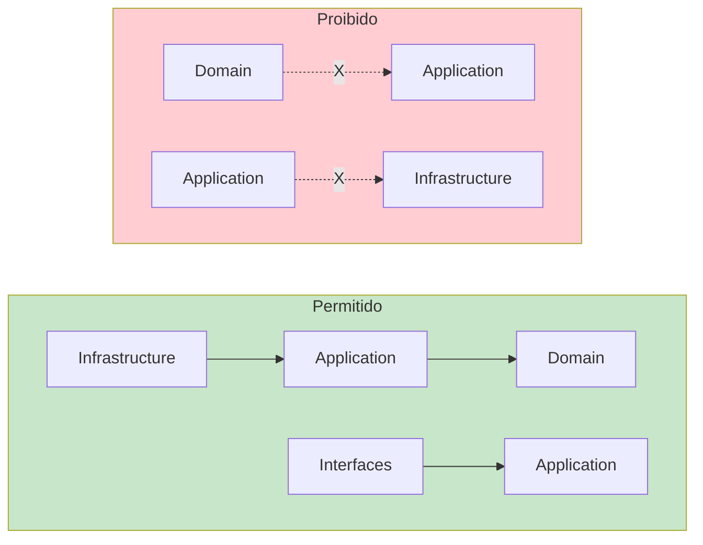
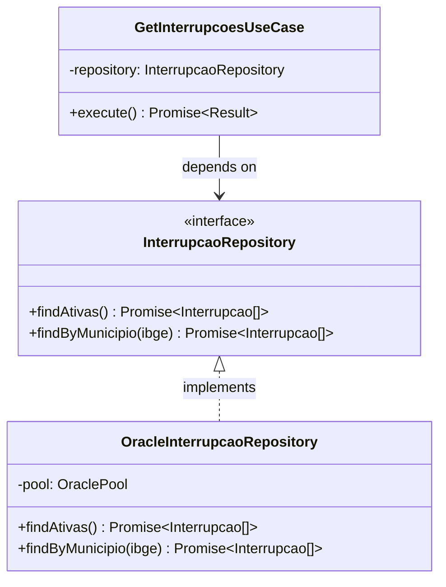

# Clean Architecture - Projeto RADAR

## Visao Geral

A Clean Architecture (Arquitetura Limpa) organiza o codigo em camadas concentricas, onde as dependencias apontam sempre para dentro - do mais externo (frameworks, drivers) para o mais interno (regras de negocio).



## Estrutura do Projeto RADAR

```
src/
├── domain/                    # Camada de Dominio (mais interna)
│   ├── entities/              # Entidades de negocio
│   │   ├── interrupcao.entity.ts
│   │   └── demanda.entity.ts
│   ├── value-objects/         # Value Objects imutaveis
│   │   ├── codigo-ibge.vo.ts
│   │   ├── tipo-interrupcao.vo.ts
│   │   └── data-hora-brasilia.vo.ts
│   ├── repositories/          # Interfaces (Ports) dos repositorios
│   │   ├── interrupcao.repository.ts
│   │   └── universo.repository.ts
│   └── services/              # Servicos de dominio
│       └── interrupcao-aggregator.service.ts
│
├── application/               # Camada de Aplicacao
│   ├── use-cases/             # Casos de uso
│   │   ├── get-interrupcoes-ativas.use-case.ts
│   │   └── get-quantitativo-demandas.use-case.ts
│   ├── dtos/                  # Data Transfer Objects
│   │   ├── interrupcao.dto.ts
│   │   └── aneel-response.dto.ts
│   └── mappers/               # Conversores de dados
│       └── interrupcao.mapper.ts
│
├── infrastructure/            # Camada de Infraestrutura
│   ├── database/              # Configuracao do banco
│   │   ├── oracle.connection.ts
│   │   └── oracle.pool.ts
│   ├── repositories/          # Implementacoes dos repositorios
│   │   ├── oracle-interrupcao.repository.ts
│   │   └── oracle-universo.repository.ts
│   └── cache/                 # Implementacao de cache
│       └── memory-cache.service.ts
│
├── interfaces/                # Camada de Interface (Adapters)
│   └── http/
│       ├── controllers/       # Controllers HTTP
│       │   └── interrupcoes.controller.ts
│       ├── middlewares/       # Middlewares
│       │   ├── auth.middleware.ts
│       │   └── error-handler.middleware.ts
│       ├── routes/            # Definicao de rotas
│       │   └── api.routes.ts
│       └── validators/        # Validadores de request
│           └── request.validator.ts
│
└── shared/                    # Codigo compartilhado
    ├── config/                # Configuracoes
    │   └── env.config.ts
    ├── errors/                # Erros customizados
    │   └── domain.errors.ts
    └── utils/                 # Utilitarios
        └── date.utils.ts
```

## Regra de Dependencia

A regra fundamental da Clean Architecture e que **dependencias so podem apontar para dentro**:



### Exemplo Pratico no RADAR

```typescript
// domain/repositories/interrupcao.repository.ts
// A interface (Port) esta no dominio - nao conhece Oracle
export interface InterrupcaoRepository {
  findAtivas(): Promise<Interrupcao[]>;
  findByMunicipio(ibge: CodigoIBGE): Promise<Interrupcao[]>;
}

// infrastructure/repositories/oracle-interrupcao.repository.ts
// A implementacao conhece Oracle, mas implementa a interface do dominio
import { InterrupcaoRepository } from '@/domain/repositories/interrupcao.repository';
import oracledb from 'oracledb';

export class OracleInterrupcaoRepository implements InterrupcaoRepository {
  constructor(private pool: oracledb.Pool) {}

  async findAtivas(): Promise<Interrupcao[]> {
    const result = await this.pool.execute(`
      SELECT ...
      FROM INSERVICE.AGENCY_EVENT@DBLINK_INSERVICE ae
      WHERE ae.is_open = 'T'
    `);
    return this.mapToEntities(result.rows);
  }
}
```

## Inversao de Dependencia (DIP)

O dominio define interfaces (Ports), e a infraestrutura as implementa (Adapters):



## Injecao de Dependencia

```typescript
// shared/container.ts
import { container } from 'tsyringe';

// Registrar implementacoes
container.registerSingleton<InterrupcaoRepository>(
  'InterrupcaoRepository',
  OracleInterrupcaoRepository
);

container.registerSingleton<CacheService>(
  'CacheService',
  MemoryCacheService
);

// application/use-cases/get-interrupcoes-ativas.use-case.ts
@injectable()
export class GetInterrupcoesAtivasUseCase {
  constructor(
    @inject('InterrupcaoRepository')
    private repository: InterrupcaoRepository,

    @inject('CacheService')
    private cache: CacheService
  ) {}

  async execute(): Promise<Result<InterrupcaoAgregada[]>> {
    // Logica do caso de uso
  }
}
```

## Beneficios para o RADAR

1. **Testabilidade**: Podemos testar casos de uso com repositorios mock
2. **Flexibilidade**: Trocar Oracle por outro banco sem afetar dominio
3. **Manutencao**: Regras de negocio isoladas e faceis de encontrar
4. **Evolucao**: Adicionar novas APIs sem afetar codigo existente

## Checklist de Implementacao

- [ ] Entidades nao importam nada de infraestrutura
- [ ] Casos de uso dependem apenas de interfaces (Ports)
- [ ] Repositorios implementam interfaces definidas no dominio
- [ ] Controllers sao finos - apenas delegam para casos de uso
- [ ] DTOs fazem a conversao entre camadas
- [ ] Erros de dominio sao diferentes de erros HTTP
