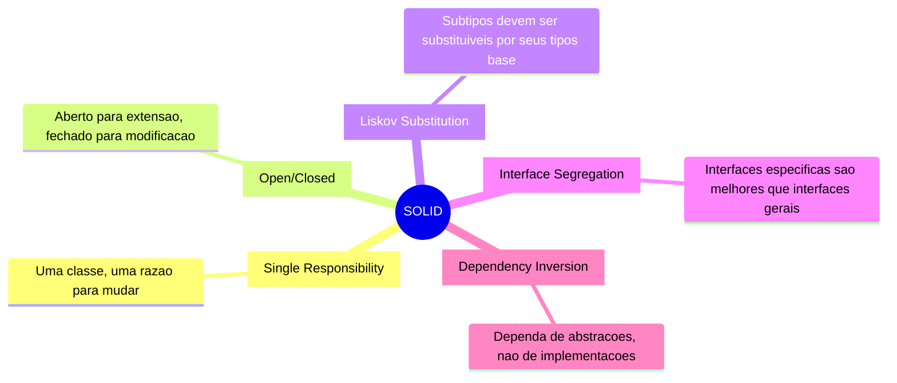
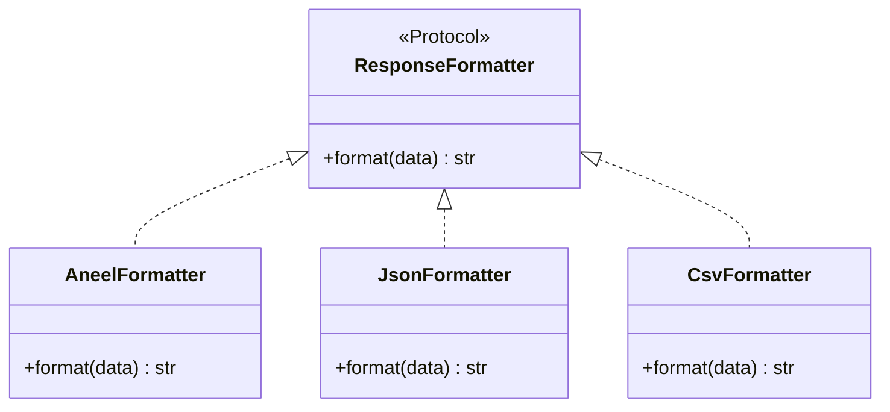
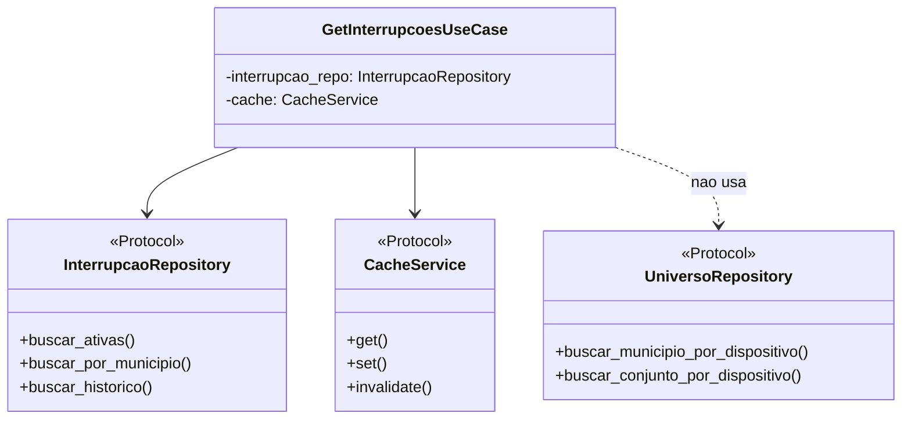
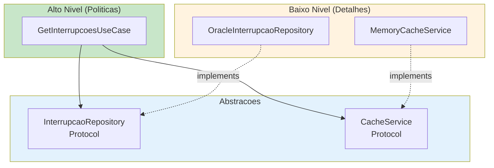

# Principios SOLID - Projeto RADAR

## Visao Geral

SOLID e um acronimo para cinco principios de design orientado a objetos que tornam o software mais compreensivel, flexivel e mantenivel.



---

## S - Single Responsibility Principle (SRP)

**"Uma classe deve ter apenas uma razao para mudar"**

### Violacao (NAO FACA ISSO)

```python
# ERRADO: Classe com multiplas responsabilidades
class InterrupcaoService:
    async def buscar_interrupcoes(self) -> list[Interrupcao]:
        # Busca no banco
        async with oracledb.connect() as conn:
            cursor = await conn.cursor()
            result = await cursor.execute("SELECT ...")

        # Validacao
        if not result:
            raise ValueError("Sem dados")

        # Mapeamento
        interrupcoes = [
            {"id": row[0], "tipo": "PROGRAMADA" if row[1] else "NAO_PROGRAMADA"}
            for row in result
        ]

        # Cache
        self.cache["interrupcoes"] = interrupcoes

        # Log
        print(f"Encontradas {len(interrupcoes)} interrupcoes")

        return interrupcoes
```

### Correto (FACA ASSIM)

```python
# shared/domain/repositories/interrupcao_repository.py
# Responsabilidade: Definir contrato de acesso a dados
from typing import Protocol

class InterrupcaoRepository(Protocol):
    async def buscar_ativas(self) -> list[Interrupcao]:
        ...


# apps/api_interrupcoes/repositories/oracle_interrupcao_repository.py
# Responsabilidade: Acesso ao banco Oracle
class OracleInterrupcaoRepository:
    def __init__(self, session: AsyncSession) -> None:
        self._session = session

    async def buscar_ativas(self) -> list[Interrupcao]:
        result = await self._session.execute(text("SELECT ..."))
        return self._mapper.to_domain(result.fetchall())


# shared/domain/mappers/interrupcao_mapper.py
# Responsabilidade: Conversao de dados
class InterrupcaoMapper:
    def to_domain(self, rows: list[tuple]) -> list[Interrupcao]:
        return [
            Interrupcao(
                id=row[0],
                tipo=TipoInterrupcao.from_plan_id(row[1]),
            )
            for row in rows
        ]


# apps/api_interrupcoes/use_cases/get_interrupcoes_ativas.py
# Responsabilidade: Orquestrar busca com cache
class GetInterrupcoesAtivasUseCase:
    def __init__(
        self,
        repository: InterrupcaoRepository,
        cache: CacheService,
    ) -> None:
        self._repository = repository
        self._cache = cache

    async def execute(self) -> Result[list[Interrupcao], DomainError]:
        cached = await self._cache.get("interrupcoes")
        if cached:
            return Result.ok(cached)

        interrupcoes = await self._repository.buscar_ativas()
        await self._cache.set("interrupcoes", interrupcoes)

        return Result.ok(interrupcoes)
```

---

## O - Open/Closed Principle (OCP)

**"Aberto para extensao, fechado para modificacao"**

### Aplicacao no RADAR



```python
# shared/formatters/response_formatter.py
from typing import Protocol, TypeVar

T = TypeVar("T")


class ResponseFormatter(Protocol[T]):
    def format(self, data: T) -> str:
        ...


# shared/infrastructure/http/aneel_formatter.py
import json
from dataclasses import asdict


class AneelFormatter:
    """Formata resposta no padrao ANEEL."""

    def format(self, data: list[InterrupcaoAgregada]) -> str:
        return json.dumps({
            "idcStatusRequisicao": 1,
            "desStatusRequisicao": "Sucesso",
            "listaInterrupcoes": [
                {
                    "ideConjuntoUnidadeConsumidora": item.id_conjunto,
                    "ideMunicipio": item.municipio_ibge,
                    "qtdOcorrenciaProgramada": item.qtd_programada,
                    "qtdOcorrenciaNaoProgramada": item.qtd_nao_programada,
                }
                for item in data
            ],
        })


# Para adicionar novo formato, crie nova classe - NAO modifique existente
class CsvFormatter:
    """Formata resposta em CSV."""

    def format(self, data: list[InterrupcaoAgregada]) -> str:
        header = "conjunto,municipio,programada,nao_programada\n"
        rows = [
            f"{d.id_conjunto},{d.municipio_ibge},{d.qtd_programada},{d.qtd_nao_programada}"
            for d in data
        ]
        return header + "\n".join(rows)
```

---

## L - Liskov Substitution Principle (LSP)

**"Subtipos devem ser substituiveis por seus tipos base"**

### Aplicacao no RADAR

```python
# shared/domain/cache/cache_service.py
from typing import Protocol, TypeVar

T = TypeVar("T")


class CacheService(Protocol):
    async def get(self, key: str) -> T | None:
        ...

    async def set(self, key: str, value: T, ttl_seconds: int) -> None:
        ...

    async def invalidate(self, key: str) -> None:
        ...


# shared/infrastructure/cache/memory_cache.py
from datetime import datetime, timedelta


class MemoryCacheService:
    """Implementacao de cache em memoria."""

    def __init__(self) -> None:
        self._cache: dict[str, tuple[Any, datetime]] = {}

    async def get(self, key: str) -> Any | None:
        if key not in self._cache:
            return None

        value, expires_at = self._cache[key]
        if datetime.now() > expires_at:
            del self._cache[key]
            return None

        return value

    async def set(self, key: str, value: Any, ttl_seconds: int) -> None:
        expires_at = datetime.now() + timedelta(seconds=ttl_seconds)
        self._cache[key] = (value, expires_at)

    async def invalidate(self, key: str) -> None:
        self._cache.pop(key, None)


# shared/infrastructure/cache/redis_cache.py (futuro)
class RedisCacheService:
    """Implementacao de cache com Redis."""

    def __init__(self, redis_client: Redis) -> None:
        self._redis = redis_client

    async def get(self, key: str) -> Any | None:
        data = await self._redis.get(key)
        return json.loads(data) if data else None

    async def set(self, key: str, value: Any, ttl_seconds: int) -> None:
        await self._redis.setex(key, ttl_seconds, json.dumps(value))

    async def invalidate(self, key: str) -> None:
        await self._redis.delete(key)


# Qualquer implementacao pode ser usada sem alterar o codigo cliente
use_case = GetInterrupcoesAtivasUseCase(
    repository=repository,
    cache=MemoryCacheService(),  # ou RedisCacheService(redis)
)
```

---

## I - Interface Segregation Principle (ISP)

**"Clientes nao devem depender de interfaces que nao usam"**

### Violacao (NAO FACA ISSO)

```python
# ERRADO: Protocol muito grande
class DatabaseRepository(Protocol):
    async def find_all(self) -> list[Any]: ...
    async def find_by_id(self, id: int) -> Any: ...
    async def create(self, data: Any) -> Any: ...
    async def update(self, id: int, data: Any) -> Any: ...
    async def delete(self, id: int) -> None: ...
    async def execute_raw_query(self, sql: str) -> Any: ...
    async def begin_transaction(self) -> None: ...
    async def commit(self) -> None: ...
    async def rollback(self) -> None: ...
```

### Correto (FACA ASSIM)

```python
# shared/domain/repositories/interrupcao_repository.py
# Protocol especifico para leitura de interrupcoes
class InterrupcaoRepository(Protocol):
    async def buscar_ativas(self) -> list[Interrupcao]: ...
    async def buscar_por_municipio(self, ibge: CodigoIBGE) -> list[Interrupcao]: ...
    async def buscar_historico(self, params: HistoricoParams) -> list[Interrupcao]: ...


# shared/domain/repositories/universo_repository.py
# Protocol especifico para dados de universo
class UniversoRepository(Protocol):
    async def buscar_municipio_por_dispositivo(self, dev_id: int) -> CodigoIBGE: ...
    async def buscar_conjunto_por_dispositivo(self, dev_id: int) -> int: ...


# shared/domain/cache/cache_service.py
# Protocol especifico para cache
class CacheService(Protocol):
    async def get(self, key: str) -> Any | None: ...
    async def set(self, key: str, value: Any, ttl: int) -> None: ...
    async def invalidate(self, key: str) -> None: ...
```



---

## D - Dependency Inversion Principle (DIP)

**"Dependa de abstracoes, nao de implementacoes concretas"**

### Violacao (NAO FACA ISSO)

```python
# ERRADO: Dependencia direta de implementacao
import oracledb


class GetInterrupcoesUseCase:
    async def execute(self) -> list[dict]:
        # Acoplamento direto com Oracle
        connection = await oracledb.connect(
            user="radar",
            password="secret",
            dsn="localhost/XE",
        )

        cursor = connection.cursor()
        result = await cursor.execute("SELECT ...")
        return result.fetchall()
```

### Correto (FACA ASSIM)

```python
# shared/domain/repositories/interrupcao_repository.py
# Abstracao definida no dominio
from typing import Protocol


class InterrupcaoRepository(Protocol):
    async def buscar_ativas(self) -> list[Interrupcao]:
        ...


# apps/api_interrupcoes/use_cases/get_interrupcoes_ativas.py
# Depende da abstracao
class GetInterrupcoesAtivasUseCase:
    def __init__(
        self,
        repository: InterrupcaoRepository,
        cache: CacheService,
    ) -> None:
        self._repository = repository
        self._cache = cache

    async def execute(self) -> Result[list[InterrupcaoAgregada], DomainError]:
        cached = await self._cache.get("interrupcoes")
        if cached:
            return Result.ok(cached)

        interrupcoes = await self._repository.buscar_ativas()
        agregadas = self._agregar(interrupcoes)

        await self._cache.set("interrupcoes", agregadas, ttl=300)

        return Result.ok(agregadas)


# apps/api_interrupcoes/repositories/oracle_interrupcao_repository.py
# Implementacao concreta
class OracleInterrupcaoRepository:
    def __init__(self, session: AsyncSession) -> None:
        self._session = session

    async def buscar_ativas(self) -> list[Interrupcao]:
        query = """
            SELECT ae.num_1, ae.NUM_CUST, spt.PLAN_ID
            FROM INSERVICE.AGENCY_EVENT@DBLINK_INSERVICE ae
            LEFT JOIN INSERVICE.SWITCH_PLAN_TASKS@DBLINK_INSERVICE spt
                ON spt.OUTAGE_NUM = ae.num_1
            WHERE ae.is_open = 'T'
        """
        result = await self._session.execute(text(query))
        return self._map_to_entities(result.fetchall())
```



---

## Checklist SOLID para Code Review

### Single Responsibility
- [ ] A classe tem apenas uma razao para mudar?
- [ ] O nome da classe descreve claramente sua responsabilidade?
- [ ] A classe tem menos de ~200 linhas?

### Open/Closed
- [ ] Novos comportamentos podem ser adicionados via extensao?
- [ ] E necessario modificar codigo existente para adicionar features?

### Liskov Substitution
- [ ] Subclasses podem substituir suas classes base?
- [ ] Os contratos dos Protocols sao respeitados?

### Interface Segregation
- [ ] Os Protocols sao pequenos e focados?
- [ ] Os clientes usam todos os metodos dos Protocols que implementam?

### Dependency Inversion
- [ ] Modulos de alto nivel dependem de abstracoes (Protocols)?
- [ ] Detalhes de implementacao estao isolados?
