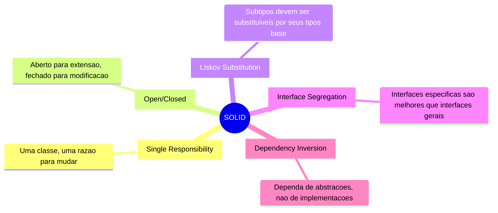
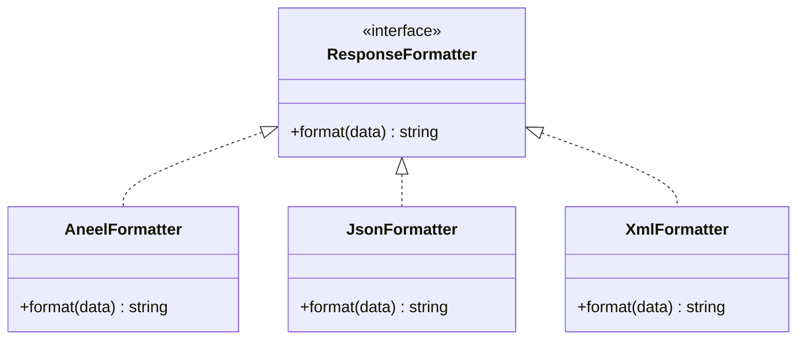
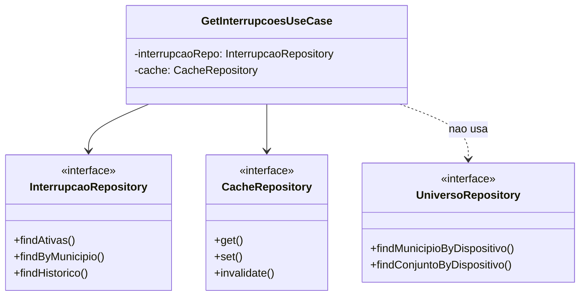
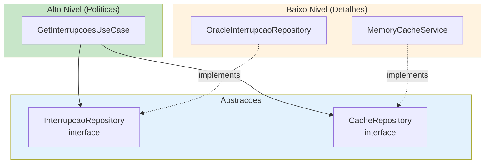

# Principios SOLID - Projeto RADAR

## Visao Geral

SOLID e um acronimo para cinco principios de design orientado a objetos que tornam o software mais compreensivel, flexivel e mantenivel.



---

## S - Single Responsibility Principle (SRP)

**"Uma classe deve ter apenas uma razao para mudar"**

### Violacao (NAO FACA ISSO)

```typescript
// ERRADO: Classe com multiplas responsabilidades
class InterrupcaoService {
  async buscarInterrupcoes(): Promise<Interrupcao[]> {
    // Busca no banco
    const connection = await oracledb.getConnection();
    const result = await connection.execute('SELECT ...');

    // Validacao
    if (!result.rows.length) {
      throw new Error('Sem dados');
    }

    // Mapeamento
    const interrupcoes = result.rows.map(row => ({
      id: row[0],
      tipo: row[1] ? 'PROGRAMADA' : 'NAO_PROGRAMADA'
    }));

    // Cache
    this.cache.set('interrupcoes', interrupcoes);

    // Log
    console.log(`Encontradas ${interrupcoes.length} interrupcoes`);

    return interrupcoes;
  }
}
```

### Correto (FACA ASSIM)

```typescript
// domain/repositories/interrupcao.repository.ts
// Responsabilidade: Definir contrato de acesso a dados
export interface InterrupcaoRepository {
  findAtivas(): Promise<Interrupcao[]>;
}

// infrastructure/repositories/oracle-interrupcao.repository.ts
// Responsabilidade: Acesso ao banco Oracle
export class OracleInterrupcaoRepository implements InterrupcaoRepository {
  async findAtivas(): Promise<Interrupcao[]> {
    const result = await this.pool.execute('SELECT ...');
    return this.mapper.toDomain(result.rows);
  }
}

// application/mappers/interrupcao.mapper.ts
// Responsabilidade: Conversao de dados
export class InterrupcaoMapper {
  toDomain(rows: any[]): Interrupcao[] {
    return rows.map(row => Interrupcao.create({
      id: row.NUM_1,
      tipo: TipoInterrupcao.fromPlanId(row.PLAN_ID)
    }));
  }
}

// application/use-cases/get-interrupcoes.use-case.ts
// Responsabilidade: Orquestrar busca com cache
export class GetInterrupcoesUseCase {
  async execute(): Promise<Result<Interrupcao[]>> {
    const cached = await this.cache.get('interrupcoes');
    if (cached) return Result.ok(cached);

    const interrupcoes = await this.repository.findAtivas();
    await this.cache.set('interrupcoes', interrupcoes);

    return Result.ok(interrupcoes);
  }
}
```

---

## O - Open/Closed Principle (OCP)

**"Aberto para extensao, fechado para modificacao"**

### Aplicacao no RADAR



```typescript
// shared/formatters/response-formatter.interface.ts
export interface ResponseFormatter<T> {
  format(data: T): string;
}

// infrastructure/formatters/aneel.formatter.ts
export class AneelFormatter implements ResponseFormatter<InterrupcaoAgregada[]> {
  format(data: InterrupcaoAgregada[]): string {
    return JSON.stringify({
      idcStatusRequisicao: 1,
      desStatusRequisicao: 'Sucesso',
      listaInterrupcoes: data.map(item => ({
        ideConjuntoUnidadeConsumidora: item.idConjunto,
        ideMunicipio: item.municipioIbge,
        qtdOcorrenciaProgramada: item.qtdProgramada,
        qtdOcorrenciaNaoProgramada: item.qtdNaoProgramada
      }))
    });
  }
}

// Para adicionar novo formato, crie nova classe - NAO modifique existente
export class CsvFormatter implements ResponseFormatter<InterrupcaoAgregada[]> {
  format(data: InterrupcaoAgregada[]): string {
    const header = 'conjunto,municipio,programada,nao_programada\n';
    const rows = data.map(d =>
      `${d.idConjunto},${d.municipioIbge},${d.qtdProgramada},${d.qtdNaoProgramada}`
    );
    return header + rows.join('\n');
  }
}
```

---

## L - Liskov Substitution Principle (LSP)

**"Subtipos devem ser substituiveis por seus tipos base"**

### Aplicacao no RADAR

```typescript
// domain/repositories/cache.repository.ts
export interface CacheRepository {
  get<T>(key: string): Promise<T | null>;
  set<T>(key: string, value: T, ttlSeconds: number): Promise<void>;
  invalidate(key: string): Promise<void>;
}

// infrastructure/cache/memory-cache.service.ts
export class MemoryCacheService implements CacheRepository {
  private cache = new Map<string, { value: any; expiresAt: number }>();

  async get<T>(key: string): Promise<T | null> {
    const item = this.cache.get(key);
    if (!item || Date.now() > item.expiresAt) {
      return null;
    }
    return item.value as T;
  }

  async set<T>(key: string, value: T, ttlSeconds: number): Promise<void> {
    this.cache.set(key, {
      value,
      expiresAt: Date.now() + ttlSeconds * 1000
    });
  }

  async invalidate(key: string): Promise<void> {
    this.cache.delete(key);
  }
}

// infrastructure/cache/redis-cache.service.ts (futuro)
export class RedisCacheService implements CacheRepository {
  async get<T>(key: string): Promise<T | null> {
    const data = await this.redis.get(key);
    return data ? JSON.parse(data) : null;
  }

  async set<T>(key: string, value: T, ttlSeconds: number): Promise<void> {
    await this.redis.setex(key, ttlSeconds, JSON.stringify(value));
  }

  async invalidate(key: string): Promise<void> {
    await this.redis.del(key);
  }
}

// Qualquer implementacao pode ser usada sem alterar o codigo cliente
const useCase = new GetInterrupcoesUseCase(
  repository,
  new MemoryCacheService() // ou new RedisCacheService()
);
```

---

## I - Interface Segregation Principle (ISP)

**"Clientes nao devem depender de interfaces que nao usam"**

### Violacao (NAO FACA ISSO)

```typescript
// ERRADO: Interface muito grande
interface DatabaseRepository {
  findAll(): Promise<any[]>;
  findById(id: number): Promise<any>;
  create(data: any): Promise<any>;
  update(id: number, data: any): Promise<any>;
  delete(id: number): Promise<void>;
  executeRawQuery(sql: string): Promise<any>;
  beginTransaction(): Promise<void>;
  commit(): Promise<void>;
  rollback(): Promise<void>;
}
```

### Correto (FACA ASSIM)

```typescript
// domain/repositories/interrupcao.repository.ts
// Interface especifica para leitura de interrupcoes
export interface InterrupcaoRepository {
  findAtivas(): Promise<Interrupcao[]>;
  findByMunicipio(ibge: CodigoIBGE): Promise<Interrupcao[]>;
  findHistorico(params: HistoricoParams): Promise<Interrupcao[]>;
}

// domain/repositories/universo.repository.ts
// Interface especifica para dados de universo
export interface UniversoRepository {
  findMunicipioByDispositivo(devId: number): Promise<CodigoIBGE>;
  findConjuntoByDispositivo(devId: number): Promise<number>;
}

// domain/repositories/cache.repository.ts
// Interface especifica para cache
export interface CacheRepository {
  get<T>(key: string): Promise<T | null>;
  set<T>(key: string, value: T, ttl: number): Promise<void>;
  invalidate(key: string): Promise<void>;
}
```



---

## D - Dependency Inversion Principle (DIP)

**"Dependa de abstracoes, nao de implementacoes concretas"**

### Violacao (NAO FACA ISSO)

```typescript
// ERRADO: Dependencia direta de implementacao
import oracledb from 'oracledb';

class GetInterrupcoesUseCase {
  async execute() {
    // Acoplamento direto com Oracle
    const connection = await oracledb.getConnection({
      user: 'radar',
      password: 'secret',
      connectionString: 'localhost/XE'
    });

    const result = await connection.execute('SELECT ...');
    return result.rows;
  }
}
```

### Correto (FACA ASSIM)

```typescript
// domain/repositories/interrupcao.repository.ts
// Abstracao definida no dominio
export interface InterrupcaoRepository {
  findAtivas(): Promise<Interrupcao[]>;
}

// application/use-cases/get-interrupcoes.use-case.ts
// Depende da abstracao
export class GetInterrupcoesUseCase {
  constructor(
    private readonly repository: InterrupcaoRepository,
    private readonly cache: CacheRepository
  ) {}

  async execute(): Promise<Result<InterrupcaoAgregada[]>> {
    const cached = await this.cache.get<InterrupcaoAgregada[]>('interrupcoes');
    if (cached) {
      return Result.ok(cached);
    }

    const interrupcoes = await this.repository.findAtivas();
    const agregadas = this.agregar(interrupcoes);

    await this.cache.set('interrupcoes', agregadas, 300);

    return Result.ok(agregadas);
  }
}

// infrastructure/repositories/oracle-interrupcao.repository.ts
// Implementacao concreta
export class OracleInterrupcaoRepository implements InterrupcaoRepository {
  constructor(private readonly pool: oracledb.Pool) {}

  async findAtivas(): Promise<Interrupcao[]> {
    const result = await this.pool.execute(`
      SELECT ae.num_1, ae.NUM_CUST, spt.PLAN_ID, ...
      FROM INSERVICE.AGENCY_EVENT@DBLINK_INSERVICE ae
      LEFT JOIN INSERVICE.SWITCH_PLAN_TASKS@DBLINK_INSERVICE spt
        ON spt.OUTAGE_NUM = ae.num_1
      WHERE ae.is_open = 'T'
    `);
    return this.mapToEntities(result.rows);
  }
}
```



---

## Checklist SOLID para Code Review

### Single Responsibility
- [ ] A classe tem apenas uma razao para mudar?
- [ ] O nome da classe descreve claramente sua responsabilidade?
- [ ] A classe tem menos de ~200 linhas?

### Open/Closed
- [ ] Novos comportamentos podem ser adicionados via extensao?
- [ ] E necessario modificar codigo existente para adicionar features?

### Liskov Substitution
- [ ] Subclasses podem substituir suas classes base?
- [ ] Os contratos das interfaces sao respeitados?

### Interface Segregation
- [ ] As interfaces sao pequenas e focadas?
- [ ] Os clientes usam todos os metodos das interfaces que implementam?

### Dependency Inversion
- [ ] Modulos de alto nivel dependem de abstracoes?
- [ ] Detalhes de implementacao estao isolados?
