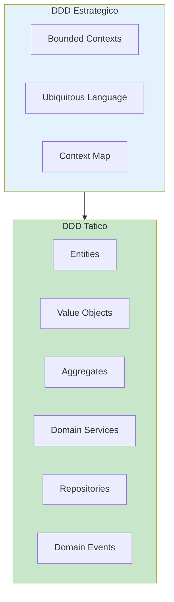
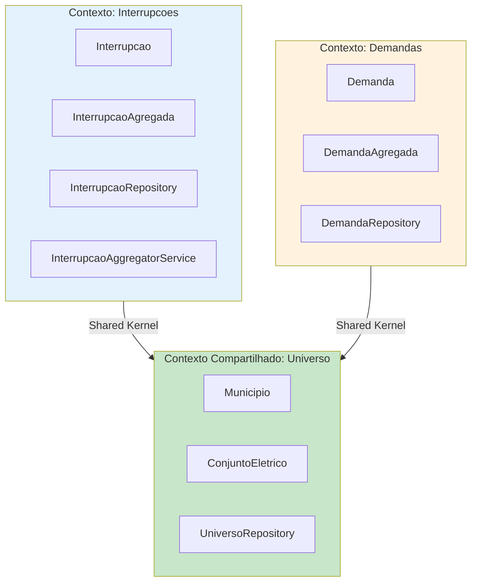
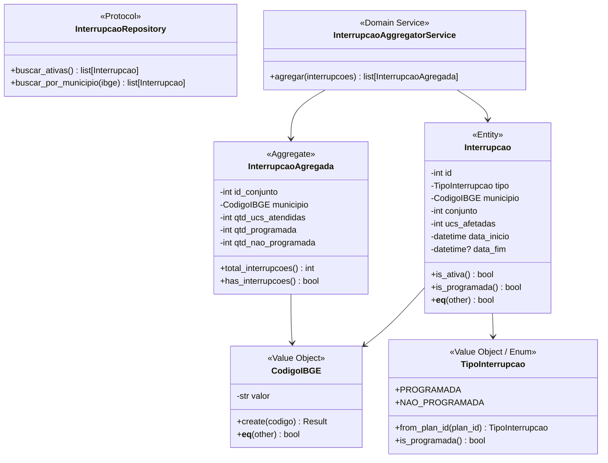

# Domain-Driven Design (DDD) - Projeto RADAR

## Visao Geral

DDD e uma abordagem de desenvolvimento que coloca o dominio de negocio no centro do design de software. Para o RADAR, isso significa modelar corretamente os conceitos do setor eletrico e da regulacao ANEEL.



---

## Linguagem Ubiqua (Ubiquitous Language)

### Glossario do Dominio RADAR

| Termo | Definicao | Contexto |
|-------|-----------|----------|
| **Interrupcao** | Evento de desligamento de energia em um dispositivo | Interrompe fornecimento |
| **Interrupcao Programada** | Desligamento planejado com PLAN_ID | Manutencao preventiva |
| **Interrupcao Nao Programada** | Desligamento emergencial sem PLAN_ID | Falha, acidente |
| **Conjunto Eletrico** | Agrupamento de unidades consumidoras | Divisao tecnica |
| **Municipio (IBGE)** | Codigo de 7 digitos do municipio | Localizacao geografica |
| **UC (Unidade Consumidora)** | Ponto de consumo de energia | Cliente final |
| **Dispositivo** | Equipamento da rede eletrica | Transformador, chave |
| **Evento** | Ocorrencia registrada no sistema OMS | AGENCY_EVENT |
| **Demanda** | Solicitacao/reclamacao de consumidor | Atendimento |

### Uso no Codigo

```python
# BOM: Usa linguagem do dominio
@dataclass(frozen=True)
class Interrupcao:
    id: int
    tipo: TipoInterrupcao
    municipio: CodigoIBGE
    ucs_afetadas: int

    def is_programada(self) -> bool:
        return self.tipo == TipoInterrupcao.PROGRAMADA

    def get_ucs_afetadas(self) -> int:
        return self.ucs_afetadas


# RUIM: Termos tecnicos sem significado de negocio
@dataclass
class Event:
    id: int
    plan_id: int | None
    num_cust: int

    def has_schedule(self) -> bool:
        return self.plan_id is not None
```

---

## Bounded Contexts

O RADAR possui tres contextos delimitados principais:



---

## Entidades (Entities)

Entidades possuem identidade unica e ciclo de vida.

```python
# shared/domain/entities/interrupcao.py
from dataclasses import dataclass
from datetime import datetime
from ..value_objects.codigo_ibge import CodigoIBGE
from ..value_objects.tipo_interrupcao import TipoInterrupcao
from ..result import Result


@dataclass
class Interrupcao:
    """Entidade que representa uma interrupcao de fornecimento."""

    _id: int
    _tipo: TipoInterrupcao
    _municipio: CodigoIBGE
    _conjunto: int
    _ucs_afetadas: int
    _data_inicio: datetime
    _data_fim: datetime | None

    @classmethod
    def create(cls, props: dict) -> "Result[Interrupcao]":
        """Factory method com validacao de invariantes."""
        if props.get("ucs_afetadas", 0) < 0:
            return Result.fail("UCs afetadas nao pode ser negativo")

        return Result.ok(cls(
            _id=props["id"],
            _tipo=props["tipo"],
            _municipio=props["municipio"],
            _conjunto=props["conjunto"],
            _ucs_afetadas=props["ucs_afetadas"],
            _data_inicio=props["data_inicio"],
            _data_fim=props.get("data_fim"),
        ))

    @property
    def id(self) -> int:
        return self._id

    @property
    def municipio(self) -> CodigoIBGE:
        return self._municipio

    @property
    def ucs_afetadas(self) -> int:
        return self._ucs_afetadas

    def is_ativa(self) -> bool:
        """Interrupcao ativa quando nao tem data de fim."""
        return self._data_fim is None

    def is_programada(self) -> bool:
        """Interrupcao programada quando tem PLAN_ID associado."""
        return self._tipo == TipoInterrupcao.PROGRAMADA

    def __eq__(self, other: object) -> bool:
        """Igualdade baseada em identidade."""
        if not isinstance(other, Interrupcao):
            return False
        return self._id == other._id

    def __hash__(self) -> int:
        return hash(self._id)
```

---

## Value Objects

Value Objects sao imutaveis e comparados por valor, nao por identidade.

```python
# shared/domain/value_objects/codigo_ibge.py
from dataclasses import dataclass
from ..result import Result


@dataclass(frozen=True)
class CodigoIBGE:
    """Value Object para codigo IBGE de municipio."""

    valor: str

    # Municipios de Roraima
    MUNICIPIOS_RORAIMA = frozenset([
        "1400050",  # Alto Alegre
        "1400027",  # Amajari
        "1400100",  # Boa Vista
        "1400159",  # Bonfim
        "1400175",  # Canta
        "1400209",  # Caracarai
        "1400233",  # Caroebe
        "1400282",  # Iracema
        "1400308",  # Mucajai
        "1400407",  # Normandia
        "1400456",  # Pacaraima
        "1400472",  # Rorainopolis
        "1400506",  # Sao Joao da Baliza
        "1400605",  # Sao Luiz
        "1400704",  # Uiramuta
    ])

    def __post_init__(self) -> None:
        """Validacao no momento da criacao."""
        if not self._is_valid():
            raise ValueError(f"Codigo IBGE invalido: {self.valor}")
        if not self._is_roraima():
            raise ValueError(f"Codigo IBGE nao pertence a Roraima: {self.valor}")

    def _is_valid(self) -> bool:
        return self.valor.isdigit() and len(self.valor) == 7

    def _is_roraima(self) -> bool:
        return self.valor in self.MUNICIPIOS_RORAIMA

    @classmethod
    def create(cls, codigo: str | int) -> "Result[CodigoIBGE]":
        """Factory method com validacao."""
        try:
            valor = str(codigo).zfill(7)
            return Result.ok(cls(valor=valor))
        except ValueError as e:
            return Result.fail(str(e))


# shared/domain/value_objects/tipo_interrupcao.py
from enum import Enum


class TipoInterrupcao(Enum):
    """Value Object para tipo de interrupcao."""

    PROGRAMADA = "PROGRAMADA"
    NAO_PROGRAMADA = "NAO_PROGRAMADA"

    @classmethod
    def from_plan_id(cls, plan_id: int | None) -> "TipoInterrupcao":
        """
        Determina tipo baseado na existencia de PLAN_ID.
        Regra: Se existe PLAN_ID, e programada.
        """
        return cls.PROGRAMADA if plan_id is not None else cls.NAO_PROGRAMADA

    def is_programada(self) -> bool:
        return self == TipoInterrupcao.PROGRAMADA
```

---

## Aggregates

Aggregates sao clusters de entidades tratados como uma unidade.

```python
# shared/domain/aggregates/interrupcao_agregada.py
from dataclasses import dataclass
from ..value_objects.codigo_ibge import CodigoIBGE


@dataclass(frozen=True)
class InterrupcaoAgregada:
    """Aggregate que representa interrupcoes agregadas por municipio/conjunto."""

    id_conjunto: int
    municipio: CodigoIBGE
    qtd_ucs_atendidas: int
    qtd_programada: int
    qtd_nao_programada: int

    @classmethod
    def create(
        cls,
        id_conjunto: int,
        municipio: CodigoIBGE,
        qtd_ucs_atendidas: int,
        qtd_programada: int,
        qtd_nao_programada: int,
    ) -> "InterrupcaoAgregada":
        return cls(
            id_conjunto=id_conjunto,
            municipio=municipio,
            qtd_ucs_atendidas=qtd_ucs_atendidas,
            qtd_programada=qtd_programada,
            qtd_nao_programada=qtd_nao_programada,
        )

    @property
    def total_interrupcoes(self) -> int:
        """Total de interrupcoes (programadas + nao programadas)."""
        return self.qtd_programada + self.qtd_nao_programada

    def has_interrupcoes(self) -> bool:
        """Verifica se ha interrupcoes neste agregado."""
        return self.total_interrupcoes > 0
```

---

## Domain Services

Servicos de dominio encapsulam logica que nao pertence a uma entidade especifica.

```python
# shared/domain/services/interrupcao_aggregator.py
from collections import defaultdict
from ..entities.interrupcao import Interrupcao
from ..aggregates.interrupcao_agregada import InterrupcaoAgregada


class InterrupcaoAggregatorService:
    """
    Servico de dominio para agregacao de interrupcoes.
    Regra: Dados devem ser agregados por Municipio + Conjunto + Tipo.
    """

    def agregar(self, interrupcoes: list[Interrupcao]) -> list[InterrupcaoAgregada]:
        """Agrega interrupcoes por municipio e conjunto."""
        agrupadas: dict[str, dict] = defaultdict(lambda: {
            "municipio": None,
            "conjunto": 0,
            "programada": 0,
            "nao_programada": 0,
        })

        for interrupcao in interrupcoes:
            chave = f"{interrupcao.municipio.valor}-{interrupcao._conjunto}"

            if agrupadas[chave]["municipio"] is None:
                agrupadas[chave]["municipio"] = interrupcao.municipio
                agrupadas[chave]["conjunto"] = interrupcao._conjunto

            if interrupcao.is_programada():
                agrupadas[chave]["programada"] += interrupcao.ucs_afetadas
            else:
                agrupadas[chave]["nao_programada"] += interrupcao.ucs_afetadas

        return [
            InterrupcaoAgregada.create(
                id_conjunto=grupo["conjunto"],
                municipio=grupo["municipio"],
                qtd_ucs_atendidas=0,  # Preenchido por outra fonte
                qtd_programada=grupo["programada"],
                qtd_nao_programada=grupo["nao_programada"],
            )
            for grupo in agrupadas.values()
        ]
```

---

## Repositories

Repositories abstraem o acesso a dados, mantendo o dominio puro.

```python
# shared/domain/repositories/interrupcao_repository.py
from typing import Protocol
from ..entities.interrupcao import Interrupcao
from ..value_objects.codigo_ibge import CodigoIBGE


class InterrupcaoRepository(Protocol):
    """Port para repositorio de interrupcoes."""

    async def buscar_ativas(self) -> list[Interrupcao]:
        """Busca todas as interrupcoes ativas (is_open = 'T')."""
        ...

    async def buscar_por_municipio(self, ibge: CodigoIBGE) -> list[Interrupcao]:
        """Busca interrupcoes por municipio."""
        ...

    async def buscar_historico(
        self,
        data_inicio: str,
        data_fim: str,
    ) -> list[Interrupcao]:
        """Busca historico de interrupcoes em um periodo."""
        ...


# shared/domain/repositories/universo_repository.py
class UniversoRepository(Protocol):
    """Port para repositorio de universo (dados geograficos)."""

    async def buscar_municipio_por_dispositivo(
        self,
        dev_id: int,
    ) -> CodigoIBGE | None:
        """Retorna o codigo IBGE do municipio associado ao dispositivo."""
        ...

    async def buscar_conjunto_por_dispositivo(
        self,
        dev_id: int,
    ) -> int | None:
        """Retorna o conjunto eletrico associado ao dispositivo."""
        ...
```

---

## Diagrama Completo do Dominio



---

## Checklist DDD

### Linguagem Ubiqua
- [ ] Termos do dominio estao documentados
- [ ] Codigo usa mesmos termos do negocio
- [ ] Time fala a mesma lingua (dev e negocio)

### Entidades
- [ ] Possuem identidade unica
- [ ] Igualdade comparada por ID
- [ ] Encapsulam comportamento de negocio

### Value Objects
- [ ] Sao imutaveis (frozen=True)
- [ ] Igualdade comparada por valor
- [ ] Validacao no __post_init__ ou factory method

### Aggregates
- [ ] Definem limites de consistencia
- [ ] Acesso apenas pela raiz
- [ ] Transacoes respeitam limites

### Repositories
- [ ] Protocol no dominio
- [ ] Implementacao na infraestrutura
- [ ] Retornam entidades de dominio
