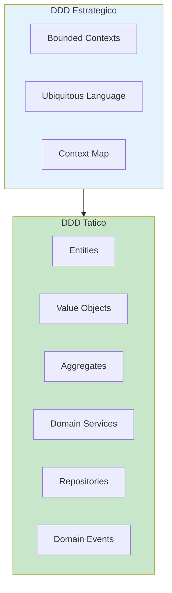
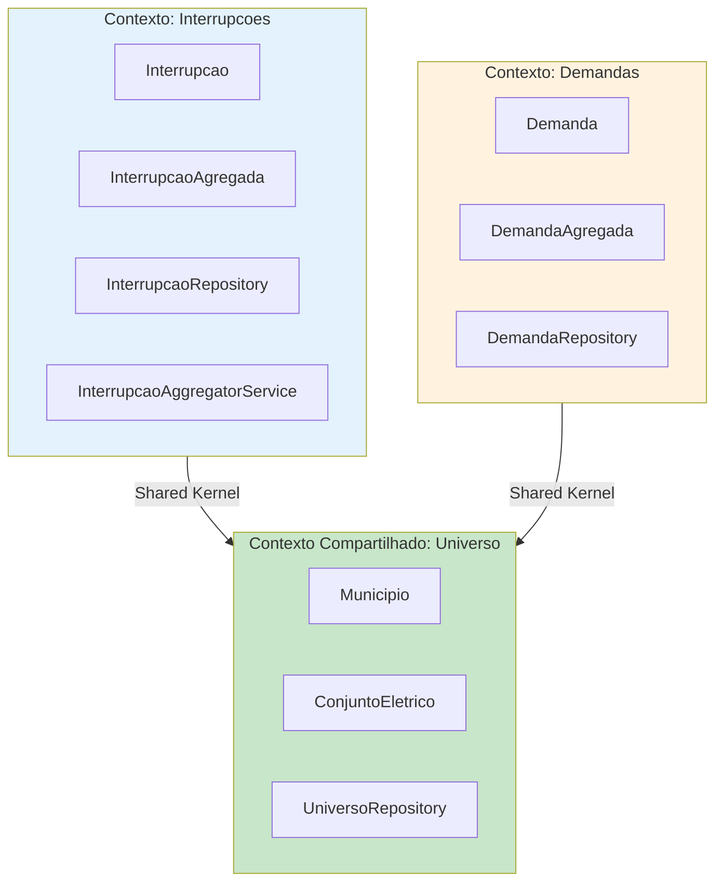
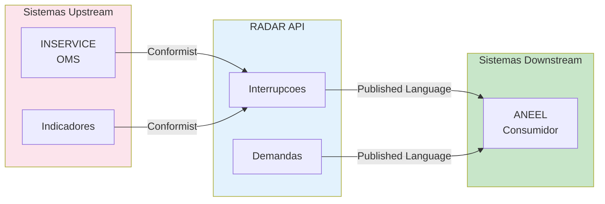
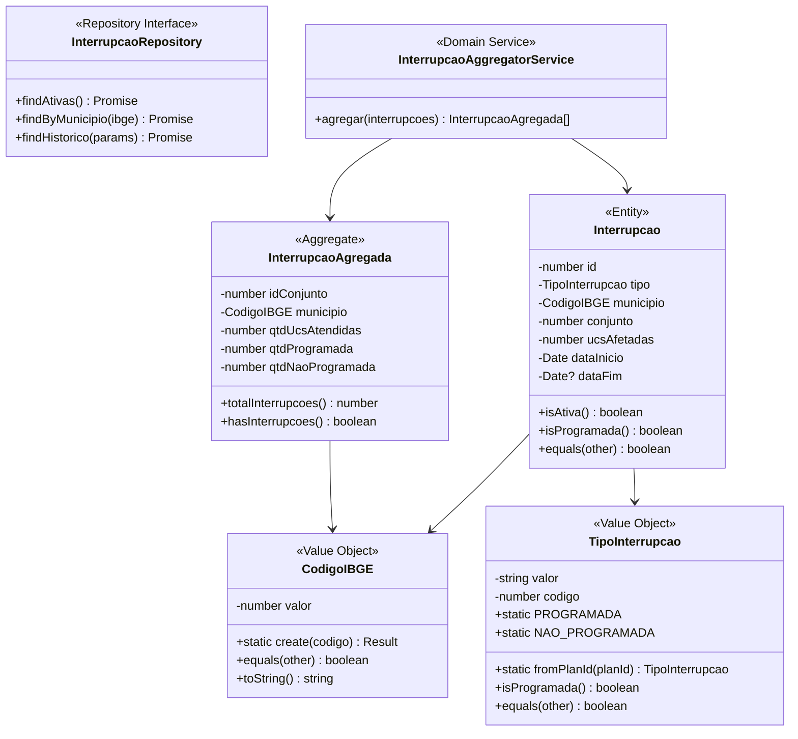

# Domain-Driven Design (DDD) - Projeto RADAR

## Visao Geral

DDD e uma abordagem de desenvolvimento que coloca o dominio de negocio no centro do design de software. Para o RADAR, isso significa modelar corretamente os conceitos do setor eletrico e da regulacao ANEEL.



---

## Linguagem Ubiqua (Ubiquitous Language)

### Glossario do Dominio RADAR

| Termo | Definicao | Contexto |
|-------|-----------|----------|
| **Interrupcao** | Evento de desligamento de energia em um dispositivo | Interrompe fornecimento |
| **Interrupcao Programada** | Desligamento planejado com PLAN_ID | Manutencao preventiva |
| **Interrupcao Nao Programada** | Desligamento emergencial sem PLAN_ID | Falha, acidente |
| **Conjunto Eletrico** | Agrupamento de unidades consumidoras | Divisao tecnica |
| **Municipio (IBGE)** | Codigo de 7 digitos do municipio | Localizacao geografica |
| **UC (Unidade Consumidora)** | Ponto de consumo de energia | Cliente final |
| **Dispositivo** | Equipamento da rede eletrica | Transformador, chave |
| **Evento** | Ocorrencia registrada no sistema OMS | AGENCY_EVENT |
| **Demanda** | Solicitacao/reclamacao de consumidor | Atendimento |

### Uso no Codigo

```typescript
// BOM: Usa linguagem do dominio
class Interrupcao {
  isProgramada(): boolean {
    return this.tipo.equals(TipoInterrupcao.PROGRAMADA);
  }

  getUcsAfetadas(): number {
    return this.ucsAfetadas;
  }
}

// RUIM: Termos tecnicos sem significado de negocio
class Event {
  hasSchedule(): boolean {
    return this.planId !== null;
  }

  getCustomerCount(): number {
    return this.numCust;
  }
}
```

---

## Bounded Contexts

O RADAR possui tres contextos delimitados principais:



### Mapeamento de Contextos (Context Map)



---

## Entidades (Entities)

Entidades possuem identidade unica e ciclo de vida.

```typescript
// domain/entities/interrupcao.entity.ts
export class Interrupcao {
  private constructor(
    private readonly _id: number,
    private readonly _tipo: TipoInterrupcao,
    private readonly _municipio: CodigoIBGE,
    private readonly _conjunto: number,
    private readonly _ucsAfetadas: number,
    private readonly _dataInicio: Date,
    private readonly _dataFim: Date | null
  ) {}

  // Factory method
  static create(props: InterrupcaoProps): Result<Interrupcao> {
    // Validacoes de invariantes
    if (props.ucsAfetadas < 0) {
      return Result.fail('UCs afetadas nao pode ser negativo');
    }

    return Result.ok(new Interrupcao(
      props.id,
      props.tipo,
      props.municipio,
      props.conjunto,
      props.ucsAfetadas,
      props.dataInicio,
      props.dataFim ?? null
    ));
  }

  // Identidade
  get id(): number {
    return this._id;
  }

  // Comportamento de negocio
  isAtiva(): boolean {
    return this._dataFim === null;
  }

  isProgramada(): boolean {
    return this._tipo.equals(TipoInterrupcao.PROGRAMADA);
  }

  // Igualdade baseada em identidade
  equals(other: Interrupcao): boolean {
    return this._id === other._id;
  }
}
```

---

## Value Objects

Value Objects sao imutaveis e comparados por valor, nao por identidade.

```typescript
// domain/value-objects/codigo-ibge.vo.ts
export class CodigoIBGE {
  private static readonly MUNICIPIOS_RORAIMA = [
    1400050, // Alto Alegre
    1400027, // Amajari
    1400100, // Boa Vista
    1400159, // Bonfim
    1400175, // Canta
    1400209, // Caracarai
    1400233, // Caroebe
    1400282, // Iracema
    1400308, // Mucajai
    1400407, // Normandia
    1400456, // Pacaraima
    1400472, // Rorainopolis
    1400506, // Sao Joao da Baliza
    1400605, // Sao Luiz
    1400704  // Uiramuta
  ];

  private constructor(private readonly _valor: number) {}

  // Factory method com validacao
  static create(codigo: number): Result<CodigoIBGE> {
    if (!this.isValid(codigo)) {
      return Result.fail(`Codigo IBGE invalido: ${codigo}`);
    }

    if (!this.isRoraima(codigo)) {
      return Result.fail(`Codigo IBGE nao pertence a Roraima: ${codigo}`);
    }

    return Result.ok(new CodigoIBGE(codigo));
  }

  private static isValid(codigo: number): boolean {
    return codigo >= 1000000 && codigo <= 9999999;
  }

  private static isRoraima(codigo: number): boolean {
    return this.MUNICIPIOS_RORAIMA.includes(codigo);
  }

  get valor(): number {
    return this._valor;
  }

  // Igualdade por valor
  equals(other: CodigoIBGE): boolean {
    return this._valor === other._valor;
  }

  toString(): string {
    return this._valor.toString();
  }
}

// domain/value-objects/tipo-interrupcao.vo.ts
export class TipoInterrupcao {
  static readonly PROGRAMADA = new TipoInterrupcao('PROGRAMADA', 1);
  static readonly NAO_PROGRAMADA = new TipoInterrupcao('NAO_PROGRAMADA', 2);

  private constructor(
    private readonly _valor: string,
    private readonly _codigo: number
  ) {}

  // Factory baseado em regra de negocio
  static fromPlanId(planId: number | null): TipoInterrupcao {
    return planId !== null
      ? TipoInterrupcao.PROGRAMADA
      : TipoInterrupcao.NAO_PROGRAMADA;
  }

  get valor(): string {
    return this._valor;
  }

  get codigo(): number {
    return this._codigo;
  }

  isProgramada(): boolean {
    return this === TipoInterrupcao.PROGRAMADA;
  }

  equals(other: TipoInterrupcao): boolean {
    return this._valor === other._valor;
  }
}
```

---

## Aggregates

Aggregates sao clusters de entidades tratados como uma unidade.

```typescript
// domain/aggregates/interrupcao-agregada.ts
export class InterrupcaoAgregada {
  private constructor(
    private readonly _idConjunto: number,
    private readonly _municipio: CodigoIBGE,
    private readonly _qtdUcsAtendidas: number,
    private readonly _qtdProgramada: number,
    private readonly _qtdNaoProgramada: number
  ) {}

  static create(props: InterrupcaoAgregadaProps): InterrupcaoAgregada {
    return new InterrupcaoAgregada(
      props.idConjunto,
      props.municipio,
      props.qtdUcsAtendidas,
      props.qtdProgramada,
      props.qtdNaoProgramada
    );
  }

  // Aggregate Root controla acesso
  get idConjunto(): number { return this._idConjunto; }
  get municipio(): CodigoIBGE { return this._municipio; }
  get qtdUcsAtendidas(): number { return this._qtdUcsAtendidas; }
  get qtdProgramada(): number { return this._qtdProgramada; }
  get qtdNaoProgramada(): number { return this._qtdNaoProgramada; }

  // Comportamento de negocio
  get totalInterrupcoes(): number {
    return this._qtdProgramada + this._qtdNaoProgramada;
  }

  hasInterrupcoes(): boolean {
    return this.totalInterrupcoes > 0;
  }
}
```

---

## Domain Services

Servicos de dominio encapsulam logica que nao pertence a uma entidade especifica.

```typescript
// domain/services/interrupcao-aggregator.service.ts
export class InterrupcaoAggregatorService {
  /**
   * Agrega interrupcoes por municipio e conjunto
   * Regra de negocio: Dados devem ser agregados por Municipio + Conjunto + Tipo
   */
  agregar(interrupcoes: Interrupcao[]): InterrupcaoAgregada[] {
    const agrupadas = new Map<string, {
      municipio: CodigoIBGE;
      conjunto: number;
      programada: number;
      naoProgramada: number;
    }>();

    for (const interrupcao of interrupcoes) {
      const chave = `${interrupcao.municipio.valor}-${interrupcao.conjunto}`;

      if (!agrupadas.has(chave)) {
        agrupadas.set(chave, {
          municipio: interrupcao.municipio,
          conjunto: interrupcao.conjunto,
          programada: 0,
          naoProgramada: 0
        });
      }

      const grupo = agrupadas.get(chave)!;

      if (interrupcao.isProgramada()) {
        grupo.programada += interrupcao.ucsAfetadas;
      } else {
        grupo.naoProgramada += interrupcao.ucsAfetadas;
      }
    }

    return Array.from(agrupadas.values()).map(grupo =>
      InterrupcaoAgregada.create({
        idConjunto: grupo.conjunto,
        municipio: grupo.municipio,
        qtdUcsAtendidas: 0, // Sera preenchido por outra fonte
        qtdProgramada: grupo.programada,
        qtdNaoProgramada: grupo.naoProgramada
      })
    );
  }
}
```

---

## Repositories

Repositories abstraem o acesso a dados, mantendo o dominio puro.

```typescript
// domain/repositories/interrupcao.repository.ts
export interface InterrupcaoRepository {
  /**
   * Busca todas as interrupcoes ativas (is_open = 'T')
   */
  findAtivas(): Promise<Interrupcao[]>;

  /**
   * Busca interrupcoes por municipio
   */
  findByMunicipio(ibge: CodigoIBGE): Promise<Interrupcao[]>;

  /**
   * Busca historico de interrupcoes em um periodo
   */
  findHistorico(params: HistoricoParams): Promise<Interrupcao[]>;
}

// domain/repositories/universo.repository.ts
export interface UniversoRepository {
  /**
   * Retorna o codigo IBGE do municipio associado ao dispositivo
   */
  findMunicipioByDispositivo(devId: number): Promise<CodigoIBGE | null>;

  /**
   * Retorna o conjunto eletrico associado ao dispositivo
   */
  findConjuntoByDispositivo(devId: number): Promise<number | null>;

  /**
   * Lista todos os municipios de Roraima
   */
  findAllMunicipios(): Promise<Municipio[]>;
}
```

---

## Diagrama Completo do Dominio



---

## Checklist DDD

### Linguagem Ubiqua
- [ ] Termos do dominio estao documentados
- [ ] Codigo usa mesmos termos do negocio
- [ ] Time fala a mesma lingua (dev e negocio)

### Entidades
- [ ] Possuem identidade unica
- [ ] Igualdade comparada por ID
- [ ] Encapsulam comportamento de negocio

### Value Objects
- [ ] Sao imutaveis
- [ ] Igualdade comparada por valor
- [ ] Validacao no factory method

### Aggregates
- [ ] Definem limites de consistencia
- [ ] Acesso apenas pela raiz
- [ ] Transacoes respeitam limites

### Repositories
- [ ] Interface no dominio
- [ ] Implementacao na infraestrutura
- [ ] Retornam entidades de dominio
