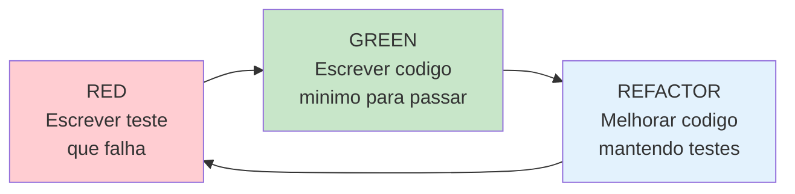
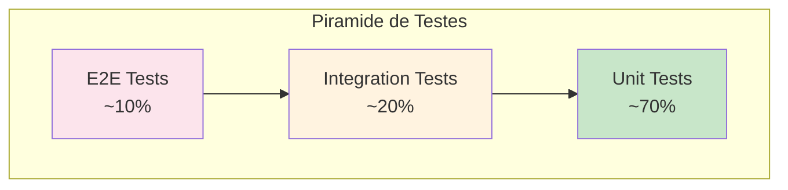

# Test-Driven Development (TDD) - Projeto RADAR

## Visao Geral

TDD e uma pratica de desenvolvimento onde os testes sao escritos **antes** do codigo de producao. O ciclo Red-Green-Refactor guia todo o desenvolvimento.



## Ciclo TDD no RADAR

### 1. RED - Escrever o Teste Primeiro

```python
# tests/unit/domain/value_objects/test_codigo_ibge.py
import pytest
from shared.domain.value_objects.codigo_ibge import CodigoIBGE


class TestCodigoIBGE:
    """Testes para Value Object CodigoIBGE."""

    class TestCreate:
        def test_deve_criar_codigo_ibge_valido_para_boa_vista(self):
            # Arrange
            codigo_bv = "1400100"

            # Act
            result = CodigoIBGE.create(codigo_bv)

            # Assert
            assert result.is_success
            assert result.value.valor == "1400100"

        def test_deve_rejeitar_codigo_ibge_com_menos_de_7_digitos(self):
            # Arrange
            codigo_invalido = "140010"  # 6 digitos

            # Act
            result = CodigoIBGE.create(codigo_invalido)

            # Assert
            assert result.is_failure
            assert "invalido" in result.error.lower()

        def test_deve_rejeitar_codigo_ibge_de_outro_estado(self):
            # Arrange
            codigo_sp = "3550308"  # Sao Paulo

            # Act
            result = CodigoIBGE.create(codigo_sp)

            # Assert
            assert result.is_failure
            assert "Roraima" in result.error

    class TestEquals:
        def test_deve_ser_igual_quando_valores_sao_iguais(self):
            ibge1 = CodigoIBGE.create("1400100").value
            ibge2 = CodigoIBGE.create("1400100").value

            assert ibge1 == ibge2
```

**Neste ponto, o teste FALHA porque `CodigoIBGE` nao existe.**

### 2. GREEN - Implementar o Minimo Necessario

```python
# shared/domain/value_objects/codigo_ibge.py
from dataclasses import dataclass
from ..result import Result


@dataclass(frozen=True)
class CodigoIBGE:
    valor: str

    MUNICIPIOS_RORAIMA = frozenset([
        "1400050", "1400027", "1400100", "1400159", "1400175",
        "1400209", "1400233", "1400282", "1400308", "1400407",
        "1400456", "1400472", "1400506", "1400605", "1400704"
    ])

    def __post_init__(self) -> None:
        if len(self.valor) != 7 or not self.valor.isdigit():
            raise ValueError(f"Codigo IBGE invalido: {self.valor}")
        if self.valor not in self.MUNICIPIOS_RORAIMA:
            raise ValueError(f"Codigo IBGE nao pertence a Roraima: {self.valor}")

    @classmethod
    def create(cls, codigo: str | int) -> "Result[CodigoIBGE]":
        try:
            valor = str(codigo).zfill(7)
            return Result.ok(cls(valor=valor))
        except ValueError as e:
            return Result.fail(str(e))
```

**Agora o teste PASSA.**

### 3. REFACTOR - Melhorar sem Quebrar Testes

```python
# Extrair validacoes para metodos privados
@dataclass(frozen=True)
class CodigoIBGE:
    valor: str

    MUNICIPIOS_RORAIMA = frozenset([...])

    def __post_init__(self) -> None:
        self._validate()

    def _validate(self) -> None:
        if not self._has_seven_digits():
            raise ValueError(f"Codigo IBGE invalido: {self.valor}")
        if not self._belongs_to_roraima():
            raise ValueError(f"Codigo IBGE nao pertence a Roraima: {self.valor}")

    def _has_seven_digits(self) -> bool:
        return len(self.valor) == 7 and self.valor.isdigit()

    def _belongs_to_roraima(self) -> bool:
        return self.valor in self.MUNICIPIOS_RORAIMA

    @classmethod
    def create(cls, codigo: str | int) -> "Result[CodigoIBGE]":
        try:
            valor = str(codigo).zfill(7)
            return Result.ok(cls(valor=valor))
        except ValueError as e:
            return Result.fail(str(e))
```

**Testes continuam PASSANDO.**

---

## Piramide de Testes



### Distribuicao no RADAR

| Tipo | Quantidade | Cobertura | Velocidade |
|------|------------|-----------|------------|
| **Unit** | ~70% | Value Objects, Entities, Services | < 1ms cada |
| **Integration** | ~20% | Repositories, Use Cases | < 100ms cada |
| **E2E** | ~10% | Rotas HTTP, Fluxo completo | < 1s cada |

---

## Exemplos de Testes por Camada

### Testes Unitarios - Dominio

```python
# tests/unit/domain/value_objects/test_tipo_interrupcao.py
import pytest
from shared.domain.value_objects.tipo_interrupcao import TipoInterrupcao


class TestTipoInterrupcao:
    class TestFromPlanId:
        def test_deve_retornar_programada_quando_plan_id_existe(self):
            tipo = TipoInterrupcao.from_plan_id(12345)
            assert tipo.is_programada() is True

        def test_deve_retornar_nao_programada_quando_plan_id_e_none(self):
            tipo = TipoInterrupcao.from_plan_id(None)
            assert tipo.is_programada() is False


# tests/unit/domain/entities/test_interrupcao.py
class TestInterrupcao:
    class TestIsAtiva:
        def test_deve_ser_ativa_quando_data_fim_e_none(self):
            interrupcao = Interrupcao.create({
                "id": 1,
                "tipo": TipoInterrupcao.PROGRAMADA,
                "municipio": CodigoIBGE.create("1400100").value,
                "conjunto": 1,
                "ucs_afetadas": 100,
                "data_inicio": datetime.now(),
                "data_fim": None,
            }).value

            assert interrupcao.is_ativa() is True

        def test_deve_ser_inativa_quando_data_fim_existe(self):
            interrupcao = Interrupcao.create({
                "id": 1,
                "tipo": TipoInterrupcao.PROGRAMADA,
                "municipio": CodigoIBGE.create("1400100").value,
                "conjunto": 1,
                "ucs_afetadas": 100,
                "data_inicio": datetime(2025, 1, 1),
                "data_fim": datetime(2025, 1, 2),
            }).value

            assert interrupcao.is_ativa() is False
```

### Testes Unitarios - Domain Services

```python
# tests/unit/domain/services/test_interrupcao_aggregator.py
class TestInterrupcaoAggregatorService:
    @pytest.fixture
    def service(self):
        return InterrupcaoAggregatorService()

    def test_deve_agregar_interrupcoes_por_municipio_e_conjunto(self, service):
        # Arrange
        municipio = CodigoIBGE.create("1400100").value
        interrupcoes = [
            create_interrupcao(municipio=municipio, conjunto=1, tipo="PROGRAMADA", ucs=50),
            create_interrupcao(municipio=municipio, conjunto=1, tipo="PROGRAMADA", ucs=30),
            create_interrupcao(municipio=municipio, conjunto=1, tipo="NAO_PROGRAMADA", ucs=20),
        ]

        # Act
        agregadas = service.agregar(interrupcoes)

        # Assert
        assert len(agregadas) == 1
        assert agregadas[0].qtd_programada == 80
        assert agregadas[0].qtd_nao_programada == 20

    def test_deve_separar_por_conjunto_diferente(self, service):
        municipio = CodigoIBGE.create("1400100").value
        interrupcoes = [
            create_interrupcao(municipio=municipio, conjunto=1, tipo="PROGRAMADA", ucs=50),
            create_interrupcao(municipio=municipio, conjunto=2, tipo="PROGRAMADA", ucs=30),
        ]

        agregadas = service.agregar(interrupcoes)

        assert len(agregadas) == 2
```

### Testes de Integracao - Repositories

```python
# tests/integration/repositories/test_oracle_interrupcao_repository.py
import pytest
from sqlalchemy.ext.asyncio import AsyncSession


@pytest.mark.integration
class TestOracleInterrupcaoRepository:
    @pytest.fixture
    async def repository(self, db_session: AsyncSession):
        return OracleInterrupcaoRepository(db_session)

    async def test_deve_retornar_apenas_interrupcoes_com_is_open_t(
        self,
        repository: OracleInterrupcaoRepository,
    ):
        # Act
        interrupcoes = await repository.buscar_ativas()

        # Assert
        assert all(i.is_ativa() for i in interrupcoes)

    async def test_deve_mapear_corretamente_os_campos_do_banco(
        self,
        repository: OracleInterrupcaoRepository,
    ):
        interrupcoes = await repository.buscar_ativas()

        if interrupcoes:
            interrupcao = interrupcoes[0]
            assert isinstance(interrupcao.id, int)
            assert isinstance(interrupcao._tipo, TipoInterrupcao)
            assert isinstance(interrupcao.municipio, CodigoIBGE)
```

### Testes de Integracao - Use Cases

```python
# tests/integration/use_cases/test_get_interrupcoes_ativas.py
@pytest.mark.integration
class TestGetInterrupcoesAtivasUseCase:
    @pytest.fixture
    def use_case(self):
        repository = InMemoryInterrupcaoRepository()
        cache = InMemoryCacheService()
        return GetInterrupcoesAtivasUseCase(repository, cache)

    async def test_deve_retornar_dados_do_cache_quando_disponivel(
        self,
        use_case: GetInterrupcoesAtivasUseCase,
    ):
        # Arrange
        cached_data = [create_agregada(qtd_programada=100)]
        await use_case._cache.set("interrupcoes:ativas", cached_data, 300)

        # Act
        result = await use_case.execute()

        # Assert
        assert result.is_success
        assert result.value == cached_data

    async def test_deve_buscar_do_repositorio_quando_cache_vazio(
        self,
        use_case: GetInterrupcoesAtivasUseCase,
    ):
        # Arrange
        interrupcoes = [
            create_interrupcao(tipo="PROGRAMADA", ucs=50),
            create_interrupcao(tipo="NAO_PROGRAMADA", ucs=30),
        ]
        await use_case._repository.save(interrupcoes)

        # Act
        result = await use_case.execute()

        # Assert
        assert result.is_success
        assert result.value[0].qtd_programada == 50
        assert result.value[0].qtd_nao_programada == 30
```

### Testes E2E - API

```python
# tests/e2e/api/test_interrupcoes.py
import pytest
from httpx import AsyncClient
from fastapi import status


@pytest.mark.e2e
class TestQuantitativoInterrupcoesAtivas:
    async def test_deve_retornar_200_com_formato_aneel(
        self,
        client: AsyncClient,
        api_key: str,
    ):
        response = await client.get(
            "/quantitativointerrupcoesativas",
            headers={"x-api-key": api_key},
        )

        assert response.status_code == status.HTTP_200_OK

        body = response.json()
        assert body["idcStatusRequisicao"] == 1
        assert body["desStatusRequisicao"] == "Sucesso"
        assert isinstance(body["listaInterrupcoes"], list)

    async def test_deve_retornar_401_sem_api_key(
        self,
        client: AsyncClient,
    ):
        response = await client.get("/quantitativointerrupcoesativas")

        assert response.status_code == status.HTTP_401_UNAUTHORIZED

    async def test_deve_incluir_campos_obrigatorios_na_resposta(
        self,
        client: AsyncClient,
        api_key: str,
    ):
        response = await client.get(
            "/quantitativointerrupcoesativas",
            headers={"x-api-key": api_key},
        )

        body = response.json()
        if body["listaInterrupcoes"]:
            item = body["listaInterrupcoes"][0]
            assert "ideConjuntoUnidadeConsumidora" in item
            assert "ideMunicipio" in item
            assert "qtdUCsAtendidas" in item
            assert "qtdOcorrenciaProgramada" in item
            assert "qtdOcorrenciaNaoProgramada" in item
```

---

## Estrutura de Diretorios de Testes

```
backend/tests/
├── unit/                           # Testes unitarios
│   ├── domain/
│   │   ├── entities/
│   │   │   └── test_interrupcao.py
│   │   ├── value_objects/
│   │   │   ├── test_codigo_ibge.py
│   │   │   └── test_tipo_interrupcao.py
│   │   └── services/
│   │       └── test_interrupcao_aggregator.py
│   └── shared/
│       └── test_result.py
│
├── integration/                    # Testes de integracao
│   ├── repositories/
│   │   └── test_oracle_interrupcao_repository.py
│   └── use_cases/
│       └── test_get_interrupcoes_ativas.py
│
├── e2e/                            # Testes end-to-end
│   └── api/
│       ├── test_interrupcoes.py
│       ├── test_demandas.py
│       └── test_health.py
│
├── fixtures/                       # Dados de teste
│   ├── interrupcoes.py
│   └── demandas.py
│
├── conftest.py                     # Configuracao pytest
└── helpers/                        # Funcoes auxiliares
    ├── factories.py
    └── mock_repositories.py
```

---

## Configuracao Pytest

```python
# pyproject.toml
[tool.pytest.ini_options]
testpaths = ["backend/tests"]
python_files = ["test_*.py"]
python_classes = ["Test*"]
python_functions = ["test_*"]
asyncio_mode = "auto"
markers = [
    "unit: Testes unitarios",
    "integration: Testes de integracao",
    "e2e: Testes end-to-end",
]

[tool.coverage.run]
source = ["backend"]
omit = ["backend/tests/*", "**/__init__.py"]

[tool.coverage.report]
fail_under = 80
exclude_lines = [
    "pragma: no cover",
    "if TYPE_CHECKING:",
    "raise NotImplementedError",
]
```

```python
# backend/tests/conftest.py
import pytest
from httpx import AsyncClient
from sqlalchemy.ext.asyncio import AsyncSession, create_async_engine

from backend.apps.api_interrupcoes.main import create_app


@pytest.fixture
def app():
    return create_app()


@pytest.fixture
async def client(app):
    async with AsyncClient(app=app, base_url="http://test") as client:
        yield client


@pytest.fixture
def api_key():
    return "test-api-key"
```

---

## Comandos de Teste

```bash
# Todos os testes
pytest

# Apenas testes unitarios
pytest -m unit

# Apenas testes de integracao
pytest -m integration

# Apenas testes e2e
pytest -m e2e

# Com cobertura
pytest --cov=backend --cov-report=html

# Modo watch (reexecuta ao salvar)
pytest-watch

# Verbose com output
pytest -v -s
```

---

## Checklist TDD

### Antes de Escrever Codigo
- [ ] Teste escrito primeiro (RED)
- [ ] Teste falha pelo motivo correto
- [ ] Teste e claro e legivel

### Ao Implementar
- [ ] Codigo minimo para passar (GREEN)
- [ ] Sem codigo desnecessario
- [ ] Todos os testes passam

### Apos Implementar
- [ ] Codigo refatorado (REFACTOR)
- [ ] Duplicacao removida
- [ ] Nomes claros
- [ ] Testes ainda passam

### Cobertura
- [ ] Cobertura de linhas >= 80%
- [ ] Cobertura de branches >= 80%
- [ ] Casos de borda testados
- [ ] Erros e excecoes testados
