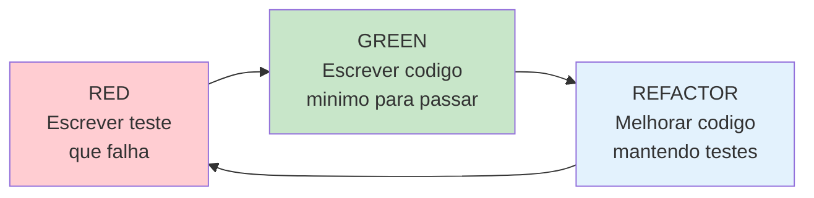
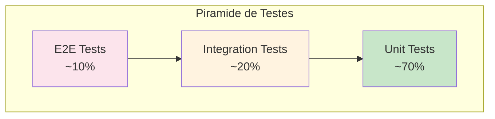

# Test-Driven Development (TDD) - Projeto RADAR

## Visao Geral

TDD e uma pratica de desenvolvimento onde os testes sao escritos **antes** do codigo de producao. O ciclo Red-Green-Refactor guia todo o desenvolvimento.



## Ciclo TDD no RADAR

### 1. RED - Escrever o Teste Primeiro

```typescript
// tests/unit/domain/value-objects/codigo-ibge.spec.ts
import { describe, it, expect } from 'vitest';
import { CodigoIBGE } from '@/domain/value-objects/codigo-ibge.vo';

describe('CodigoIBGE', () => {
  describe('create', () => {
    it('deve criar codigo IBGE valido para Boa Vista', () => {
      // Arrange
      const codigoBv = 1400100;

      // Act
      const result = CodigoIBGE.create(codigoBv);

      // Assert
      expect(result.isSuccess).toBe(true);
      expect(result.getValue().valor).toBe(1400100);
    });

    it('deve rejeitar codigo IBGE com menos de 7 digitos', () => {
      // Arrange
      const codigoInvalido = 140010; // 6 digitos

      // Act
      const result = CodigoIBGE.create(codigoInvalido);

      // Assert
      expect(result.isFailure).toBe(true);
      expect(result.getError()).toContain('invalido');
    });

    it('deve rejeitar codigo IBGE de outro estado', () => {
      // Arrange
      const codigoSP = 3550308; // Sao Paulo

      // Act
      const result = CodigoIBGE.create(codigoSP);

      // Assert
      expect(result.isFailure).toBe(true);
      expect(result.getError()).toContain('Roraima');
    });
  });

  describe('equals', () => {
    it('deve ser igual quando valores sao iguais', () => {
      const ibge1 = CodigoIBGE.create(1400100).getValue();
      const ibge2 = CodigoIBGE.create(1400100).getValue();

      expect(ibge1.equals(ibge2)).toBe(true);
    });
  });
});
```

**Neste ponto, o teste FALHA porque `CodigoIBGE` nao existe.**

### 2. GREEN - Implementar o Minimo Necessario

```typescript
// domain/value-objects/codigo-ibge.vo.ts
import { Result } from '@/shared/result';

export class CodigoIBGE {
  private static readonly MUNICIPIOS_RORAIMA = [
    1400050, 1400027, 1400100, 1400159, 1400175,
    1400209, 1400233, 1400282, 1400308, 1400407,
    1400456, 1400472, 1400506, 1400605, 1400704
  ];

  private constructor(private readonly _valor: number) {}

  static create(codigo: number): Result<CodigoIBGE> {
    if (codigo < 1000000 || codigo > 9999999) {
      return Result.fail(`Codigo IBGE invalido: ${codigo}`);
    }

    if (!this.MUNICIPIOS_RORAIMA.includes(codigo)) {
      return Result.fail(`Codigo IBGE nao pertence a Roraima: ${codigo}`);
    }

    return Result.ok(new CodigoIBGE(codigo));
  }

  get valor(): number {
    return this._valor;
  }

  equals(other: CodigoIBGE): boolean {
    return this._valor === other._valor;
  }
}
```

**Agora o teste PASSA.**

### 3. REFACTOR - Melhorar sem Quebrar Testes

```typescript
// Extrair validacoes para metodos privados
export class CodigoIBGE {
  private static readonly MUNICIPIOS_RORAIMA = [...];

  private constructor(private readonly _valor: number) {}

  static create(codigo: number): Result<CodigoIBGE> {
    const validation = this.validate(codigo);
    if (validation.isFailure) {
      return Result.fail(validation.getError());
    }

    return Result.ok(new CodigoIBGE(codigo));
  }

  private static validate(codigo: number): Result<void> {
    if (!this.hasSevenDigits(codigo)) {
      return Result.fail(`Codigo IBGE invalido: ${codigo}`);
    }

    if (!this.belongsToRoraima(codigo)) {
      return Result.fail(`Codigo IBGE nao pertence a Roraima: ${codigo}`);
    }

    return Result.ok();
  }

  private static hasSevenDigits(codigo: number): boolean {
    return codigo >= 1000000 && codigo <= 9999999;
  }

  private static belongsToRoraima(codigo: number): boolean {
    return this.MUNICIPIOS_RORAIMA.includes(codigo);
  }

  // ... resto do codigo
}
```

**Testes continuam PASSANDO.**

---

## Piramide de Testes



### Distribuicao no RADAR

| Tipo | Quantidade | Cobertura | Velocidade |
|------|------------|-----------|------------|
| **Unit** | ~70% | Value Objects, Entities, Services | < 1ms cada |
| **Integration** | ~20% | Repositories, Use Cases | < 100ms cada |
| **E2E** | ~10% | Rotas HTTP, Fluxo completo | < 1s cada |

---

## Exemplos de Testes por Camada

### Testes Unitarios - Dominio

```typescript
// tests/unit/domain/value-objects/tipo-interrupcao.spec.ts
describe('TipoInterrupcao', () => {
  describe('fromPlanId', () => {
    it('deve retornar PROGRAMADA quando PLAN_ID existe', () => {
      const tipo = TipoInterrupcao.fromPlanId(12345);
      expect(tipo.isProgramada()).toBe(true);
    });

    it('deve retornar NAO_PROGRAMADA quando PLAN_ID e null', () => {
      const tipo = TipoInterrupcao.fromPlanId(null);
      expect(tipo.isProgramada()).toBe(false);
    });
  });
});

// tests/unit/domain/entities/interrupcao.spec.ts
describe('Interrupcao', () => {
  describe('isAtiva', () => {
    it('deve ser ativa quando dataFim e null', () => {
      const interrupcao = Interrupcao.create({
        id: 1,
        tipo: TipoInterrupcao.PROGRAMADA,
        municipio: CodigoIBGE.create(1400100).getValue(),
        conjunto: 1,
        ucsAfetadas: 100,
        dataInicio: new Date(),
        dataFim: null
      }).getValue();

      expect(interrupcao.isAtiva()).toBe(true);
    });

    it('deve ser inativa quando dataFim existe', () => {
      const interrupcao = Interrupcao.create({
        id: 1,
        tipo: TipoInterrupcao.PROGRAMADA,
        municipio: CodigoIBGE.create(1400100).getValue(),
        conjunto: 1,
        ucsAfetadas: 100,
        dataInicio: new Date('2025-01-01'),
        dataFim: new Date('2025-01-02')
      }).getValue();

      expect(interrupcao.isAtiva()).toBe(false);
    });
  });
});
```

### Testes Unitarios - Domain Services

```typescript
// tests/unit/domain/services/interrupcao-aggregator.spec.ts
describe('InterrupcaoAggregatorService', () => {
  let service: InterrupcaoAggregatorService;

  beforeEach(() => {
    service = new InterrupcaoAggregatorService();
  });

  it('deve agregar interrupcoes por municipio e conjunto', () => {
    // Arrange
    const municipio = CodigoIBGE.create(1400100).getValue();
    const interrupcoes = [
      createInterrupcao({ municipio, conjunto: 1, tipo: 'PROGRAMADA', ucs: 50 }),
      createInterrupcao({ municipio, conjunto: 1, tipo: 'PROGRAMADA', ucs: 30 }),
      createInterrupcao({ municipio, conjunto: 1, tipo: 'NAO_PROGRAMADA', ucs: 20 })
    ];

    // Act
    const agregadas = service.agregar(interrupcoes);

    // Assert
    expect(agregadas).toHaveLength(1);
    expect(agregadas[0].qtdProgramada).toBe(80);
    expect(agregadas[0].qtdNaoProgramada).toBe(20);
  });

  it('deve separar por conjunto diferente', () => {
    const municipio = CodigoIBGE.create(1400100).getValue();
    const interrupcoes = [
      createInterrupcao({ municipio, conjunto: 1, tipo: 'PROGRAMADA', ucs: 50 }),
      createInterrupcao({ municipio, conjunto: 2, tipo: 'PROGRAMADA', ucs: 30 })
    ];

    const agregadas = service.agregar(interrupcoes);

    expect(agregadas).toHaveLength(2);
  });
});
```

### Testes de Integracao - Repositories

```typescript
// tests/integration/infrastructure/repositories/oracle-interrupcao.repository.spec.ts
describe('OracleInterrupcaoRepository', () => {
  let repository: OracleInterrupcaoRepository;
  let pool: oracledb.Pool;

  beforeAll(async () => {
    pool = await createTestPool();
    repository = new OracleInterrupcaoRepository(pool);
  });

  afterAll(async () => {
    await pool.close();
  });

  describe('findAtivas', () => {
    it('deve retornar apenas interrupcoes com is_open = T', async () => {
      // Arrange - dados de teste inseridos via fixture

      // Act
      const interrupcoes = await repository.findAtivas();

      // Assert
      expect(interrupcoes.every(i => i.isAtiva())).toBe(true);
    });

    it('deve mapear corretamente os campos do banco', async () => {
      const interrupcoes = await repository.findAtivas();

      expect(interrupcoes[0]).toMatchObject({
        id: expect.any(Number),
        tipo: expect.any(TipoInterrupcao),
        municipio: expect.any(CodigoIBGE),
        conjunto: expect.any(Number),
        ucsAfetadas: expect.any(Number)
      });
    });
  });
});
```

### Testes de Integracao - Use Cases

```typescript
// tests/integration/application/use-cases/get-interrupcoes-ativas.spec.ts
describe('GetInterrupcoesAtivasUseCase', () => {
  let useCase: GetInterrupcoesAtivasUseCase;
  let repository: InterrupcaoRepository;
  let cache: CacheRepository;

  beforeEach(() => {
    repository = new InMemoryInterrupcaoRepository();
    cache = new InMemoryCacheRepository();
    useCase = new GetInterrupcoesAtivasUseCase(repository, cache);
  });

  it('deve retornar dados do cache quando disponivel', async () => {
    // Arrange
    const cachedData = [createAgregada({ qtdProgramada: 100 })];
    await cache.set('interrupcoes:ativas', cachedData, 300);

    // Act
    const result = await useCase.execute();

    // Assert
    expect(result.isSuccess).toBe(true);
    expect(result.getValue()).toEqual(cachedData);
  });

  it('deve buscar do repositorio quando cache vazio', async () => {
    // Arrange
    const interrupcoes = [
      createInterrupcao({ tipo: 'PROGRAMADA', ucs: 50 }),
      createInterrupcao({ tipo: 'NAO_PROGRAMADA', ucs: 30 })
    ];
    await repository.save(interrupcoes);

    // Act
    const result = await useCase.execute();

    // Assert
    expect(result.isSuccess).toBe(true);
    expect(result.getValue()[0].qtdProgramada).toBe(50);
    expect(result.getValue()[0].qtdNaoProgramada).toBe(30);
  });

  it('deve armazenar resultado no cache', async () => {
    // Arrange
    await repository.save([createInterrupcao({ ucs: 100 })]);

    // Act
    await useCase.execute();

    // Assert
    const cached = await cache.get('interrupcoes:ativas');
    expect(cached).not.toBeNull();
  });
});
```

### Testes E2E - API

```typescript
// tests/e2e/api/interrupcoes.e2e.spec.ts
describe('GET /quantitativointerrupcoesativas', () => {
  let app: FastifyInstance;

  beforeAll(async () => {
    app = await buildApp();
  });

  afterAll(async () => {
    await app.close();
  });

  it('deve retornar 200 com formato ANEEL', async () => {
    const response = await app.inject({
      method: 'GET',
      url: '/quantitativointerrupcoesativas',
      headers: {
        'x-api-key': process.env.API_KEY
      }
    });

    expect(response.statusCode).toBe(200);

    const body = JSON.parse(response.body);
    expect(body).toMatchObject({
      idcStatusRequisicao: 1,
      desStatusRequisicao: 'Sucesso',
      listaInterrupcoes: expect.any(Array)
    });
  });

  it('deve retornar 401 sem API Key', async () => {
    const response = await app.inject({
      method: 'GET',
      url: '/quantitativointerrupcoesativas'
    });

    expect(response.statusCode).toBe(401);
  });

  it('deve incluir campos obrigatorios na resposta', async () => {
    const response = await app.inject({
      method: 'GET',
      url: '/quantitativointerrupcoesativas',
      headers: { 'x-api-key': process.env.API_KEY }
    });

    const body = JSON.parse(response.body);
    const item = body.listaInterrupcoes[0];

    expect(item).toHaveProperty('ideConjuntoUnidadeConsumidora');
    expect(item).toHaveProperty('ideMunicipio');
    expect(item).toHaveProperty('qtdUCsAtendidas');
    expect(item).toHaveProperty('qtdOcorrenciaProgramada');
    expect(item).toHaveProperty('qtdOcorrenciaNaoProgramada');
  });
});
```

---

## Estrutura de Diretorios de Testes

```
tests/
├── unit/                           # Testes unitarios
│   ├── domain/
│   │   ├── entities/
│   │   │   └── interrupcao.spec.ts
│   │   ├── value-objects/
│   │   │   ├── codigo-ibge.spec.ts
│   │   │   └── tipo-interrupcao.spec.ts
│   │   └── services/
│   │       └── interrupcao-aggregator.spec.ts
│   ├── application/
│   │   ├── use-cases/
│   │   │   └── get-interrupcoes-ativas.spec.ts
│   │   └── mappers/
│   │       └── interrupcao.mapper.spec.ts
│   └── shared/
│       └── result.spec.ts
│
├── integration/                    # Testes de integracao
│   ├── infrastructure/
│   │   ├── repositories/
│   │   │   └── oracle-interrupcao.repository.spec.ts
│   │   └── cache/
│   │       └── memory-cache.service.spec.ts
│   └── application/
│       └── use-cases/
│           └── get-interrupcoes-with-cache.spec.ts
│
├── e2e/                            # Testes end-to-end
│   └── api/
│       ├── interrupcoes.e2e.spec.ts
│       ├── demandas.e2e.spec.ts
│       └── health.e2e.spec.ts
│
├── fixtures/                       # Dados de teste
│   ├── interrupcoes.fixture.ts
│   └── demandas.fixture.ts
│
└── helpers/                        # Funcoes auxiliares
    ├── test-factories.ts
    ├── mock-repositories.ts
    └── test-database.ts
```

---

## Configuracao Vitest

```typescript
// vitest.config.ts
import { defineConfig } from 'vitest/config';
import path from 'path';

export default defineConfig({
  test: {
    globals: true,
    environment: 'node',
    include: ['tests/**/*.spec.ts'],
    exclude: ['tests/e2e/**'],
    coverage: {
      provider: 'v8',
      reporter: ['text', 'html', 'lcov'],
      exclude: [
        'node_modules/',
        'tests/',
        'src/shared/config/',
        '**/*.d.ts'
      ],
      thresholds: {
        branches: 80,
        functions: 80,
        lines: 80,
        statements: 80
      }
    },
    setupFiles: ['tests/helpers/setup.ts']
  },
  resolve: {
    alias: {
      '@': path.resolve(__dirname, './src')
    }
  }
});

// vitest.config.e2e.ts
export default defineConfig({
  test: {
    globals: true,
    environment: 'node',
    include: ['tests/e2e/**/*.spec.ts'],
    testTimeout: 30000,
    hookTimeout: 30000
  }
});
```

---

## Scripts NPM

```json
{
  "scripts": {
    "test": "vitest run",
    "test:watch": "vitest",
    "test:unit": "vitest run tests/unit",
    "test:integration": "vitest run tests/integration",
    "test:e2e": "vitest run --config vitest.config.e2e.ts",
    "test:coverage": "vitest run --coverage",
    "test:ci": "vitest run --coverage --reporter=junit"
  }
}
```

---

## Checklist TDD

### Antes de Escrever Codigo
- [ ] Teste escrito primeiro (RED)
- [ ] Teste falha pelo motivo correto
- [ ] Teste e claro e legivel

### Ao Implementar
- [ ] Codigo minimo para passar (GREEN)
- [ ] Sem codigo desnecessario
- [ ] Todos os testes passam

### Apos Implementar
- [ ] Codigo refatorado (REFACTOR)
- [ ] Duplicacao removida
- [ ] Nomes claros
- [ ] Testes ainda passam

### Cobertura
- [ ] Cobertura de linhas >= 80%
- [ ] Cobertura de branches >= 80%
- [ ] Casos de borda testados
- [ ] Erros e excecoes testados
