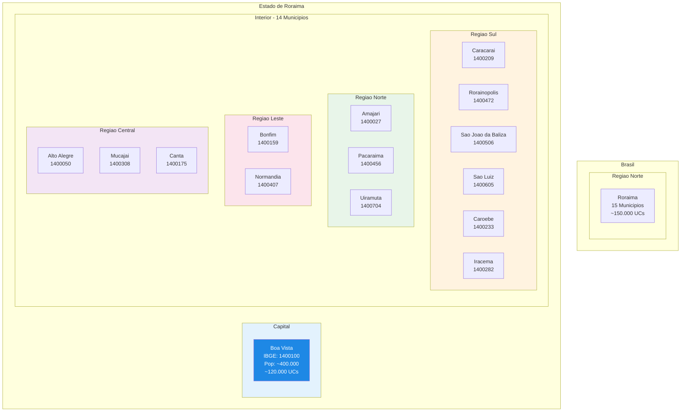
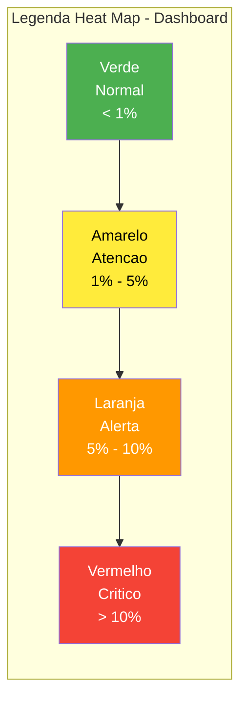
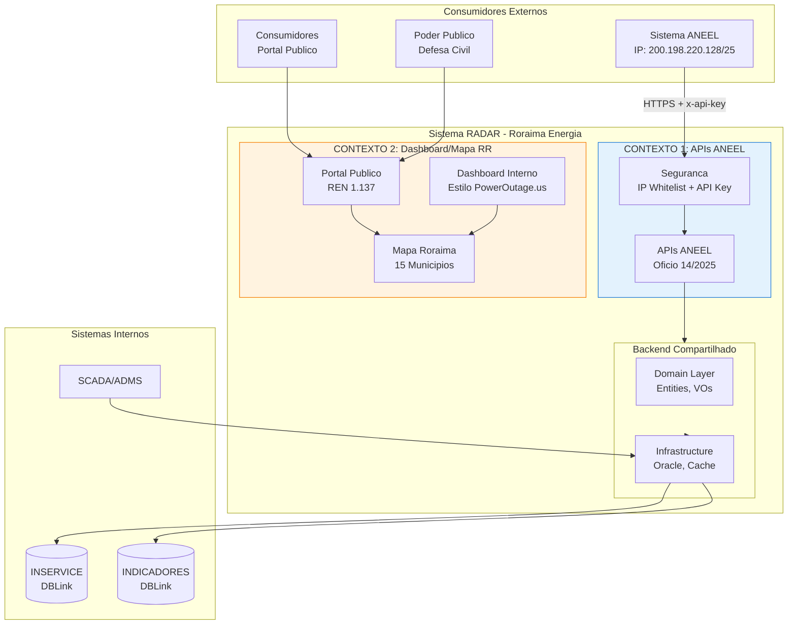
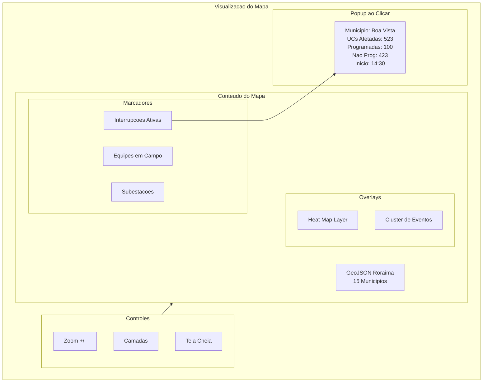
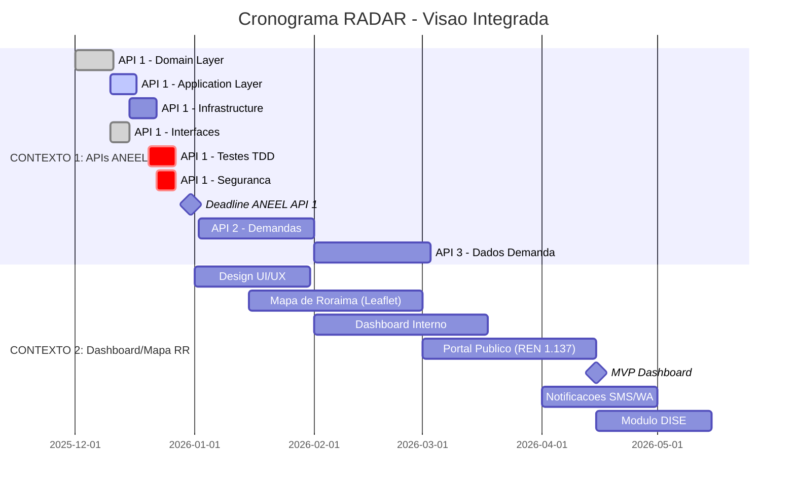

# Visibilidade Integrada - Projeto RADAR

**Projeto:** RADAR - Sistema de Monitoramento de Interrupcoes e Demandas
**Empresa:** Roraima Energia S/A
**Versao:** 1.0
**Data:** 2025-12-19

---

## Sumario Executivo

Este documento apresenta a visao integrada do Projeto RADAR, separando claramente:

1. **APIs ANEEL** (Requisitos Regulatorios) - Oficio Circular 14/2025-SFE/ANEEL
2. **Dashboard/Mapa Roraima Energia** (Estilo PowerOutage.us) - REN 1.137/2025

---

## Indice

1. [Mapa de Roraima e Localidades](#1-mapa-de-roraima-e-localidades)
2. [Arquitetura de Alto Nivel](#2-arquitetura-de-alto-nivel)
3. [Contexto 1: APIs ANEEL](#3-contexto-1-apis-aneel)
4. [Contexto 2: Dashboard/Mapa Roraima Energia](#4-contexto-2-dashboardmapa-roraima-energia)
5. [Matriz de Rastreabilidade - Tasks vs Diagramas](#5-matriz-de-rastreabilidade)
6. [Cronograma Integrado](#6-cronograma-integrado)
7. [Aderencia aos Requisitos ANEEL](#7-aderencia-aos-requisitos-aneel)

---

## 1. Mapa de Roraima e Localidades

### 1.1 Estrutura Geografica do Estado



### 1.2 Tabela de Municipios com Codigos IBGE

| # | Municipio | Codigo IBGE | Regiao | UCs Estimadas |
|---|-----------|-------------|--------|---------------|
| 1 | **Boa Vista** | 1400100 | Capital | ~120.000 |
| 2 | Alto Alegre | 1400050 | Central | ~3.000 |
| 3 | Amajari | 1400027 | Norte | ~2.000 |
| 4 | Bonfim | 1400159 | Leste | ~3.000 |
| 5 | Canta | 1400175 | Central | ~2.500 |
| 6 | Caracarai | 1400209 | Sul | ~5.000 |
| 7 | Caroebe | 1400233 | Sul | ~1.500 |
| 8 | Iracema | 1400282 | Sul | ~1.500 |
| 9 | Mucajai | 1400308 | Central | ~3.000 |
| 10 | Normandia | 1400407 | Leste | ~2.000 |
| 11 | Pacaraima | 1400456 | Norte | ~2.500 |
| 12 | Rorainopolis | 1400472 | Sul | ~4.000 |
| 13 | Sao Joao da Baliza | 1400506 | Sul | ~1.500 |
| 14 | Sao Luiz | 1400605 | Sul | ~1.500 |
| 15 | Uiramuta | 1400704 | Norte | ~1.500 |

**Total Roraima:** ~150.000 UCs

### 1.3 Niveis de Severidade - Heat Map



**Formula de Calculo:**
```
Percentual = (qtdProgramada + qtdNaoProgramada) / qtdUCsAtendidas x 100
```

---

## 2. Arquitetura de Alto Nivel

### 2.1 Visao Geral - Dois Contextos Principais



---

## 3. Contexto 1: APIs ANEEL

### 3.1 Visao Geral

**Objetivo:** Atender requisitos regulatorios do Oficio Circular 14/2025-SFE/ANEEL

**Prazo:** Dezembro/2025

**Status Atual:** 54% Completo

### 3.2 APIs a Implementar

| API | Endpoint | Descricao | Prazo | Status |
|-----|----------|-----------|-------|--------|
| **API 1** | `/quantitativointerrupcoesativas` | Interrupcoes Ativas | Dez/2025 | **PRIORIDADE** |
| **API 2** | `/dadosdemanda` | Dados de Demanda | Dez/2025 | Planejado |
| **API 3** | `/quantitativodemandasdiversas` | Demandas Diversas | Dez/2025 | Planejado |
| **API 4** | REN 1.137 | Tempo Real | 60 dias apos | Pendente |

### 3.3 Requisitos de Seguranca ANEEL

| Requisito | Especificacao | Task | Status |
|-----------|---------------|------|--------|
| **IP Whitelist** | 200.198.220.128/25 | RAD-130 | Pendente |
| **API Key** | Header x-api-key | RAD-122 | Pendente |
| **Rate Limiting** | 10 req/min | RAD-123 | Pendente |
| **HTTPS** | TLS 1.2+ | Infra | Configurar |

### 3.4 Formato de Resposta ANEEL

```json
{
  "idcStatusRequisicao": 1,
  "emailIndisponibilidade": "radar@roraimaenergia.com.br",
  "mensagem": "",
  "interrupcaoFornecimento": [
    {
      "ideConjuntoUnidadeConsumidora": 1,
      "ideMunicipio": 1400100,
      "qtdUCsAtendidas": 120000,
      "qtdOcorrenciaProgramada": 500,
      "qtdOcorrenciaNaoProgramada": 1200
    }
  ]
}
```

### 3.5 Tasks API 1 - Interrupcoes (RAD-100 a RAD-130)

```mermaid
flowchart LR
    subgraph Fase1["Fase 1: Domain Layer"]
        RAD100[RAD-100<br/>CodigoIBGE]
        RAD101[RAD-101<br/>TipoInterrupcao]
        RAD102[RAD-102<br/>Entity Interrupcao]
        RAD103[RAD-103<br/>Result Pattern]
        RAD104[RAD-104<br/>Protocol Repo]
    end

    subgraph Fase2["Fase 2: Application"]
        RAD105[RAD-105<br/>Aggregator Service]
        RAD106[RAD-106<br/>Cache Protocol]
        RAD107[RAD-107<br/>Use Case]
    end

    subgraph Fase3["Fase 3: Infrastructure"]
        RAD108[RAD-108<br/>Oracle Connection]
        RAD109[RAD-109<br/>Oracle Repository]
        RAD110[RAD-110<br/>Memory Cache]
        RAD111[RAD-111<br/>Settings]
    end

    subgraph Fase4["Fase 4: Interfaces"]
        RAD112[RAD-112<br/>Schemas Pydantic]
        RAD113[RAD-113<br/>Dependencies DI]
        RAD114[RAD-114<br/>Middlewares]
        RAD115[RAD-115<br/>Routes]
        RAD116[RAD-116<br/>Main App]
    end

    subgraph Fase5["Fase 5: Testes TDD"]
        RAD117[RAD-117<br/>Unit VOs]
        RAD118[RAD-118<br/>Unit Entity]
        RAD119[RAD-119<br/>Unit UseCase]
        RAD120[RAD-120<br/>Integration]
        RAD121[RAD-121<br/>E2E]
    end

    subgraph Fase6["Fase 6: Seguranca"]
        RAD122[RAD-122<br/>API Key]
        RAD123[RAD-123<br/>Rate Limit]
        RAD124[RAD-124<br/>Logging]
        RAD125[RAD-125<br/>OpenAPI]
        RAD130[RAD-130<br/>IP Whitelist]
    end

    subgraph Fase7["Fase 7: Database"]
        RAD126[RAD-126<br/>Alembic]
        RAD127[RAD-127<br/>Tabelas Auditoria]
        RAD128[RAD-128<br/>View SQL]
        RAD129[RAD-129<br/>Entity Consulta]
    end

    Fase1 --> Fase2 --> Fase3 --> Fase4 --> Fase5 --> Fase6 --> Fase7

    style Fase6 fill:#ffcdd2
    style RAD130 fill:#f44336,color:#fff
```



---

## 4. Contexto 2: Dashboard/Mapa Roraima Energia

### 4.1 Visao Geral

**Objetivo:** Monitoramento de interrupcoes estilo PowerOutage.us

**Componentes:**
1. **Dashboard Interno** - Para operadores do COD
2. **Portal Publico** - Para consumidores (REN 1.137)
3. **Mapa Roraima** - Visualizacao geografica

### 4.2 Dashboard Interno - Layout PowerOutage.us

```
+------------------------------------------------------------------+
| RORAIMA ENERGIA - RADAR Monitor de Interrupcoes     [14:30] [Att]|
+------------------------------------------------------------------+
|                                                                   |
| [PAINEL ESQUERDO 30%]        | [PAINEL CENTRAL 70%]              |
|                              |                                    |
| Total UCs Afetadas: 1.234    |     +------------------------+    |
| [========] Vermelho          |     |   MAPA DE RORAIMA       |    |
|                              |     |   (Leaflet + GeoJSON)   |    |
| Programadas: 234             |     |                         |    |
| Nao Programadas: 1.000       |     |   [Heat Map Layer]      |    |
| % Estado: 0.82%              |     |   [Markers]             |    |
|                              |     |   [Polygons]            |    |
| Lista Municipios:            |     |                         |    |
| 1. Pacaraima    400 UCs [R]  |     +------------------------+    |
| 2. Boa Vista    523 UCs [O]  |     Legenda: [V] [A] [L] [V]      |
| 3. Caracarai    100 UCs [V]  |                                    |
+------------------------------------------------------------------+
| [Historico 24h - Grafico]  | [Comparativo] | [Estatisticas]     |
+------------------------------------------------------------------+
```

### 4.3 Portal Publico - Requisitos REN 1.137

| Artigo | Requisito | Implementacao |
|--------|-----------|---------------|
| **Art. 105** | Notificacao 15min/1h | SMS/WhatsApp Gateway |
| **Art. 106** | Mapa por bairro (minimo) | GeoJSON + Leaflet |
| **Art. 107** | Faixas de duracao | <1h, 1-3h, 3-6h, 6-12h, 12-24h, 24-48h, >48h |
| **Art. 107** | Status ocorrencia | Em Preparacao / Deslocamento / Em Execucao |
| **Art. 107** | Atualizacao 30 min | Scheduler Celery |
| **Art. 107** | CHI exibido | Calculador DISE |
| **Art. 113** | API Tempo Real | API 4 |

### 4.4 Componentes do Mapa



### 4.5 KPIs e Indicadores

| KPI | Descricao | Alinhamento PowerOutage | Obrigatorio REN 1.137 |
|-----|-----------|-------------------------|------------------------|
| **Total UCs Afetadas** | Destaque principal | Sim | - |
| **Programadas** | Separacao por tipo | Diferencial | - |
| **Nao Programadas** | Separacao por tipo | Diferencial | - |
| **% Estado** | Percentual afetado | Sim | - |
| **CHI** | Consumidor.Hora.Interrompido | Diferencial | **Sim** |
| **Equipes em Campo** | Quantidade ativas | Diferencial | **Sim** |
| **Status Plano Contingencia** | Nivel ativado | Diferencial | **Sim** |

---

## 5. Matriz de Rastreabilidade

### 5.1 Tasks vs Diagramas Mermaid

| Task | Diagrama Relacionado | Secao no Arquivo | Tipo |
|------|---------------------|------------------|------|
| RAD-100 | Modelos de Resposta API | Secao 10 | Class Diagram |
| RAD-101 | Modelos de Resposta API | Secao 10 | Class Diagram |
| RAD-102 | Modelo de Dados (ERD) | Secao 4 | ERD |
| RAD-103 | - | - | Codigo |
| RAD-104 | Modelo de Dados (ERD) | Secao 4 | ERD |
| RAD-105 | Fluxo de Dados | Secao 2 | Sequence |
| RAD-106 | Arquitetura Geral | Secao 1 | Flowchart |
| RAD-107 | Casos de Uso | Secao 8 | Use Case |
| RAD-108 | Integracao Sistemas | Secao 18 | Flowchart |
| RAD-109 | Fluxo Sincronizacao SCADA | Secao 18 | Sequence |
| RAD-110 | Arquitetura Geral (Cache) | Secao 1 | Flowchart |
| RAD-111 | Infraestrutura Deploy | Secao 15 | Flowchart |
| RAD-112 | Modelos de Resposta API | Secao 10 | Class Diagram |
| RAD-113 | Arquitetura Geral | Secao 1 | Flowchart |
| RAD-114 | Arquitetura Geral | Secao 1 | Flowchart |
| RAD-115 | APIs Endpoints ANEEL | Secao 7 | Flowchart |
| RAD-116 | Infraestrutura Deploy | Secao 15 | Flowchart |
| RAD-117 a 121 | - | - | Testes |
| RAD-122 | Fluxo de Autenticacao | Secao 11 | Sequence |
| RAD-123 | - | - | Security |
| RAD-124 | Sistema de Alertas | Secao 16 | Flowchart |
| RAD-125 | APIs Endpoints ANEEL | Secao 7 | Flowchart |
| RAD-126 | Modelo de Dados (ERD) | Secao 4 | ERD |
| RAD-127 | Modelo de Dados (ERD) | Secao 4 | ERD |
| RAD-128 | Modelo de Dados (ERD) | Secao 4 | ERD |
| RAD-129 | Modelo de Dados (ERD) | Secao 4 | ERD |
| RAD-130 | Fluxo de Autenticacao | Secao 11 | Sequence |

### 5.2 Diagramas vs Contexto

| Diagrama | Contexto Principal | Documento de Referencia |
|----------|-------------------|-------------------------|
| Arquitetura Geral | Ambos | DIAGRAMAS_MERMAID Sec. 1 |
| Fluxo APIs ANEEL | API ANEEL | DIAGRAMAS_MERMAID Sec. 2 |
| Fluxo Recuperacao | API ANEEL | DIAGRAMAS_MERMAID Sec. 3 |
| Modelo de Dados | Ambos | DIAGRAMAS_MERMAID Sec. 4 |
| Estados de Demanda | API ANEEL | DIAGRAMAS_MERMAID Sec. 5 |
| Componentes Dashboard | Dashboard RR | DIAGRAMAS_MERMAID Sec. 6 |
| APIs Endpoints ANEEL | API ANEEL | DIAGRAMAS_MERMAID Sec. 7 |
| Casos de Uso | Ambos | DIAGRAMAS_MERMAID Sec. 8 |
| Cronograma | Ambos | DIAGRAMAS_MERMAID Sec. 9 |
| Modelos Resposta API | API ANEEL | DIAGRAMAS_MERMAID Sec. 10 |
| Fluxo Autenticacao | API ANEEL | DIAGRAMAS_MERMAID Sec. 11 |
| Estrutura Geografica | Dashboard RR | DIAGRAMAS_MERMAID Sec. 12 |
| Heat Map | Dashboard RR | DIAGRAMAS_MERMAID Sec. 13 |
| Canais Atendimento | Dashboard RR | DIAGRAMAS_MERMAID Sec. 14 |
| Infraestrutura Deploy | Ambos | DIAGRAMAS_MERMAID Sec. 15 |
| Sistema Alertas | Dashboard RR | DIAGRAMAS_MERMAID Sec. 16 |
| Dashboard PowerOutage | Dashboard RR | DIAGRAMAS_MERMAID Sec. 17 |
| Integracao Sistemas | Ambos | DIAGRAMAS_MERMAID Sec. 18 |
| Portal Publico | Dashboard RR | DIAGRAMAS_MERMAID Sec. 19 |
| Notificacao SMS/WA | Dashboard RR | DIAGRAMAS_MERMAID Sec. 20 |
| Modulo DISE | Dashboard RR | DIAGRAMAS_MERMAID Sec. 21 |
| Fluxo Emergencia | Dashboard RR | DIAGRAMAS_MERMAID Sec. 22 |

---

## 6. Cronograma Integrado

### 6.1 Visao Geral por Contexto



### 6.2 Dependencias entre Contextos

| Contexto 1 (APIs) | Contexto 2 (Dashboard) | Dependencia |
|-------------------|------------------------|-------------|
| Domain Layer | Mapa Roraima | Usa mesmas Entities |
| Infrastructure | Dashboard Backend | Compartilha Oracle |
| API 1 | Portal Publico | Mesmos dados, formato diferente |
| API 4 (REN 1.137) | Portal Publico | Complementar |

---

## 7. Aderencia aos Requisitos ANEEL

### 7.1 Oficio Circular 14/2025-SFE/ANEEL - Checklist

| Secao | Requisito | Task | Status |
|-------|-----------|------|--------|
| **5** | IP Whitelist 200.198.220.128/25 | RAD-130 | Pendente |
| **6.2** | API Key via x-api-key | RAD-122 | Pendente |
| **7** | Endpoint /quantitativointerrupcoesativas | RAD-115 | Pendente |
| **7** | Formato de resposta padrao | RAD-112 | Pendente |
| **7** | Campo idcStatusRequisicao | RAD-112 | Pendente |
| **7** | Campo emailIndisponibilidade | RAD-112 | Pendente |
| **7** | Campo mensagem | RAD-112 | Pendente |
| **7** | Array interrupcaoFornecimento | RAD-112 | Pendente |
| **7** | Campo ideConjuntoUnidadeConsumidora | RAD-112 | Pendente |
| **7** | Campo ideMunicipio (IBGE) | RAD-100 | Pendente |
| **7** | Campo qtdUCsAtendidas | RAD-112 | Pendente |
| **7** | Campo qtdOcorrenciaProgramada | RAD-101 | Pendente |
| **7** | Campo qtdOcorrenciaNaoProgramada | RAD-101 | Pendente |
| **8** | Atualizacao a cada 30 min | RAD-107 | Pendente |
| **8** | Cache de 5 min | RAD-110 | Pendente |

### 7.2 REN 1.137/2025 - Checklist

| Artigo | Requisito | Implementacao | Status |
|--------|-----------|---------------|--------|
| **Art. 105** | Notificacao em ate 15min (causa conhecida) | SMS/WA Gateway | Futuro |
| **Art. 105** | Notificacao em ate 1h (causa desconhecida) | SMS/WA Gateway | Futuro |
| **Art. 106** | Mapa georreferenciado por bairro | GeoJSON Bairros | Futuro |
| **Art. 107** | Faixas de duracao (<1h a >48h) | Portal Publico | Futuro |
| **Art. 107** | Status ocorrencia | Portal Publico | Futuro |
| **Art. 107** | CHI exibido | Calculador DISE | Futuro |
| **Art. 107** | Atualizacao 30 min | Scheduler | Futuro |
| **Art. 110** | Canal SMS | Gateway Zenvia | Futuro |
| **Art. 110** | Canal WhatsApp | Meta Business | Futuro |
| **Art. 113** | API Tempo Real | API 4 | Pendente |
| **Art. 173** | Indicador DISE | Modulo DISE | Futuro |

### 7.3 Gaps Identificados

| Prioridade | Gap | Impacto | Acao Requerida |
|------------|-----|---------|----------------|
| **CRITICA** | Testes TDD 0% | Qualidade | Implementar RAD-117 a 121 |
| **ALTA** | IP Whitelist | Seguranca ANEEL | Implementar RAD-130 |
| **ALTA** | API Key | Seguranca ANEEL | Implementar RAD-122 |
| **ALTA** | Rate Limiting | Seguranca | Implementar RAD-123 |
| **MEDIA** | GeoJSON Bairros | REN 1.137 | Obter dados IBGE |
| **MEDIA** | Mobile Responsivo | UX | Especificar wireframes |

---

## 8. Referencias

### 8.1 Documentos Oficiais ANEEL

- `docs/official/Oficio_Circular_14-2025_SMA-ANEEL_RADAR.pdf`
- `docs/official/REN 1.137-2025.pdf`

### 8.2 Documentos de Design

- `docs/design/DESIGN_ARQUITETURA_RADAR_RR.md` (3.968 linhas)
- `docs/design/DIAGRAMAS_MERMAID_RADAR_RR.md` (1.997 linhas)

### 8.3 Especificacoes de API

- `docs/api-specs/API_01_QUANTITATIVO_INTERRUPCOES_ATIVAS.md`
- `docs/api-specs/openapi-api1-interrupcoes.yaml`

### 8.4 Plano de Implementacao

- `docs/tasks/api-interrupcoes/PLAN.md`
- `docs/tasks/api-interrupcoes/INDEX.md`
- `docs/tasks/api-interrupcoes/EXECUTION_STATUS.md`

### 8.5 Comparativo PowerOutage.us

- `docs/reports/RELATORIO_COMPARATIVO_POWEROUTAGE_US.md`

---

**Documento elaborado em:** 2025-12-19
**Proxima revisao:** Apos conclusao da API 1
**Status:** Ativo

---

## Legenda

| Simbolo | Significado |
|---------|-------------|
| Pendente | Nao iniciado |
| Em Progresso | Em desenvolvimento |
| Completo | Finalizado e testado |
| **CRITICA** | Bloqueia entrega |
| **ALTA** | Muito importante |
| **MEDIA** | Importante mas nao bloqueante |
