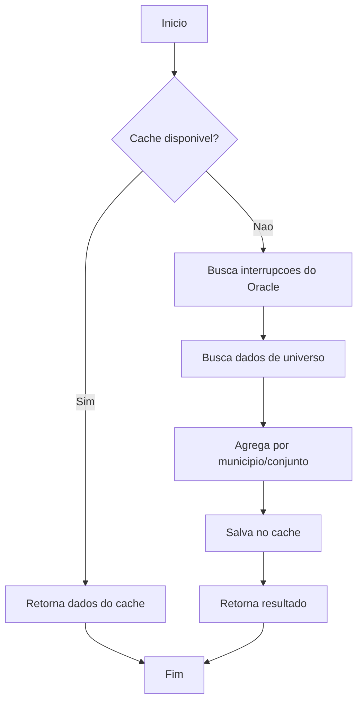

# RAD-107: Use Case GetInterrupcoesAtivas

**Fase:** 2 - Application Layer
**Tipo:** Use Case
**Prioridade:** Alta
**Status:** Existente (necessita refatoracao)
**Dependencias:** RAD-104, RAD-105, RAD-106

## Objetivo

Implementar caso de uso principal para buscar e agregar interrupcoes ativas.

## Localizacao

`backend/apps/api_interrupcoes/use_cases/get_interrupcoes_ativas.py`

## Especificacao

### Fluxo de Execucao



### Responsabilidades

1. Verificar cache antes de buscar do banco
2. Orquestrar busca de interrupcoes e universo
3. Delegar agregacao ao Domain Service
4. Gerenciar cache de resultados
5. Retornar Result com sucesso ou erro

## Implementacao

```python
# apps/api_interrupcoes/use_cases/get_interrupcoes_ativas.py
from dataclasses import dataclass
from shared.domain.result import Result
from shared.domain.repositories.interrupcao_repository import InterrupcaoRepository
from shared.domain.repositories.universo_repository import UniversoRepository
from shared.domain.cache.cache_service import CacheService, CacheKeys, CacheTTL
from shared.domain.services.interrupcao_aggregator import (
    InterrupcaoAggregatorService,
    InterrupcaoAgregada,
)


@dataclass
class GetInterrupcoesAtivasUseCase:
    """
    Caso de uso para buscar interrupcoes ativas agregadas.

    Orquestra:
    1. Verificacao de cache
    2. Busca de dados (interrupcoes + universo)
    3. Agregacao por municipio/conjunto
    4. Armazenamento em cache
    """

    _repository: InterrupcaoRepository
    _universo_repository: UniversoRepository
    _cache: CacheService
    _aggregator: InterrupcaoAggregatorService
    _ttl_segundos: int = CacheTTL.INTERRUPCOES

    async def execute(self) -> Result[list[InterrupcaoAgregada]]:
        """
        Executa busca de interrupcoes ativas.

        Returns:
            Result com lista de InterrupcaoAgregada ou erro
        """
        try:
            # 1. Verificar cache
            cached = await self._try_get_from_cache()
            if cached is not None:
                return Result.ok(cached)

            # 2. Buscar dados
            interrupcoes = await self._repository.buscar_ativas()

            if not interrupcoes:
                return Result.ok([])

            # 3. Buscar dados de universo (UCs atendidas por conjunto)
            universo = await self._get_universo_data(interrupcoes)

            # 4. Agregar
            agregadas = self._aggregator.agregar(interrupcoes, universo)

            # 5. Salvar no cache
            await self._save_to_cache(agregadas)

            return Result.ok(agregadas)

        except Exception as e:
            return Result.fail(f"Erro ao buscar interrupcoes: {str(e)}")

    async def _try_get_from_cache(self) -> list[InterrupcaoAgregada] | None:
        """Tenta recuperar dados do cache."""
        return await self._cache.get(CacheKeys.INTERRUPCOES_ATIVAS)

    async def _get_universo_data(
        self,
        interrupcoes: list,
    ) -> dict[tuple[int, str], int]:
        """
        Busca quantidade de UCs atendidas por conjunto/municipio.

        Returns:
            Mapa (conjunto, ibge) -> qtd_ucs
        """
        # Extrair combinacoes unicas de conjunto/municipio
        combinacoes = {
            (i.conjunto, i.municipio.valor)
            for i in interrupcoes
        }

        universo = {}
        for conjunto, ibge in combinacoes:
            qtd = await self._universo_repository.buscar_ucs_por_conjunto_municipio(
                conjunto, ibge
            )
            universo[(conjunto, ibge)] = qtd or 0

        return universo

    async def _save_to_cache(self, data: list[InterrupcaoAgregada]) -> None:
        """Salva resultado no cache."""
        await self._cache.set(
            CacheKeys.INTERRUPCOES_ATIVAS,
            data,
            self._ttl_segundos,
        )


# Factory function para injecao de dependencia
def create_get_interrupcoes_use_case(
    repository: InterrupcaoRepository,
    universo_repository: UniversoRepository,
    cache: CacheService,
) -> GetInterrupcoesAtivasUseCase:
    """Factory para criar instancia do use case com dependencias."""
    return GetInterrupcoesAtivasUseCase(
        _repository=repository,
        _universo_repository=universo_repository,
        _cache=cache,
        _aggregator=InterrupcaoAggregatorService(),
    )
```

## Uso

```python
# Na rota/endpoint
@router.get("/quantitativointerrupcoesativas")
async def get_interrupcoes(
    use_case: GetInterrupcoesAtivasUseCase = Depends(get_use_case),
) -> InterrupcoesAtivasResponse:
    result = await use_case.execute()

    if result.is_failure:
        raise HTTPException(
            status_code=500,
            detail=result.error,
        )

    return InterrupcoesAtivasResponse.from_agregadas(result.value)
```

## Testes TDD (Escrever PRIMEIRO)

```python
# tests/unit/use_cases/test_get_interrupcoes_ativas.py
import pytest
from unittest.mock import AsyncMock, MagicMock
from datetime import datetime

from apps.api_interrupcoes.use_cases.get_interrupcoes_ativas import (
    GetInterrupcoesAtivasUseCase,
)
from shared.domain.entities.interrupcao import Interrupcao
from shared.domain.value_objects.codigo_ibge import CodigoIBGE
from shared.domain.value_objects.tipo_interrupcao import TipoInterrupcao
from shared.domain.services.interrupcao_aggregator import (
    InterrupcaoAggregatorService,
    InterrupcaoAgregada,
)


class TestGetInterrupcoesAtivasUseCase:
    """Testes para Use Case de interrupcoes ativas."""

    @pytest.fixture
    def mock_repository(self):
        """Mock do InterrupcaoRepository."""
        return AsyncMock()

    @pytest.fixture
    def mock_universo_repository(self):
        """Mock do UniversoRepository."""
        return AsyncMock()

    @pytest.fixture
    def mock_cache(self):
        """Mock do CacheService."""
        mock = AsyncMock()
        mock.get.return_value = None  # Cache miss por padrao
        return mock

    @pytest.fixture
    def aggregator(self):
        """Aggregator real."""
        return InterrupcaoAggregatorService()

    @pytest.fixture
    def use_case(
        self, mock_repository, mock_universo_repository, mock_cache, aggregator
    ):
        """Use case com mocks injetados."""
        return GetInterrupcoesAtivasUseCase(
            _repository=mock_repository,
            _universo_repository=mock_universo_repository,
            _cache=mock_cache,
            _aggregator=aggregator,
        )

    @pytest.fixture
    def interrupcao_sample(self):
        """Interrupcao de exemplo."""
        return Interrupcao.create({
            "id": 1,
            "tipo": TipoInterrupcao.PROGRAMADA,
            "municipio": CodigoIBGE.create("1400100").value,
            "conjunto": 1,
            "ucs_afetadas": 100,
            "data_inicio": datetime.now(),
            "data_fim": None,
        }).value

    class TestCacheHit:
        """Testes quando cache tem dados."""

        async def test_deve_retornar_dados_do_cache_quando_disponivel(
            self, use_case, mock_cache
        ):
            """Retorna do cache sem acessar banco."""
            cached_data = [
                InterrupcaoAgregada(
                    id_conjunto=1,
                    municipio=CodigoIBGE.create("1400100").value,
                    qtd_ucs_atendidas=10000,
                    qtd_programada=100,
                    qtd_nao_programada=50,
                )
            ]
            mock_cache.get.return_value = cached_data

            result = await use_case.execute()

            assert result.is_success
            assert result.value == cached_data
            use_case._repository.buscar_ativas.assert_not_called()

    class TestCacheMiss:
        """Testes quando cache esta vazio."""

        async def test_deve_buscar_do_repositorio_quando_cache_vazio(
            self, use_case, mock_repository, interrupcao_sample
        ):
            """Busca do banco quando cache miss."""
            mock_repository.buscar_ativas.return_value = [interrupcao_sample]

            result = await use_case.execute()

            assert result.is_success
            mock_repository.buscar_ativas.assert_called_once()

        async def test_deve_salvar_no_cache_apos_buscar(
            self, use_case, mock_repository, mock_cache, interrupcao_sample
        ):
            """Salva resultado no cache."""
            mock_repository.buscar_ativas.return_value = [interrupcao_sample]

            await use_case.execute()

            mock_cache.set.assert_called_once()

        async def test_deve_retornar_lista_vazia_sem_interrupcoes(
            self, use_case, mock_repository
        ):
            """Retorna lista vazia quando nao ha interrupcoes."""
            mock_repository.buscar_ativas.return_value = []

            result = await use_case.execute()

            assert result.is_success
            assert result.value == []

    class TestAggregation:
        """Testes de agregacao."""

        async def test_deve_agregar_interrupcoes_por_municipio_conjunto(
            self, use_case, mock_repository
        ):
            """Agrega corretamente por municipio/conjunto."""
            boa_vista = CodigoIBGE.create("1400100").value
            interrupcoes = [
                Interrupcao.create({
                    "id": 1,
                    "tipo": TipoInterrupcao.PROGRAMADA,
                    "municipio": boa_vista,
                    "conjunto": 1,
                    "ucs_afetadas": 50,
                    "data_inicio": datetime.now(),
                }).value,
                Interrupcao.create({
                    "id": 2,
                    "tipo": TipoInterrupcao.NAO_PROGRAMADA,
                    "municipio": boa_vista,
                    "conjunto": 1,
                    "ucs_afetadas": 30,
                    "data_inicio": datetime.now(),
                }).value,
            ]
            mock_repository.buscar_ativas.return_value = interrupcoes

            result = await use_case.execute()

            assert result.is_success
            assert len(result.value) == 1
            assert result.value[0].qtd_programada == 50
            assert result.value[0].qtd_nao_programada == 30

    class TestErrorHandling:
        """Testes de tratamento de erros."""

        async def test_deve_retornar_failure_em_erro_de_banco(
            self, use_case, mock_repository
        ):
            """Retorna Result.fail em erro de banco."""
            mock_repository.buscar_ativas.side_effect = Exception("DB Error")

            result = await use_case.execute()

            assert result.is_failure
            assert "erro" in result.error.lower()

        async def test_nao_deve_lancar_exception(
            self, use_case, mock_repository
        ):
            """Use case nunca lanca exception."""
            mock_repository.buscar_ativas.side_effect = Exception("DB Error")

            # Nao deve lancar
            result = await use_case.execute()

            assert result.is_failure
```

## Criterios de Aceite

- [ ] Testes escritos e passando
- [ ] Verifica cache antes de buscar do banco
- [ ] Busca interrupcoes via Repository Protocol
- [ ] Busca dados de universo para UCs atendidas
- [ ] Agrega usando InterrupcaoAggregatorService
- [ ] Salva resultado no cache com TTL
- [ ] Retorna Result (nunca lanca exception)
- [ ] Factory function para DI
- [ ] Cobertura >= 90%

## Comando de Execucao

```bash
# Executar testes (RED)
pytest tests/unit/use_cases/test_get_interrupcoes_ativas.py -v

# Com cobertura
pytest tests/unit/use_cases/test_get_interrupcoes_ativas.py --cov=apps/api_interrupcoes/use_cases --cov-report=term-missing
```
